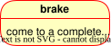
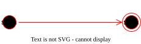
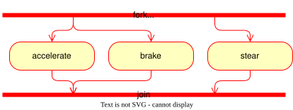
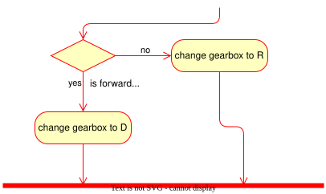
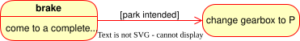
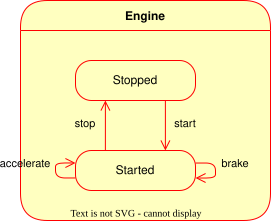
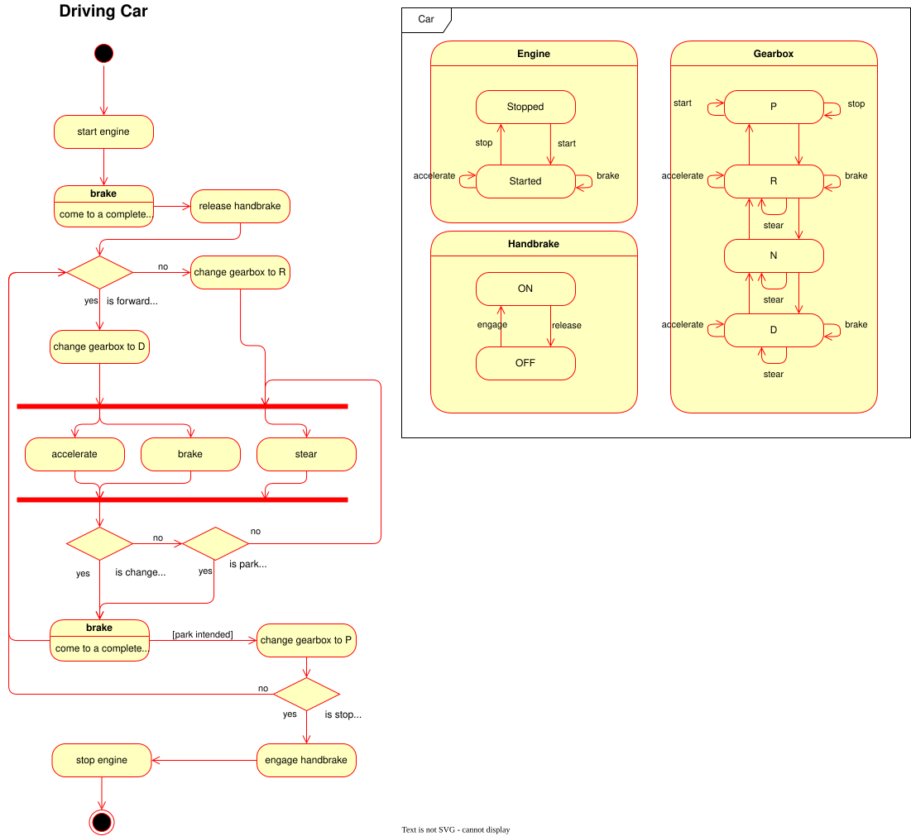

# Help > Activity Diagrams

## Purpose

* To illustrate:
    1. Process activity flows
    2. State transitions 

## Syntax & Semantics

1. Activity or State
===
Both activities and states are modeled using the same modeling element which is illustrated as a rounded rectangle. This rectangle may have zero or more compartments which are seperated by a solid line divider. The compartments can be used to provide details on activity/state context.

]

1. Start and Stop
===
Start and stop are entry and exit states respectively. The start is illustrated as a solid circle and the end is illustrated as a solid circle enclosed in an open outer circle.

]

1. Synchronisation Bar
===
This modeling element can represent either a fork or a join of a parallel process. They are a fork when transitional elements are illustrated as exiting the element. They are a join when transitional elements are illustrated as entering the element. Unless otherwise modeled, the diagram reader should assume that the activities modeled between two synchronisation bars occurs in parallel, with no guarantees of linear/sequential processing. These bars are represented as a thin but long solid rectangle. 

]

1. Decision Point
===
A decision point enables conditional logic to be modeled to divert and/or control process flows. They are illustrated as a diamond and accompanied with a question in written text.

]

1. Transition
===
Transitions are the most critical modeling element in an activity diagram. These illustrates the direction of flow between any of the above elements. Transitions may include a guard condition represented as a condition enclosed in square brackets eg. [current-time < 24:00]. Modelers should ensure that when guards are used, that there is still an alternative path the flow can take should that condition fail. Note, guard conditions are a shorthand for decision points and may help to simplify the diagram.

]

1. Composite State
===
Composite states captures a part/aspect of a state machine within the context of the whole object. Thus, you will note that many or all of the above modeling elements can be used in a composite state/activity.

]

## Example of Driving A Car

)

