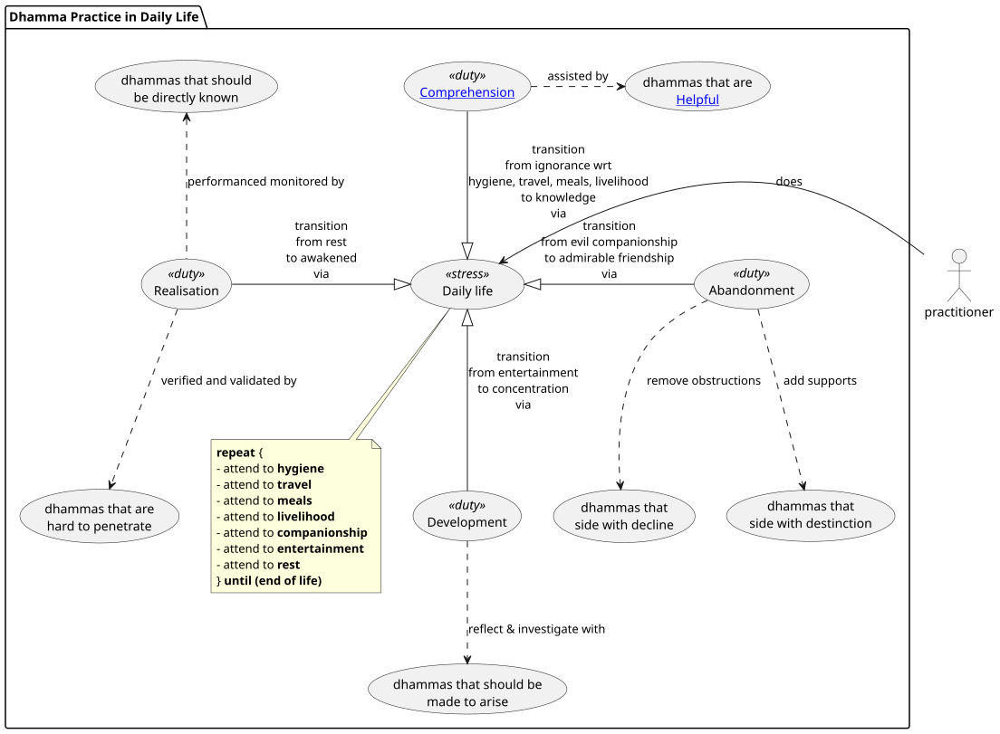

# PROGRESSING BY TENS
## DASUTTARA SUTTA  Dīgha Nikāya 34

This repository is a project (work in progress) undertaken in my 2025 rains retreat. The repository follows Venerable Sāriputta's organisational structure of Dhammas that:
1. Are **Helpful**
2. Should be **Developed**
3. Should be **Comprehended**
4. Should be **Abandoned**
5. Side with **Decline**
6. Side with **Distinction**
7. Are hard to **Penetrate**
8. Should be **Made To Arise**
9. Should be **Directly Known**
10. Should be **Realised**

This is a [SuttaPlayer](https://suttaplayer.github.io/#about) sub-project which means that the sources (ie. scope) are limited to those Suttas which were included with the SuttaPlayer App. 

> All sutta texts are translated by Ajaan Geoff (Ṭhānissaro Bhikkhu) and are sourced from [https://dhammatalks.org/suttas](https://dhammatalks.org/suttas) under the https://creativecommons.org/licenses/by-nc/4.0/ license.

Each page will consists of Sutta text references and models. The models are representations of my direct experiences, and also through ferreting out the qualities that occur to me during meditation & reflection.

### Modeling the Dhamma
These models are like maps and they have been illustrated in a universal software engineering modeling format known as the Unified Modeling Language (ie. UML). I will restrict the modeling to two types of diagrams:
1. [Activity Diagrams](./help-uml/activity/activity-diagram.md)
2. [Class Diagrams](./help-uml/class/class-diagram.md)

Click on the links above for basic UML guidance on the syntax and semantics of these diagrams.

These maps are not intended for scholarly use and I am not asserting that only this is true and everything else is worthless. Instead, use these maps as an artifact handed down to a fellow traveler which may help you navigate the crossing of the fourfold floods.

*best wishes, ash*

---

## A Progressive Framework for Dhamma Practice

> Venerable Sāriputta said,
>
> I will teach the Dhamma
>
> progressing by tens,
>
> for attaining unbinding,
>
> for putting an end to suffering & stress,
>
> for releasing from all ties.[^1]

---
<!-- 
@startuml
package "Dhamma Practice in Daily Life" {
    usecase dl as "     Daily life     " <<stress>>
    note bottom of dl 
        **repeat** {
        - attend to **hygiene**
        - attend to **travel**
        - attend to **meals**
        - attend to **livelihood**
        - attend to **companionship**
        - attend to **entertainment**
        - attend to **rest**
        } **until (end of life)**
    end note
    (Development) as developed <<duty>>
    ([[./3.comprehended-index.html Comprehension]]) as comprehended <<duty>>
    (Abandonment) as abandoned <<duty>>
    (Realisation) as realised <<duty>>
    dl <|-u- (comprehended): transition\nfrom ignorance wrt\nhygiene, travel, meals, livelihood\nto knowledge\nvia
    dl <|-r- (abandoned): transition\nfrom evil companionship\nto admirable friendship\nvia
    dl <|-d- (developed): transition\nfrom entertainment\nto concentration\nvia
    dl <|-l- (realised): transition\nfrom rest\nto awakened\nvia
    
    usecase madeToArise as "dhammas that should be\nmade to arise"
    developed ..> madeToArise: reflect & investigate with

    usecase helpful as "dhammas that are\n[[./1.helpful-index.html Helpful]]"
    comprehended .r.> helpful: assisted by
    
    usecase decline as "dhammas that\nside with decline"
    usecase destinction as "dhammas that\nside with destinction"
    abandoned ..> decline: remove obstructions
    abandoned ..> destinction: add supports
    
    usecase penetrate as "dhammas that are\nhard to penetrate"
    usecase directlyKnown as "dhammas that should\nbe directly known"
    realised ..> penetrate: verified and validated by
    realised .u.> directlyKnown: performanced monitored by
}

practitioner -l-> (dl): does
@enduml
 -->
 

## Table of Contents

| Aspects | Ones | Twos | Threes | Fours | Fives | Sixes | Sevens | Eights | Nines | Tens |
| :----------- | :----- | :----- | :----- | :----- | :----- | :----- | :----- | :----- | :----- | :----- |
| **[Helpful](./1.helpful-index.md)** |[Heedfulness](./ones/helpful.md) | [Mindfulness & alertness](./twos/helpful.md) | [Three Factors of Stream Entry](./threes/helpful.md) | [xxx](./fours/helpful.md) | [xxx](./fives/helpful.md) | [xxx](./sixes/helpful.md) | [xxx](./sevens/helpful.md) | [xxx](./eights/helpful.md) | [xxx](./nines/helpful.md) | [xxx](./tens/helpful.md)|
| **[Developed](./2.developed-index.md)** |[Mindfulness immersed in the body](./ones/developed.md) | [Tranquility & insight](./twos/developed.md) | [xxx](./threes/developed.md) | [xxx](./fours/developed.md) | [xxx](./fives/developed.md) | [xxx](./sixes/developed.md) | [xxx](./sevens/developed.md) | [xxx](./eights/developed.md) | [xxx](./nines/developed.md) | [xxx](./tens/developed.md)|
| **[Comprehended](./3.comprehended-index.md)** |[Contact](./ones/comprehended.md) | [Name & form](./twos/comprehended.md) | [xxx](./threes/comprehended.md) | [xxx](./fours/comprehended.md) | [xxx](./fives/comprehended.md) | [xxx](./sixes/comprehended.md) | [xxx](./sevens/comprehended.md) | [xxx](./eights/comprehended.md) | [xxx](./nines/comprehended.md) | [xxx](./tens/comprehended.md)|
| **[Abandoned](./4.abandoned-index.md)** |[The conceit ‘I am’](./ones/abandoned.md) | [Ignorance & craving for becoming](./twos/abandoned.md) | [xxx](./threes/abandoned.md) | [xxx](./fours/abandoned.md) | [xxx](./fives/abandoned.md) | [xxx](./sixes/abandoned.md) | [xxx](./sevens/abandoned.md) | [xxx](./eights/abandoned.md) | [xxx](./nines/abandoned.md) | [xxx](./tens/abandoned.md)|
| **[Decline](./5.decline-index.md)** |[Inappropriate attention](./ones/decline.md) | [	Being hard to instruct & evil friendship](./twos/decline.md) | [xxx](./threes/decline.md) | [xxx](./fours/decline.md) | [xxx](./fives/decline.md) | [xxx](./sixes/decline.md) | [xxx](./sevens/decline.md) | [xxx](./eights/decline.md) | [xxx](./nines/decline.md) | [xxx](./tens/decline.md)|
| **[Distinction](./6.distinction-index.md)** |[Appropriate attention](./ones/distinction.md) | [Being easy to instruct & admirable friendship](./twos/distinction.md) | [xxx](./threes/distinction.md) | [xxx](./fours/distinction.md) | [xxx](./fives/distinction.md) | [xxx](./sixes/distinction.md) | [xxx](./sevens/distinction.md) | [xxx](./eights/distinction.md) | [xxx](./nines/distinction.md) | [xxx](./tens/distinction.md)|
| **[Penetrate](./7.penetrate-index.md)** |[Unmediated concentration of awareness](./ones/penetrate.md) | [defilement & purification](./twos/penetrate.md) | [xxx](./threes/penetrate.md) | [xxx](./fours/penetrate.md) | [xxx](./fives/penetrate.md) | [xxx](./sixes/penetrate.md) | [xxx](./sevens/penetrate.md) | [xxx](./eights/penetrate.md) | [xxx](./nines/penetrate.md) | [xxx](./tens/penetrate.md)|
| **[Made To Arise](./8.made-to-arise-index.md)** |[Knowledge of the unprovoked](./ones/made-to-arise.md) | [ending (of the effluents & non-recurrence](./twos/made-to-arise.md) | [xxx](./threes/made-to-arise.md) | [xxx](./fours/made-to-arise.md) | [xxx](./fives/made-to-arise.md) | [xxx](./sixes/made-to-arise.md) | [xxx](./sevens/made-to-arise.md) | [xxx](./eights/made-to-arise.md) | [xxx](./nines/made-to-arise.md) | [xxx](./tens/made-to-arise.md)|
| **[Directly Known](./9.directly-known-index.md)** |[Nutriment](./ones/directly-known.md) | [the fabricated property & the unfabricated property](./twos/directly-known.md) | [xxx](./threes/directly-known.md) | [xxx](./fours/directly-known.md) | [xxx](./fives/directly-known.md) | [xxx](./sixes/directly-known.md) | [xxx](./sevens/directly-known.md) | [xxx](./eights/directly-known.md) | [xxx](./nines/directly-known.md) | [xxx](./tens/directly-known.md)|
| **[Realised](./10.realised-index.md)** |[Unprovoked release](./ones/realised.md) | [Clear knowing & release](./twos/realised.md) | [xxx](./threes/realised.md) | [xxx](./fours/realised.md) | [xxx](./fives/realised.md) | [xxx](./sixes/realised.md) | [xxx](./sevens/realised.md) | [xxx](./eights/realised.md) | [xxx](./nines/realised.md) | [xxx](./tens/realised.md)|

## References

[^1]: [https://suttaplayer.github.io/#DN/DN34_1_5](https://suttaplayer.github.io/#DN/DN34_1_5?cursorLinePosition=8&highlightLineRanges=8-18)