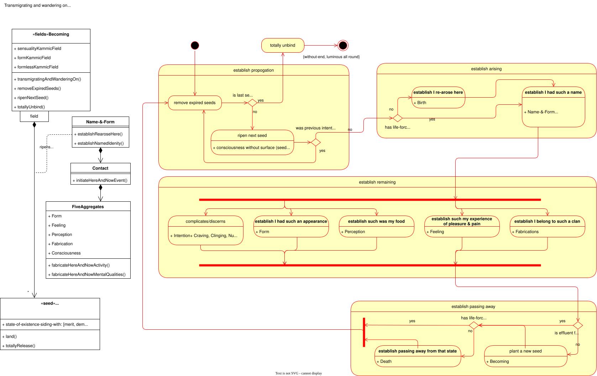

# PROGRESSING BY TENS
## DASUTTARA SUTTA  Dīgha Nikāya 34

This repository is a project (work in progress) undertaken in my 2025 rains retreat. The repository follows Venerable Sāriputta's organisational structure of Dhammas that:
1. Are **Helpful**
2. Should be **Developed**
3. Should be **Comprehended**
4. Should be **Abandoned**
5. Side with **Decline**
6. Side with **Distinction**
7. Are hard to **Penetrate**
8. Should be **Made To Arise**
9. Should be **Directly Known**
10. Should be **Realised**

This is a [SuttaPlayer](https://suttaplayer.github.io/#about) sub-project which means that the sources (ie. scope) are limited to those Suttas which were included with the SuttaPlayer App. 

> All sutta texts are translated by Ajaan Geoff (Ṭhānissaro Bhikkhu) and are sourced from https://dhammatalks.org/suttas under the https://creativecommons.org/licenses/by-nc/4.0/ license.

Each page will consists of Sutta text references and models. The models are representations of my direct experiences, and also through ferreting out the qualities that occur to me during meditation & reflection.

### Modeling the Dhamma
These models are like maps and they have been illustrated in a universal software engineering modeling format known as the Unified Modeling Language (ie. UML). I will restrict the modeling to two types of diagrams:
1. [Activity Diagrams](./help-uml/activity/activity-diagram.md)
2. [Class Diagrams](./help-uml/class/class-diagram.md)

Click on the links above for basic UML guidance on the syntax and semantics of these diagrams.

These maps are not intended for scholarly use and I am not asserting that only this is true and everything else is worthless. Instead, use these maps as an artifact handed down to a fellow traveler which may help you navigate the crossing of the fourfold floods.

*best wishes, ash*

---

> Venerable Sāriputta said,
>
> I will teach the Dhamma
>
> progressing by tens,
>
> for attaining unbinding,
>
> for putting an end to suffering & stress,
>
> for releasing from all ties.[^1]

---

## Transmigrating and wandering on

### Situation
Existence is characterized by an unending cycle of rebirth, a journey through "transmigration" whose origins are not readily apparent. As stated by the Blessed One, "**from an inconceivable beginning** comes transmigration. **A beginning point is not evident, although beings hindered by ignorance and fettered by craving are transmigrating & wandering on.**" This prolonged wandering includes countless past lives, where one can recollect having "**had such a name, belonged to such a clan, had such an appearance. Such was my food, such my experience of pleasure and pain, such the end of my life. Passing away from that state, I re-arose there.**"

### Complication
The continuation of this cyclical existence is intrinsically tied to a process that perpetuates stress. This entanglement begins with subtle causes: "Sustained by or clinging to the six properties, **there is an alighting of an embryo**. **There being an alighting, there is name-&-form**. **From name-&-form as a requisite condition come the six sense media**. **From the six sense media as a requisite condition comes contact**. From contact as a requisite condition comes feeling." This sequence describes the very foundation of how new existence arises, rooted in clinging and leading to the experience of feeling.

### Resolution
Crucially, the path to ending this inherent stress is also revealed within this understanding of interconnected conditions. It is to "one experiencing feeling I declare, 'This is stress.' I declare, 'This is the origination of stress.' I declare, 'This is the cessation of stress.' I declare, 'This is the path of practice leading to the cessation of stress.'" This clear declaration lays out the essential framework for comprehending the nature of suffering and the practice leading to its complete cessation, offering a definitive escape from the cycle of existence.

### Quotations

> Near Sāvatthī. There the Blessed One said: 'Monks, **from an inconceivable beginning** comes transmigration. **A beginning point is not evident, although beings hindered by ignorance and fettered by craving are transmigrating & wandering on.**[^2]

> 'If he wants, he recollects his manifold past lives [literally: previous homes], i e, one birth, two births, three births, four, five, ten, twenty, thirty, forty, fifty, one hundred, one thousand, one hundred thousand, many eons of cosmic contraction, many eons of cosmic expansion, many eons of cosmic contraction and expansion, (recollecting,) '**There I had such a name, belonged to such a clan, had such an appearance. Such was my food, such my experience of pleasure and pain, such the end of my life. Passing away from that state, I re-arose there.** There too I had such a name, belonged to such a clan, had such an appearance. Such was my food, such my experience of pleasure and pain, such the end of my life. Passing away from that state, I re-arose here.' Thus he remembers his manifold past lives in their modes and details. He can witness this for himself whenever there is an opening.[^3]

> Near Sāvatthī. 'Monks, **any contemplatives or brahmans who recollect their manifold past lives all recollect the five clinging-aggregates, or one among them. Which five? When recollecting, 'I was one with such a form** in the past,' one is recollecting just form. Or when recollecting, 'I was one with **such a feeling** in the past,' one is recollecting just feeling. Or when recollecting, 'I was one with **such a perception in the past**,' one is recollecting just perception. Or when recollecting, 'I was one with **such fabrications** in the past,' one is recollecting just fabrications. Or when recollecting, 'I was one with **such a consciousness** in the past,' one is recollecting just consciousness.[^4]

> Then Venerable Ānanda went to the Blessed One and, on arrival, bowed down to him and sat to one side. As he was sitting there he said to the Blessed One, 'Lord, this word, **'becoming, becoming'—to what extent is there becoming?**'
> 
> 'Ānanda, if there were no kamma ripening in the sensuality-property, would sensuality-becoming be discerned?'
> 
> 'No, lord.'
> 
> '**Thus kamma is the field, consciousness the seed, and craving the moisture**. The consciousness of **living beings** hindered by ignorance & fettered by craving **is established in or tuned to a lower property**. Thus there is the production of renewed becoming in the future.[^5]

> 'Sustained by or clinging to the six properties, **there is an alighting of an embryo**. **There being an alighting, there is name-&-form**. **From name-&-form as a requisite condition come the six sense media**. **From the six sense media as a requisite condition comes contact**. From contact as a requisite condition comes feeling. To one experiencing feeling I declare, 'This is stress.' I declare, 'This is the origination of stress.' I declare, 'This is the cessation of stress.' I declare, 'This is the path of practice leading to the cessation of stress.'[^6]

> 'Dependent on eye & forms, eye-consciousness arises. The meeting of the three is contact. With contact as a requisite condition, there is feeling. **What one feels, one perceives** [labels in the mind]. What one perceives, **one thinks about**. What one thinks about, **one complicates**. Based on what a person complicates, the perceptions & categories of objectification assail him or her with regard to past, present, & future forms cognizable via the eye. [^7]

> 'Discernment & consciousness are conjoined, friend, not disjoined. It's not possible, having separated them one from the other, to delineate the difference between them. For **what one discerns, that one cognizes**. **What one cognizes, that one discerns**.What one cognizes, that one discerns. Therefore these qualities are conjoined, not disjoined, and it is not possible, having separated them one from another, to delineate the difference between them.'[^8]

> 'Feeling, perception, & consciousness are conjoined, friend, not disjoined. It is not possible, having separated them one from another, to delineate the difference among them. For **what one feels, that one perceives**. What one perceives, **that one cognizes**. Therefore these qualities are conjoined, not disjoined, and it is not possible, having separated them one from another, to delineate the difference among them.'[^8]

## Table of Contents

| Aspects | Features |
| :----------- | :----- |
| Dhammas that are [Helpful](./1.helpful-index.md) | 1. [Heedfulness with regard to skillful qualities](./ones/helpful.md) 2. [Mindfulness & alertness](./twos/helpful.md) 3. [Associating with people of integrity, listening to the True Dhamma, practicing the Dhamma in accordance with the Dhamma](./threes/helpful.md) 4. [Four wheels: living in a civilized land, associating with people of integrity, directing oneself rightly, & having done merit in the past](./fours/helpful.md) 5. [Five factors for exertion](./fives/helpful.md) 6. [Six conditions conducive to amiability](./sixes/helpful.md) 7. [Seven noble treasures](./sevens/helpful.md) 8. [Eight causes, eight requisite conditions lead to the acquiring of the as-yet-unacquired discernment](./eights/helpful.md) 9. [Nine dhammas rooted in appropriate attention](./nines/helpful.md) 10. [Ten qualities creating a protector](./tens/helpful.md) |
| Dhammas should be [Developed](./2.developed-index.md) | 1. [Mindfulness immersed in the body connected with joy](./ones/developed.md) 2. [Tranquility & insight](./twos/developed.md) 3. [Three concentrations: concentration with directed thought & evaluation, concentration without directed thought & with a modicum of evaluation, concentration without directed thought & evaluation](./threes/developed.md) 4. [Four establishings of mindfulness](./fours/developed.md) 5. [Five-factored right concentration](./fives/developed.md) 6. [Six Six objects of recollection](./sixes/developed.md) 7. [Seven factors for awakening](./sevens/developed.md) 8. [The noble eightfold path](./eights/developed.md) 9. [Nine factors of exertion for full purity](./nines/developed.md) 10. [Ten totality-dimensions](./tens/developed.md) |
| Dhammas should be [Comprehended](./3.comprehended-index.md) | 1. [Contact accompanied by effluents & subject to clinging](./ones/comprehended.md) 2. [Name & form](./twos/comprehended.md) 3. [Three feelings: a feeling of pleasure, a feeling of pain, a feeling of neither pleasure nor pain](./threes/comprehended.md) 4. [Four nutriments](./fours/comprehended.md) 5. [Five clinging-aggregates](./fives/comprehended.md) 6. [Six internal sense media](./sixes/comprehended.md) 7. [Seven stations of consciousness](./sevens/comprehended.md) 8. [Eight worldly conditions](./eights/comprehended.md) 9. [Nine abodes for beings](./nines/comprehended.md) 10. [Ten sense media](./tens/comprehended.md) |
| Dhammas should be [Abandoned](./4.abandoned-index.md) | 1. [The conceit 'I am'](./ones/abandoned.md)  2. [Ignorance & craving for becoming](./twos/abandoned.md)  3. [Three cravings: craving for sensuality, craving for becoming, craving for non-becoming](./threes/abandoned.md)  4. [Four floods: the flood of sensuality, the flood of becoming, the flood of views, the flood of ignorance](./fours/abandoned.md)  5. [Five hindrances: the hindrance of sensual desire, the hindrance of ill will, the hindrance of sloth & drowsiness, the hindrance of restlessness & anxiety, the hindrance of uncertainty](./fives/abandoned.md)  6. [Six classes of craving: craving for forms, craving for sounds, craving for aromas, craving for flavors, craving for tactile sensations, craving for ideas](./sixes/abandoned.md)  7. [Seven obsessions: the obsession of sensual passion, the obsession of resistance, the obsession of views, the obsession of uncertainty, the obsession of conceit, the obsession of passion for becoming, the obsession of ignorance](./sevens/abandoned.md)  8. [Eight forms of wrongness: wrong view, wrong resolve, wrong speech, wrong action, wrong livelihood, wrong effort, wrong mindfulness, wrong concentration](./eights/abandoned.md)  9. [Nine dhammas rooted in craving: seeking is dependent on craving; acquisition is dependent on seeking; ascertainment is dependent on acquisition; desire & passion is dependent on ascertainment; attachment is dependent on desire & passion; possessiveness is dependent on attachment; stinginess is dependent on possessiveness; defensiveness is dependent on stinginess; and because of defensiveness, dependent on defensiveness, various evil, unskillful phenomena come into play](./nines/abandoned.md)  10. [Ten forms of wrongness: wrong view, wrong resolve, wrong speech, wrong action, wrong livelihood, wrong effort, wrong mindfulness, wrong concentration, wrong knowledge, wrong release](./tens/abandoned.md) |
| Dhammas that side with [Decline](./5.decline-index.md) | 1. [Inappropriate attention](./ones/decline.md)  2. [Being hard to instruct & evil friendship](./twos/decline.md)  3. [Three roots of what is unskillful: greed as a root of what is unskillful, aversion as a root of what is unskillful, delusion as a root of what is unskillful](./threes/decline.md)  4. [Four yokes: the yoke of sensuality, the yoke of becoming, the yoke of views, the yoke of ignorance](./fours/decline.md)  5. [Five mental blockages](./fives/decline.md)  6. [Six types of disrespect: There is the case, friends, where a monk dwells without respect or deference for the Teacher… for the Dhamma… for the Saṅgha… for the training… for heedfulness… for welcoming manners](./sixes/decline.md)  7. [Seven untrue dhammas: There is the case, friends, where a monk is without conviction, without a sense of shame, without compunction, without learning, lazy, one of muddled truth, & undiscerning](./sevens/decline.md)  8. [Eight grounds for laziness](./eights/decline.md)  9. [Nine grounds for hatred](./nines/decline.md)  10. [Ten unskillful courses of action](./tens/decline.md) |
| Dhammas that side with [Distinction](./6.distinction-index.md) | 1. [Appropriate attention](./ones/distinction.md) 2. [Being easy to instruct & admirable friendship](./twos/distinction.md) 3. [ Three roots of what is skillful: lack of greed as a root of what is skillful, lack of aversion as a root of what is skillful, lack of delusion as a root of what is skillful.](./threes/distinction.md) 4. [Four unyokings: the unyoking of the yoke of sensuality, the unyoking of the yoke of becoming, the unyoking of the yoke of views, the unyoking of the yoke of ignorance.](./fours/distinction.md) 5. [Five faculties: the faculty of conviction, the faculty of persistence, the faculty of mindfulness, the faculty of concentration, the faculty of discernment.](./fives/distinction.md) 6. [Six types of respect](./sixes/distinction.md) 7. [Seven true dhammas](./sevens/distinction.md) 8. [Eight grounds for the arousal of energy](./eights/distinction.md) 9. [Nine ways of subduing hatred](./nines/distinction.md) 10. [Ten skillful courses of action](./tens/distinction.md) |
| Dhammas that are hard to [Penetrate](./7.penetrate-index.md) | 1. [Unmediated concentration of awareness](./ones/penetrate.md)  2. [The cause & condition for the defilement of beings and the cause & condition for the purification of beings](./twos/penetrate.md)  3. [Three properties for escape: This is the escape from sensuality: renunciation. This is the escape from form: the formless. As for whatever has come into being, is fabricated, & is dependently co-arisen, the escape from that is cessation](./threes/penetrate.md)  4. [Four concentrations: concentration that has a share in decline, concentration that has a share in stability, concentration that has a share in distinction, concentration that has a share in penetration](./fours/penetrate.md)  5. [Five properties leading to escape](./fives/penetrate.md)  6. [Six properties that are means of escape](./sixes/penetrate.md)  7. [Seven qualities of a person of integrity](./sevens/penetrate.md)  8. [Eight inopportune, untimely situations for leading the holy life](./eights/penetrate.md)  9. [Nine multiplicities](./nines/penetrate.md)  10. [Ten noble abodes](./tens/penetrate.md) |
| Dhammas should be [Made To Arise](./8.made-to-arise-index.md) | 1. [Knowledge of the unprovoked [or: unprovoked knowledge]](./ones/made-to-arise.md)  2. [Two knowledges: knowledge of the ending (of the effluents) & knowledge of (their) non-recurrence](./twos/made-to-arise.md)  3. [Three knowledges: knowledge of the past, knowledge of the future, & knowledge of the present](./threes/made-to-arise.md)  4. [Four knowledges: knowledge with regard to the Dhamma, knowledge with regard to inference, knowledge with regard to encompassing (the minds of others), knowledge of conventions](./fours/made-to-arise.md)  5. [Right concentration with knowledges: The knowledge arises right within oneself that 'This concentration is blissful in the present & will result in bliss in the future.' 'The knowledge arises right within oneself that 'This concentration is noble & not connected with the baits of the flesh.' 'The knowledge arises right within oneself that 'This concentration is not obtained by base people.' 'The knowledge arises right within oneself that 'This concentration is peaceful, exquisite, the acquiring of calm, the attainment of unification, not kept in place by the fabrications of forceful restraint.' 'The knowledge arises right within oneself that 'I enter into this concentration mindfully, & mindfully I emerge from it.'](./fives/made-to-arise.md)  6. [Six persevering dwellings: on seeing a form via the eye, is neither gladdened nor saddened, but remains equanimous, mindful, & alert. On hearing a sound via the ear… On smelling an aroma via the nose… On tasting a flavor via the tongue… On sensing a tactile sensation via the body… On cognizing an idea via the intellect, he is neither gladdened nor saddened, but remains equanimous, mindful, & alert](./sixes/made-to-arise.md)  7. [Seven perceptions: the perception of inconstancy, the perception of not-self, the perception of unattractiveness, the perception of drawbacks, the perception of abandoning, the perception of dispassion, the perception of cessation](./sevens/made-to-arise.md)  8. [Eight thoughts of a great person: 'This Dhamma is for one who is modest, not for one who is self-aggrandizing. This Dhamma is for one who is content, not for one who is discontent. This Dhamma is for one who is reclusive, not for one who is entangled. This Dhamma is for one whose persistence is aroused, not for one who is lazy. This Dhamma is for one whose mindfulness is established, not for one whose mindfulness is confused. This Dhamma is for one whose mind is concentrated, not for one whose mind is unconcentrated. This Dhamma is for one endowed with discernment, not for one whose discernment is weak. This Dhamma is for one who enjoys non-objectification, who delights in non-objectification, not for one who enjoys & delights in objectification.](./eights/made-to-arise.md)  9. [Nine perceptions: the perception of unattractiveness, the perception of death, the perception of loathsomeness in food, the perception of distaste for every world, the perception of inconstancy, the perception of stress in what is inconstant, the perception of not-self in what is stressful, the perception of abandoning, the perception of dispassion](./nines/made-to-arise.md)  10. [Ten perceptions: the perception of unattractiveness, the perception of death, the perception of loathsomeness in food, the perception of distaste for every world, the perception of inconstancy, the perception of stress in what is inconstant, the perception of not-self in what is stressful, the perception of abandoning, the perception of dispassion, the perception of cessation](./tens/made-to-arise.md) |
| Dhammas should be [Directly Known](./9.directly-known-index.md) | 1. [All beings are maintained by nutriment](./ones/directly-known.md)  2. [Two properties: the fabricated property & the unfabricated property](./twos/directly-known.md)  3. [Three properties: the property of sensuality, the property of form, the property of the formless](./threes/directly-known.md)  4. [Four noble truths: the noble truth of stress, the noble truth of the origination of stress, the noble truth of the cessation of stress, the noble truth of the path of practice leading to the cessation of stress](./fours/directly-known.md)  5. [Five openings to release](./fives/directly-known.md)  6. [Six things that are unsurpassed: unsurpassed vision, unsurpassed hearing, unsurpassed gains, unsurpassed trainings, unsurpassed service, unsurpassed objects of recollection](./sixes/directly-known.md)  7. [Seven grounds for praise: He has keen desire to undertake the training & has not discarded his love for undertaking the training in the future. He has keen desire to attend carefully to the Dhamma… to subdue his wants… to find solitude… to arouse persistence… to be mindful & adept… to penetrate (right) view & has not discarded his love for penetrating (right) view in the future](./sevens/directly-known.md)  8. [Eight dimensions of (mental) mastery](./eights/directly-known.md)  9. [Nine step-by-step dwellings](./nines/directly-known.md)  10. [Ten grounds for abolishing](./tens/directly-known.md) |
| Dhammas should be [Realised](./10.realised-index.md) | 1. [Unprovoked release of awareness](./ones/realised.md)  2. [Clear knowing & release](./twos/realised.md)  3. [Three forms of clear knowing: the clear knowing of the knowledge of previous lifetimes, the clear knowing of the knowledge of the passing away & arising of beings, the clear knowing of the knowledge of the ending of the effluents](./threes/realised.md)  4. [Four fruits of the contemplative life: the fruit of stream-entry, the fruit of once-returning, the fruit of non-returning, the fruit of arahantship](./fours/realised.md)  5. [Five dhamma aggregates: the aggregate of virtue, the aggregate of concentration, the aggregate of discernment, the aggregate of release, the aggregate of knowledge & vision of release](./fives/realised.md)  6. [Six direct knowledges](./sixes/realised.md)  7. [Seven strengths of one whose effluents are ended](./sevens/realised.md)  8. [Eight emancipations](./eights/realised.md)  9. [Nine step-by-step cessations](./nines/realised.md)  10. [Ten qualities of one beyond training](./tens/realised.md) |

## References

[^1]: [https://suttaplayer.github.io/#DN/DN34_1_5](https://suttaplayer.github.io/#DN/DN34_1_5?cursorLinePosition=8&highlightLineRanges=8-18)
[^2]: [https://suttaplayer.github.io/#SN/SN22_99](https://suttaplayer.github.io/#SN/SN22_99?cursorLinePosition=4&highlightLineRanges=4&markTextRanges=108-138,162-290)
[^3]: [https://suttaplayer.github.io/#AN/AN3_102](https://suttaplayer.github.io/#AN/AN3_102?cursorLinePosition=24&highlightLineRanges=24&markTextRanges=5018-5223)
[^4]: [https://suttaplayer.github.io/#SN/SN22_79](https://suttaplayer.github.io/#SN/SN22_79?cursorLinePosition=4&highlightLineRanges=4&markTextRanges=79-241,244-270,355-368,456-472,563-579,672-691)
[^5]: [https://suttaplayer.github.io/#AN/AN3_77](https://suttaplayer.github.io/#AN/AN3_77?markTextRanges=226-279,408-454,504-516,562-607&cursorLinePosition=4&highlightLineRanges=4,10)
[^6]: [https://suttaplayer.github.io/#AN/AN3_62](https://suttaplayer.github.io/#AN/AN3_62?cursorLinePosition=26&highlightLineRanges=26&markTextRanges=7817-7850,7853-7898,7901-7966,7969-8031)
[^7]: [https://suttaplayer.github.io/#MN/MN18](https://suttaplayer.github.io/#MN/MN18?cursorLinePosition=30&highlightLineRanges=30&markTextRanges=6642-6655,6658-6670,6714-6729,6755-6769)
[^8]: [https://suttaplayer.github.io/#MN/MN43](https://suttaplayer.github.io/#MN/MN43?highlightLineRanges=26,48&cursorLinePosition=26&markTextRanges=2471-2510,2513-2548,4049-4082,4110-4121)