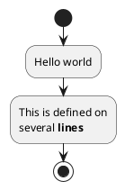
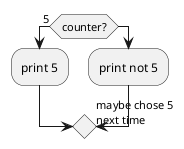
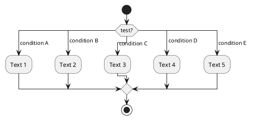
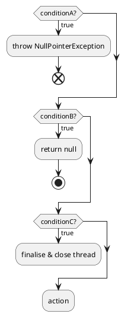
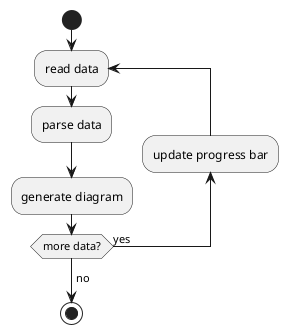
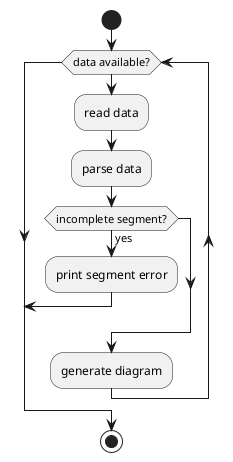
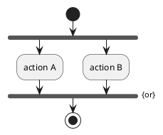

# PlantUML Activity Diagrams modeling syntax & semantics notation guide

## Rules:
1. Add title to the diagram
1. Add creation identifiers to the header
1. Do not apply any Skinparam, inline color or styling
1. Do not add any general diagram notes; notes with sutta acronym references (eg. "MN 95") beside the relevant concept are welcomed
1. Use start, stop & end where applicable
1. Honour the original source representation in names (eg. "Awareness-Release"). That is, do not use underscores or CamelCase in naming
1. [<= 25 characters]: Use a space on word boundaries (but preserve hyphens) in state and member names to make them easier to read (eg. "Unprovoked Awareness-Release" -> "Unprovoked Awareness-Release")
1. [> 25 characters]: Break state name on word boundaries using multiple line notation for long state names  > 25 characters (eg. "Unprovoked\nAwareness-Release")

## Add title and header

### How this example is to be read & understood
* The diagram has a header where notebooklm has replaced <generation-date> with today's date in dd-MMM-YYYY format
* The diagram has a title named "Mindfulness immersed in the body"

## Standard name formatting and Creole wiki syntax for highlighting

### How this example is to be read & understood
* The process starts with a flow directly to an activity named "Hello world". This is then followed by another activity that spans two lines with the word lined in bold before the process stops

## Conditional [if, then, else, endif]

### How this example is to be read & understood
* The process starts with a condition of assessing whether the counter value is 5. If so then it the process flows to the activity that prints 5. Otherwise, the process flows to the activity to print not 5 with a label on the outflow suggesting to chose next time

## Switch and case [switch, case, endswitch]

### How this example is to be read & understood
* The process starts with a flow directly to a switch condition. Here, each possible case condition is expressed and the flow continues to whichever condition that resolves with respect to the test variable. The process continue with that respective activity and the flows and then flows to stop.   

## Conditonal with stop on an action [kill, detach]

### How this example is to be read & understood
* The process flows directly to conditionA. If the condition evaluates to true, then the process is unexpectedly aborted with a NullPointerException fault
* The process then flows to conditionB. If this condition evaluates to true, then the process is returns with a null value
* The process then flows to conditionC. If this condition evaluates to true, then the process flows to activity finalise & close thread which on completion terminates the thread
* Otherwise, the process flows to the action activity

## Repeat loop with repeat action and backward action

### How this example is to be read & understood
* The proces starts with a flow directly to a repeat loop
* The loop's first activity is to read data which is then followed by parsing the data and finally generating the diagram
* The repeats condition is evaluated for more data remains
* If there is more data, then the process flows to the update progress bar before the loop continues
* When there is no more data, the process flows to the stop 

## While loop

### How this example is to be read & understood
* The proces starts with a flow directly to a while loop which evaluates the data available condition immediately
* If there is data available then the loop's first activity is to read data which is then followed by parsing the data and finally generating the diagram
* If an incomplete segment is encountered after parsing, then the process flows to the print segment error activity and breaks out of the loop otherwise loop repeats with the evaluation of the data available condition
* When there is no more data available, the process flows to the stop 

## Parallel processing [fork, fork again, end fork, end merge]

### How this example is to be read & understood
* There are two diagrams in this bundle which although are visually different, they are semantically the same because of the "{or}" constraint added to the end fork statement. If the "{or}" constraint was absent or "{and}" was used, then it implies that the process will only continue once both action A & B are complete
* The process starts with a flow directly to a synchronisation bar (ie. fork). From there two parallel activities are spawned namely action A & action B. No notes have been specified on how this parallelism is managed
* Then whichever of action A or action B completes first the process flows to stop
