# PlantUML Class Diagrams modeling syntax & semantics notation guide

## Rules:
1. Add title to the diagram
1. Add creation identifiers to the header
1. Do not apply any Skinparam, inline color or styling
1. Do not add any diagram notes
1. Always apply 'hide empty members' pragma (to reduce visual clutter and focus on explicitly defined elements)
1. Consider including left to right direction or top to bottom direction at the beginning of the diagram definition to optimize visual flow for complex relationship structures
1. Model packages for cohesive sets of classes as a separate diagram when the base diagram already has more than 9 nodes
1. Use name aliasing to handle class names with special characters
1. Honour the original source representation in class names (eg. "Awareness-Release")
1. [<= 25 characters]: Use underscore on word boundaries in class and member names (eg. "Unprovoked Awareness-Release" -> "Unprovoked_Awareness-Release")
1. [> 25 characters]: Break class name on word boundaries using multiple line notation for long class names  > 25 characters (eg. "Unprovoked\nAwareness-Release")
1. Add 1 member per line in compartments

## Add title and header

### How this example is to be read & understood
* The diagram has a header where notebooklm has replaced <gemini-model-id> with the model identifier & <generation-date> with date in dd-MMM-YYYY format
* The diagram has a title named "Mindfulness immersed in the body"

## Use aliases for names with special characters, names with spacing & long names spanning multiple lines
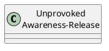
### How this example is to be read & understood
* There is a class named "Unprovoked Awareness-Release" that spans two lines separated at the word boundary

## Use abtract classes for abstract concepts
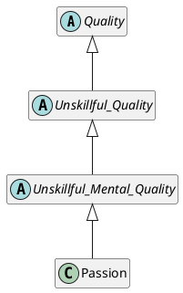
### How this example is to be read & understood
* There are abstract classes named Quality, Unskillful_Quality, Unskillful_Mental_Quality
* There is a class named Passion
* Passion extends Unskillful_Mental_Quality, which in turn extends Unskillful_Quality, which in turn extends Quality

## Use sterotype as the similes associated with the class when relevant
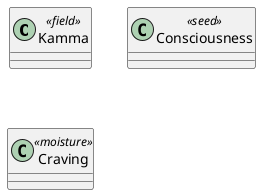
### How this example is to be read & understood
* There is a class named Kamma that is sterotyped as "field" (with respect to the simile)
* There is a class named Consciousness that is sterotyped as "seed" (with respect to the simile)
* There is a class named Craving that is sterotyped as "moisture" (with respect to the simile)

## Show class constraints using {<constraint>} in the first line of the first compartment
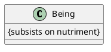
### How this example is to be read & understood
* There is a class named Being that is governed by the constraint (ie. class invariant) that it subsists on nutriment

## Show class member features using compartments with underscores as opposed to camel-case
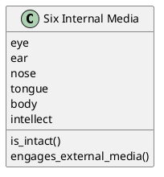
### How this example is to be read & understood
* There is a class named Six Internal Media which has the following members:
  * Attributes: eye, ear, nose, tongue, body, intellect
  * Methods: is_intact(), engages_external_media()

## Apply UML visibility modifiers (+ for public, - for private, # for protected) to attributes and operations when the accessibility or nature of the quality/action is explicitly described or strongly implied in the sources (e.g., publicly taught Dhamma vs. internally cultivated qualities)
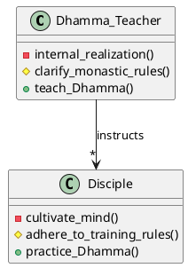
### How this example is to be read & understood
* There are classes named Dhamma_Teacher & Disciples
* The Dhamma_Teacher class has the following operations with the indicated visibility modifiers:
  * public teach_Dhamma()
  * private internal_realization()
  * protected clarify_monastic_rules()
* The Disciple class has the following operations with the indicated visibility modifiers: 
  * public practice_Dhamma()
  * private cultivate_mind() 
  * protected adhere_to_training_rules()
* The Dhamma_Teacher instructs many Disciples

## Use Extends, Composition, Aggregation, Dependency and Association for relationships 
Note:
* apply unidirection to dependency and associations when known and/or relevant

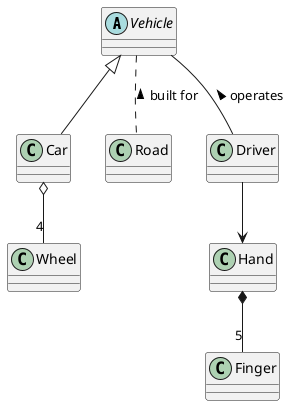
### How this example is to be read & understood
* There is an abstract class named Vehicle
* There are classes named Car, Road, Driver, Wheel, Hand & Finger
* A Car extends Vehicle and inherits all of its features
* A Car has 4 Wheels. This indicates a 'has-a' relationship where the component can exist independently of the whole (e.g., a 'Saṅgha' (Community) has 'Monks' (Members), but individual 'Monk' entities can exist independently of a specific Saṅgha)
* Roads are built for Vehicles. This relationship indicates that one class depends on another, often at a conceptual or usage level, without implying structural containment or direct ownership (e.g., 'Virtue' might depend on 'Shame' and 'Compunction' as guarding qualities, but Shame and Compunction are not structural parts of Virtue)
* A Driver operates a Vehicle
* A Driver is unidirectionally associated with a Hand
* A Hand embodies 5 Fingers. This signifies a 'part-of' relationship where the component cannot exist independently of the whole within the modeled context (e.g., the 'Hair_of_the_Head' is part of 'Body' and does not typically exist independently once detached and decaying in this specific conceptual model of a living being)

## Show navigation direction on associations & constraints for clarity of how the association is to be read
Note:
  * apply navigation direction identifier as last character in association name
  * show constraint in {} as first set of characters in association name

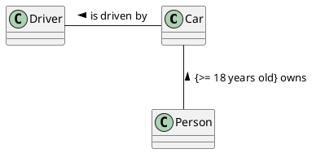
### How this example is to be read & understood
* There are classes named Car, Driver & Person
* A Car is driven by a Driver
* A Person may own a Car when they are 18 years old or older

## Use class associations for illustrating classification born out of an association
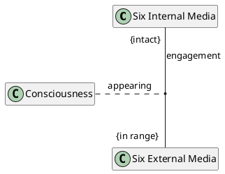
### How this example is to be read & understood
* There are classes named Six Internal Media, Six External Media & Consciousness
* There is an association named "engagement" between the Six Internal Media & Six External Media, where the:
  * Six Internal Media must be intact
  * Six External Media must be in range
* Born out of the "engagement" association is the "appearing" of Consciousness

## Use qualified associations to show accessing index/context
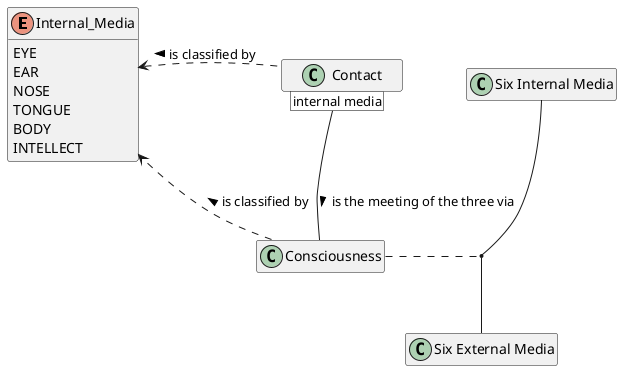
### How this example is to be read & understood
* There are classess named Six Internal Media, Six External Media, Consciousness & Contact
* There is an enumeration type named Internal_Media with the following values: 
  * EYE, EAR, NOSE, TONGUE, BODY, INTELLECT
* Contact is classified by Internal_Media as a dependency, suggesting that there are the following classes of Contact:
  * Eye Contact, Ear Contact, Nose Contact, Tongue Contact, Body Contact & Intellect Contact
* Consciousness is also classified by Internal_Media as a dependency, suggesting that there are the following classes of Consciousness:
  * Eye Consciousness, Ear Concsciousness, Nose Consciousness, Ear Consciousness, Nose Consciousness, Tongue Consciousness, Body Consciousness & Intellect Consciousness
* There is an association between the Six Internal Media & Six External Media from which Consciousness is born 
* Contact is the meeting of the three via Consciousness. Note, this is a qualified association which has internal media as its accessor

## Show role end details for non-obvious relationships
Note:
* A relationship is a link between two elements. A link has two ends (ie. start & end). Each end plays a role in the relationship 
* Role end's details can include:
  1. constraint within {}
  2. multiplcity
  3. role name

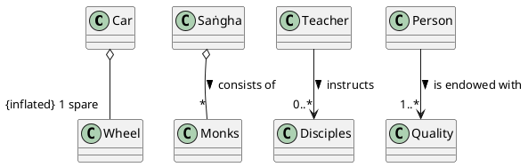
### How this example is to be read & understood
* There are classes named Car, Wheel, Saṅgha, Teacher & Person
* A Car has 1 spare wheel which must be inflated
* A Saṅgha typically consists_of * (many) Monks
* A Teacher instructs 0..* (zero to many) Disciples
* A Person is endowed_with 1..* (one or more) Quality

## Show relationships between specific members when necessary by using class-level associations or dependencies with explanatory labels that clarify the specific member interaction, avoiding direct lines within compartments

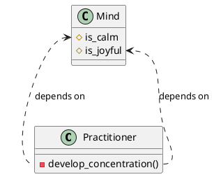
### How this example is to be read & understood
* There are classes named Practitioner & Mind
* The Practitioner supports a private member operation named develop_concentration()
* The Mind has two protected attributes named: is_calm and is_joyful
* The Practitioner's ability to develop_concentration is dependent on the Mind possessing the qualities of being is_calm and is_joyful. This reflects how concentration is fostered through calm and joy arising from mental cultivation
