# PlantUML Class Diagrams modeling syntax & semantics notation guide

## Rules:
1. Add title to the diagram
1. Add creation identifiers to the header
1. Do not apply any Skinparam, inline color or styling
1. Do not add any diagram notes
1. Always apply 'hide empty members' pragma
1. Model packages for cohesive sets of classes as a separate diagram when the base diagram already has more than 9 nodes
1. Use name aliasing to handle class names with special characters
1. Honour the original source representation in class names (eg. "Awareness-Release")
1. [<= 25 characters]: Use underscore on word boundaries in class and member names (eg. "Unprovoked Awareness-Release" -> "Unprovoked_Awareness-Release")
1. [> 25 characters]: Break class name on word boundaries using multiple line notation for long class names  > 25 characters (eg. "Unprovoked\nAwareness-Release")
1. Add 1 member per line in compartments

## Add title and header

### How this example is to be read & understood
* The diagram has a header where notebooklm has replaced <gemini-model-id> with the model identifier & <generation-date> with date in dd-MMM-YYYY format
* The diagram has a title named "Mindfulness immersed in the body"

## Use aliases for names with special characters, names with spacing & long names spanning multiple lines
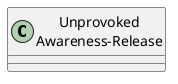
### How this example is to be read & understood
* There is a class named "Unprovoked Awareness-Release" that spans two lines separated at the word boundary

## Use abtract classes for abstract concepts
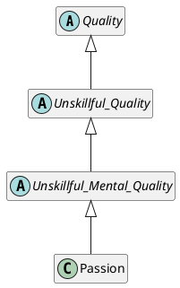
### How this example is to be read & understood
* There are abstract classes named Quality, Unskillful_Quality, Unskillful_Mental_Quality
* There is a class named Passion
* Passion extends Unskillful_Mental_Quality, which in turn extends Unskillful_Quality, which in turn extends Quality

## Use sterotype as the similes associated with the class when relevant
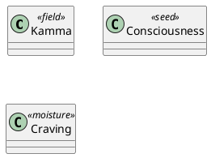
### How this example is to be read & understood
* There is a class named Kamma that is sterotyped as "field" (with respect to the simile)
* There is a class named Consciousness that is sterotyped as "seed" (with respect to the simile)
* There is a class named Craving that is sterotyped as "moisture" (with respect to the simile)

## Show class constraints using {<constraint>} in the first line of the first compartment
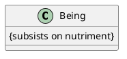
### How this example is to be read & understood
* There is a class named Being that is governed by the constraint (ie. class invariant) that it subsists on nutriment

## Show class member features using compartments with underscores as opposed to camel-case
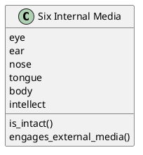
### How this example is to be read & understood
* There is a class named Six Internal Media which has the following members:
  * Attributes: eye, ear, nose, tongue, body, intellect
  * Methods: is_intact(), engages_external_media()

## Use Extends, Composition, Aggregation, Dependency and Association for relationships 
Note:
* apply unidirection to dependency and associations when known and/or relevant

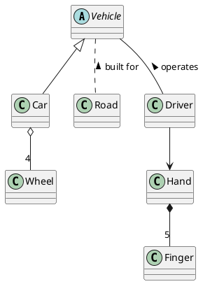
### How this example is to be read & understood
* There is an abstract class named Vehicle
* There are classes named Car, Road, Driver, Wheel, Hand & Finger
* A Car extends Vehicle and inherits all of its features
* A Car has 4 Wheels
* Roads are built for Vehicles 
* A Driver operates a Vehicle
* A Driver is unidirectionally associated with a Hand
* A Hand embodies 5 Fingers

## Show navigation direction on associations & constraints for clarity of how the association is to be read
Note:
  * apply navigation direction identifier as last character in association name
  * show constraint in {} as first set of characters in association name

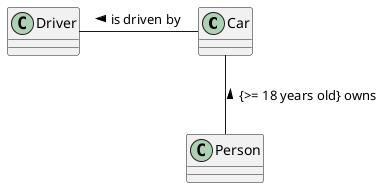
### How this example is to be read & understood
* There are classes named Car, Driver & Person
* A Car is driven by a Driver
* A Person may own a Car when they are 18 years old or older

## Use class associations for illustrating classification born out of an association
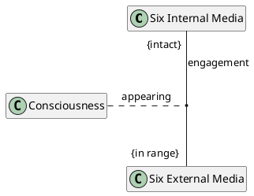
### How this example is to be read & understood
* There are classes named Six Internal Media, Six External Media & Consciousness
* There is an association named "engagement" between the Six Internal Media & Six External Media, where the:
  * Six Internal Media must be intact
  * Six External Media must be in range
* Born out of the "engagement" association is the "appearing" of Consciousness

## Use qualified associations to show accessing index/context
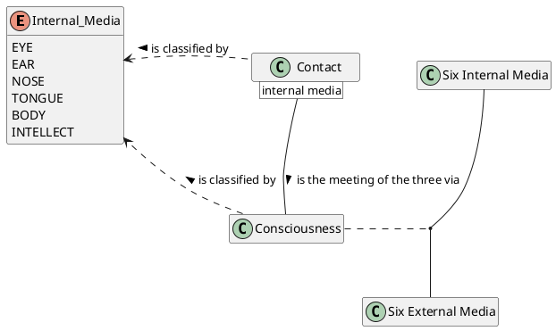
### How this example is to be read & understood
* There are classess named Six Internal Media, Six External Media, Consciousness & Contact
* There is an enumeration type named Internal_Media with the following values: 
  * EYE, EAR, NOSE, TONGUE, BODY, INTELLECT
* Contact is classified by Internal_Media as a dependency, suggesting that there are the following classes of Contact:
  * Eye Contact, Ear Contact, Nose Contact, Tongue Contact, Body Contact & Intellect Contact
* Consciousness is also classified by Internal_Media as a dependency, suggesting that there are the following classes of Consciousness:
  * Eye Consciousness, Ear Concsciousness, Nose Consciousness, Ear Consciousness, Nose Consciousness, Tongue Consciousness, Body Consciousness & Intellect Consciousness
* There is an association between the Six Internal Media & Six External Media from which Consciousness is born 
* Contact is the meeting of the three via Consciousness. Note, this is a qualified association which has internal media as its accessor

## Show role end details for non-obvious relationships
Note:
* A relationship is a link between two elements. A link has two ends (ie. start & end). Each end plays a role in the relationship 
* Role end's details can include:
  1. constraint within {}
  2. multiplcity
  3. role name

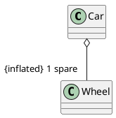
### How this example is to be read & understood
* There are classes named Car & Wheel
* A Car has 1 spare wheel which must be inflated

## Show relationships between specific members when necessary
Note:
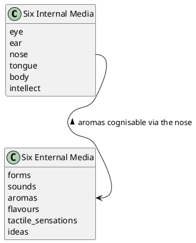
### How this example is to be read & understood
* There are classes named Six Internal Media & Six External Media
* The Six Internal Media has the following members:
  * eye, ear, nose, tongue, body & intellect
* The Six External Media has the following members:
  * forms, sounds, aromas, flavours, tactile sensations & ideas
* There is a unidirection association from Six Internal Media's nose to Six External Media's aromas. Note, this association is read in reverse as aromas cognisable via the nose