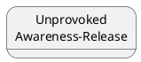
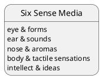
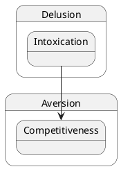
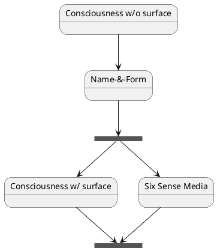
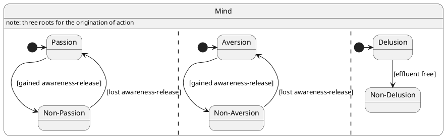
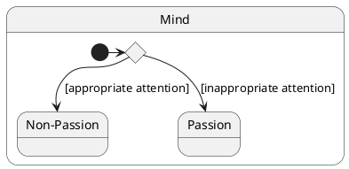
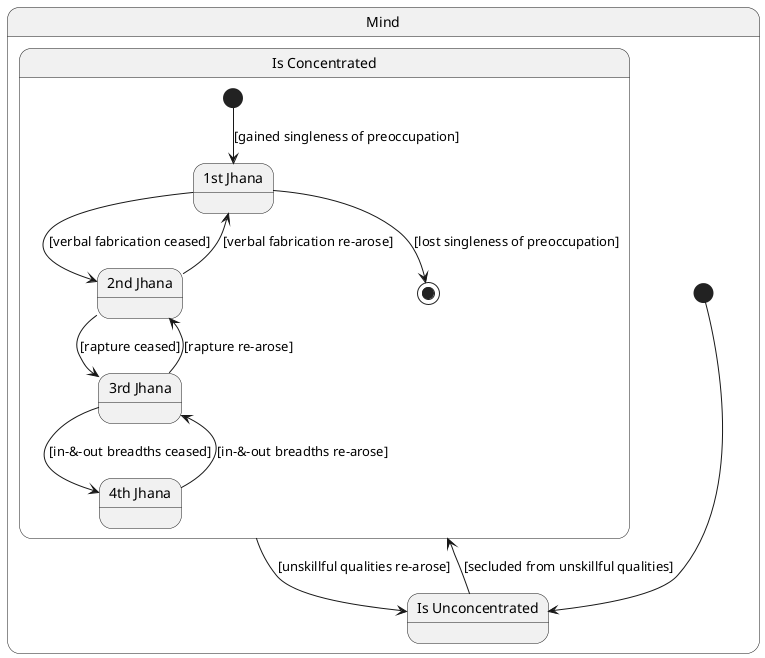
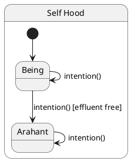
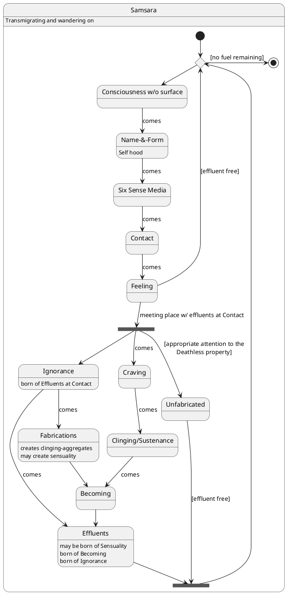

# PlantUML State Diagrams modeling syntax & semantics notation guide

## Rules:
1. Add title to the diagram
1. Add creation identifiers to the header
1. Do not apply any Skinparam, inline color or styling
1. Do not add any general diagram notes; notes with sutta acronym references (eg. "MN 95") beside the relevant concept are welcomed
1. Always add 'hide empty description' pragma (to reduce visual clutter and focus on state transitions and key internal details)
1. Consider including left to right direction or top to bottom direction at the beginning of the diagram definition to optimize visual flow for complex state transitions
1. Always have a start & end state unless not applicable
1. Use name aliasing to handle state names with special characters
1. Honour the original source representation in names (eg. "Awareness-Release"). That is, do not use underscores or CamelCase in naming
1. [<= 25 characters]: Use a space on word boundaries (but preserve hyphens) in state and member names to make them easier to read (eg. "Unprovoked Awareness-Release" -> "Unprovoked Awareness-Release")
1. [> 25 characters]: Break state name on word boundaries using multiple line notation for long state names  > 25 characters (eg. "Unprovoked\nAwareness-Release")
1. Add 1 member per line in compartments

## Add title and header

### How this example is to be read & understood
* The diagram has a header where notebooklm has replaced <generation-date> with today's date in dd-MMM-YYYY format
* The diagram has a title named "Mindfulness immersed in the body"

## Use aliases for names with special characters, names with spacing & long names spaning multiple lines

### How this example is to be read & understood
* There is a state named "Unprovoked Awareness-Release" that spans two lines separated at the word boundary

## Use state compartment for expressing details

### How this example is to be read & understood
* There is a state named Six Sense Media which has the following internal details/values:
  * eye & forms, ear & sounds, nose & aromas, body & tactile sensations, intellect & ideas

## Create a separate composite state diagram when the total number of states > 9 and a composite state is evident

```plantuml
@startuml
state "Training in Heightened Virtue" as hv
state "Training in Heightened Mind" as hm
state "Training in Heightened Discernment" as hd

hv:Mind
hm:Mind
hd:Mind

[*] -> hv
hv -> hm: leads to
hm -> hd: leads to
hd -> [*]
@enduml

@startuml
state Mind {
  state "Non-Passion" as np

  [*] -> Passion
  Passion --> np : [gained awareness-release]
  np --> Passion : \n\n[lost awareness-release]
  ||
  state "Non-Aversion" as na
  [*] -> Aversion
  Aversion --> na : [gained awareness-release]
  na --> Aversion : \n\n[lost awareness-release]
  ||
  state "Non-Delusion" as nd
  [*] -> Delusion
  Delusion --> nd : [effluent free]
}
Mind:note: three roots for the origination of action
@enduml
```

### How this example is to be read & understood
* There are two diagrams that have been created as part of this bundle:
  * Top-level diagram: 
    * There are the three states: Training in Heightened Virtue, Training in Heightened Mind & Training in Heightened Discernment
      * Each of these states makes reference to an internal member named Mind
    * The start state transitions to the Training in Heightened Virtue, which in turn transitions to the Training in Heightened Mind, which in turn transitions to the Training in Heightened Discernment and finally transitions to the end state
  * The Mind diagram:
    * There is a composite state named Mind which indicates that there are three roots for the origination of action. These are illustrated as the following concurrent states:
      * Passion/Non-Passion:
        * The Mind from the start transitions immediately to the Passion sub-state
        * The Passion sub-state transitions to the Non-Passion sub-state when awareness-release is gained
        * The Non-Passion sub-state transitions to the Passion sub-state when awareness-release is lost
      * Aversion/Non-Aversion
        * The Mind from the start transitions immediately to the Aversion sub-state
        * The Aversion sub-state transitions to the Non-Aversion sub-state when awareness-release is gained
        * The Non-Aversion sub-state transitions to the Aversion sub-state when awareness-release is lost
      * Delusion/Non-Delusion
        * The Mind from the start transitions immediately to the Delusion sub-state
        * The Delusion sub-state transitions permanently to the Non-Delusion sub-state when the mind is effluent free

## Use sub-states when context is required

### How this example is to be read & understood
* There are two outer-states namely: Delusion & Aversion
* The Delusion state has an Intoxication sub-state
* The Aversion state has a Competitiveness sub-state
* There is a transition that occurs from the Intoxication sub-state to the Competitiveness sub-state

## Use synchronisation bar for forks and joins

### How this example is to be read & understood
* There are four states namely: Consciousness w/o surface, Name-&-Form, Consciousness w/ surface & Six Sense Media
* There is a transition from Consciousness w/o surface to Name-&-Form
* There is a transition from Name-&-Form to a synchronisation bar fork
* There are two transitions that are spawned simultaneously from the fork:
  * A transition to Consciousness w/ surface
  * A transition to Six Sense Media
* There are no indications as to whether these states are completed serially or in parallel, however both end together at the synchronisation bar join

## Use concurrent states for complex objects when required

### How this example is to be read & understood
* There is a composite state named Mind which indicates that there are three roots for the origination of action. These are illustrated as the following concurrent states:
  * Passion/Non-Passion:
    * The Mind from the start transitions immediately to the Passion sub-state
    * The Passion sub-state transitions to the Non-Passion sub-state when awareness-release is gained
    * The Non-Passion sub-state transitions to the Passion sub-state when awareness-release is lost
  * Aversion/Non-Aversion
    * The Mind from the start transitions immediately to the Aversion sub-state
    * The Aversion sub-state transitions to the Non-Aversion sub-state when awareness-release is gained
    * The Non-Aversion sub-state transitions to the Aversion sub-state when awareness-release is lost
  * Delusion/Non-Delusion
    * The Mind from the start transitions immediately to the Delusion sub-state
    * The Delusion sub-state transitions permanently to the Non-Delusion sub-state when the mind is effluentfree

## Use choice for expressing critical conditional transitions

### How this example is to be read & understood
* There is a composite state named Mind with two sub-states namely: Passion & Non-Passion
* From the start, the mind encounters a binary condition: attending appropriately (yoniso manasikāra) or inappropriately (ayoniso manasikāra)
  * When the mind holds appropriate attention, it transitions to the Non-Passion sub-state, reflecting the path where skillful qualities arise
  * Conversely, when the mind holds inappropriate attention, it transitions to the Passion sub-state, indicating a decline where unskillful qualities arise and increase

## Use [<condition>] labels on transitions for expressing non-critical conditional transitions
Note:
  * When using conditional labels on transitions, verify that the model does not get unintentionally stuck in a given state 

### How this example is to be read & understood
* There is a composite state named Mind with two sub-states namely: Is Concentrated & Is Unconcentrated
* The mind starts in the Is Unconcentrated sub-state:
  * The mind transitions to the Is Concentrated sub-state when the mind is secluded from unskillful qualities
  * The mind transitions from the Is Concentrated sub-state when unskillful qualities re-arise
* The Is Concentrated sub-state is itself a composite state with four sub-states:
  * The mind transitions into the 1st Jhana sub-state when singleness of preoccupation has been gained
  * The mind transitions out of the 1st Jhana sub-state when singleness of preoccupation has been lost
  * The mind transitions into the 2nd Jhana sub-state when verbal fabrication have ceased
  * The mind transitions back into the 1st Jhana sub-state when verbal fabrication have re-arisen
  * The mind transitions into the 3rd Jhana sub-state when rapture has ceased
  * The mind transitions back into the 2nd Jhana sub-state when rpature has re-arisen3rd
  * The mind transitions into the 4th Jhana sub-state when the in-&-out breadths have ceased
  * The mind transitions back into the 3rd Jhana sub-state when the in-&-out breadths have re-arisen

## Use self-referencing transitions when necessary

### How this example is to be read & understood
* The model starts in the Being sub-state, representing an individual in the cycle of existence
* The 'Being' continuously performs actions driven by intention (cetanā), which typically results in a self-referencing transition, perpetuating one's state within the cycle of becoming
* However, upon becoming effluent-free with one's intention, meaning the abandonment of passion, aversion, and delusion, they transition into the Arahant sub-state
* Once Arahantship is acquired, all further actions and intentions keep one remaining in this released state, as the root of future becoming has been destroyed

## Use loops to illustrate cycles

### How this example is to be read & understood
* Upon starting, the process encounters a decision point: whether there is 'fuel' (likened to clinging/sustenance or craving) remaining
* If no fuel remains, it signifies the ending of the cycle and a transition to the end state
* If fuel remains, the cycle of dependent co-arising begins: 
  * Consciousness (without surface) leads to Name-&-Form
  * From Name-&-Form comes the Six Sense Media
  * From Six Sense Media comes Contact
  * From Contact comes Feeling
  * The cycle then repeats unless effluents are ended at Contact or Ignorance and Craving are abandoned, which leads to the Unfabricated state, representing the deathless
This depicts the cycle of becoming and suffering (saṁsāra) and the path to its cessation (Nibbāna).