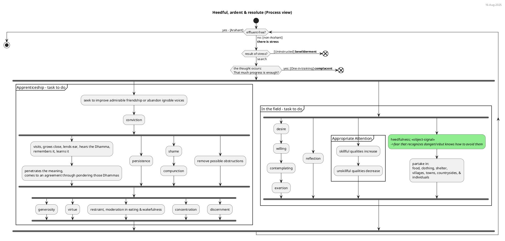
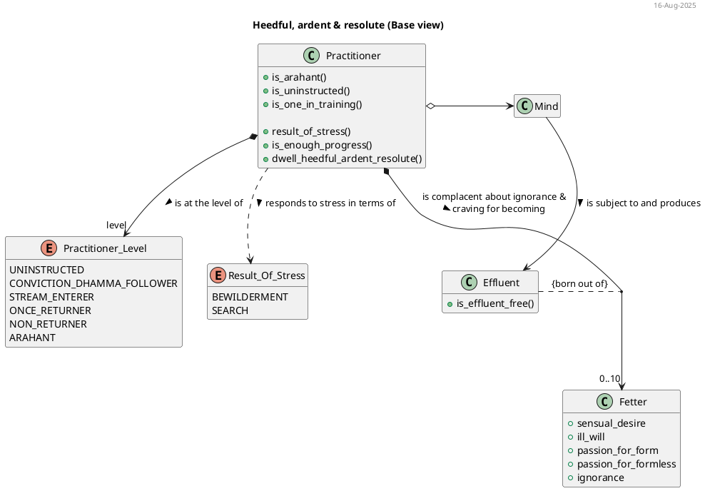
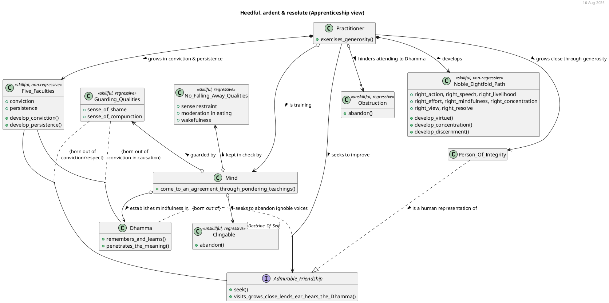
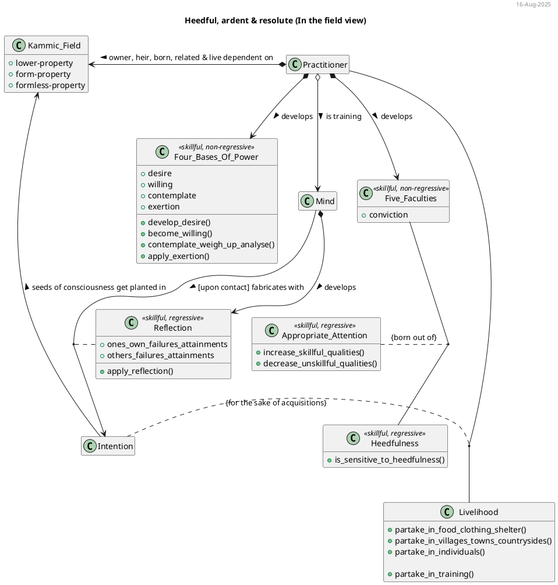
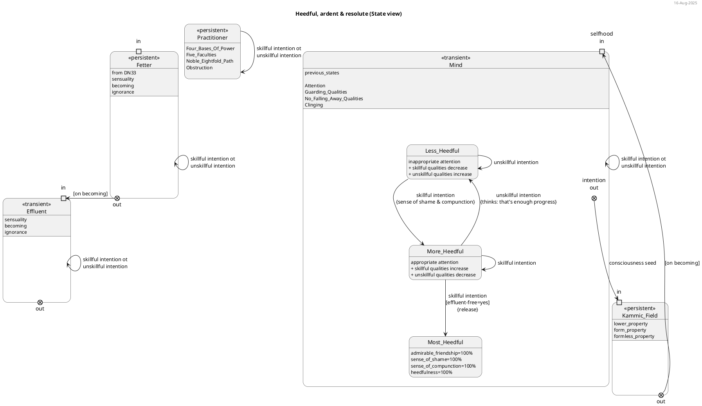
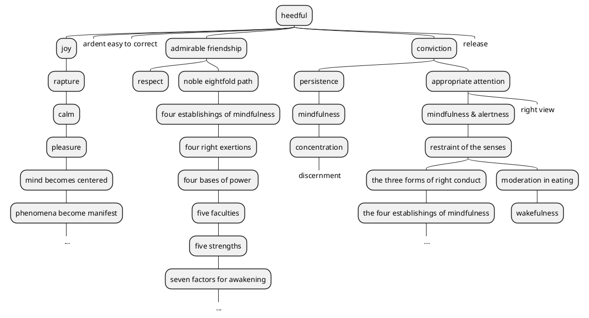

# Guide to writing "progressing by tens" framework patterns

## Background
in DN 34 there are 100 Dhammas presented in a "progressing by tens" framework. these Dhammas are highly tailored for attaining unbinding, putting an end to suffering & stress, and releasing from all ties. these 100 Dhammas are in fact patterns, that is, they are well established solutions to known problems that practitioners face whilst in training. there is a requirements to create a project which will result in a Dhamma practitioner's pattern language of the "progressing by tens" framework

in order to be successful at this task, notebooklm has been paired with an expert dhamma practitioner. the expert has authored the source "DN34-param-pattern-request.md" template/instructions and it's accompanying source "DN34-param-pattern-request-config.json.txt" configuration file.

notebooklm has been assigned the task of eventually generating all of the 100 patterns. notebooklm and the expert have been collaborating on the "Heedful, ardent & resolute" pattern (previously known just as Heedfulness) which has thus experienced 4 iterations with feedback from the expert serving as input for the next generated iteration. whilst this process review/refinement process is progressing, it is far too slow.


## Purpose
after repeated failures to generate the pattern to the quality expected by the expert, the expert has authored this guide to accelerate the process by reducing the number of iterations in the learning development process. this guide represents the approach that the expert themselves would follow to deliver the desired pattern. the purpose of this guide is to document the processes & methods of creating the raw materials and building blocks. 

note, this guide is more akin to capturing the working out (ie. building blocks) to a math's problem rather than the solution's actual answer. this capturing will be achieved by storing the each building block value into a JSON object. thus, the consuming template of this guide will be responsible for formatting each building block into the final generated pattern from the following JSON object:

```json
  patternBuildingBlocksJson = {
    "Problem": "", /* string of the problem statement */
    "Solution": {
        "Step-by-Step": [/* array of process step string (this is a flattened representation of Process View)*/],
        "Cause-&-Effect": [/* array of {cause: string, effect: string} objects (from sources and used in Process View)*/],
        "Solution": {
            "Process View": [/* array of PlantUML Activity Diagram strings */],
            "Concepts & Relationships": [/* array of PlantUML Class Diagram strings */],
            "State Transitions": [/* array of PlantUML State Diagram strings */]
        },
    },
    "Context": [/* array of requisite condition/invariant strings */],
    "Forces": [/* array of design constraint/influence strings */],
    "Rationale": "", /* string of the rationale statement */
    "Resulting Context": [/* array of PlantUML Mindmap Diagram strings */],
    "Related Patterns": [/* array of related pattern-name strings */],
    "Case-studies": [/* array of individual's name reference strings */],
    "Simile": [/* array of simile name reference strings */]
  }
```

note, 
1. the **"Heedful, ardent & resolute"** pattern whose association answer-excerpt is **"Heedfulness with regard to skillful qualities"** has been used as a running example for this guide. use the running example to follow the expert's methodology on how they went about crafting the raw materials and building blocks that lead to/will lead to the section's final draft. note, only the problem section and plantuml diagrams are considered final drafts. all other sections or sub-sections should be considered as works in progress that notebooklm can use as a reference.


## The "progressing by tens" Pattern writing process
1. Research the solution
2. Prepare the content for the pattern's "Problem"
3. Prepare the content for the pattern's "Solution"
4. Prepare the content for the pattern's "Context"
5. Prepare the content for the pattern's "Forces"
6. Prepare the content for the pattern's "Rationale"
7. Prepare the content for the pattern's "Resulting Context"
8. Prepare the content for the pattern's "Related Patterns"
9. Prepare the content for the pattern's "Case-studies"
10. Prepare the content for the pattern's "Simile"


## Assessment criteria
the expert uses the following accessment criteria when reviewing each section of the generated pattern and assign the following mark based on the marking scheme:
1. **distinction**
    1. when there is nothing missing [in the content]
    2. when there is nothing in excess [in the content]
2. **credit**
    1. when there are some things missing [in the content]
    2. when there are some things in excess [in the content]
3. **pass**
    1. when there are many things missing [in the content]
    2. when there are many things in excess [in the content]
4. **fail**
    1. when the content is categorically wrong and not fit for purpose


## 1. Research the solution
unlike writing a typical pattern, the "progressing by tens" pattern's approach will be a little backwards. this is because the answer as been given in response to a question focused around dhamma memorisation. note, Ven. Sāriputta's answers are not solutions. the answer's solution space must be explored and comprehended in order to determine the real solution and problem.

more often than not, Ven. Sāriputta's full answer is provided in brief. even though there are 100 dhamma topics, the "progression by tens" framework means that in total there are 550 dhammas referenced within the framework itself. therefore, researching the suttas is crucial on each subject (eg for ones there is 1 subject, for twos there are 2 subjects in the answer, and so on) for comprehension. further, there is one specific case of "Mindfulness & alertness" which appears as two subjects. this is a special case where there is a specific practice named "Mindfulness & alertness" and thus is to treated as one subject, however "alertness" in of itself should be added as the second subject.


(a) parse the originating "progression by tens" question and answer statement for the following:
1. progression-index
2. category-key
3. subjects
4. focus areas for each subject

(b) search ONLY the sutta sources for each of the above identified subject within the context of the category-key. sometime a opposite or inverse of the subject will also help identify valuable search results


**running example**

originating question and answer statement:
  * 'Which one dhamma is very helpful? Heedfulness with regard to skillful qualities: This one dhamma is very helpful.

1. progression-index = "one" or 1
2. category-key = "helpful"
3. subjects = ["Heedfulness"]
4. focus areas for each subject = ["skillful qualities"]

start searching the suttas for the key term "heedful" or opposite "heedless" in the context of it being helpful

search results may include:
* Don't be heedless. Don't later fall into remorse.
* Now, then, monks, I exhort you: All fabrications are subject to ending & decay. Reach consummation through heedfulness.' That was the Tathāgata's last statement [to a group of noble monks the most backward of which was a stream-enterer]
* *Monks, I don't say of all monks that they have a task to do with heedfulness"
* [dont] ever let yourself get complacent when the ending of effluents is still unattained
* Now the thought may occur to you, 'We are endowed with shame & compunction. That much is enough, that much means we're done, so that the goal of our contemplative state has been reached. There's nothing further to be done,' and you may rest content with just that. So I tell you, monks. I exhort you, monks. Don't let those of you who seek the contemplative state fall away from the goal of the contemplative state when there is more to be done.


## 2. Prepare the content for the pattern's "Problem"
(a) identify the **real** problem that the solution addresses. using the following:
1. Ven. Sāriputta (an expert) has provided the answer & 
2. the search results from the previous step 
we can progress towards the problem statement.

consider the following:
* in each search result who (ie. what type of individual uninstructed, stream-enterer, etc) was the recipient of that statement?
* an expert will often know the exact question to ask and how to frame it; eg Ven. Sāriputta asks "what does your teacher teach?"
* an expert is often highly direct and brief

(b) generate a statement with the following attributes:
1. what is the problem about
2. what is the scope (ie. where does it start and stop) for the problem to be rsolve
3. what would Ven. Sāriputta, knowing that you are practicing wrongly, ask a very direct and brief question of you such that you cannot hide behind words?

(c) store this value in patternBuildingBlocksJson["Problem"]

**Assessment**
assess in terms of missing/excess, the 
* problem statement


**running example**
after some analysis:
* it is evident that this statement is mostly targetted at "one in training" (ie. stream-enterer to non-returner, who have a task to do) 
* one in training can become content with their existing developed skillful qualities (thinking: this much is enough)
* it appears that the end state of heedfulness is ending the effluents

therefore, the sections building blocks are:
1. the problem is about complacency
2. the scope starts from the point of complacency and continues until the end of the effluents is unattained
3. what would Ven. Sāriputta, knowing that you are practicing wrongly, ask a very direct and brief question of you such that you cannot hide behind words?

draft problem statement could be:
How do you stop being complacent when the ending of effluents is still unattained?


## 3. Prepare the content for the pattern's "Solution"
despite having already been given the Ven. Sāriputta's answers, this is by far the most challenging aspect of writing these dhamma patterns.

consider the following:
* 'The Dhamma should be taught with the thought, 'I will speak step-by-step.'
* 'The Dhamma should be taught with the thought, 'I will speak explaining the sequence (of cause & effect).'
* humans follow processes, do activities and reach milestones. the dhamma however, is most often expressed in terms of causation, this causes that, leads to, results in, benefit, reward etc.
* consider a student being told that they need to practice the noble eightful path. they having been told that, they are immediately lost. the student needs to transform an event based causal model (ie. when this, then that) with principles and transform it into a concrete process that they can follow, complete activities and achieve milestones. due to dull discernment, it often results in failure! the various aspects of the overral solution is intended to resolve that issue.

the sutta texts are sources that document causation which can both implicitly and explicitly inferred. notebooklm has supoerior inference, logic and reasoning skills which are required for this task. notebooklm should be able to identify links between disparate causal chains and/or activities that are not explicitly stated. teaching and learning dhamma is largely an exercise in language. because notebooklm is an LLM, it should be well positioned to perform this task.

1. **identify causal chains related to the scope**
(a) use the source "guide_causation_expression.md" for some candidate causation expressions as a means for searching in relation to both the problem and solution.
(b) search for cause/effect relationships related the subject(s) depending on the progression (ie. ones, twos,...)
(c) for each cause/effect encountered, expand the search by repeating step (b) with using the related cause (backward) or effect (forward). do this again such that you have researched a pool of cause/effect relations with a few degress of freedom from the original subject and which also includes the problem statement's scope from the previous section
(d) compile the list of search results as this represents the causal pool 

**running example**
consider the following search results (ie. causal pool):
* all skillful qualities are rooted in heedfulness, converge in heedfulness, and heedfulness is reckoned the foremost among them
* This one quality, monks, when developed & pursued, keeps both kinds of benefit secure: benefit in this life & in lives to come.
* Monks, having a sense of shame & having a sense of compunction, one is heedful
* Monks, these two bright qualities guard the world. Which two? Shame & compunction.
* For him, dwelling thus heedfully, joy is born. In one who has joy, rapture is born. The body of one enraptured at heart grows calm. When the body is calm, one feels pleasure. Feeling pleasure, the mind becomes centered. When the mind is centered, phenomena become manifest. When phenomena are manifest, he is reckoned as one who dwells in heedfulness
* Being heedful, one is capable of abandoning apathy, being hard to correct, & evil friendship
* 'And what is heedfulness? There is the case where a monk guards his mind with regard to effluents and qualities accompanied by effluents. When his mind is guarded with regard to effluents and mental qualities accompanied by effluents, the faculty of conviction goes to the culmination of its development. The faculty of persistence… mindfulness… concentration… discernment goes to the culmination of its development
* The monk delighting in heedfulness, seeing danger in heedlessness –incapable of falling back– stands right on the verge of Unbinding.
* 'There is the case, friends, where a monk lives in apprenticeship to the Teacher or to a respectable companion in the holy life in whom he has established a strong sense of shame & compunction, love, & respect.
* Any individual of whom one has come to know, 'When I partake of this individual, unskillful qualities decrease and skillful qualities increase,' that sort of individual is to be partaken of
* Monks, as long as the monks have conviction… shame… compunction… learning… aroused persistence… established mindfulness… discernment, the monks' growth can be expected, not their decline
* 'Seven noble treasures: the treasure of conviction, the treasure of virtue, the treasure of a sense of shame, the treasure of a sense of compunction, the treasure of listening, the treasure of generosity, the treasure of discernment
* 'Seven true dhammas: There is the case, friends, where a monk has conviction, a sense of shame, a sense of compunction, learning, and is one of aroused persistence, established mindfulness, & discerning
* 'Seven strengths: the strength of conviction, the strength of persistence, the strength of a sense of shame, the strength of compunction, the strength of mindfulness, the strength of concentration, the strength of discernment.
* 'When, on observing that the monk is purified with regard to qualities based on delusion, he places conviction in him. With the arising of conviction, he visits him & grows close to him. Growing close to him, he lends ear. Lending ear, he hears the Dhamma. Hearing the Dhamma, he remembers it. Remembering it, he penetrates the meaning of those dhammas. Penetrating the meaning, he comes to an agreement through pondering those dhammas. There being an agreement through pondering those dhammas, desire arises. With the arising of desire, he becomes willing. Willing, he contemplates [literally: weighs, compares]. Contemplating, he makes an exertion. Exerting himself, he both realizes the highest truth with his body and sees by penetrating it with discernment.
* Having admirable people as friends, companions, & colleagues is actually the whole of the holy life. When a monk has admirable people as friends, companions, & colleagues, he can be expected to develop & pursue the noble eightfold path.
* 'He is endowed with a (present) kamma obstruction, a defilement obstruction, a result-of-(past)-kamma obstruction; he lacks conviction, has no desire (to listen), and has dull discernment. Endowed with these six qualities, a person is incapable of alighting on the lawfulness, the rightness of skillful qualities even when listening to the true Dhamma.
* 'You, too, monks, should relentlessly exert yourselves, (thinking,) 'Gladly would we let the flesh & blood in our bodies dry up, leaving just the skin, tendons, & bones, but if we have not attained what can be reached through manly firmness, manly persistence, manly striving, there will be no relaxing our persistence.' You, too, in no long time will enter & remain in the supreme goal of the holy life for which clansmen rightly go forth from home into homelessness, directly knowing & realizing it for yourselves in the here & now.
* If, when a monk's awareness often remains steeped in the perception of stress in what is inconstant, a fierce perception of danger & fear is not established in him toward idleness, indolence, laziness, heedlessness, lack of commitment, & lack of reflection, as if toward a murderer with an upraised sword, then he should realize, 'I have not developed the perception of stress in what is inconstant; there is no step-by-step distinction in me; I have not arrived at the fruit of (mental) development.'
* 'Commitment & reflection are food for Dhammas.
* Monks, it's good for a monk periodically to have reflected on his own failings. It's good for a monk periodically to have reflected on the failings of others. It's good for a monk periodically to have reflected on his own attainments. It's good for a monk periodically to have reflected on the attainments of others
* Thus for him, having thus developed the noble eightfold path, the four establishings of mindfulness go to the culmination of their development. The four right exertions… the four bases of power… the five faculties… the five strengths… the seven factors for awakening go to the culmination of their development.
* seeking is dependent on craving, acquisition is dependent on seeking, ascertainment is dependent on acquisition, desire and passion is dependent on ascertainment,
* I tell you, monks, that stress results either in bewilderment or in search.
* when associating with people of integrity is made full, it fills [the conditions for] hearing the true Dhamma… conviction… appropriate attention… mindfulness & alertness… restraint of the senses… the three forms of right conduct… the four establishings of mindfulness… the seven factors for awakening. When the seven factors for awakening are made full, they fill [the conditions for] clear knowing & release
* There is the case where a monk is consummate in virtue, guards the doors to his sense faculties, knows moderation in eating, & is devoted to wakefulness.
* Monks, I speak of robes in two ways: to be partaken of and not to be partaken of. I also speak of alms food… lodgings… villages & towns… countrysides… individuals in two ways: to be partaken of and not to be partaken of.
* Any robe of which one has come to know, 'When I partake of this robe, unskillful qualities decrease and skillful qualities increase,' that sort of robe is to be partaken of.

(e) expanding the causal pool using expert direct experience. this step can be added by the expert after reviewing the generated pattern

**running example**
1. direct experience would reveal that as the practice progresses the admirable friend's voice continues to resonate and echo like a songs of dhamma stuck on repeat in the practitioners mind; consider this as signal. the admirable friend need not be a physical person. it could a book, audio/video dhamma talks, it could even be a notebooklm <smile> notebook. furthermore, the clinging to doctrine-of-self is the attachment to voices and roles. the practitioner must start to realise that voices other than the buddha's instructions, are to be treated as noise. hence, regardless of whether one physically lives with a teacher or not, the practice is one of continous seeking, resulting in perfecting the signal to noise ratio of instruction! further, admirable friendship *means* to copy, clone and imitate the qualities of the admirable friend, not the quality of companionship in-of-itself (ie. "Associating with an admirable friend even a fool becomes wise")

therefore, add the additional causal chains to the pool:
* 'Monks, there are these two conditions for the arising of right view. Which two? The voice of another and appropriate attention. These are the two conditions for the arising of right view.'
2. note, not even the buddha could not teach/instruct on the specific topics of how to acquire heedfulness, appropriate attention and admirable friendship despite being "well-gone, an expert with regard to the cosmos, unexcelled trainer of people fit to be tamed, teacher of devas & human beings, awakened, blessed". an individual needed to be fit to be tamed!
    * "It's impossible, there's no way, that a person of no integrity would know of a person of no integrity: 'This is a person of no integrity... It's impossible, there's no way, that a person of no integrity would know of a person of integrity: 'This is a person of integrity."
    * "Monks, with regard to external factors, I don't envision any other single factor like friendship with admirable people as doing so much for a monk in training, who has not attained the heart's aspiration but remains intent on the unsurpassed safety from bondage."
    * "Monks, with regard to internal factors, I don't envision any other single factor like appropriate attention as doing so much for a monk in training, who has not attained the heart's aspiration but remains intent on the unsurpassed safety from bondage."

note, the root cause of acquiring admirable friendship is kammic. therefore, these causal chains should also be added to the pool:
* Eight inopportune, untimely situations for leading the holy life
* Four wheels: living in a civilized land, associating with people of integrity, directing oneself rightly, & having done merit in the past. These four dhammas are very helpful.


2. **Section: Solution > Cause-&-Effect** 
it is important to realise that many of the lists that are in the sutta sources are in fact causal chains. you can safely assume that about 90% of lists are causal chains. even the five-clinging aggregates is itself a causal chain, you just need to know how to see it. therefore, proceed with the assumption that any given list is a causal chain and the expert will identify the exceptions when the section is reviewed.

(a) visit each causal chain result from the causal pool and list all unique cause -> effect pairs. generalising concepts and pattern matching will help (eg. teacher = admirable friendship) avoid the list becoming unmanagable

* shame -> heedful
* compunction -> heedful
* heedful -> joy
* joy -> rapture
* rapture -> calm
* calm -> pleasure
* pleasure -> mind becomes centered
* mind becomes centered -> phenomena become manifest
* heedful -> ardent
* heedful -> easy to correct
* heedful -> admirable friendship
* heedful -> conviction
* conviction -> persistence
* persistence -> mindfulness
* mindfulness -> concentration
* concentration -> discernment
* heedful -> release
* admirable friendship -> shame
* admirable friendship -> compunction
* admirable friendship -> respect
* conviction -> shame
* shame -> compunction
* compunction -> learning
* learning -> persistence
* persistence -> mindfulness
* mindfulness -> discernment
* conviction -> virtue
* virtue -> shame
* virtue -> sense restraint
* sense-restraint -> moderation in eating
* moderation in eating -> wakefulness
* learning -> generosity 
* generosity -> discernment
* conviction -> persistence
* persistence -> shame
* compunction -> mindfulness
* admirable friendship -> conviction
* conviction -> visits
* visits -> grows close
* grows close -> lends ear
* lends ear -> hears the Dhamma
* hearing the Dhamma -> remembers it
* remembers it -> penetrates the meaning
* penetrates the meaning -> comes to an agreement through pondering those Dhammas
* comes to an agreement through pondering -> desire
* desire -> willing
* willing -> contemplates
* contemplates -> exertion
* exertion -> realizes the highest truth
* admirable friend -> noble eightfold path
* (present) kamma obstruction -CANNOT-> remembers it
* defilement obstruction -CANNOT-> remembers it
* result-of-(past)-kamma obstruction -CANNOT-> remembers it
* NOT conviction -CANNOT-> remembers it
* NOT desire -CANNOT-> remembers it
* NOT discernment -CANNOT-> remembers it
* NOT fear -> heedlessness
* NOT fear -CANNOT-> commitment
* NOT fear -CANNOT-> reflection
* commitment -> noble eightfold path
* reflection -> noble eightfold path
* noble eightfold path -> four establishings of mindfulness
* four establishings of mindfulness -> four right exertions
* four right exertions -> four bases of power
* four bases of power -> five faculties
* five faculties -> five strengths
* five strengths -> seven factors for awakening
* craving -> seeking
* seeking -> acquisition
* acquisition -> ascertainment
* ascertainment -> desire and passion
* appropriate attention -> right view
* admirable friendship -> right view
* admirable friendship -> hearing the true dhamma
* hearing the true dhamma -> conviction
* conviction -> appropriate attention
* appropriate attention -> mindfulness & alertness
* mindfulness & alertness -> restraint of the senses
* restraint of the senses -> the three forms of right conduct
* the three forms of right conduct -> the four establishings of mindfulness
* the four establishings of mindfulness -> the seven factors for awakening
* the seven factors for awakening -> clear knowing & release
* NOT living in a civilized land -CANNOT-> heedfulness
* NOT admirable friendship -CANNOT-> heedfulness
* NOT virtue -CANNOT-> heedfulness
* NOT done merit in the past [and/or lifetimes] -CANNOT-> heedfulness

note, there will be small deviations in terms of order amongst these pairs across suttas but nothing of signifance. when you encounter a cause/effect pair that contradicts another encountered cause/effect pair, then it is because occur in parallel or its a specific facet of a dhamma qualities that is causing the difference.

consolidate this cause/effect list removing duplicate pairs

(b) clone and store this consolidated list in the patternBuildingBlocksJson["Solution"]["Cause-&-Effect"] array as this will be modified in the next step


3. **Section: Solution > Process View** 

(a) review the consolidated cause/effect pairs in terms of timing, conditional logic and loops. ensure that the entire scope of the problem/solution is considered. after some iterations of adjustment an identifiable process will emerge 

the process model is created first because it forces all causal aspects to be unified and resolved in order to make a functional process. 

**running example**
Using the cause/effect pairs from the previous step, we observe:
* a sense of shame and a sense of compunction is the cause of heedfulness
* conviction, persistence, virtue, generosity etc, precede a sense of shame and a sense of compunction
* obstructions block learning the true dhamma
* admirable friendship precedes conviction
* seeking leads to desire
* desire results in exertion
* contemplating and reflection are related
* the process completes when task is done (ie. effluent-free)


(b) generate a plantuml activity diagram(s) as a building block of the orchestration by tallying these points together and resolving timing with concurrency, loops & conditions
  * use the source "guide_plantuml_activity_diagram.md" for a syntax and semantics guide
  * set the diagram title as "${varPatternName} (Process view)"

(c) push/append the plantuml **Activity Diagram** string to patternBuildingBlocksJson["Solution"]["Process View"] array. push it to the end of the array to preserve the intended order. this approach will enable multiple diagrams to be added when required.

(d) modify the patternBuildingBlocksJson["Solution"]["Cause-&-Effect"] list retaining only those pairs that were used in the Process View


**Assessment**
assess in terms of missing/excess, the 
* the modified patternBuildingBlocksJson["Solution"]["Cause-&-Effect"] list
* diagram(s) that were generated 


**running example**

patternBuildingBlocksJson["Solution"]["Process View"] = []
patternBuildingBlocksJson["Solution"]["Process View"].push(plantUmlActivityDiagramAsString)

4. **Section: Solution > Step-by-Step**
(a) using only the process model details above and by collapsing the process into a flattened activity structure
(b) generate the step-by-step solution instructions and store the list in patternBuildingBlocksJson["Solution"]["Step-by-Step"]


**Assessment**
assess in terms of missing/excess, the 
* Step-by-Step instructions


**running example**
1. this process repeats continuously while the practitioner is not effluent-free and proceeds with stress at the context, otherwise they have awakened to truth and the process exits
1. if the reaction to stress is bewilderment then exit, otherwise continue the process
1. if the thought occurs to the practitioner that "this much progress is enough", then exit, otherwise continue the process knowing that there is a task to do with heedfulness
1. the process now splits in to two segments. the first is the "Apprenticeship" task that is cultivated through the training process. the second is the "In the field" task whatever the practices in heedfulness get applied in whatever is being partaken in. these two segments may occur with an attention to one or both at the same time
1. the first segment focuses on the Apprenticeship task
1. seek to improve admirable friendship or abandon those ignoble voices (which discourage vigilance and encourage deferment)
1. develop conviction in the admirable friendship
1. visits, grows close, lend ear to the admirable friendship. then hear the Dhamma, remembers it and learns it
1. develop a sense of shame of failing to follow the admirable friends instructions, & a sense of compunction of failing to act in line with causation
1. remove possible obstruction to learning Dhamma
1. penerate the Dhamma and come to an agreement through pondering those teachings
1. develop persistence here to consider possibilities outside the practitioner's habitual views, habits & practices and roles that they self-identify with
1. develop generosity
1. develop virtue (ie. right speech, action & livelihood)
1. develop sense restraint, moderation in eating & wakefulness
1. develop concentration (ie. right effort, mindfulness & concentration)
1. develop discernment (ie. right view, resolve)
1. the second segment focuses on the In the field task
1. develop desire to complete the holy life
1. reflect on one's own failings and attainments, and also the failings and attainments of others in terms of causation
1. is sensitive to heedfulness, a feeling of fear recognising dangers, but at the same time knowing how to avoid them arises: thus, heedfulness is an event, not an activity. it shapes what and how the practitioner partakes
1. attend appropriately by increasing skillful qualities and decreasing unskillful qualities whilst partaking
1. become willing to do what it takes to complete the holy life
1. contemplate on the direct application of Dhammas with respect to the duties of contemplation, abandoning, development & realisation
1. relentlessly exert oneself to complete the holy life


5. **Section: Solution > Concepts & Relationship** 
(a) using only the process model identify responsibilities

**running example**

**responsiblities**: (in order of appearance)
* is_effluent_free()
* seek_admirable_friendship()
* abandon_ignoble_voices()
* result_of_stress()
* develop_conviction()
* is_enough_progress()
* visits_grows_close_lends_ear_hears_the_Dhamma()
* remembers_learns_penetrate_the_meaning_of_true_Dhammaa()
* develop_persistence()
* develop_sense_of_shame()
* develop_sense_of_compunction()
* remove_obstructions()
* come_to_an_agreement_through_pondering_teachings()
* develop_virtue_aggregate()
* develop_sense_restraint_moderation_in_eating_wakefulness()
* develop_concentration_aggregate()
* develop_discernment_aggregate()
* develop_desire()
* become_willing()
* contemplate_weigh_up_analyse()
* apply_exertion()
* apply_reflection()
* attend_appropriately()
* skillful_qualities_increase()
* unskillful_qualities_decrease()
* develop_heefulness()
* partake_in_food_clothing_shelter()
* partake_in_villages_towns_countrysides()
* partake_in_individuals()
* has_a_task_to_do_with_heedfulness()

(b) using only the process model and applying Dhamma domain knowledge, identify the obvious classes associated with each responsibility

**running example**

**obvious classes [pass 1]**: (in order of unique appearance)
* Effluent
* Admirable Friendship
* Clinging
* Conviction
* Practitioner
* Dhamma
* Five Faculties
* Sense of Shame
* Sense of Compunction
* Obstruction
* Mind
* Practitioner
* Noble Eightfold Path
* Four Bases of Power
* Reflection
* Appropriate Attention
* Heedfulness
* Livelihood

(c) as you brainstorm the assignment of responsibilities to the above classes gaps may appear. there are often many abstractions that are implicitly involved in the orchestration of activities. these abstractions need to be identified and often further domain research is required

**running example**

search results may include:
* I don't envision a single thing that is as quick to reverse itself as the mind—so much so that there is no satisfactory simile for how quick to reverse itself it is.
* Intention, I tell you, is kamma. Intending, one does kamma by way of body, speech, & intellect.
* The intention & aspiration of living beings hindered by ignorance & fettered by craving is established in or tuned to a lower property
* Five lower fetters & five higher fetters. And which are the five lower fetters? Self-identification views, uncertainty, grasping at habits & practices, sensual desire, & ill will. These are the five lower fetters. And which are the five higher fetters? Passion for form, passion for what is formless, conceit, restlessness, & ignorance.

add the following supporting abstractions:
* Skillful_Mental_Qualities
* Unskillful_Mental_Qualities
* Intention
* Kammic_Field
* Fetter
* Person_Of_Integrity

(d) using responsibilities and abstractions from the previous sections identify the collaborators that participate in fulfilling each responsibility

**running example**

through direct experience one notices which qualities are associated with the Being and which are associated with the mind. one knows that there is noble growth and certain qualities (eg. five faculties, four establishings of mindfulness etc) despite changes in circumstances do not regress. however, other qualities despited appearing to be well grounded and established, regress when the sitation changes. heedfulness is an a example of such a quality. a practitioner can appear ever so commited; they may go on meditation retreats, practice diligently but when they return home and friends visits them, that heedfulness is gone! therefore, we realise that heedfulness like other states based on fear reside in the mind. 

**collaborators**
* Effluent::is_effluent_free()
    * Mind
* Admirable Friendship::seek_admirable_friendship()
    * Practitioner
* Clinging::abandon_ignoble_voice()
    * Mind
* Mind::result_of_stress()
    * Practitioner
* Conviction::develop_conviction()
    * Practitioner
* Practitioner::is_enough_progress()
    * Mind
* Admirable Friehship::visits_grows_close_lends_ear_hears_the_Dhamma()    
    * Practitioner, Dhamma
* Dhamma::remembers_learns_true_Dhamma(), penetrates_the_meaning_of_true_Dhamma()
    * Practitioner
* Five Facutlies::develop_persistence()
    * Practitioner
* Sense of Shame::develop_sense_of_shame()
    * Conviction, Admirable Friendship, Heedfulness
* Sense of Compunction::develop_sense_of_compunction()
    * Conviction, Dhamma, Heedfulness
* Obstruction::remove_obstructions()
    * Mind, Heedfulness
* Mind::come_to_an_agreement_through_pondering_teachings()
    * Dhamma, Practitioner, Conviction
* Noble Eightfold Path::exercises_generosity()
    * Practitioner
* Noble Eightfold Path::develop_virtue_aggregate()
    * Practitioner 
* Noble Eightfold Path::develop_sense_restraint_moderation_in_eating_wakefulness()
    * Practitioner 
* Noble Eightfold Path::develop_concentration_aggregate()
    * Practitioner 
* Noble Eightfold Path::develop_discernment_aggregate()
    * Practitioner 
* Four Bases of Power::develop_desire()
    * Practitioner
* Four Bases of Power::becomes_willing()
    * Practitioner
* Four Bases of Power::contemplate_weigh_up_analyse()
    * Practitioner
* Four Bases of Power::apply_exertion()
    * Practitioner
* Reflection::apply_reflection()
    * Mind, Dhamma, intention
* Appropriate Attention::attend_appropriately()
    * Mind
* Appropriate Attention::skillful_qualities_increase()
    * Mind
* Appropriate Attention::unskillful_qualities_decrease()
    * Mind
* Heedfulness::is_sensitive_to_heedfulness()
    * Mind
* Livelihood::partake_in_food_clothing_shelter()
    * Practitioner
* Livelihood::partake_in_villages_towns_countrysides()
    * Practitioner
* Livelihood::partake_in_individuals()
    * Practitioner


(b) generate plantuml class diagram(s) as a building blocks using the above details adding relationship details and synthesising as required. when there is a subject like heedfulness which touches from the start to the end of the practice then you will likely need to decompose the diagram into sub-diagrams. in such instances use the partitioned segments from the process view for the sub-diagrams. illustrate abstract and concrete concepts along with their generalisation, aggregation, composition, association etc relationships. also show relevent members, "class associations" & qualified associations when applicable
* use the source "guide_plantuml_class_diagram.md" for a syntax and semantics guide
* set the diagram title as "${varPatternName} (Concepts & Relationships)"

(c) push/append the plantuml **Class Diagram** string to patternBuildingBlocksJson["Solution"]["Concepts & Relationships"] array. push it to the end of the array to preserve the intended order. this approach will enable multiple diagrams to be added when required.


**Assessment**
assess in terms of missing/excess, the 
* diagram(s) that was generated


**running example**



patternBuildingBlocksJson["Solution"]["Concepts & Relationships"] = []
patternBuildingBlocksJson["Solution"]["Concepts & Relationships"].push(plantUmlClassDiagramAsString)



patternBuildingBlocksJson["Solution"]["Concepts & Relationships"].push(plantUmlClassDiagramAsString)



patternBuildingBlocksJson["Solution"]["Concepts & Relationships"].push(plantUmlClassDiagramAsString)


6. **Section: Solution > State Transitions** 
to complete a practitioner's understanding of the solution beyond a process and structural perspective, model the solution in terms of state transitions. for each of the subjects identify how the relevent object transitions between states as the process unfolds. further, how do other objects respond to those transitions participating in an orchestration. this model should ultimately serve to give the practitioner a more nuanced understanding of how things have come to be or function. 

this task will utilise the Process View activity diagram and the class diagram(s) created in the previous sections.

(a) identify the core object(s) and model it's initial state. then follow the process model for each activity in the process. review its associated classes from the class diagram and observe what determinant states & responsibilities govern transitions. add those determinant state to the state model along with the transitions. further, add the other objects key state changes as part of the same signaling. continue until all activities have been considered. generate the plantuml state diagram of the model
* use the source "guide_plantuml_state_diagram.md" for a syntax and semantics guide
* set the diagram title as "${varPatternName} (State view)"


(b) push/append the plantuml **State Diagram** string to patternBuildingBlocksJson["Solution"]["State Transitions"] array. push it to the end of the array to preserve the intended order. this approach will enable multiple diagrams to be added when required.


**Assessment**
assess in terms of missing/excess, the 
* critical states & transitions 
* diagram(s) generated

**running example**


patternBuildingBlocksJson["Solution"]["State Transitions"] = []
patternBuildingBlocksJson["Solution"]["State Transitions"].push(plantUmlStateDiagramAsString)

## 4. Prepare the content for the pattern's "Context"
use all previous sourced research material:
1. search results from section 1 solution research
2. search results from section 3.1 causal pool research

(a) having created the solution, identify the invariants & determinants that would results in the process failing on entry, exit or in process. these are the solution's requisite conditions. these requisites form the basis of the pattern's context. this task may require further research.
(b) generate the pattern's context as a list
(c) store the list in patternBuildingBlocksJson["Context"]


**Assessment**
assess in terms of missing/excess, the 
* requisite conditions for the solution 
* the context list

**running example**

the key requisite conditions for heedfulness are:
* Four wheels: living in a civilized land, associating with people of integrity, directing oneself rightly, & having done merit in the past
* There are these five inhabitants of the states of deprivation, inhabitants of hell, who are in agony & incurable. Which five? One who has killed his or her mother, one who has killed his or her father, one who has killed an arahant, one who—with a corrupted mind—has caused the blood of a Tathāgata to flow, and one who has caused a split in the Saṅgha
* Obstructions: He is endowed with a (present) kamma obstruction, a defilement obstruction, a result-of-(past)-kamma obstruction; he lacks conviction, has no desire (to listen), and has dull discernment


## 5. Prepare the content for the pattern's "Forces"
use all previous sourced research material:
1. search results from section 1 solution research
2. search results from section 3.1 causal pool research

(a) identify a list of design constraints, influences, trade-offs and other considerations that were made with respect to the solution. 
(b) generate the patterns forces as a list
(c) store the list in patternBuildingBlocksJson["Forces"]


**Assessment**
assess in terms of missing/excess, the 
* design constraints, influences, trade-offs and other considerations
* the forces list

**running example**

key forces for heedfulness are:
* wrt heedfulness, the buddha was only able to urge, encourage & arouse (ie. not instruct) with statements like: 
    * "Don't be heedless. Don't later fall into remorse.", 
    * "Reach consummation through heedfulness." 
    because heedfulness couldn't be directly taught. consider: how do you get someone to have a positive sense of fear for something they have no fear about
* even buddha the was only able to teach "those that are fit to be tamed"
* people of no integrity not being able to identify others of no integrity or others with integrity. note, one's own actions as the arbitrator will dictate the quality of the admirable friendship you will encounter. therefore, keep increasing one's own skillful qualities is the only way forward which may or may not result in seeking more admirable friendships. continue to exercise generosity towards such individuals and observe their behaviour as your visit and grow close 
* heedfulness establishes appropriate attention. Heedfulness's role is to take the fuel from conviction (via shame & compunction) and direct it at appropriate attention and exertion, then through repeated appropriate attention and exertion the task is completed 


## 6. Prepare the content for the pattern's "Rationale"
use the generated output from the following:
1. solution::step-by-step section
2. context section
3. forces section
4. problem section

(a) generate the rationale explaining why the generated solution best addresses the problem within this context
(b) store the rationale in patternBuildingBlocksJson["Rationale"]


**Assessment**
assess in terms of missing/excess, the 
* the rationale statement

**running example**

key points worthy of mentioning:
* the solution addresses the problem:
    1. by using craving to end craving via positive applications of seeking ... to desire
    2. by showing how complacency by-passes continued convergence in heedfulness
    3. by showing continous seeking admirable friendship & abandoning ignoble voices of another grows heedfulness
    4. by various causal-chains (surrounding shame & compunction) have been unified into a single process
    5. by connecting heedfulness to appropriate attention which results in right view
    6. by applying four bases of power (speciically exertion/commitment) and reflection nurture the practice to end the effluents


## 7. Prepare the content for the pattern's "Resulting Context"
revisit the dhamma subject(s) (in the answer's excerpt) with a focus on the process flowing down stream assuming the solution has been performed. this gives the practitioner a roadmap of the pathways ahead by modeling causal-chains

**follow on causal-chains**
unlike the solution's Step-by-Step & Process View sections, the resulting context honours the original causal chains directly from the sources without wedging them into a process. to a large extent we can leverage the cause and effect pairs captured in the "Solution > Cause-&-Effect" section.

(a) [for each dhamma subject] model those follow on causal-chains that are relevant to this problem or solution for up to 3-7 levels deep. go through the list one by one and avoid any circular references and avoid repeating aspects that are already in the solution. note, multiple diagrams may be required to make the diagram useful particularly when the progressions approach the tens.

(b) generate a plantuml mindmap diagram(s) using the cause and effect pairs from the previous section
* apply "top to bottom direction" directive
* use "*" for representing all nodes except leaves
* use "*_" for leaf nodes
* if the current branch exceeds 7 levels then make the 7th level's node be "*_..." 

(c) push/append the plantuml **Mindmap Diagram** string to patternBuildingBlocksJson["Resulting Context"] array. push it to the end of the array to preserve the intended order. this approach will enable multiple diagrams to be added when required.


**Assessment**
assess in terms of missing/excess, the 
* diagram(s) generated

**running example**


patternBuildingBlocksJson["Resulting Context"] = []
patternBuildingBlocksJson["Resulting Context"].push(plantUmlMindmapDiagramAsString)

## 8. Prepare the content for the pattern's "Related Patterns"
link to other related patterns that became evident during the research and production of all of the raw materials and building blocks. consider patterns that:
  * are other solutions to the same problem,
  * more general or (possibly domain) specific variations of this pattern,
  * solve some of the problems in the resulting context (set up by this pattern)

(a) identify related patterns whose concepts have been referenced in any of the sections above

(b) generate the related pattern list using the source "DN34-param-pattern-request-config.json.txt" as a JSON object "pattern-names" property for pattern references 

(c) store this list in patternBuildingBlocksJson["Related Patterns"]


**Assessment**
assess in terms of missing/excess, the 
* related patterns list


**running example**

key related patterns are:
* Four wheels
* Factors for stream-entry
* Easy to instruct & admirable friendship
* Person of integrity
* Ignorance & craving for becoming
* Appropriate attention
* Qualities creating a protector
* Mindfulness & alertness
* Four Establishings of Mindfulness
* Seven Factors for Awakening
* Noble eightfold path
* Factors for exertion


## 9. Prepare the content for the pattern's "Case-studies"
identify and list actual events where individuals applied this pattern with success from the sources.

(a) identify specific individuals who undertook the pattern's solution to achieve a benefical or successful outcome. note, there are cases where individuals have the same name so apply uniqueness in naming

(b) generate the patterns Case-studies list

(c) store this list in patternBuildingBlocksJson["Case-studies"]


**Assessment**
assess in terms of missing/excess, the 
* choice of individuals
* background context & solution 

**running example**

*   Gavesin, the lay follower
*   Venerable Citta Hatthisārīputta
*   Nandamātar, the lay follower


## 10. Prepare the content for the pattern's "Simile"
enumerate relevant similes that can help practitioners understand the solution through a comparable concept.

(a) identify similes related to the solution. for each simile describe what role the subject played in the simile and how this can be understood

(b) generate the pattern's simile list

(c) store this list in patternBuildingBlocksJson["Simile"]


**Assessment**
assess in terms of missing/excess, the 
* choice of simile
* role discription & how it can be understood 


**running example**

*   The Elephant's Footprint
*   The roof-peak of a house