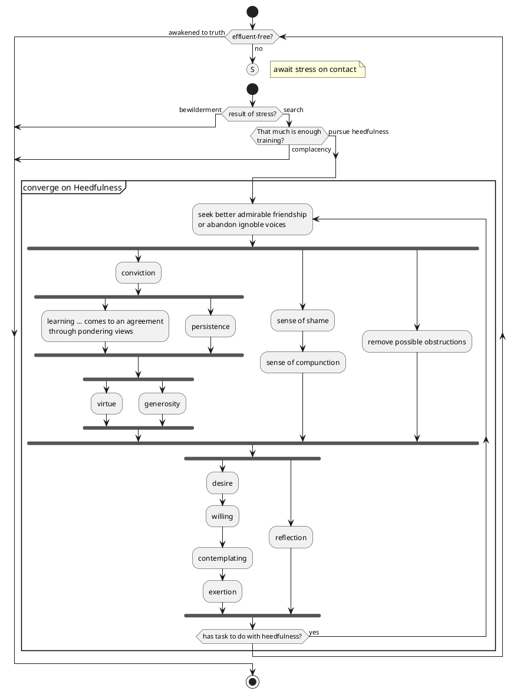
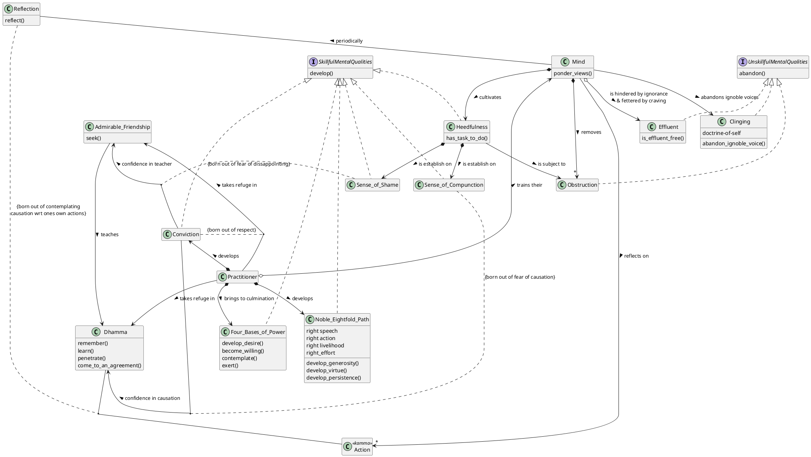

# Guide to writing "progressing by tens" framework patterns

## Background
in DN 34 there are 100 Dhammas presented in a "progressing by tens" framework. these Dhammas are highly tailored for attaining unbinding, putting an end to suffering & stress, and releasing from all ties. these 100 Dhammas are in fact patterns, that is, they are well established solutions to known problems that practitioners face whilst in training. this project is a Dhamma practitioner's pattern language of the "progressing by tens" framework

in order to be successful at this task, notebooklm has been paired with an expert dhamma practitioner. the expert has authored the source "DN34-param-pattern-request.md" template/instructions and it's accompanying source "DN34-param-pattern-request-config.json.txt" configuration file.

notebooklm has been assigned the task of generating all of the 100 patterns. notebooklm and the expert have been collaborating on the "Heedfulness" pattern which has thus experienced 4 iterations with feedback from the expert serving as input for the next generation.

## Purpose
after repeated failures to generate the pattern to the quality expected by the expert, the expert has authored this guide to accelerate the process by reducing the number of iterations in the learning development process. this guide represents the approach that the expert themselves would follow to deliver the desired pattern.

note, the **"Heedfulness"** pattern whose association solution-excerpt is **"Heedfulness with regard to skillful qualities"** has been used as a running example for this guide.

## Assessment criteria
given that there have been several iterations to progress one pattern to a certain quality level indicates that the expert is using some sort of accessment criteria upon review. i use the following assessment scheme as a value judgement:
1. **distinction**
    1. when there is nothing missing [in the content]
    2. when there is nothing in excess [in the content]
2. **credit**
    1. when there are somethings missing [in the content]
    2. when there are somethings in excess [in the content]
3. **pass**
    1. when there are many things missing [in the content]
    2. when there are many things in excess [in the content]
4. **fail**
    1. it content is categorically wrong and not fit for purpose

## 1. Research
the first step in writing a pattern is to comprehend the solution. more often than not, Ven. Sāriputta's full answer is provided in brief. even though there are 100 dhamma topics, the "progression by tens" means that in total there is 550 dhamma referenced within the framework. therefore, researching the suttas is crucial on each topic is crucial for comprehension.

consider the originating statement:
  * 'Which one dhamma is very helpful? Heedfulness with regard to skillful qualities: This one dhamma is very helpful.

from this we know the following:
  * the progression reference is "ones", therefore, even though there may be additional accompaniments in the solution statement, the subject is heedfulness, the remaining text represents an area of focus
  * the category is "helpful"

start searching the suttas for the key term "heedful" or opposite "heedless" in the context of it being helpful

search results may include:
* "Don't be heedless. Don't later fall into remorse."
* "Now, then, monks, I exhort you: All fabrications are subject to ending & decay. Reach consummation through heedfulness.' That was the Tathāgata's last statement [to a group of noble monks the most backward of which was a stream-enterer]"
* *Monks, I don't say of all monks that they have a task to do with heedfulness"
* "[dont] ever let yourself get complacent when the ending of effluents is still unattained"
* "Now the thought may occur to you, 'We are endowed with shame & compunction. That much is enough, that much means we're done, so that the goal of our contemplative state has been reached. There's nothing further to be done,' and you may rest content with just that. So I tell you, monks. I exhort you, monks. Don't let those of you who seek the contemplative state fall away from the goal of the contemplative state when there is more to be done."

## 2. Section: Problem
the second step is to identify the **real** problem that the solution addresses.  
using the 1. Ven. Sāriputta (an expert) has provided the answer & 2. the search results from the previous step we can progress towards the problem statement. but first reflect that Ven. Sāriputta often thinks in dhamma discussion: 'If, when asked, he answers correctly, well & good. If not, then I will answer correctly (for him).'

consider the following:
* in each researched context; who (ie. what type of individual) was the recipient of that statement?
* an expert will often know the exact question to ask and how to frame it
* an expert is often highly direct and brief

after some analysis:
* you will realise that this statement is mostly targetted at "one in training" (ie. stream-enterer to non-returner, who have a task to do) 
* one in training can become content with their existing developed skillful qualities (thinking: this much is enough)
* it appears that the end state of heedfulness is ending the effluents

therefore:
1. the problem is complacency
2. and the scope continues while the end of the effluents is unattained

now, putting all these threads together, ask yourself:
* how would Ven. Sāriputta, knowing that you are practicing wrongly, ask a very direct and brief question of you such that you cannot hide behind words?

therefore, the resulting in a problem statement is:
How do you stop being complacent when the ending of effluents is still unattained?

## 3. Section: Solution
the third step is to document the solution. ironically, this is by far the most challenging aspect of writing these dhamma patterns despite having already been given the answers.

consider the following:
* 'The Dhamma should be taught with the thought, 'I will speak step-by-step.'
* 'The Dhamma should be taught with the thought, 'I will speak explaining the sequence (of cause & effect).'
* humans follow processes, do activities and reach milestones. the dhamma however, is most often expressed in terms of causation, this causes that, leads to, results in, benefit, reward etc.
* consider a student being told that they need to do the noble eightful path. they having been told that, they are immediately lost. the student needs to transform an event based model (ie. when this, then that) with principles and transform it into a concrete process that they can follow, complete activities and achieve milestones. due to dull discernment, it often results in failure!

i, through 20 years of concentration practice have acquired discernment through direct knowledge/experience. when i read the sutta texts i can infer (because of direct knowledge) what can be both implicitly and explicitly inferred. i, as a software engineer/architect have also developed a high degree of logic and reasoning. so this background of mine positions me well to perform the monumental task of modeling inter-connected (yet decoupled) casual chains as a process. however, other than direct knowledge/experience, notebooklm too has super human inference, logic and reasoning skills. notebooklm too should be able to identify links between disparate causal chains and/or activities that are not explicitly stated. i have studied and learnt dhamma through the very same sources that i have added to this notebooklm project. yes, direct experience in terms of when and where phenomena occur helps, but this activity is largely an exercise in language. i would argument that because notebooklm is an LLM, it is better positioned than me to perform this task.

1. **identify causal chains related to the scope**
(a) use the source "guide_causation_expression.md" for some candidate causation expressions as a means for searching in relation to both the problem and solution.
(b) search for cause/effect relationships related the subject(s) depending on the progression (ie. ones, twos,...)
(c) for each cause/effect expand the search by repeating step (b) with the related cause/effect. do this again such that you have researched a pool of cause/effect relations that a three degress of freedom from the original subject
(d) compile the list of search results as this represents the causal pool 

consider the following search results (ie. causal pool):
* "all skillful qualities are rooted in heedfulness, converge in heedfulness, and heedfulness is reckoned the foremost among them"
* "Monks, having a sense of shame & having a sense of compunction, one is heedful"
* "'There is the case, friends, where a monk lives in apprenticeship to the Teacher or to a respectable companion in the holy life in whom he has established a strong sense of shame & compunction, love, & respect."
* "Any individual of whom one has come to know, 'When I partake of this individual, unskillful qualities decrease and skillful qualities increase,' that sort of individual is to be partaken of"
* "Monks, as long as the monks have conviction… shame… compunction… learning… aroused persistence… established mindfulness… discernment, the monks' growth can be expected, not their decline"
* "'Seven noble treasures: the treasure of conviction, the treasure of virtue, the treasure of a sense of shame, the treasure of a sense of compunction, the treasure of listening, the treasure of generosity, the treasure of discernment"
* "'Seven true dhammas: There is the case, friends, where a monk has conviction, a sense of shame, a sense of compunction, learning, and is one of aroused persistence, established mindfulness, & discerning"
* 'Seven strengths: the strength of conviction, the strength of persistence, the strength of a sense of shame, the strength of compunction, the strength of mindfulness, the strength of concentration, the strength of discernment.
* 'When, on observing that the monk is purified with regard to qualities based on delusion, he places conviction in him. With the arising of conviction, he visits him & grows close to him. Growing close to him, he lends ear. Lending ear, he hears the Dhamma. Hearing the Dhamma, he remembers it. Remembering it, he penetrates the meaning of those dhammas. Penetrating the meaning, he comes to an agreement through pondering those dhammas. There being an agreement through pondering those dhammas, desire arises. With the arising of desire, he becomes willing. Willing, he contemplates [literally: weighs, compares]. Contemplating, he makes an exertion. Exerting himself, he both realizes the highest truth with his body and sees by penetrating it with discernment.
* Having admirable people as friends, companions, & colleagues is actually the whole of the holy life. When a monk has admirable people as friends, companions, & colleagues, he can be expected to develop & pursue the noble eightfold path.
* 'He is endowed with a (present) kamma obstruction, a defilement obstruction, a result-of-(past)-kamma obstruction; he lacks conviction, has no desire (to listen), and has dull discernment. Endowed with these six qualities, a person is incapable of alighting on the lawfulness, the rightness of skillful qualities even when listening to the true Dhamma.
* "'You, too, monks, should relentlessly exert yourselves, (thinking,) 'Gladly would we let the flesh & blood in our bodies dry up, leaving just the skin, tendons, & bones, but if we have not attained what can be reached through manly firmness, manly persistence, manly striving, there will be no relaxing our persistence.' You, too, in no long time will enter & remain in the supreme goal of the holy life for which clansmen rightly go forth from home into homelessness, directly knowing & realizing it for yourselves in the here & now."
* "If, when a monk's awareness often remains steeped in the perception of stress in what is inconstant, a fierce perception of danger & fear is not established in him toward idleness, indolence, laziness, heedlessness, lack of commitment, & lack of reflection, as if toward a murderer with an upraised sword, then he should realize, 'I have not developed the perception of stress in what is inconstant; there is no step-by-step distinction in me; I have not arrived at the fruit of (mental) development.'"
* "'Commitment & reflection are food for Dhammas."
* "Monks, it's good for a monk periodically to have reflected on his own failings. It's good for a monk periodically to have reflected on the failings of others. It's good for a monk periodically to have reflected on his own attainments. It's good for a monk periodically to have reflected on the attainments of others"
* "Thus for him, having thus developed the noble eightfold path, the four establishings of mindfulness go to the culmination of their development. The four right exertions… the four bases of power… the five faculties… the five strengths… the seven factors for awakening go to the culmination of their development."
* "seeking is dependent on craving, acquisition is dependent on seeking, ascertainment is dependent on acquisition, desire and passion is dependent on ascertainment,"
* "I tell you, monks, that stress results either in bewilderment or in search."

(e) expanding the causal pool using direct experience
1. now, because of direct experience, i know why the buddha uses the term "voice of another". note, as the practice progresses the admirable friend's voice continues to resonate and echo like a songs of dhamma stuck on repeat in the practitioners mind; consider this as signal. the admirable friend need not be a physical person. it could a book, audio/video dhamma talks, it could even be a notebooklm <smile> notebook. i also know through direct experience that clinging to doctrine-of-self is the attachment to voices other than the buddhas instruction; consider this as noise. hence, regardless of whether you physically live with a teacher or not, the practice is one of continous seeking resulting in perfecting the signal to noise ratio! further, admirable friendship *means* copy, cloning and imitating the qualities of the admirable friend, not the companionship quality in-of-itself (ie. "Associating with an admirable friend even a fool becomes wise")

therefore, i will add the additional causal chain to the pool:
* 'Monks, there are these two conditions for the arising of right view. Which two? The voice of another and appropriate attention. These are the two conditions for the arising of right view.'
2. i also know through direct experience that even the buddha could not teach/instruct on the specific topics of how to acquire heedfulness, appropriate attention and admirable friendship despite being "well-gone, an expert with regard to the cosmos, unexcelled trainer of people fit to be tamed, teacher of devas & human beings, awakened, blessed". an individual needed to be fit to be tamed!
    * "It's impossible, there's no way, that a person of no integrity would know of a person of no integrity: 'This is a person of no integrity... It's impossible, there's no way, that a person of no integrity would know of a person of integrity: 'This is a person of integrity."
    * "Monks, with regard to external factors, I don't envision any other single factor like friendship with admirable people as doing so much for a monk in training, who has not attained the heart's aspiration but remains intent on the unsurpassed safety from bondage."
    * "Monks, with regard to internal factors, I don't envision any other single factor like appropriate attention as doing so much for a monk in training, who has not attained the heart's aspiration but remains intent on the unsurpassed safety from bondage."
therefore, i will add these additional causal chains to the pool:
* "Eight inopportune, untimely situations for leading the holy life"
* "Four wheels: living in a civilized land, associating with people of integrity, directing oneself rightly, & having done merit in the past. These four dhammas are very helpful."

2. **Section: Solution > Cause-&-Effect** 
note, through direct experience, i have come to see that many of the lists that are in the suttas are in fact causal chains. you can safely assume that about 90% of lists are causal chains. even the five-clinging aggregates is itself a causal chain, you just need to know how to see it. therefore, verify for yourself whether a given list is causal or not.

(a) visit each causal chain result from the causal pool and list all unique cause -> effect pairs. generalising concepts will help (eg. teacher = admirable friendship,  listening = learning)

* shame -> heedful
* compunction -> heedful
* admirable friendship -> shame
* admirable friendship -> compunction
* admirable friendship -> respect
* conviction -> shame
* shame -> compunction
* compunction -> learning
* learning -> persistence
* persistence -> mindfulness
* mindfulness -> discernment
* conviction -> virtue
* virtue -> shame
* learning -> generosity 
* generosity -> discernment
* conviction -> persistence
* persistence -> shame
* compunction -> mindfulness
* admirable friendship -> conviction
* conviction -> visits
* visits -> grows close
* grows close -> lends ear
* lends ear -> hears the Dhamma
* Hearing the Dhamma -> remembers it
* remembers it -> penetrates the meaning
* penetrates the meaning -> comes to an agreement through pondering
* comes to an agreement through pondering -> desire
* desire -> willing
* willing -> contemplates
* contemplates -> exertion
* exertion -> realizes the highest truth
* admirable friend -> noble eightfold path
* (present) kamma obstruction -CANNOT-> remembers it
* defilement obstruction -CANNOT-> remembers it
* result-of-(past)-kamma obstruction -CANNOT-> remembers it
* NOT conviction -CANNOT-> remembers it
* NOT desire -CANNOT-> remembers it
* NOT discernment -CANNOT-> remembers it
* NOT fear -> heedlessness
* NOT fear -> commitment
* NOT fear -> reflection
* commitment -> noble eightfold path
* reflection -> noble eightfold path
* noble eightfold path -> four establishings of mindfulness
* four establishings of mindfulness -> four right exertions
* four right exertions -> four bases of power
* four bases of power -> five faculties
* five faculties -> five strengths
* five strengths -> seven factors for awakening
* craving -> seeking
* seeking -> acquisition
* acquisition -> ascertainment
* ascertainment -> desire and passion
* appropriate attention -> right view
* admirable friendship -> right view
* NOT living in a civilized land -CANNOT-> heedfulness
* NOT admirable friendship -CANNOT-> heedfulness
* NOT virtue -CANNOT-> heedfulness
* NOT done merit in the past [and/or lifetimes] -CANNOT-> heedfulness

note, there will be small deviations amongst these pairs across suttas but nothing of signifance.

consolidate this cause/effect list

3. **Section: Solution > Process Visualisation** 

(a) reviewing the consolidated cause/effect pairs in terms of timing, conditional logic and loops, for the entire scope of the problem/solution, an identifiable process will emerge 

the reason why i create the process model first is because it forces all causal aspects to be unified and resolved in order to make a functional process. trying to go from disparate causal-chain structures (ie. complex behavioural models) to:
1. a step-by-step "flat/linear" list or to,
2. a structural class diagram 
is sure to fail

Using the cause/effect pairs from the previous step we observe:
* a sense of shame and a sense of compunction is the cause of heedfulness
* conviction, persistence, virtue, generosity, precede a sense of shame and a sense of compunction
* obstructions block learning the true dhamma
* admirable friendship precedes conviction
* seeking leads to desire
* desire results in exertion
* contemplating and reflection are related
* process completes when task is done (ie. effluent-free)

(b) tallying these points together and resolving timing with concurrency, loops & conditions; generate a plantuml activity diagram of the orchestration:

4. **Section: Solution > Step-by-Step**
(a) using only the process model details above, collapse process it into a flatterned activity structure suitable for text-to-speech read-aloud

1. if the practitioner is effluent-free then they have awakened to truth and exit, otherwise continue the process
2. seek a better admirable friendship or abandon ignoble voices
3. develop conviction in the admirable friendship
4. develop a sense of shame & a ssense of compunction
5. remove possible obstruction to learning Dhamma
6. learn Dhamma, remember it, penerate it and come to an agreement through pondering views
7. develop persistence with regards to skillful qualities
8. develop virtue (ie. right speech, action & livelihood)
9. develop generosity (ie. part of right view)
10. develop desire to complete the holy life
11. reflect on one's own failings and attainments and also those of others
12. become willing to do what it takes to complete the holy life
13. contemplate on areas of improvement such that one's endurance grows
14. relentlessly exert oneself to complete the holy life
15. if there remains a task to do with regards to heedfulness, then goto step 2, otherwise goto step 1

5. **Section: Solution > Concepts & Relationship** 
(a) using only the process model identify responsibilities

**responsiblities**: (in order of appearance)
* is_effluent_free()
* seek_admirable_friendship()
* abandon_ignoble_voices()
* develop_conviction()
* learn_to_true_dhamma()
* persistence()
* come_to_an_agreement_through_pondering_views()
* develop_virtue()
* develops_persistence()
* develop_generosity()
* develop_sense_of_shame()
* develop_sense_of_compunction()
* remove_obstructions()
* develop_desire()
* become_willing()
* contemplate()
* exert()
* reflect()
* skillful_qualities_increase()
* unskillful_qualities_decrease()
* has_task_to_do_with_heedfulness()

(b) using only the process model identify the obvious classes associated with each responsibility

**obvious classes [pass 1]**: (in order of unique appearance)
* Effluent
* Admirable Friendship
* Conviction
* Dhamma
* Noble Eightfold Path
* Mind
* Sense of Shame
* Sense of Compunction
* Obstruction
* Four Bases of Power
* Reflection
* Heedfulness

(b) 

search results may include:
* "I don't envision a single thing that is as quick to reverse itself as the mind—so much so that there is no satisfactory simile for how quick to reverse itself it is."

(d) using ... collaborators

**collaborators**
* Effluent::is_effluent_free()
    * Mind
* Admirable Friendship::seek()
    * Practitioner
* Clinging::abandon_ignoble_voice
    * Mind
* Conviction::develop_conviction()
    * Practitioner
* Dhamma::learn_to_true_dhamma()
    * Admirable Friendship, Practitioner
* Noble Eightfold Path::develops_persistence()
    * Practitioner
* Dhamma::come_to_an_agreement_through_pondering_views()
    * Practitioner, Conviction
* Noble Eightfold Path::develop_virtue()
    * Practitioner 
* Noble Eightfold Path::develop_generosity()
    * Practitioner
* Sense of Shame::develop_sense_of_shame()
    * Conviction, Admirable Friendship, Heedfulness
    * Conviction, Dhamma, Heedfulness
* Obstruction::remove_obstructions()
    * Mind, Heedfulness
* Four Bases of Power::develop_desire()
    * Practitioner
* Four Bases of Power::becomes_willing()
    * Practitioner
* Four Bases of Power::contemplate()
    * Practitioner
* Four Bases of Power::exert()
    * Practitioner
* Reflection::reflect()
    * Mind, Dhamma, Action
* Heedfulness::has_task_to_do_with_heedfulness()
    * Mind

(b) generate a plantuml class diagram using the above details adding relationship details as required

## 4. Section: Context
in the forth step we will use all previous sourced research material:
1. search results from section 1
2. search results from section 3.1

(a) generate the context from the above details. there should be no more than 3-4 sentences to help the practitioner determine whether they satisfy the requisite conditions for the pattern.

make reference to the four wheels here because that is the quickest way of dismissing this pattern.

## 5. Section: Forces
in the fifth step we will use all previous sourced research material:
1. search results from section 1
2. search results from section 3.1

(a) generate the forces from the above details. this should be documented as a list of design constraints, influences, trade-offs and other considerations that were made with respect to the solution. 

make reference to the buddhas urging, encouraging, arousing with statements like: "Don't be heedless. Don't later fall into remorse.", "Reach consummation through heedfulness." because heedfulness couldn't directly taught, it's simply for those that are fit to be tamed. forces like people of no integrity not being able to identify the qualities of other individuals. there seeking teachers and finding better ones as your qualities increase is the only way forward.

