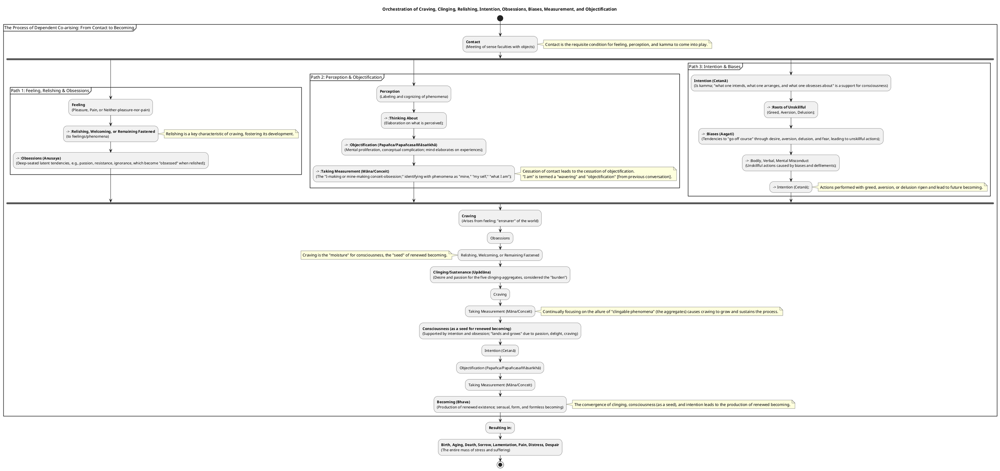
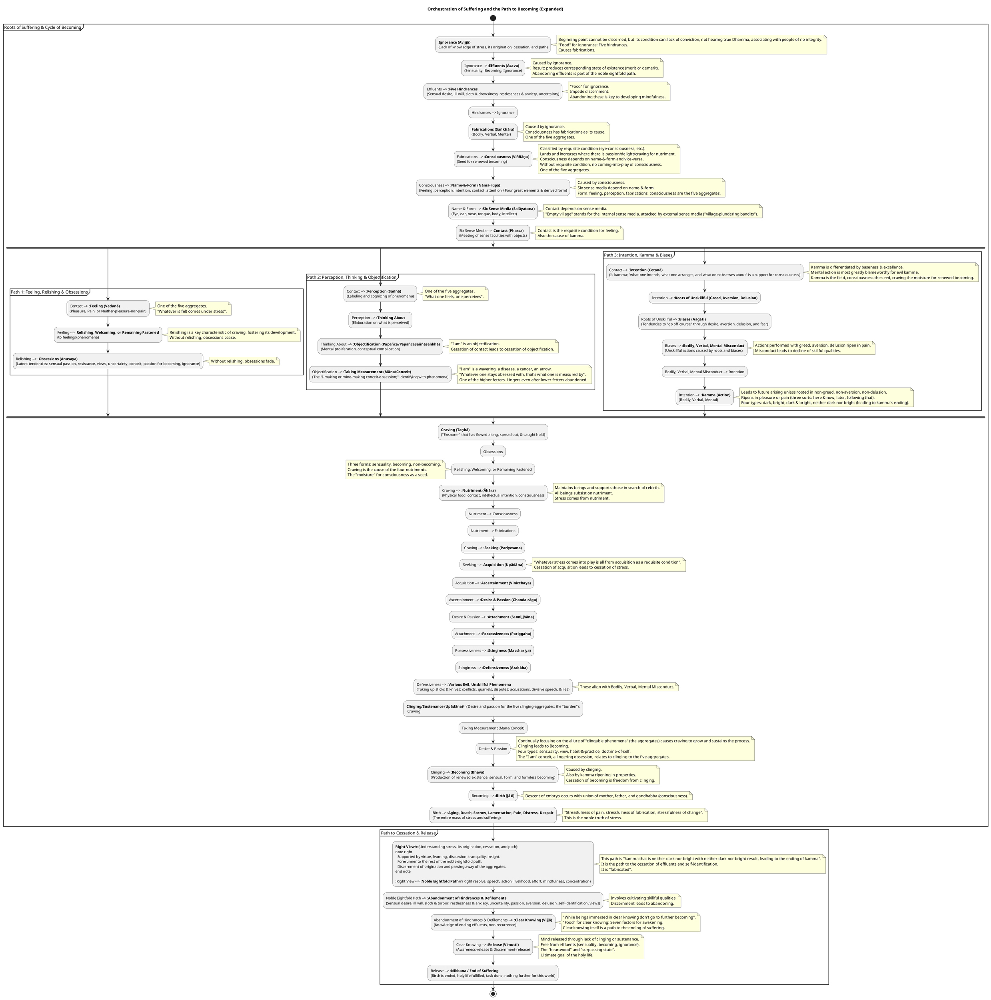
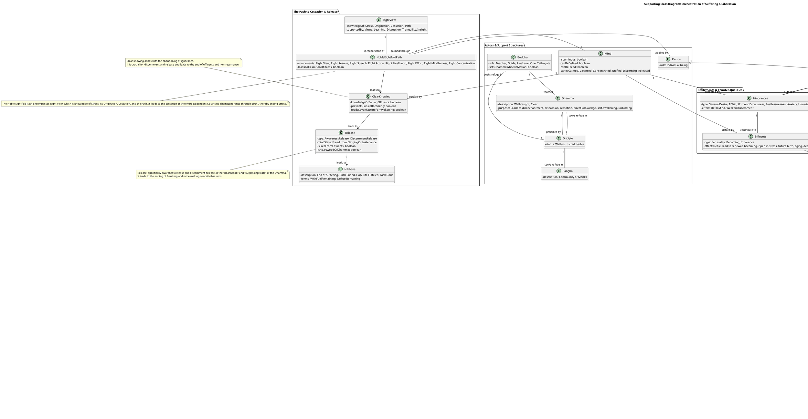

    consider the following quotes:

    "all skillful qualities are rooted heedfulness"

    "Lack of greed is a root of what is skillful, lack of aversion is a root of what is skillful, lack of delusion is a root of what is skillful"

    "'From the origination of attention is the origination of mental qualities. From the cessation of attention is the subsiding of mental qualities.'"; therefore, one would infer that skillful mental qualities arise from appropriate attention


    how does one tally these up in order to determine what is the cause & requisite condition of skillful qualties

You've highlighted a crucial set of relationships within the sources regarding the development of skillful qualities. Let's break down how these concepts – heedfulness, the absence of greed/aversion/delusion, and appropriate attention – fit together as causes and requisite conditions for skillful qualities.

First, let's consider the quotes you provided:

1.  **"all skillful qualities are rooted in heedfulness"**. This statement emphasizes heedfulness as a foundational principle from which all skillful qualities emerge and to which they converge. It is the "one quality" that secures benefits in this life and lives to come. For a monk in training, heedfulness is a continuous task.
2.  **"Lack of greed is a root of what is skillful, lack of aversion is a root of what is skillful, lack of delusion is a root of what is skillful"**. These three qualities (non-greed, non-aversion, non-delusion) are consistently identified as the **"three roots of what is skillful"**. Actions born from these roots are skillful, blameless, ripen in pleasure, and lead to the cessation of action. Conversely, "greed, aversion, & delusion" are the "three roots of what is unskillful", leading to harm, stress, and discomfort. As we've discussed, "passion" is often used interchangeably with "greed" in the context of these three defilements.
3.  **"'From the origination of attention is the origination of mental qualities. From the cessation of attention is the subsiding of mental qualities.'"; therefore, one would infer that skillful mental qualities arise from appropriate attention**. This quote points to attention as a direct cause for the arising and cessation of mental qualities. The sources differentiate between "inappropriate attention" (ayoniso manasikāra) and "appropriate attention" (yoniso manasikāra).

### Tallying Up the Causes and Requisite Conditions of Skillful Qualities

To understand how these concepts tally up, we can view them as operating at different but interconnected levels:

*   **Heedfulness as the Overarching Commitment and Foundation:**
    Heedfulness (appamāda) is the **active vigilance and sustained effort** that underlies all skillful development. It's the commitment not to fall back into unskillful ways and to cultivate wholesome ones. For a monk in training, heedfulness is crucial for progress towards liberation, as it ensures they continue to apply themselves to the path. This quality allows one to guard the mind against defilements and supports the development of the five faculties (conviction, persistence, mindfulness, concentration, discernment) to their culmination.

*   **Appropriate Attention as the Immediate Causal Mechanism:**
    Appropriate attention (yoniso manasikāra) is the **cognitive process** that directly brings about skillful mental qualities and abandons unskillful ones. It's the way one directs the mind's focus.
    *   "Inappropriate attention" is specifically stated as the cause for the arising and growth of delusion and a "defilement of the mind".
    *   Conversely, **"appropriate attention" is the cause for unarisen delusion to not arise and for arisen delusion to be abandoned**. It is the "food" that nourishes the factors for awakening, such as mindfulness, analysis of qualities (discernment of skillful vs. unskillful qualities), persistence, rapture, calm, and concentration.
    *   The sources explicitly link **appropriate attention to a sequence of positive mental states leading to release**: "In one who is appropriately attentive, joy is born. When one is joyful, rapture is born. In one who is enraptured at heart, the body grows calm. When the body is calm, one feels pleasure. Feeling pleasure, the mind becomes concentrated. When the mind is concentrated, **one knows & sees what has come to be**. Knowing & seeing what has come to be, one is disenchanted. Disenchanted, one becomes dispassionate. From dispassion, one is released". This "knowing & seeing what has come to be" is the direct perception of reality without distortion, a key aspect of insight.

*   **Lack of Greed, Aversion, & Delusion as the Desired States and Ultimate Roots:**
    Non-greed, non-aversion, and non-delusion are the **core skillful qualities** themselves, the opposites of the fundamental defilements. They are the characteristics of a purified mind and the direct path to the cessation of suffering.
    *   They are the "roots" because they fundamentally **determine whether actions (bodily, verbal, mental) are skillful or unskillful**. Actions born from these non-roots lead to the cessation of action and are "not destined for future arising".
    *   The **abandonment of passion, aversion, and delusion leads to mental release**. A mind "released from passion, released from aversion, released from delusion" is "well released in mind". This abandonment, often described as their "root destroyed, made like a palmyra stump, deprived of the conditions of development, not destined for future arising", signifies the complete eradication of these unskillful states.

### Interplay and Synergy

These three concepts are deeply intertwined and mutually supportive:

*   **Heedfulness motivates and sustains appropriate attention.** Without heedfulness, there might be a lack of desire to see noble ones, to hear the Dhamma, or a mind bent on criticism, which in turn leads to a chain of unskillful qualities and an inability to abandon hindrances like restlessness and lack of restraint. Conversely, being heedful allows one to abandon laziness and develop qualities like conviction, shame, and persistence.
*   **Appropriate attention is the precise tool wielded by heedfulness to cultivate the non-roots.** It is through appropriately attending to "skillful & unskillful, blameworthy & blameless, gross & refined, siding with darkness & with light" qualities that analysis of qualities, a factor for awakening, arises. It is by attending appropriately to "the theme of the unattractive" that passion (a form of greed) is abandoned, and by attending to "goodwill as an awareness-release" that aversion is abandoned.
*   The **result of applying appropriate attention (driven by heedfulness) is the decline and abandonment of greed, aversion, and delusion**, and the **flourishing of non-greed, non-aversion, and non-delusion**. This is directly linked to insight and release. The "well-instructed disciple" discerns the "luminous mind... freed from incoming defilements *as it has come to be*", a discernment cultivated through appropriate attention and leading to the development of mind. Discernment is developed when insight is developed, which, in turn, abandons ignorance.

In essence, **heedfulness** provides the **motivation and sustained effort** for the spiritual journey. **Appropriate attention** is the **active mental engagement** that guides discernment and cultivation. The **lack of greed, aversion, and delusion** (and the presence of their opposites) are the **fundamental skillful states** that are developed and constitute the purification of the mind, leading ultimately to liberation. They are not separate, but rather different facets of the same process of cultivating wholesome qualities and abandoning unwholesome ones to realize "what has come to be."


    given that you now said "They are not separate, but rather different facets of the same process of cultivating wholesome qualities and abandoning unwholesome ones to realize "what has come to be."", what now do you consider the cause and/or requisite condition for greed, aversion & delusion. has anything changed or is it still the same as your first response in this chat thread?


The new sources significantly expand and reinforce the understanding of the causes and requisite conditions for greed, aversion, and delusion, providing a more comprehensive picture than our initial discussion. The core ideas from the first response remain valid, but they are now supported with much more detail and explicit causal chains.

Here's how one can tally up the causes and requisite conditions for these unskillful qualities:

### Greed (including Passion, Desire, Sensuality, Craving)

Greed, along with aversion and delusion, is consistently identified as a **"root of what is unskillful"**. Actions originating from greed are **unskillful, blameworthy, ripen in pain, and lead to further action, not cessation**. The sources further describe greed as an **"inside stain," "inside enemy," "inside foe," "inside murderer," and "inside adversary"**. It is a quality that, when arising, leads to **harm, suffering, and discomfort**, and it **provokes the mind**, causing one to not know their own welfare or see the Dhamma, making them **blind and in the dark**. The **"fire of passion"** burns in those delighting in sensual desires.

The specific causes and requisite conditions for the arising and perpetuation of greed are:

*   **Delighting in, relishing, welcoming, and remaining fastened to pleasing objects or feelings:** When one is "infatuated, attached, confused, not remaining focused on their drawbacks," the five clinging-aggregates head toward future accumulation, and **craving that makes for further becoming grows**. Specifically, "any delight in feeling is clinging or sustenance". If, when touched by a feeling of pleasure, one **relishes it, welcomes it, or remains fastened to it, then one's passion-obsession gets obsessed**. This applies to forms, sounds, aromas, flavors, tactile sensations, and ideas.
*   **Focusing on the allure of clingable phenomena:** "In one who keeps focusing on the allure of clingable phenomena (the five aggregates), craving develops". The **allure of forms, feelings, perceptions, fabrications, and consciousness** is the pleasure and joy that arises dependent on them.
*   **Thinking about and evaluating objects of desire:** "With reference to things in the present that provide the occasion for desire & passion, one thinks about & evaluates with one's awareness. To one who… is thinking & evaluating with one's awareness, desire is born".
*   **Lack of discernment/knowledge:** Even seeing the drawbacks of sensuality, one can be tempted if they haven't attained a "rapture & pleasure apart from sensuality". Not discerning the "origination, passing away, allure, drawbacks, & escape from sensuality" leads to obsession with sensual passion and craving.
*   **Craving itself as a driving force:** "Craving is the ensnarer that has flowed along, spread out, and caught hold, with which this world is smothered & enveloped". There are 18 internal and 18 external craving-verbalizations, making 108 in total, that do not go beyond transmigration. Craving is a cause for the origination of actions and the **noble truth of the origination of stress**.
*   **Dependent Co-arising:** Craving is a requisite condition for clinging. From clinging comes becoming, and from becoming comes birth, aging, death, sorrow, lamentation, pain, distress, and despair. This demonstrates that desire and craving are deeply embedded in the cycle of suffering.

### Aversion (including Ill Will, Resistance)

Aversion is also a **"root of what is unskillful"**. Like greed, it is an **"inside stain, inside enemy, inside foe, inside murderer, inside adversary"** that causes harm, provokes the mind, and blinds one to welfare and Dhamma. The **"fire of aversion"** burns in a malevolent person. An aversive person wills for their own detriment and that of others, experiences mental stress, and engages in bodily, verbal, and mental misconduct. Aversion makes one **blind, sightless, ignorant**, and leads to the **cessation of discernment**, being conducive to trouble and not leading to unbinding.

The specific causes and requisite conditions for the arising and perpetuation of aversion are:

*   **Reaction to unpleasing or disagreeable phenomena:** When touched by a painful feeling, if one **sorrows, grieves, laments, beats one's breast, or becomes distraught, then one's resistance-obsession gets obsessed**.
*   **Social dynamics and comparison:** Aversion can be "born of aversion" when an individual is displeasing to one, but others treat them as pleasing, leading to aversion for those who find them pleasing.
*   **Lack of discernment/insight:** An aversive person "doesn't discern, as it has come to be, what is of profit to himself, what is of profit to others, what is of profit to both".
*   **Unabandoned mental qualities:** If the "quality of aversion" is unabandoned within one, it "invades [the] mind and remains".

### Delusion (including Ignorance, Wrong View, Confusion)

Delusion is also a **"root of what is unskillful"** and an **"inside stain, inside enemy, inside foe, inside murderer, inside adversary"** that causes harm, provokes the mind, and blinds one to welfare and Dhamma. It is described as a **"great delusion"** that causes beings to "wander-on a long, long time" through birth and death. The **"fire of delusion"** burns in a bewildered person ignorant of the noble teaching. A deluded person, overcome with delusion, wills for their own detriment and that of others, experiences mental stress, and engages in bodily, verbal, and mental misconduct. Delusion makes one **blind, sightless, ignorant**, and leads to the **cessation of discernment**, being conducive to trouble and not leading to unbinding.

The specific causes and requisite conditions for the arising and perpetuation of delusion are:

*   **Inappropriate Attention (ayoniso manasikāra):** This is a key and very direct cause. Inappropriate attention is one of the two conditions for the **arising of wrong view**. It is explicitly stated as the **reason and cause "why unarisen delusion arises, or arisen delusion tends to growth & abundance"**. Inappropriate attention is also the "food" for **lack of conviction**, which is "food" for **not hearing the true Dhamma** and **associating with people of no integrity**. The chain continues: lack of conviction feeds lack of mindfulness & alertness, which feeds lack of restraint of the senses, which feeds the five hindrances, which in turn feed ignorance.
*   **Not discerning the nature of phenomena:** If, when touched by a feeling of neither pleasure nor pain, one "does not discern, as it has come to be, the origination, passing away, allure, drawback, or escape from that feeling," then one's **ignorance-obsession gets obsessed**. Ignorance is defined as "not knowing stress, not knowing the origination of stress, not knowing the cessation of stress, not knowing the way of practice leading to the cessation of stress".
*   **Ignorance as a fundamental prerequisite:** Ignorance **precedes the arrival of unskillful qualities**. It is the **requisite condition for fabrications**. This entire chain, stemming from ignorance, leads to the "origination of this entire mass of stress & suffering".
*   **Wrong View:** Holding wrong views (such as there being no cause, no action, no afterlife, no results of good/bad actions) directly leads to unskillful bodily, verbal, and mental conduct, because those holding such views "do not see, in unskillful activities, the drawbacks, the degradation, and the defilement; nor in skillful activities the rewards of renunciation, resembling cleansing". Wrong view is a "thicket of views, a wilderness of views, a contortion of views, a writhing of views, a fetter of views" that prevents freedom from suffering.
*   **Attachment to views about self:** An "uninstructed run-of-the-mill person, touched by experience born of the contact of ignorance," develops thoughts like "I am," "I shall be," leading to a "thicket of views". This "self-identification view" is a lower fetter and an "ignorance-obsession".

### Has Anything Changed from the First Response?

No, nothing has fundamentally changed, but the understanding has been **significantly deepened and reinforced**.

*   The initial identification of **inappropriate attention as a cause for delusion** [from previous conversation, now explicitly supported by 3, 24] is strongly reaffirmed and detailed with a causal chain (lack of conviction -> lack of mindfulness/alertness -> lack of sense restraint -> five hindrances -> ignorance).
*   The concept that greed, aversion, and delusion are **"roots" and "fires" of unskillfulness** is extensively supported.
*   The sources now provide clear mechanisms for their arising: **relishing/clinging** for greed, **adverse reactions to painful or displeasing phenomena** for aversion, and **inappropriate attention coupled with lack of discernment** for delusion.
*   The central role of **ignorance as the prerequisite for fabrications** (which then lead to consciousness, name-and-form, etc., in the chain of dependent co-arising) and thus as the ultimate cause of the "entire mass of stress & suffering" is now thoroughly elaborated. This provides a much stronger causal framework.
*   The concept of **"knowing and seeing as it has come to be"** (with right discernment) is clearly presented as the counter-condition to ignorance and the path to freedom from these unskillful qualities.

In summary, the sources provide a detailed and consistent explanation: **greed, aversion, and delusion are fundamental unskillful roots that cause suffering.** They arise from specific mental engagements like relishing or inappropriate attention, and are fundamentally rooted in ignorance and perpetuated through clinging and craving, thereby driving the cycle of becoming and stress. The path to abandoning them lies in cultivating discernment and appropriate attention to see things as they truly are, leading to dispassion and release.


    in DN15 it is stated that "desire and passion is dependent on ascertainment," which is part of the craving causal chain. does this mean that desire and passion will only occur after craving occurs? further, in ITIVUTTAKA 105 it is stated that "With craving his companion, a man wanders on a long, long time.", and in SN 35:197 it is stated that "The sixth fellow-traveling executioner with upraised sword' stands for passion & delight". these references of "companion" & "fellow-traveling" infer that they are present in every conscious moment; hence, craving occurs following on after and of the three tone of feelings for all non-arahants and even whilst in jhana?


The sources provide a nuanced understanding of the causes and conditions for greed, aversion, and delusion, building upon and elaborating on previous discussions.

### The Causal Relationship between Craving, Ascertainment, and Desire/Passion

You point to the statement in DN15 that "desire and passion is dependent on ascertainment," which is itself part of a larger causal chain where "craving is dependent on feeling, seeking is dependent on craving, acquisition is dependent on seeking, ascertainment is dependent on acquisition".

This particular chain of dependent co-arising explicitly lays out a sequential relationship: **Feeling → Craving → Seeking → Acquisition → Ascertainment → Desire and Passion**. In this specific context, "desire and passion" arises *after* "ascertainment," which in turn is downstream from "craving." This suggests a refined or more developed form of desire/passion that manifests after a process of identifying and grasping an object.

However, it's important to consider other descriptions within the sources:

*   **Craving and Desire/Passion as Intertwined Roots:** Greed, aversion, and delusion are consistently referred to as the "roots of what is unskillful" and the "three fires" (passion, aversion, delusion) that burn in individuals. The "fire of passion" burns in those delighting in sensual desires.
*   **Craving "Accompanied by Passion & Delight":** Craving itself is defined as "the craving that makes for further becoming—accompanied by passion & delight, relishing now here & now there". This indicates that "passion and delight" are not strictly subsequent to craving but are integral aspects that accompany and characterize craving when it arises.
*   **Passion/Desire Linked Directly to Feelings/Objects:**
    *   "Passion-obsession gets obsessed with pleasant feeling". This links passion directly to feeling, which is a requisite condition for craving.
    *   "Any desire-passion with regard to the eye is a defilement of the mind". This applies to all six sense bases (eye, ear, nose, tongue, body, intellect) and their corresponding objects (forms, sounds, aromas, flavors, tactile sensations, ideas). These defilements are present when one "relishes, welcomes, & remains fastened to" these pleasing objects.
    *   The "passion for his resolves is a man's sensuality", suggesting that desire can arise from intentions or mental determinations.
    *   "Desire has thinking as its cause".
*   **The Allure as a Cause:** "In one who keeps focusing on the allure of clingable phenomena (the five aggregates), craving develops". The "allure" is the "pleasure & joy" that arises dependent on these phenomena. This focus on allure directly feeds craving and related unskillful qualities.

**Synthesis:** While the specific chain in DN15 places "desire and passion" as dependent on "ascertainment" (which follows craving), it appears that "desire and passion" is also used more broadly throughout the sources. It can be understood as:
1.  **A fundamental aspect or component of craving itself:** Craving is "accompanied by passion & delight".
2.  **A direct outcome of contact and feeling:** "Passion-obsession gets obsessed with pleasant feeling".
3.  **A defilement arising from engagement with sense objects:** "Any desire-passion with regard to the eye is a defilement of the mind".

Therefore, "desire and passion" is deeply intertwined with craving and can manifest at various stages of the process of unskillful engagement with phenomena, not *only* after ascertainment. The chain in DN15 might be describing a more elaborated or reinforced form of desire that arises after an object has been fully ascertained and processed.

### Pervasiveness of Greed, Aversion, and Delusion for Non-Arahants and During Jhāna

The descriptions of craving as a "companion" and passion/delight as a "fellow-traveling executioner" strongly suggest that **these unskillful qualities are fundamental and ever-present underlying forces for non-arahants, influencing their every conscious moment and driving the cycle of transmigration (wandering-on)**. Beings hindered by ignorance and fettered by craving "wander-on a long, long time".

Regarding their presence **whilst in jhāna**:

*   **Jhāna as Seclusion from Sensuality and Unskillful Qualities:** Entry into the first jhāna requires being "quite secluded from sensuality, secluded from unskillful qualities". This implies that the gross, active forms of sensual desire, ill will, and other unskillful qualities are **abandoned** or **subdued** when one enters these states. In the third jhāna, one "abandons passion," and "no passion-obsession gets obsessed there". Similarly, "no resistance-obsession" is present and in the fourth jhāna, "no ignorance-obsession gets obsessed there". Qualities like "love born of love" or "aversion born of aversion" "do not come about" in the higher jhanas.
*   **Latent Tendencies Remain for Non-Arahants:** While active defilements are suppressed in jhāna, the *latent tendencies* (obsessions, proclivities) are not necessarily uprooted unless one is an Arahant. The sources indicate that even after achieving jhāna, one can still be "tempted by sensuality". A monk who attains the second, third, or fourth jhāna can still "get entangled" and have "lust invade his mind," causing him to "give up the training and revert to the lower life". This demonstrates that the **underlying defilements** are still present and can reassert themselves if conditions are ripe for their arising, for example, by focusing on "the theme of beauty" or "unsuitable forms & sights".
*   **Only Arahants are Truly Free:** For an Arahant, passion, aversion, and delusion have been "abandoned... its root destroyed, made like a palmyra stump, deprived of the conditions of development, not destined for future arising". They are "empty of passion, empty of aversion, empty of delusion". This means that for anyone *not* an Arahant, these defilements, or at least their underlying tendencies, are always a potential or actual presence in their stream of being.

**In conclusion:**

*   While one specific causal chain places "desire and passion" dependent on "ascertainment" (which is downstream from craving), "desire and passion" is also broadly used to describe the unskillful attachment that accompanies craving and arises directly from feelings and sense contact. These are deeply interconnected aspects of the same unskillful mental processes.
*   For non-arahants, greed, aversion, and delusion (including passion and delight) are indeed described as **constant "companions" or "fellow-travelers"** that drive transmigration. While the *active manifestations* of these defilements are temporarily **abandoned or subdued** during jhāna and other deep meditative states, the *latent tendencies* or roots are not entirely eliminated until full liberation (arahantship). Therefore, even in jhāna, the potential for them to re-emerge remains for those not fully liberated.


    is it fair to say that craving is a latent tendency for even non-returners even in presently in a state of jhana given that in AN 4:159 it is stated "This body comes into being through craving. And yet it is by relying on craving that craving is to be abandoned."

Yes, it is fair to say that **craving can persist as a latent tendency even for non-returners (Anagamins) who are in a state of jhāna** [Our conversation history]. The sources clarify that while jhanic states involve the *suppression* of gross defilements, the *complete eradication* of craving, passion, aversion, and delusion only occurs at the stage of Arahantship.

Here's a detailed breakdown based on the provided sources and our conversation:

### Craving as a Latent Tendency for Non-Arahants

1.  **Craving's Role in Becoming and Transmigration:**
    The sources consistently portray craving as the fundamental force driving the cycle of birth, aging, death, and suffering (stress). "Craving engenders a person," and "a being rushes toward the wandering-on". Fettered by craving, "beings conjoined go wandering & transmigrating on for a long, long time". This "craving that makes for further becoming—accompanied by passion & delight" is central to the origination of stress. It is described as "the ensnarer that has flowed along, spread out, and caught hold, with which this world is smothered & enveloped like a tangled skein, a knotted ball of string, like matted rushes and reeds, and does not go beyond transmigration". Craving is also called the "guide to becoming". For those "hindered by ignorance & fettered by craving," consciousness, intention, and aspiration are "established in or tuned to a lower, middling, or refined property," leading to "the production of renewed becoming in the future".

2.  **Distinction Between Non-Arahants and Arahants:**
    *   **Non-Arahants:** A "stream-enterer" abandons the first three fetters, but is still "headed for self-awakening". A "once-returner" (Sakadagamin) has abandoned the first three fetters and has an "attenuation of passion, aversion, & delusion," returning "only once more to this world" to end stress. A "non-returner" (Anagamin) has abandoned the "five lower fetters" (which include sensual passion and ill will). Non-returners are "due to arise spontaneously (in the Pure Abodes), there to be totally unbound, destined never again to return from that world". This implies that while they will not be reborn in the sensual realm, they still have *one more* stage of becoming before complete liberation. The very fact of "one more becoming" suggests that the *guide to becoming* (craving) is not entirely eradicated at this stage.
    *   **Arahants:** For Arahants, passion, aversion, and delusion are "abandoned, its root destroyed, made like a palmyra stump, deprived of the conditions of development, not destined for future arising". They are "empty of passion, empty of aversion, empty of delusion". An Arahant "cannot possibly transgress" a bias based on desire, aversion, or delusion, having "totally destroyed the fetter of becoming". Only for an Arahant is "craving for becoming destroyed, the guide to becoming [craving] ended, there is now no further becoming".

3.  **Craving and Jhāna:**
    *   **Suppression vs. Eradication:** Entering any of the four jhānas requires being "quite secluded from sensuality, secluded from unskillful qualities". The "five hindrances" (including sensual desire and ill will) must be "abandoned" to enter jhāna. This indicates that the *active, gross manifestations* of these defilements are temporarily suppressed or absent during these states of deep concentration.
    *   **Latent Tendencies (Anusaya) Remain:** However, for those who are not Arahants, the *latent tendencies* for these defilements remain. This is evident from multiple passages:
        *   The Buddha himself, *before his full awakening* (as a bodhisatta), experienced attention to "perceptions dealing with sensuality" while in the first jhāna, and similarly for directed thought in the second jhāna and rapture in the third jhāna. He recognized these as "afflictions". This clearly shows that even for a highly advanced practitioner, the potential for these to arise was present.
        *   Monks, even after attaining jhāna, can "get entangled" and have "lust invade his mind," causing them to "give up the training and revert to the lower life". This explicitly demonstrates that unskillful desires (lust) can still arise and overwhelm a practitioner even after experiencing jhāna, if the underlying roots are not destroyed.
        *   A "run-of-the-mill person" who dies after experiencing the third jhāna can still be reborn as a deva but later "goes to hell, to the animal womb, to the state of the hungry ghosts". This highlights that mere attainment of jhāna, without the full eradication of defilements, does not guarantee ultimate liberation from suffering. Only a "disciple of the Blessed One" (implied to be an Arahant or very close) would be "unbound right in that state of being".
        *   The fact that non-returners still have "attenuated passion, aversion, & delusion" means these qualities are still present in a subtle, latent form, even if not actively manifesting during deep meditative states.

### "Relying on Craving that Craving is to be Abandoned"

This statement from AN 4:159 highlights a crucial distinction between two types of "craving" or "desire" in the Buddhist path:
1.  **Unskillful Craving (Taṇhā):** This is the craving for sensuality, for becoming (continued existence), and for non-becoming (annihilation). This type of craving is the cause of suffering and rebirth. This is the "craving" through which the body comes into being.
2.  **Skillful Desire (Chanda) or Aspiration:** This refers to the wholesome wish or aspiration for liberation, for developing skillful qualities, and for abandoning unskillful ones.
    *   The source explicitly illustrates this: "The thought occurs to him, 'I hope that I, too, will—through the ending of the effluents—enter & remain in the effluent-free awareness-release & discernment-release, having directly known & realized them for myself right in the here & now.' Then, at a later time, he abandons craving, having relied on craving".
    *   This "desire" is a driving force for practice. Monks are exhorted to have "strong will... for the undertaking of the training in heightened virtue... heightened mind... heightened discernment". One must "generate desire, endeavor, & arouse persistence for the abandoning of... evil, unskillful qualities". This type of desire is "most helpful for contemplation" and leads to willingness and exertion on the path.
    *   This skillful desire, however, is not to be clung to. Even the desire for arahantship is "allayed" once the goal is achieved, indicating it's a tool, not the ultimate destination.

Therefore, the "craving" that the body *comes into being through* (unskillful craving) is the very thing that is ultimately abandoned *by relying on* a different kind of "craving" or "desire"—the skillful aspiration towards liberation. For non-returners, the unskillful craving is attenuated and suppressed, but its latent potential for one more becoming remains, while the skillful desire is actively guiding them toward complete liberation.

In summary, for non-returners in jhāna, the *active manifestation* of craving is subdued, but its *latent tendency* is still present, as evidenced by their potential for one more rebirth and the ability of lust to "invade" their minds if vigilance slackens. The statement about abandoning craving *by relying on craving* refers to utilizing wholesome aspiration to eradicate unskillful attachments.


    create a plantuml activity diagram that starts from contact and unifies:
    1. the craving causal chain (ie. craving -> seeking -> acquisition etc)
    2. welcoming, relishing, remaining fastened to -> delight -> clinging/sustenance -> becoming
    3. craving -> nutriment -> clinging/sustenance -> becoming
    my confusion is that welcoming, relishing, etc arises independently of craving. the diagram may help clarify this?


Yes, it is fair to say that craving is a latent tendency for even non-returners (Anagamins), even in a state of jhāna, and the sources provide insights into how this occurs. Your query about unifying different causal chains related to craving, particularly the role of "welcoming, relishing, and remaining fastened to," highlights a key distinction in how craving manifests and sustains existence.

Here is a PlantUML activity diagram illustrating the relationships between contact, feeling, craving, and the subsequent chains leading to becoming:

```plantuml
@startuml
title Causal Chains from Contact Leading to Becoming

start

:Contact;
:Feeling;

fork
  partition "Standard Dependent Co-arising" {
    :Feeling;
    :Craving (Taṇhā);
  }

  partition "Craving's Manifestations & Direct Outcomes" {
    :Craving (Taṇhā);
    fork
      :Seeking;
      :Acquisition;
      :Ascertainment;
      :Desire & Passion;
      :Attachment
      :Possessiveness;
      :Stinginess;
      :Defensiveness;
      :Evil, Unskillful Phenomena (e.g., conflicts, lies);
    end fork
  }

  partition "From Feelings to Clinging (via Engagement)" {
    :Feeling; 
    :Relishing, Welcoming, Remaining fastened to; 
    :Delight;
    :Clinging/Sustenance;
  }

  partition "Craving and Nutriment (Reinforcing Becoming)" {
    :Craving (Taṇhā);
    :Nutriment (physical food, contact, intention, consciousness);
    :Becoming;
  }
end fork

'Unified flow for continuation of suffering
:Clinging/Sustenance;
:Becoming;
:Birth;
:Aging & Death;
:Sorrow, Lamentation, Pain, Distress, Despair;

stop
@enduml


### Explanation and Clarification

The diagram illustrates how the cycle of suffering (stress) and continued existence (becoming) originates from **contact**, which leads to **feeling**. From this central point, different interconnected paths unfold:

1.  **Standard Dependent Co-arising Chain (Feeling → Craving → Clinging/Sustenance):**
    This is the fundamental sequence described in the sources. From **feeling**, **craving** (taṇhā) arises. This craving, described as the "ensnarer" that prevents beings from escaping transmigration, directly leads to **clinging or sustenance** (upādāna). This clinging is the "taking up of the burden" of the five aggregates, which then directly causes **becoming** (continued existence). Becoming, in turn, is the requisite condition for **birth**, and subsequently for **aging, death, sorrow, lamentation, pain, distress, and despair**.

2.  **Craving's Manifestations & Direct Outcomes (Craving → Seeking → Acquisition, etc.):**
    This detailed sequence shows how craving, once present, leads to a cascade of further mental states and actions that perpetuate suffering. The sources state that **"nine dhammas rooted in craving"** include **seeking, acquisition, ascertainment, desire & passion, attachment, possessiveness, stinginess, and defensiveness**. These states then give rise to "various evil, unskillful phenomena" such as "conflicts, quarrels, & disputes". This illustrates how craving is not just an internal state but a direct impetus for unskillful behavior and strife.

3.  **From Feelings to Clinging (via Engagement - "Welcoming, Relishing, Remaining fastened to"):**
    This path addresses your specific point of confusion. The sources indicate that when a person experiences **feeling** (which arises from contact), and then actively **relishes, welcomes, and remains fastened to** pleasant experiences, **delight arises**. Crucially, the sources explicitly state, **"Now, any delight in feeling is clinging or sustenance"**.
    *   **Clarification:** The acts of "welcoming, relishing, and remaining fastened to" do **not** arise independently of craving. Instead, they represent the *active engagement* or *manifestation* of an underlying inclination to craving (passion-obsession) in response to pleasant feelings. While craving is the **cause** for clinging, these specific actions are the *mechanism* by which that craving takes hold, intensifies, and becomes the concrete state of delight-as-clinging. The mind, if "overcome by sensual passion, obsessed with sensual passion," will "absorb itself with it, besorb, resorb, & supersorb itself with it". This "sensual passion" is directly linked to "desire" and "craving". Thus, the "welcoming, relishing" actions are the *expression* of a mind already prone to craving, leading to the solidification of clinging.

4.  **Craving and Nutriment (Reinforcing Becoming):**
    This chain emphasizes craving's role in the continuity of existence through "nutriment." The sources state that the **four nutriments** (physical food, contact, intellectual intention, and consciousness) **have craving as their cause, origination, and source**. Furthermore, craving is likened to the **"moisture" that causes consciousness (the "seed") to land and increase, thereby producing renewed becoming in the future**. This illustrates that craving isn't merely a point in a chain but an active force that perpetually supplies the necessary conditions (nutriments) for the cycle of becoming to continue.

In summary, all these pathways converge on **clinging/sustenance** and **becoming**, highlighting craving's pervasive influence as the central force propelling the cycle of suffering. For non-returners, while gross sensual desire and ill will are abandoned, subtle forms of craving for continued existence (becoming-craving) still remain and must be eradicated for full liberation. This means that the latent tendency for craving, and thus the potential for these chains to activate, persists until the final stage of Arahantship. The cessation of these phenomena—from feeling to becoming and beyond—is achieved through the abandonment of craving, which is rooted in discerning their inconstant, stressful, and not-self nature.    


    just has ignorance is the concomitant to contact that conditions non-arahants to fabricate acquisitions; but not is absent in the contact for arahants; what is the concomitant to feeling that conditions the craving.


Your query touches upon the intricate workings of Dependent Co-arising and how craving manifests and sustains the cycle of becoming. Let's break down the relationships you've highlighted, drawing directly from the provided sources.

Firstly, regarding your statement: "just as ignorance is the concomitant to contact that conditions non-arahants to fabricate acquisitions; but not is absent in the contact for arahants."

The sources indeed show a deep connection between **ignorance** and the defiled mind in non-arahants, and its absence in arahants:
*   **Ignorance is the fundamental condition for fabrications**: "From ignorance as a requisite condition come fabrications". Fabrications, in turn, lead to consciousness, and down the chain to contact and feeling.
*   One source explicitly connects **ignorance with contact in relation to craving and fabrications** for the uninstructed: "To an uninstructed, run-of-the-mill person, touched by experience born of the **contact of ignorance**, craving arises. That fabrication is born of that. And that fabrication is inconstant, fabricated, dependently co-arisen". This suggests that ignorance is indeed an accompanying factor (concomitant) in the contact experience for those who are uninstructed, leading to craving and subsequent fabrications.
*   **Acquisitions** are shown to be rooted in craving: "When craving exists, acquisition exists". Also, "clinging or sustenance" (upādāna) is often synonymous with "acquisitions". Thus, the defilement of ignorance can ultimately be traced through the chain to the process of fabricating acquisitions.
*   For **arahants**, ignorance is abandoned, and **clear knowing arises**. Their "knowledge of ending" has "release" as its prerequisite, and fabrications have "ignorance" as their prerequisite; therefore, with the "cessation of ignorance comes the cessation of fabrications". Arahants are described as those who have "done their task with heedfulness" and are "incapable of being heedless". They are "without acquisitions, released in the ending of acquisitions".

Now, to your main question: **"what is the concomitant to feeling that conditions the craving?"**

The sources consistently identify **feeling itself as the direct requisite condition for craving**:
*   "**From feeling as a requisite condition comes craving**". This is a fundamental link in the chain of Dependent Co-arising.

While feeling is the *condition*, the **active mental processes of "relishing, welcoming, and remaining fastened to"** are the **mechanisms by which craving intensifies and manifests as clinging** in response to feelings, particularly pleasant ones:
*   The sources explain that when an uninstructed person experiences feeling, they "**relish any feeling he feels—pleasure, pain, neither-pleasure-nor-pain—welcomes it, & remains fastened to it. As he relishes that feeling, welcomes it, & remains fastened to it, delight arises. Now, any delight in feeling is clinging or sustenance**".
*   This "delight" is a manifestation of craving. Craving is described as "the craving that makes for further becoming—accompanied by passion & delight, relishing now here & now there".
*   Specifically, if one is "touched by a feeling of pleasure, one relishes it, welcomes it, or remains fastened to it, then one's **passion-obsession** gets obsessed". If one *does not* relish, welcome, or remain fastened to it, passion-obsession does *not* get obsessed. Passion-obsession is a type of desire-passion, which itself is a form of craving.
*   This active engagement ("relishing, welcoming, remaining fastened to") is how the *tendency* to craving, which is latent, becomes an *active* force that leads to **delight**, which then *is* **clinging** (or sustenance), and subsequently **becoming**. Craving is the requisite condition for clinging.

Therefore, while **feeling** is the direct "concomitant" or requisite condition for craving, the specific mental acts of **relishing, welcoming, and remaining fastened to** feelings are the *active expressions* of that underlying craving, solidifying it into delight and then clinging, propelling the cycle of becoming. These acts don't arise *independently* of craving, but rather demonstrate how the mind, if unskillful or uninstructed, processes feelings in a way that *feeds* and *develops* craving and clinging. In essence, they are the behavioral manifestation of a mind conditioned by craving.


    can you describe the sequencing (ie. order of processing) in relation to craving, relishing/delight, intention and fabrication of aggregates


Your query delves into the subtle and interconnected nature of the mind's processes as described in the sources, particularly how craving, relishing/delight, intention, and fabrication of aggregates contribute to the cycle of becoming and suffering.

Here's a breakdown of their sequencing and interrelationships:

### 1. The Core Sequence: Contact → Feeling → Craving → Clinging → Becoming

The foundational sequence described in the sources is the chain of Dependent Co-arising:
*   **Contact** is a requisite condition for **feeling**.
*   **Feeling** is a requisite condition for **craving**.
*   **Craving** is a requisite condition for **clinging (or sustenance)**.
*   **Clinging** is a requisite condition for **becoming** (continued existence).
*   **Becoming** is a requisite condition for **birth**.
*   **Birth** is a requisite condition for **aging, death, sorrow, lamentation, pain, distress, and despair**. This entire chain constitutes "the origination of this entire mass of stress & suffering".

### 2. Relishing/Delight and its Link to Clinging

The acts of "relishing, welcoming, and remaining fastened to" feelings are critical in the process of craving becoming clinging:
*   When an uninstructed person (not a noble one) experiences a pleasant, painful, or neutral feeling, and **relishes, welcomes, and remains fastened to it, delight arises**.
*   **Any delight in feeling is clinging or sustenance**.
*   This means that while "craving" is the underlying condition for clinging, the active process of **relishing and delighting in feelings is how that craving manifests and solidifies into clinging**. For example, when a monk relishes, welcomes, and remains fastened to agreeable, pleasing, charming forms (or sounds, etc.) linked to sensual desire, "delight arises. There being delight, he is impassioned. Being impassioned, he is fettered". This directly leads to him being "fettered to forms cognizable by the eye".
*   The cessation of this active relishing leads to the cessation of delight and thus the cessation of clinging.

### 3. Craving's Manifestations: Seeking and Acquisition

Craving is not just a passive state but an active force that leads to further actions and states:
*   **Craving** is the cause of **seeking**.
*   **Seeking** is the cause of **acquisition**.
*   This chain continues: acquisition leads to ascertainment, which leads to desire and passion, then attachment, possessiveness, stinginess, and defensiveness.
*   From defensiveness, "various evil, unskillful phenomena come into play: the taking up of sticks & knives; conflicts, quarrels, & disputes; accusations, divisive speech, & lies". This demonstrates the behavioral and social consequences directly flowing from craving.

### 4. Intention and Fabrication of Aggregates

These concepts are interwoven throughout the cycle of dependent co-arising and the perpetuation of existence:

*   **Fabrications (Saṅkhāra):**
    *   **Ignorance** is the requisite condition for **fabrications**. These fabrications are defined as bodily, verbal, and mental fabrications.
    *   **Perceptions and feelings are mental fabrications**.
    *   **Directed thought and evaluation are verbal fabrications**.
    *   **In-and-out breaths are bodily fabrications**.
    *   **Fabrications are the requisite condition for consciousness**.
    *   The five clinging-aggregates (form, feeling, perception, fabrications, consciousness) are rooted in **desire**.

*   **Intention (Cetanā) and its Role in Kamma and Becoming:**
    *   The sources state, "**Intention, I tell you, is kamma**". Actions (kamma) are born of greed, aversion, and delusion.
    *   **Craving acts as the "moisture" for consciousness (the "seed") to land and increase**, leading to the production of renewed becoming in the future.
    *   This renewed becoming is further clarified by stating that the **"intention & aspiration of living beings hindered by ignorance & fettered by craving is established in or tuned to a lower, middling, or refined property,"** producing renewed becoming in the future. This means that one's intentions, driven by craving and ignorance, directly shape the nature of future existence.
    *   **Intellectual intention** is identified as one of the four nutriments that support beings or those in search of birth. These nutriments **have craving as their cause, origination, and source**.
    *   When there is passion, delight, and craving for these nutriments (including intellectual intention), **consciousness "lands there and increases," leading to the "alighting of name-&-form," and the "growth of fabrications," which then produces "renewed becoming in the future"**.
    *   This illustrates a reinforcing loop: craving fuels nutriments (including intention), which then cause consciousness to proliferate, leading to more fabrications and renewed becoming.

### 5. Summary of Sequencing and Interplay

1.  **Contact** with sense objects leads to **Feeling**.
2.  From **Feeling**, **Craving** arises.
3.  For the uninstructed, this craving manifests as **relishing, welcoming, and remaining fastened to** feelings, which then generates **delight**, and **any delight in feeling *is* clinging**.
4.  **Craving also directly causes Seeking, which leads to Acquisition**, and a chain of unskillful actions.
5.  **Craving is also the cause of the Four Nutriments** (physical food, contact, intellectual intention, and consciousness).
6.  These **nutriments, fueled by craving, cause consciousness to land and increase**, leading to the **alighting of name-and-form and the growth of fabrications**.
7.  **Fabrications (which include perceptions and feelings as mental fabrications, and intentions as part of mental and verbal fabrications)**, in turn, are a requisite condition for **consciousness**.
8.  The five clinging-aggregates (form, feeling, perception, fabrications, consciousness) are **rooted in desire/craving**, and any desire/passion for them *is* clinging. This ultimately causes **becoming** (continued existence).

The clarification offered by the sources is that "welcoming, relishing, and remaining fastened to" pleasant feelings is not *independent* of craving, but rather the *active expression* or *mechanism* by which the underlying craving manifests as delight and becomes clinging. Craving is the general "ensnarer". This active engagement of the mind, particularly in the presence of feelings, is what perpetuates the cycle of becoming and stress.

**The cessation of this entire mass of suffering** is achieved through the **remainderless fading and cessation of craving**. This cessation, in turn, leads to the cessation of clinging, becoming, birth, and all associated suffering.


    why is it called clinging, given that clinging implies some level of persistence of the clinging-aggregate aspect of sensuality, views, habits & practices and doctrine of self. however, it presented as an emergent phenomena originating from craving in each conscious moment


Your query insightfully touches upon a subtle but crucial aspect of the Buddhist teachings on suffering: the relationship between the momentary arising of phenomena like craving and the seemingly persistent nature of "clinging" or "sustenance" (upādāna). The sources indeed explain this as a dynamic, self-perpetuating process rather than a static state.

Here's a breakdown of why it is called clinging, considering its emergent nature:

### 1. Clinging (Upādāna) as a Conditioned Phenomenon

Firstly, it's essential to reiterate the causal sequence from Dependent Co-arising: **"From feeling as a requisite condition comes craving. From craving as a requisite condition comes clinging or sustenance"**. The sources define four types of clinging: sensuality clinging, view clinging, habit-&-practice clinging, and doctrine-of-self clinging.

Crucially, **clinging is explicitly defined as "whatever desire & passion there is with regard to the five clinging-aggregates"**. The five clinging-aggregates are form, feeling, perception, fabrications, and consciousness.

### 2. The Mechanics of Persistence: Relishing, Welcoming, and Remaining Fastened To

While clinging *originates* from craving, its persistence is maintained through continuous mental engagement. The sources extensively describe the process for the "uninstructed run-of-the-mill person":
*   When such a person **relishes any feeling he feels—pleasure, pain, neither-pleasure-nor-pain—welcomes it, & remains fastened to it, delight arises. Now, any delight in feeling is clinging or sustenance**.
*   This "relishing, welcoming, & remaining fastened to" is not a one-time event. It is a continuous process that allows craving to solidify into clinging.
*   This "delight" is presented as the **"passion & delight, relishing now here & now there"** that accompanies the "craving that makes for further becoming".

### 3. How Craving and Clinging Lead to Persistence in the Cycle of Becoming

The term "clinging" is appropriate because the sources depict it as the **mechanism by which beings become "stuck" or "sustained" in the cycle of existence (becoming)**.
*   **Craving is the "moisture" and "intention & aspiration" the "seed" for consciousness to "land there and increase"**, leading to "the production of renewed becoming in the future". This implies a continuous *proliferation* of experience rooted in attachment.
*   The mind, "hindered by ignorance & fettered by craving," continuously generates actions and states of being.
*   **"Craving is the seamstress—for craving stitches one to the production of this or that very becoming"**. This powerful metaphor directly addresses the idea of persistence: craving repeatedly binds (stitches) one to new states of existence, rather than a single, isolated moment. This "stitching" implies a continuous, binding force over time.
*   "Relishing, possession, greed, bondage, & entrenchment in passion for sensuality" are causes for dispute. This "entrenchment" signifies a deep-seated, persistent attachment.
*   The **"five clinging-aggregates are stress"**. These aggregates are called "clinging-aggregates" because of the desire and passion (clinging) one has for them. They are also described as "sustained by clinging".
*   When consciousness "stands attached to form... supported by form... landing on form, watered with delight, it would exhibit **growth, increase, & proliferation**". This *growth, increase, and proliferation* clearly indicates persistence and continuity over time, fueled by delight and attachment.
*   The uninstructed person is described as being "infatuated with, greedy for, addicted to, fastened to, absorbed in sensual pleasures", which further illustrates the persistent and pervasive nature of their attachment.
*   The analogy of a **dog tied to a post, "running around and circling around that very form… feeling… perception… fabrications… consciousness"**, perfectly illustrates the ceaseless, persistent nature of being bound by these aggregates due to clinging.

### 4. Clinging as a Root Cause of Ongoing Suffering

The persistence of clinging is precisely why suffering continues:
*   "When craving exists, acquisition exists". This leads to a chain of negative consequences: "ascertainment, desire and passion, attachment, possessiveness, stinginess, and defensiveness," ultimately resulting in "various evil, unskillful phenomena… conflicts, quarrels, & disputes; accusations, divisive speech, & lies". This is an ongoing, painful process fueled by persistent craving and clinging.
*   The "yokes" of sensuality, becoming, views, and ignorance are described as states where one is "obsessed with" passions, delights, attractions, infatuations, thirsts, fevers, and cravings related to these categories. These obsessions are not fleeting but enduring mental states that bind one to continued suffering.
*   The statement that "this world is smothered & enveloped like a tangled skein, a knotted ball of string, like matted rushes and reeds, and does not go beyond transmigration, beyond the planes of deprivation, woe, & bad destinations" due to craving emphasizes its pervasive and persistent nature that prevents escape from the cycle of suffering.

### 5. The Cessation of Persistence

The ending of suffering involves breaking this persistence:
*   Cessation is achieved when one "doesn't relish any feeling… doesn't welcome it, & doesn't remain fastened to it, delight doesn't arise. From the cessation of his delight comes the cessation of clinging or sustenance". This directly shows that the persistence is *conditional* and can be stopped by cutting off the active engagement (relishing, etc.) that feeds it.
*   A monk who has "cut through craving, has ripped off the fetter, and—from rightly breaking through conceit—has put an end to suffering & stress" demonstrates the complete eradication of this binding force. Such a person is "without acquisitions, released in the ending of acquisitions".
*   Abandoning "passion, desire, fondness, thirst, fever, & craving" for the body means one is not "afraid & in terror of death". This illustrates that the *absence* of persistent attachment leads to freedom from fear.
*   The "remainderless fading & cessation" of craving leads to the cessation of clinging, becoming, birth, and stress. This "remainderless" cessation indicates a permanent unbinding from the cycle.

In conclusion, while clinging *arises* moment-by-moment conditioned by craving, it is called "clinging" because the unskillful mind, conditioned by ignorance, *continually re-engages* with the objects of craving through processes like relishing and delighting. This active, sustained engagement generates a powerful, binding force that perpetuates the cycle of becoming and stress. The continuous renewal of this desire-passion in each moment creates the *persistence* that the term "clinging" accurately conveys.


    what are the acquisitions and where do they persist? are these acquisitions pinned to the transient mind much like mind states of greed, aversion, delusion, enlarged, surpassed, concentrated etc?


The sources indicate that "clinging" or "sustenance" (upādāna) and "acquisition" (upadhi) are deeply interconnected and represent a persistent, self-perpetuating process, even though they arise moment by moment from craving.

Here's a breakdown of what acquisitions are and how they relate to the transient mind:

### What are Acquisitions (Upadhi) and Where Do They Persist?

Acquisitions are fundamentally linked to **clinging (upādāna)** and **craving (taṇhā)**. The sources state that **"When craving exists, acquisition exists"**.

The chain of phenomena leading from craving outlines the nature and persistence of acquisitions:
*   **Seeking is dependent on craving**.
*   **Acquisition is dependent on seeking**.
*   **Ascertainment is dependent on acquisition**.
*   **Desire & passion is dependent on ascertainment**.
*   **Attachment is dependent on desire & passion**.
*   **Possessiveness is dependent on attachment**.
*   **Stinginess is dependent on possessiveness**.
*   **Defensiveness is dependent on stinginess**.
*   **Because of defensiveness, various evil, unskillful phenomena come into play**, such as taking up sticks & knives; conflicts, quarrels, & disputes; accusations, divisive speech, & lies. This entire chain illustrates how acquisitions lead to an ongoing perpetuation of suffering and unskillful actions.

The sources explicitly define the **"five clinging-aggregates"**—form, feeling, perception, fabrications, and consciousness—as **"the burden"**. Taking up this burden is "stressful," while casting it off is "bliss". These aggregates are also called **"clingable phenomena"**. The root of these five clinging-aggregates is **desire**.

Acquisitions, therefore, are not just fleeting events but represent a deep-seated **"entrenchment"** in passion for sensuality [MN_nblm.txt], a continuous binding force that prevents one from "go[ing] beyond transmigration, beyond the planes of deprivation, woe, & bad destinations". This is further highlighted by the statement that the world is "smothered & enveloped like a tangled skein, a knotted ball of string, like matted rushes and reeds" due to craving.

The goal of the practice is the **"abandoning & relinquishing of acquisitions"**. One who is "without acquisitions, released in the ending of acquisitions" is "unfettered". This signifies that acquisitions are a persistent state or accumulation that needs to be permanently overcome.

### Are These Acquisitions Pinned to the Transient Mind Much Like Mind States?

The sources strongly suggest that acquisitions, while originating from momentary craving, are indeed "pinned" to the mind in a way that creates persistence and influences its overall state. This is evident through several descriptions:

*   **The mind as the leader:** The mind is presented as the primary driver: **"By the mind is the world led. By the mind is it dragged around. The mind is the one thing that has the all under its sway"**. Similarly, **"Craving engenders a person. One's mind is what runs around"**.
*   **Defilements and their impact on the mind:** The mind is described as inherently "luminous," but it is **"defiled by incoming defilements"**. Greed, aversion, and delusion are explicitly identified as **"defilements of the mind"**. These defilements are called "inside stains, inside enemies, inside foes, inside murderers, inside adversaries" that "destroy the self-same person of evil mind from whom they are born".
*   **Mind "possessed" or "overcome" by defilements:** A person is described as **"overcome by greed, his mind possessed by greed"** or having their **"mind overcome with evil, unskillful qualities born of greed… aversion… delusion"**. This demonstrates that these mind-states are not fleeting but can dominate and consume the mind.
*   **Consciousness as a sticky phenomenon:** Consciousness, which is one of the five clinging-aggregates, is said to **"stand attached to form... supported by form (as its object), landing on form, watered with delight, it would exhibit growth, increase, & proliferation"**. This "delight" is explicitly identified as clinging or sustenance: **"any delight in feeling is clinging or sustenance"**. This process of "relishing, welcoming, & remaining fastened to" shows how the mind actively sustains acquisitions.
*   **Analogy of the dog and post:** The persistent nature of clinging is vividly illustrated by the analogy of a dog tied to a post: **"If it walks, it walks right around that post or stake. If it stands, it stands right next to that post or stake. If it sits, it sits right next to that post or stake. If it lies down, it lies down right next to that post or stake. In the same way, an uninstructed run-of-the-mill person regards form as: 'This is mine, this is my self, this is what I am.'... He keeps running around and circling around that very form… feeling… perception… fabrications… consciousness"**. This shows the mind's continuous, binding interaction with the aggregates due to clinging.
*   **Mind's pliancy and development:** An "undeveloped" mind is "unpliant" and leads to "great harm," while a "developed" mind is "pliant" and leads to "great benefit". This development involves cleansing the mind of defilements. The mind's state (e.g., concentrated, enlarged, released, or unreleased, restricted, scattered) is a reflection of whether these defilements are present or have been abandoned.
*   **Yokes and Fetters as persistent bonds:** The "yokes" of sensuality, becoming, views, and ignorance describe how one is **"obsessed with"** various forms of passion and craving. These obsessions signify a persistent, binding state. Similarly, **fetters** (like self-identification views, sensual desire, ill will, conceit, restlessness, ignorance, passion for form, passion for the formless) are binding qualities that prevent release. The "remainderless fading & cessation" of craving leads to the cessation of clinging, becoming, birth, and stress. The "root destroyed, made like a palmyra stump, deprived of the conditions of development, not destined for future arising" signifies a permanent cessation of the *potential* for these states to arise and persist.

In essence, while craving may arise in each conscious moment, the term "clinging" or "acquisition" is used because the mind's continued **"relishing, welcoming, and remaining fastened to"** the objects of craving solidifies this momentary arising into a **sustained, self-perpetuating force**. These acquisitions are not merely transient mental states; they are the pervasive defilements that effectively "pin" the mind, hindering its development, leading to misconduct, and ensuring continued suffering and rebirth until they are completely abandoned and their roots destroyed.


    in sn12:62 "Just as a monkey, swinging through a forest wilderness, grabs a branch. Letting go of that, it grabs another branch. Letting go of that, it grabs another one. Letting go of that, it grabs another one. In the same way, what's called 'mind,' 'intellect,' or 'consciousness' by day and by night arises as one thing and ceases as another." this monkey-branch simile indicates a very transient nature of the mind which is why i was struggling with a sustained/enduring clinging


You've hit upon a key point of understanding in the sources: how the seemingly transient nature of the mind, as illustrated by the monkey-branch simile, reconciles with the concept of "sustained/enduring clinging" or "acquisitions."

The monkey-branch simile vividly describes the mind, intellect, or consciousness as arising and ceasing moment by moment, like a monkey swinging from branch to branch. The mind is also characterized as "quivering, wavering, hard to guard, to hold in check", and "quick to reverse itself". This highlights its momentary and restless nature.

However, despite this moment-to-moment arising and ceasing, the sources explain that **acquisitions (upadhi)** and **clinging (upādāna)** are deeply interconnected phenomena that lead to a *persistent* state of suffering and continued existence, precisely because of how the transient mind *interacts* with objects.

Here's how these concepts are reconciled:

*   **What are Acquisitions (Upadhi) and Where Do They Persist?**
    *   Acquisitions are fundamentally dependent on **craving (taṇhā)**. The sources state, **"When craving exists, acquisition exists"**. Craving is described as an "ensnarer that has flowed along, spread out, and caught hold, with which this world is smothered & enveloped" and prevents one from "go[ing] beyond transmigration".
    *   The "five clinging-aggregates"—form, feeling, perception, fabrications, and consciousness—are explicitly identified as **"clingable phenomena"** and **"the burden"**. "Desire-passion" for these aggregates constitutes "clinging" or "sustenance".
    *   Acquisitions, therefore, are not just fleeting thoughts, but represent a **deep-seated entrenchment** in passion for sensuality and becoming. They are a continuous "binding" force that prevents release.
    *   The *persistence* of acquisitions is highlighted by the statement that "From acquisition as cause the many forms of stress come into being in the world. Whoever, unknowing, makes acquisitions—the dullard—comes to stress again & again". The goal of the practice is the **"abandoning & relinquishing of acquisitions,"** leading to a state of being "without acquisitions, released in the ending of acquisitions," and "unfettered". This implies they are a persistent state or accumulation that needs to be overcome permanently.

*   **How Acquisitions Persist Despite the Transient Mind (Reconciliation):**
    *   **Relishing, Welcoming, and Remaining Fastened To:** While consciousness itself is transient (arising and ceasing), the *problem* arises when one "relishes," "welcomes," and "remains fastened to" feelings or other aggregates. This *act of relishing* is explicitly stated as "clinging or sustenance". It is this continuous *act of sustaining* by the mind, even as its individual moments pass, that creates the enduring bond.
    *   **Consciousness as a "Sticky Phenomenon":** Consciousness is described as needing to "stand attached to form... supported by form (as its object), landing on form, watered with delight, it would exhibit growth, increase, & proliferation". This "delight" is the clinging that provides the "water and nutriment," like the roots of a great tree, enabling suffering to "stand for a long, long time".
    *   **Mind's Defilement and Possession:** The mind, although "luminous" in its innate nature, becomes **"defiled by incoming defilements"**. These defilements—greed, aversion, and delusion—are not merely fleeting, but can "invade" and "remain" in the mind, leading to it being "possessed" or "overcome". The presence of these defilements makes the mind "unpliant", "unconcentrated," and "brittle".
    *   **The Dog-on-a-Leash Analogy:** This simile directly addresses your point. An "uninstructed run-of-the-mill person regards form as: 'This is mine, this is my self, this is what I am.'... He keeps running around and circling around that very form… feeling… perception… fabrications… consciousness". Just as a dog tied to a post continually circles that post, the mind, even in its transience, *recurrently* engages with the aggregates *as if they were self or mine*, thereby perpetuating the cycle of clinging. This is a **sustained pattern of engagement**, rather than a static, unchanging "pinning."
    *   **Karma and Rebirth:** The ultimate persistence of acquisitions is seen in the cycle of birth, aging, and death. "From craving as a requisite condition comes clinging or sustenance. From clinging or sustenance as a requisite condition comes becoming. From becoming as a requisite condition comes birth". This chain of dependent co-arising demonstrates that the *tendency* towards acquisition, fueled by craving, perpetuates existence across lifetimes.
    *   **Abandoning the Root:** The path to liberation involves abandoning defilements, cravings, and acquisitions by **destroying their "root,"** making them "like a palmyra stump, deprived of the conditions of development, not destined for future arising". This signifies a permanent cessation of the *potential* for these states to arise and persist, rather than merely momentary suppression.

In essence, while each *moment* of consciousness is transient, the *patterns of acquisition and clinging* are **sustained by the mind's continual relishing, welcoming, and fastening to the objects of experience**. This repetitive engagement, rooted in fundamental defilements like greed, aversion, and delusion, creates an enduring bond that keeps beings trapped in suffering and the cycle of rebirth, even as the specific mental content changes from moment to moment. The aim of practice is to break this *pattern of sustaining* by developing discernment and releasing the mind from these attachments.


// Dog-on-a-Leash Analogy: the album with is the post. circling around is samsara. clinging/sustenance is apptly named (ie. it sustains & persists until sustenance is exhausted). clinging/sustenance is what holds the acquisitions, clinging/sustenance is what owns the becoming kammic fields. whilst clinging overcome upon arahantship, the sustenance continues until no fuel remains. (therefore clinging/sustenance is the enduring self; all beings are sustained by food!)

// craving must repeatedly occur otherwise nutriment would not be produced for further becoming.


    amongst all that has been discussed with regards to craving, clinging, relishing, intention etc. where does obsessions, biases, taking measurement and objectification within into the process


The monkey-branch simile you cited from SN 12:62 illustrates the **very transient nature of the mind**, intellect, or consciousness, describing it as constantly arising and ceasing [SN 12:62, user's query]. This can indeed lead to questions about how something so momentary can give rise to "sustained/enduring clinging" or "acquisitions." The sources provide a detailed explanation of how this transience of the mind reconciles with the persistence of suffering through the interconnected roles of craving, clinging, relishing, and the concepts you've raised: obsessions, biases, taking measurement, and objectification.

Here's how these concepts integrate into the process that maintains "sustained clinging" despite the mind's transient nature:

*   **Obsessions (Anusaya): Deep-Seated Tendencies Sustained by Relishing**
    *   Obsessions are described as **seven latent tendencies** that, when undeveloped, lead to harm. These include the obsession of sensual passion, resistance (ill will), views, uncertainty, conceit, passion for becoming, and ignorance. They are not merely fleeting thoughts but **underlying predispositions** that can "invade" the mind.
    *   The sources explicitly state that when a person **relishes, welcomes, or remains fastened to** the "perceptions & categories of objectification" (which we'll discuss next), this is the *cause* for the persistence of these obsessions. Conversely, ending this relishing leads to the **abandoning and destruction of these obsessions**, making them "like a palmyra stump, deprived of the conditions of development, not destined for future arising".
    *   For example, **passion-obsession** gets obsessed with pleasant feeling, **resistance-obsession** with painful feeling, and **ignorance-obsession** with neither-pleasant-nor-painful feeling. These obsessions are maintained when one *relishes, welcomes, or remains fastened* to these feelings. If one *does not relish, welcome, or remain fastened*, these obsessions are not sustained. This clearly shows how the continuous *act* of relishing, even by a transient mind, provides the "water and nutriment" for these obsessions to **grow and endure**.

*   **Biases (Aagati / rooted in desire, aversion, delusion): Actions Driven by Unskillful States**
    *   Biases refer to tendencies to "go off course" through desire, aversion, delusion, and fear. An arahant, one whose "effluents are ended," is **incapable of following a bias** based on desire, aversion, fear, or delusion.
    *   These biases are directly linked to the **roots of what is unskillful**: greed, aversion, and delusion. When a mind is "overcome with greed," "possessed by greed," it leads to actions that cause "long-term harm & suffering". Similarly for aversion and delusion.
    *   Thus, biases are the *manifestations* of these underlying defilements and obsessions, guiding the momentary mind's actions and choices in a way that perpetuates the cycle of suffering and prevents liberation. The practice aims at abandoning these roots, making the actions "deprived of the conditions of development, not destined for future arising".

*   **Taking Measurement (Maana/Conceit): The Core of Self-Identification and Possession**
    *   "Taking measurement" refers primarily to **conceit (Māna)**, particularly the "I-making or mine-making conceit-obsession". It is the pervasive tendency to regard phenomena as "This is mine, this is my self, this is what I am". This includes identifying with the five clinging-aggregates: form, feeling, perception, fabrications, and consciousness.
    *   The sources state that if one "stays obsessed with form... that's what one is measured by. Whatever one is measured by, that's how one is classified". This shows that **obsession** (a form of clinging/desire-passion) is what leads the mind to constantly "measure" or classify things in terms of self, creating a persistent, albeit subtly reinforced, sense of "I am."
    *   Even for those who have abandoned lesser "fetters," a "lingering residual 'I am' conceit, an 'I am' desire, an 'I am' obsession" remains concerning the five clinging-aggregates. This lingering tendency is overcome by focusing on the arising and passing away of these aggregates.
    *   The very thought "I am" is termed a "wavering" and an "objectification," highlighting its problematic and constructed nature. This continuous self-referential "measuring" by the transient mind ensures a sustained identification that prevents release.

*   **Objectification (Papañca / Papañcasaññāsaṅkhā): Proliferation of Concepts and Mental Complication**
    *   Objectification, or "perceptions & categories of objectification" (papañca-saññā-saṅkhā), describes the process by which the mind elaborates, conceptualizes, and complicates sensory and mental experiences.
    *   The sequence outlined in the sources is crucial: **Contact** (e.g., eye & forms) leads to **Feeling**. What one feels, one **perceives** (labels in the mind). What one perceives, one **thinks about**. What one thinks about, one **complicates** (or proliferates).
    *   It is "based on what a person complicates" that these "perceptions & categories of objectification assail him or her with regard to past, present, & future" experiences. This means that the mind's tendency to elaborate and categorize its experiences is a key mechanism for creating mental "themes" and "variations".
    *   The crucial point for understanding sustained clinging is that if there is "nothing there to **relish, welcome, or remain fastened to**" these perceptions and categories of objectification, "then that is the end of the obsessions". This directly links the process of objectification to the maintenance of obsessions and, consequently, to the continuation of suffering and renewed becoming. The continuous engagement with these complicated, objectified ideas, fueled by delight, results in consciousness becoming "landed" and "watered with delight," leading to its "growth, increase, & proliferation".

**Reconciliation of Transience and Enduring Clinging:**

The monkey-branch simile highlights the **momentary nature** of individual consciousness-events. However, the *problem* leading to sustained suffering lies in the **repetitive and conditioned patterns of engagement** of this transient mind.

1.  **Ignorance** is the fundamental prerequisite.
2.  From ignorance, **fabrications** arise, leading to **consciousness**.
3.  Consciousness, in contact with sense objects, leads to **feeling**.
4.  From feeling, **craving** arises. Craving is the "ensnarer that has flowed along, spread out, and caught hold, with which this world is smothered & enveloped".
5.  Craving leads to **clinging (or sustenance)**. Clinging is defined as "whatever desire & passion there is with regard to the five clinging-aggregates". The **five clinging-aggregates** are explicitly called "the burden".
6.  The **act of relishing, welcoming, and remaining fastened to** forms, feelings, perceptions, fabrications, and consciousness is the direct mechanism by which delight arises, and this delight *is* clinging. This "sustains" the phenomena, much like roots sustain a tree, ensuring that suffering "would stand for a long, long time".
7.  It is this continuous, **recursive process** of the transient mind *engaging* with phenomena, driven by latent obsessions, guided by biases, and reinforced by self-identifying "measurements" and objectified concepts, that creates the *enduring* cycle of becoming and suffering, even as each moment of consciousness passes. The mind, though momentary, gets "consumed" and "possessed" by these defilements.

In summary, the monkey-branch simile describes the mind's impermanence. However, the sources explain that **sustained clinging** arises because the fleeting mind continually *re-engages* with the world through patterns of:
*   **Obsessions**, which are deep-seated tendencies.
*   **Biases**, which are the conditioned inclinations of the mind due to these defilements.
*   **Taking measurement (conceit)**, which is the mind's ongoing self-identification with impermanent phenomena.
*   **Objectification**, which is the mind's process of elaborating and getting entangled in its own mental constructs.

These elements, nourished by relishing and welcoming, keep the cycle of craving, clinging, and becoming in motion, preventing liberation and perpetuating stress and suffering across time. The path to liberation involves understanding and abandoning these intricate dependencies.


    create a plantuml activity diagram that illustrates the orchestration of all of these events operating in parallel forking from contact and joining together at becoming


The transient nature of the mind, as described by the simile of the monkey leaping from branch to branch [SN 12:62, from previous conversation], might seem to contradict the idea of "sustained clinging." However, the sources explain that enduring suffering and renewed becoming arise from the **repetitive and conditioned patterns of engagement** of this momentary mind, specifically through the interweaving of craving, clinging, relishing, intention, and the roles played by obsessions, biases, taking measurement, and objectification.

Here's a PlantUML activity diagram illustrating how these elements are orchestrated, forking from **Contact** and joining together at **Becoming**:



**Explanation of Integration:**

1.  **Contact as the Starting Point:** The process begins with **Contact**, which is the meeting of a sense organ with its corresponding object (e.g., eye with forms, ear with sounds, intellect with ideas). This meeting is the requisite condition for **Feeling**, **Perception**, and **Intention (Kamma)** to arise.

2.  **The Forking Paths:**
    *   **Feeling, Relishing, and Obsessions:** When a feeling (pleasant, painful, or neutral) arises from contact, the individual's response of **relishing, welcoming, or remaining fastened to** that feeling is crucial. This act of relishing directly activates and nourishes the latent **Obsessions (Anusaya)**, such as sensual passion, resistance (ill will), or ignorance. These obsessions are not fleeting but deep-seated tendencies that perpetuate attachment. The continuous relishing of feelings also directly feeds **Craving**.
    *   **Perception, Objectification, and Taking Measurement:** What one feels, one **Perceives**. This perception then leads to **Thinking About** and the mental process of **Objectification (Papañca)**, where the mind elaborates, conceptualizes, and complicates experiences, creating "perceptions & categories of objectification" that "assail" the individual. From this, the tendency to **Take Measurement (Conceit/Māna)** arises—the pervasive "I-making or mine-making conceit-obsession" where phenomena are regarded as "This is mine, this is my self, this is what I am". This self-identification, described as "being washed up on high ground" in the river simile, reinforces clinging. This entire path fuels the underlying attachment and identification with phenomena.
    *   **Intention and Biases:** From contact also arises **Intention (Cetanā)**, which is defined as kamma. This intention is heavily influenced by the **Roots of Unskillful** qualities: greed, aversion, and delusion. These roots give rise to **Biases (Aagati)**, which are inclinations to "go off course" through desire, aversion, delusion, or fear. These biases manifest as **Bodily, Verbal, and Mental Misconduct**, which in turn shapes further intentions and contributes to the ripening of kamma for future becoming.

3.  **The Convergence at Clinging:** All these processes converge to fuel **Clinging (Upādāna)**. Craving directly leads to clinging. The act of relishing and the activation of obsessions solidify the groundwork for clinging. Taking measurement and objectification strengthen the identification with phenomena, which is the very essence of clinging to the "five clinging-aggregates".

4.  **The Role of Consciousness (as a seed):** **Consciousness** itself, though momentary, is central to the perpetuation of the cycle. It is the "seed" that, when "landed" and "watered with delight" (fueled by craving, intention, and obsessions), "exhibits growth, increase, & proliferation". This active, proliferating consciousness is directly involved in the **production of renewed becoming**.

5.  **Joining at Becoming:** All these interconnected pathways ultimately converge at **Becoming (Bhava)**, which represents the process of continued existence in various realms. The interplay of craving, clinging, intentions shaped by biases, and consciousness nourished by objectification and self-identification, collectively creates the conditions for repeated existences.

6.  **The Outcome: Suffering:** This sustained **Becoming** then inevitably leads to **Birth, Aging, Death, Sorrow, Lamentation, Pain, Distress, and Despair**, representing the entire mass of suffering and stress that characterizes samsara.

Thus, while the mind is momentary ("quick to reverse itself"), its repeated and conditioned engagement through these interwoven processes of craving, clinging, relishing, intention, obsessions, biases, measurement, and objectification creates the enduring "sustained clinging" and the cycle of suffering. The path to liberation, as described in the Dhamma, involves understanding and abandoning these intricate dependencies to halt the cycle.    


    there were two aspects in our discussion that you neglected to include in the activity diagram which were nutriment and acquisitions, ascertainment ... chain. is there another other classifiers that play a role in this process which would complete the model. if so add them to this iteration of the activity diagram.


You're right to point out those omissions! The nuances of "nutriment" and the detailed "acquisition, ascertainment... chain" are indeed crucial for a comprehensive understanding of the cycle of suffering as described in the sources. The previous diagram, while foundational, certainly benefited from your keen eye.

Additionally, the sources provide extensive details on the roles of **Ignorance, Effluents, Hindrances, and the very nature of Kamma and Self-identification** which can further complete the model by highlighting the deeper roots and perpetuating factors.

Here is an updated PlantUML activity diagram incorporating these elements, providing a more exhaustive illustration of the orchestration from **Contact** to **Becoming**, and also outlining the counter-process towards **Cessation**:



**Comprehensive Explanation and Insights:**

Your observation was spot on! Incorporating "nutriment" and the detailed chain of "seeking, acquisition, ascertainment..." significantly enhances the model's accuracy, as these are critical mechanisms through which the cycle of suffering is perpetuated according to the sources. Let's delve into the added classifiers and their roles, as well as the improved connections.

1.  **Ignorance (Avijjā) as the Foundation:**
    *   The diagram now clearly places **Ignorance** at the very beginning of the cycle of suffering, emphasizing its foundational role. It is the "lack of knowledge" concerning the Four Noble Truths (stress, its origination, cessation, and the path). The sources highlight that a "beginning point for ignorance... cannot be discerned," but its conditions can, such as "lack of conviction," "not hearing the true Dhamma," and "associating with people of no integrity".
    *   Crucially, ignorance is the "food" for the **Five Hindrances** (sensual desire, ill will, sloth & drowsiness, restlessness & anxiety, uncertainty). This cyclical relationship indicates that the more one is obscured by hindrances, the deeper their ignorance, and vice-versa.
    *   Ignorance is the root cause for the arising of **Effluents (Āsava)**, which are mental defilements that flow out and stain the mind, namely the "effluent of sensuality, the effluent of becoming, and the effluent of ignorance". These effluents, in turn, contribute to "the production of renewed becoming". The ultimate liberation involves being "released from the effluent of sensuality, released from the effluent of becoming, released from the effluent of ignorance".

2.  **The Interwoven Chain of Dependent Co-arising:**
    *   The core "When this is, that is" sequence remains central. From **Ignorance** come **Fabrications** (volitional actions of body, speech, and mind). These Fabrications condition **Consciousness**, the "seed" for future existences.
    *   **Consciousness** then conditions **Name-&-Form** (mental and physical phenomena). Name-&-Form in turn conditions the **Six Sense Media** (eye, ear, nose, tongue, body, intellect).
    *   The "meeting" of sense faculties with objects leads to **Contact**, from which **Feeling** arises. These steps highlight the mechanistic, impersonal nature of the process.

3.  **The Elaboration of Craving's Mechanisms:**
    *   From **Feeling**, **Craving** emerges. This is the "thirst" that drives continued existence. The diagram now clearly shows two major elaborations stemming from Craving:
        *   **Relishing & Obsessions:** The act of **Relishing, Welcoming, or Remaining Fastened** to feelings and phenomena is a key characteristic of craving and directly activates deep-seated **Obsessions (Anusaya)**, which are latent tendencies that perpetuate attachment, such as sensual passion, resistance, and conceit. The absence of relishing leads to the cessation of these obsessions.
        *   **The Seeking-to-Defensiveness Chain:** This newly added, detailed chain illustrates how craving escalates into deeper forms of entanglement:
            *   **Craving** initiates **Seeking**.
            *   Seeking leads to **Acquisition**. The sources explicitly state that "Whatever stress comes into play is all from acquisition as a requisite condition". This is a powerful statement, making the abandonment of acquisition crucial for the cessation of stress.
            *   The chain continues through **Ascertainment, Desire & Passion, Attachment, Possessiveness, Stinginess, and Defensiveness**. Each step represents a deepening of entanglement, ultimately leading to "various evil, unskillful phenomena," including "conflicts, quarrels, and disputes". This directly connects to the concepts of Bodily, Verbal, and Mental Misconduct.

4.  **The Integral Role of Nutriment (Āhāra):**
    *   As you noted, "Nutriment" was missing. The sources identify four types: physical food, contact, intellectual intention, and consciousness. Critically, all these nutriments "have craving as their cause".
    *   The diagram now shows a clear path: **Craving** leads to **Nutriment**.
    *   Furthermore, where there is craving for nutriment, "consciousness lands there and increases," which then leads to "the alighting of name-&-form" and "the growth of fabrications," culminating in "the production of renewed becoming in the future". This highlights that "all beings subsist on nutriment", making it a vital sustaining force in the cycle of existence.

5.  **Intention, Kamma, and Self-Identification:**
    *   **Intention (Cetanā)** is unequivocally defined as **Kamma (Action)**, stating that "Intending, one does kamma by way of body, speech, & intellect". Kamma differentiates beings.
    *   This intention is shaped by the **Roots of Unskillful** qualities: greed, aversion, and delusion. Actions rooted in these "ripen in pain" and lead to "further action".
    *   These roots manifest as **Biases (Aagati)**, which are tendencies to "go off course" and lead to **Bodily, Verbal, and Mental Misconduct**. The diagram shows this as a loop back to Intention, demonstrating how unskillful actions feed further unskillful intentions.
    *   Conversely, actions rooted in **Non-greed, Non-aversion, and Non-delusion** are skillful, ripen in pleasure, and "lead to the cessation of action".
    *   **Taking Measurement (Māna/Conceit):** This is clarified to encompass the "I-making or mine-making conceit-obsession" [previous conversation], which is a form of self-identification with phenomena. It is explicitly stated that "I am" is a "wavering," an "objectification," a "disease," a "cancer," and an "arrow". This conceit is a higher fetter that, even after abandoning lower fetters, can "linger" and needs to be fully obliterated by focusing on the impermanence of the aggregates. This ties directly into Clinging.

6.  **The Convergence into Clinging, Becoming, and Suffering:**
    *   All these paths—the elaboration of craving, the impact of taking measurement, and the ripening of kamma—converge to fuel **Clinging/Sustenance (Upādāna)**. Clinging is "desire and passion for the five clinging-aggregates" (form, feeling, perception, fabrications, consciousness). These aggregates, in summary, *are* stress.
    *   Clinging is the direct requisite condition for **Becoming (Bhava)**, which refers to continued existence in various realms (sensual, form, formless).
    *   Becoming leads to **Birth**, and ultimately to the "entire mass of stress and suffering," including **Aging, Death, Sorrow, Lamentation, Pain, Distress, and Despair**. The three forms of stressfulness (of pain, fabrication, and change) summarize the nature of this suffering.

7.  **The Path to Cessation and Release:**
    *   The diagram clearly contrasts the cycle of suffering with the path to liberation. It emphasizes **Right View** as the "forerunner" of the Noble Eightfold Path, which is the comprehensive practice leading to the end of suffering.
    *   The practice of the Noble Eightfold Path leads to the **Abandonment of Hindrances & Defilements** and the cultivation of **skillful qualities**.
    *   This, in turn, fosters **Clear Knowing (Vijjā)**, which is the direct antidote to Ignorance. Clear Knowing is nourished by the **seven factors for awakening**.
    *   The culmination is **Release (Vimutti)**, encompassing Awareness-release and Discernment-release. This is the "unexcelled safety from bonds", where the mind is "released through lack of clinging or sustenance" and "free from the effluents". This state signifies the "ending of birth, the holy life fulfilled, the task done, nothing further for this world".

By integrating these specific elements, the diagram now provides a more detailed and accurate representation of the intricate processes described in the sources, illustrating not just the chain of dependent co-arising, but also the various forces that perpetuate it and the precise points of intervention for liberation.


    generate a supporting plantuml class diagram that corresponds to this activity diagram
    refer to source titled "activity diagram The Great Orchestra of Suffering and Liberation" for the plantuml activity diagram


The provided activity diagram, "The Orchestration of Suffering and the Path to Becoming (Expanded)", illustrates the dynamic flow of a central Buddhist teaching: Dependent Co-arising (Paṭiccasamuppāda) and the Noble Eightfold Path to its cessation. A supporting PlantUML class diagram models the **entities** (classes) involved in this orchestration, their **attributes**, and their **static relationships**, which underpin the processes shown in the activity diagram.

The class diagram below is structured into logical packages to represent the core concepts: the cycle of suffering, the path to cessation, the defilements and their counter-qualities, and the key actors and support structures.



### Explanation of the Class Diagram:

This PlantUML class diagram represents the core concepts and their relationships as depicted in the activity diagram and extensively detailed in the provided sources.

1.  **The Cycle of Suffering (Dependent Co-arising)**:
    *   This package models the sequential causal chain that leads to stress and suffering. Each class represents a key link in the twelve-link chain of dependent co-arising (Paṭiccasamuppāda).
    *   **Ignorance (Avijjā)**: The fundamental lack of knowledge regarding stress, its origination, cessation, and the path to cessation. It is a defiling quality and feeds the Hindrances.
    *   **Fabrications (Sankhāra)**: Mental, verbal, and bodily actions that arise conditioned by Ignorance.
    *   **Consciousness (Viññāṇa)**: Arises conditioned by Fabrications. It acts as the "seed" for renewed becoming.
    *   **Name-&-Form (Nāma-rūpa)**: The mental (feeling, perception, intention, contact, attention) and physical (four great elements and derived form) components that arise conditioned by Consciousness.
    *   **Six Sense Media (Salāyatana)**: The six internal sense bases (eye, ear, nose, tongue, body, intellect) that arise conditioned by Name-&-Form.
    *   **Sense Objects**: The external objects (forms, sounds, etc.) that interact with the Six Sense Media. They have an "allure" and "drawbacks".
    *   **Contact (Phassa)**: The meeting of the Six Sense Media, Sense Objects, and Consciousness. It is a requisite condition for feeling.
    *   **Feeling (Vedanā)**: The experience of pleasure, pain, or neither-pleasure-nor-pain, arising conditioned by Contact. All feelings are ultimately stressful.
    *   **Craving (Taṇhā)**: The "ensnarer" and "seamstress" that makes for further becoming, arising conditioned by Feeling. It can be for sensuality, becoming, or non-becoming.
    *   **Clinging (Upādāna)**: Desire and passion for the five clinging-aggregates, arising conditioned by Craving.
    *   **Becoming (Bhava)**: The production of renewed existence (sensual, form, or formless), arising conditioned by Clinging.
    *   **Birth (Jāti)**: The descent of an embryo, conditioned by Becoming.
    *   **Stress (Dukkha)**: The ultimate outcome, encompassing aging, death, sorrow, lamentation, pain, distress, and despair. It manifests as the stressfulness of pain, fabrication, and change.

2.  **The Path to Cessation & Release**:
    *   This package outlines the framework for ending suffering.
    *   **Noble Eightfold Path**: The practical path consisting of Right View, Right Resolve, Right Speech, Right Action, Right Livelihood, Right Effort, Right Mindfulness, and Right Concentration. It leads directly to the cessation of stress.
    *   **Right View**: The foundational understanding of stress, its origination, cessation, and the path. It is supported by virtue, learning, discussion, tranquility, and insight.
    *   **Clear Knowing (Vijjā)**: Arises from the Noble Eightfold Path. It represents knowledge of ending the effluents and preventing future becoming.
    *   **Release (Vimutti)**: The ultimate freedom of mind, categorized as Awareness-release and Discernment-release, achieved through clear knowing and the lack of clinging. It is considered the "heartwood" of the Dhamma.
    *   **Nibbana**: The final end of suffering and stress, described as birth being ended, the holy life fulfilled, and the task done, with nothing further for this world.

3.  **Defilements & Counter-Qualities**:
    *   This package details the negative qualities that perpetuate suffering and the positive qualities that counteract them.
    *   **Five Clinging-Aggregates**: Form, Feeling, Perception, Fabrications, and Consciousness, which are inherently stressful when clung to.
    *   **Effluents (Āsava)**: Defilements (sensuality, becoming, ignorance) that lead to renewed existence and ripen in stress.
    *   **Hindrances (Nīvaraṇa)**: Mental obstacles (sensual desire, ill will, sloth & drowsiness, restlessness & anxiety, uncertainty) that defile the mind and weaken discernment. They feed ignorance.
    *   **Unskillful Roots**: Greed, Aversion, and Delusion, which are the causes of evil kamma.
    *   **Skillful Roots**: Non-Greed, Non-Aversion, and Non-Delusion, which are the causes of skillful kamma.
    *   **Kamma (Action)**: Bodily, verbal, or mental actions that have consequences (pain or pleasure) and influence future becoming.

4.  **Actors & Support Structures**:
    *   This package defines the individuals involved and the core teachings.
    *   **Person**: An individual being, who is the "carrier of the burden" (the five clinging-aggregates) and subject to birth, aging, and death.
    *   **Mind (Citta)**: Described as luminous but capable of being defiled or freed. It can be calmed, cleansed, and concentrated through practice.
    *   **Buddha**: The enlightened teacher and guide who sets the Dhamma Wheel in motion.
    *   **Dhamma**: The teachings proclaimed by the Buddha, admirable in beginning, middle, and end, leading to disenchantment, dispassion, and unbinding.
    *   **Saṅgha**: The community of monks and disciples.
    *   **Disciple**: One who is well-instructed and practices the Dhamma, seeking refuge in the Buddha, Dhamma, and Saṅgha.

This class diagram provides a structural representation of the concepts detailed in "The Orchestration of Suffering and Its Cessation," serving as a static model to complement the dynamic process illustrated in the activity diagram.


  what are the requisite conditions that bring about the cessation or subduing of each of the 7 obsessions (eg. passion-obsession & resistence-obsession in first jhana, ignorance-obsession in forth jhana)


Drawing on the provided sources, here are the requisite conditions that bring about the cessation or subduing of the seven obsessions:

The seven obsessions are listed as sensual passion, resistance, views, uncertainty, conceit, passion for becoming, and ignorance. For a monk, when these seven obsessions have been abandoned and their roots destroyed—made like a palmyra stump, deprived of conditions of development, and not destined for future arising—he is called one who has cut through craving, turned away from the fetter, and, by rightly breaking through conceit, has put an end to suffering and stress. The ending of these obsessions signifies the fulfillment of the holy life.

Here are the specific conditions for the cessation or subduing of each obsession:

*   **Sensual Passion Obsession**
    *   **Basis:** Passion-obsession typically obsesses with **pleasant feeling**.
    *   **Cessation/Subduing:**
        *   When a monk, **quite secluded from sensuality and unskillful qualities, enters and remains in the first jhāna** (rapture and pleasure born of seclusion, accompanied by directed thought and evaluation), he **abandons passion**, and no passion-obsession gets obsessed there.
        *   If one **does not relish, welcome, or remain fastened to pleasant feeling**, then one's passion-obsession does not get obsessed. Abandoning passion-obsession with regard to a feeling of pleasure makes it possible to end suffering and stress in the here and now.
        *   The **noble eightfold path** (right view, right resolve, right speech, right action, right livelihood, right effort, right mindfulness, right concentration) is the path and way to the abandoning of passion.
        *   Developing the **meditation of the unattractive** helps to abandon passion.
        *   If, with regard to the cause whereby objectifying perceptions and categories assail a person, **there is nothing there to relish, welcome, or remain fastened to**, then that is the end of the obsessions of passion.

*   **Resistance Obsession**
    *   **Basis:** Resistance-obsession typically obsesses with **painful feeling**.
    *   **Cessation/Subduing:**
        *   When a monk **considers, 'O when will I enter & remain in the dimension that those who are noble now enter & remain in?'** and nurses this yearning for the unexcelled liberations, sorrow based on that yearning arises, and **with that, he abandons resistance**. (Note: The sources do not explicitly state that resistance-obsession is abandoned in the first jhāna; rather, it's linked to the yearning for higher liberations.)
        *   If, when touched by a painful feeling, one **does not sorrow, grieve, lament, beat one's breast, or become distraught**, then one's resistance-obsession does not get obsessed. Abandoning resistance-obsession with regard to a painful feeling makes it possible to end suffering and stress in the here and now.
        *   The **noble eightfold path** is the path and way to the abandoning of aversion.
        *   Developing the **meditation of compassion** helps abandon harmfulness, and cultivating **goodwill as an awareness-release** is the escape from ill will. Developing **empathetic joy** also helps abandon resentment.
        *   If, with regard to the cause whereby objectifying perceptions and categories assail a person, **there is nothing there to relish, welcome, or remain fastened to**, then that is the end of the obsessions of resistance.

*   **Ignorance Obsession**
    *   **Basis:** Ignorance-obsession typically obsesses with **neither-pleasant-nor-painful feeling**.
    *   **Cessation/Subduing:**
        *   When a monk, with the **abandoning of pleasure and pain** (as with the earlier disappearance of elation and distress), **enters and remains in the fourth jhāna** (purity of equanimity and mindfulness, neither pleasure nor pain), he **abandons ignorance**, and no ignorance-obsession gets obsessed there.
        *   If, when touched by a neither-pleasant-nor-painful feeling, one **discerns, as it has come to be, the origination, passing away, allure, drawback, and escape from that feeling**, then one's ignorance-obsession does not get obsessed. Abandoning ignorance-obsession with regard to a neither-pleasant-nor-painful feeling makes it possible to end suffering and stress in the here and now.
        *   **Focusing on inconstancy, dissolution, dispassion, cessation, and relinquishment** with regard to the body and neither-pleasant-nor-painful feeling helps to abandon any ignorance-obsession for them.
        *   The **noble eightfold path** (right view, right resolve, right speech, right action, right livelihood, right effort, right mindfulness, right concentration) is the way leading to the cessation of ignorance.
        *   **Clear knowing** arises when ignorance is abandoned.
        *   If, with regard to the cause whereby objectifying perceptions and categories assail a person, **there is nothing there to relish, welcome, or remain fastened to**, then that is the end of the obsessions of ignorance.

*   **Views Obsession**
    *   **Cessation/Subduing:**
        *   By **attending appropriately** to the four noble truths ("This is stress… This is the origination of stress… This is the cessation of stress… This is the way leading to the cessation of stress"), three fetters are abandoned, including **self-identification view** (which is related to views obsession and view clinging).
        *   Uprooting the **view-&-conceit obsession 'I am'** is part of realizing right view.
        *   A **person consummate in view is incapable of giving rise to self-identity view**.
        *   The **noble eightfold path** is also the way to abandon views.

*   **Uncertainty Obsession**
    *   **Cessation/Subduing:**
        *   By **attending appropriately** to the four noble truths ("This is stress… origination… cessation… path"), the fetter of **doubt** (uncertainty) is abandoned.
        *   **Abandoning the five hindrances** (which include uncertainty) leads to entering and remaining in the jhānas. These hindrances are corruptions of awareness that weaken discernment.
        *   Uncertainty, as a hindrance, **doesn't exist** when a disciple of the noble ones listens to the Dhamma receptively and attentively, which also completes the development of the seven factors for awakening.
        *   The **noble eightfold path** is the path to abandon uncertainty.

*   **Conceit Obsession**
    *   **Cessation/Subduing:**
        *   By **rightly breaking through conceit**, one puts an end to suffering and stress.
        *   Developing the **perception of inconstancy** helps to **uproot the conceit, 'I am'**. When the perception of not-self is made firm, one perceiving not-self attains the uprooting of the conceit 'I am', leading to unbinding in the here and now.
        *   A **basis for recollection** (e.g., in the context of jhāna development) leads to the **uprooting of the conceit, 'I am'**.
        *   Even after abandoning the five lower fetters, a lingering residual 'I am' conceit can be **fully obliterated by continuously focusing on the phenomena of arising and passing away** with regard to the five clinging-aggregates (form, feeling, perception, fabrications, consciousness).
        *   **Abandoning conceit** means going beyond all bonds.

*   **Passion for Becoming Obsession**
    *   **Cessation/Subduing:**
        *   The ending of **craving for becoming** leads to the cessation of becoming, birth, aging, death, sorrow, lamentation, pain, distress, and despair.
        *   **Ignorance and craving for becoming are qualities to be abandoned through direct knowledge**.
        *   The **noble eightfold path** is the way of practice leading to the cessation of becoming.
        *   The end of the obsessions of passion for becoming is achieved when there is nothing to relish, welcome, or remain fastened to.
        *   By comprehending what has come to be, and being free from craving for becoming and non-becoming, monks come to no further becoming.


    is there any evidence to suggest which obsessions if any are completely abandoned at stream entry and which are abandoned at non-returner stages?


  The sources provide a clear progression for the cessation or subduing of the seven obsessions, which are defined as sensual passion, resistance, views, uncertainty, conceit, passion for becoming, and ignorance. The complete abandonment of these obsessions signifies the fulfillment of the holy life and the end of suffering and stress. This abandonment is often described using the phrase "its root destroyed, made like a palmyra stump, deprived of the conditions of development, not destined for future arising".

The progress through the stages of awakening (stream-entry, once-returning, non-returning, and arahantship) is characterized by the successive abandonment or attenuation of various fetters, which largely correspond to these obsessions.

Here's a breakdown of which obsessions (or closely related fetters) are abandoned or subdued at each stage:

*   **Stream-Enterer (Sotāpanna)**
    A stream-enterer is a noble disciple who is "certain, never again destined for the lower realms, headed for self-awakening". This stage involves the **complete abandonment** of the first three fetters. These correspond directly to certain obsessions:
    *   **Views Obsession**: The "fetters" of **self-identification view** (sakkāya-diṭṭhi) and **grasping at habits & practices** (sīlabbata-parāmāsa) are entirely abandoned. This signifies a fundamental shift in one's understanding of self and spiritual practice, moving away from rigid views and external rituals. The view-obsession typically obsesses with "views". The process of abandoning "self-identification view" means it "no longer comes about".
    *   **Uncertainty Obsession**: The fetter of **uncertainty** (vicikicchā) (or doubt) is entirely abandoned. This is achieved through appropriate attention to the four noble truths.

*   **Once-Returner (Sakadagami)**
    A once-returner is one who, "on returning only once more to this world, will put an end to stress". This stage involves the **attenuation** (weakening) of three key unskillful qualities:
    *   **Sensual Passion (related to Sensual Passion Obsession)**: While the sensual passion *obsession* is fully abandoned at the non-returner stage, at the once-returner stage, sensual passion itself is significantly attenuated.
    *   **Aversion (related to Resistance Obsession)**: Aversion is also attenuated. The sources link resistance-obsession to "painful feeling" and note that cultivating "goodwill as an awareness-release" is the escape from ill will.
    *   **Delusion (related to Ignorance Obsession)**: Delusion is attenuated. The sources highlight that delusion "makes you blind, makes you sightless, makes you ignorant", and that "appropriate attention" leads to its abandonment.

*   **Non-Returner (Anagami)**
    A non-returner is one who, "through the ending of the five lower fetters, is due to arise spontaneously (in the Pure Abodes), there to be totally unbound, destined never again to return from that world". This stage involves the **complete abandonment** of the remaining two lower fetters, in addition to the three abandoned at stream-entry:
    *   **Sensual Passion Obsession**: The fetter of **sensual passion** (kāma-rāga) is entirely abandoned. When a monk enters the first jhāna, he "abandons passion," and no passion-obsession obsesses there. This is also articulated as "desire-passion for the five strings of sensuality has been abandoned".
    *   **Resistance Obsession**: The fetter of **irritation** (paṭigha), which corresponds to resistance, is entirely abandoned.

    Crucially, at this stage, the non-returner still has "a lingering residual 'I am' conceit, an 'I am' desire, an 'I am' obsession" with regard to the five clinging-aggregates, which is fully obliterated at a later stage (arahantship). This indicates that **conceit obsession** is *not* completely abandoned at the non-returner stage.

*   **Arahant (Effluents Ended)**
    An arahant is one who has "cut through craving, turned away from the fetter, and—by rightly breaking through conceit—has put an end to suffering & stress". At this stage, **all seven obsessions are completely abandoned**, their roots destroyed, not destined for future arising. This includes the **five higher fetters**: passion for form, passion for formless, conceit, restlessness, and ignorance.
    *   **Conceit Obsession**: This obsession is fully abandoned. The "lingering residual 'I am' conceit" is "fully obliterated" by continuously focusing on the phenomena of arising and passing away with regard to the five clinging-aggregates. A monk's mind being "devoid of conceit" is a condition for proclaiming "Birth is ended, the holy life fulfilled, the task done. There is nothing further for this world".
    *   **Passion for Becoming Obsession**: This obsession is abandoned, its root destroyed. The ending of "craving for becoming" is explicitly linked to the cessation of suffering and becoming, with the understanding that "Ignorance & craving for becoming" are to be abandoned through direct knowledge. An arahant has "totally destroyed the fetter of becoming".
    *   **Ignorance Obsession**: This obsession is abandoned, its root destroyed. The cessation of ignorance leads to the cessation of all effluents. Achieving the fourth jhāna, where equanimity and mindfulness are pure, involves abandoning ignorance, and no ignorance-obsession gets obsessed there. Furthermore, "clear knowing" arises from the fading of ignorance.

In summary, the progression is as follows:
*   **Stream-Entry**: **Views obsession** (self-identification view, grasping at habits & practices) and **Uncertainty obsession** are **completely abandoned**.
*   **Once-Returner**: The qualities of passion, aversion, and delusion are **attenuated**, in addition to the complete abandonment of the three fetters from stream-entry.
*   **Non-Returner**: **Sensual Passion obsession** and **Resistance obsession** (as irritation/ill will) are **completely abandoned**, along with the first three fetters. Conceit obsession is *not* yet completely abandoned.
*   **Arahantship**: **All seven obsessions** (sensual passion, resistance, views, uncertainty, conceit, passion for becoming, and ignorance) are **completely abandoned**, their roots destroyed.


    the only dispute that i have with your findings is stream-entry and view-obsession. yes, indeed the fetter of self-identification view has been abandoned at this stage. yes, a stream-enterer is typically refereed to one who is consummate in view and also consummate in virtue in the sources. yes, a  stream-enterer has right view to the extent of no longer being considered an outsider by the buddha. however, only an arahant has truly right view. to the extent that one in training(ie. stream-enterer, once-returner, non-returner) still clings, it is this this extent that such an individual has wrong view. hence, such an individual obsesses about some view keeping them bound.


You've raised an insightful point that touches on the subtle distinctions in the stages of awakening, particularly regarding the complete cessation of obsessions. Let's explore this with direct reference to the sources.

The sources delineate a clear progression for the abandonment of obsessions and fetters across the four stages of awakening: stream-entry, once-returning, non-returning, and arahantship. Your query highlights the nuance between the *abandonment of specific views* at stream-entry and the *complete cessation of the "views obsession"* or similar conceptual clingings that might persist until arahantship.

Here's a detailed breakdown:

### Abandonment at Stream-Entry (Sotāpanna)

A stream-enterer is characterized by a fundamental transformation in their understanding, leading to their certainty on the path and freedom from lower realms. At this stage, **three key fetters are completely abandoned**:

1.  **Self-identification view (sakkāya-diṭṭhi)**: The view that there is a permanent, unchanging self or that the self is identical with the five aggregates of form, feeling, perception, fabrications, or consciousness is eradicated. A stream-enterer no longer *assumes* form, feeling, perception, fabrications, or consciousness to be self or belonging to self. This is a crucial aspect of gaining "right view". The Buddha himself states that a disciple who "uprooted the view-&-conceit obsession 'I am'" (in the context of ending suffering) is a person of "right view, one whose view is made straight".
2.  **Uncertainty (vicikicchā)**: All doubt regarding the Buddha, Dhamma, and Saṅgha is abandoned. This includes uncertainty about the "undeclared issues" (such as whether the cosmos is eternal or the Tathāgata exists after death), meaning the stream-enterer's mind is no longer fixated on these speculative views. They have "shaken off idiosyncratic truths".
3.  **Grasping at habits & practices (sīlabbata-parāmāsa)**: The belief that mere adherence to rules and rituals without insight can lead to liberation is abandoned.

Therefore, at stream-entry, the gross and harmful forms of "views" (self-identification, speculative views, and ritualistic grasping) are **completely abandoned**. The stream-enterer is described as "steadfast, never again destined for states of woe, headed for self-awakening". They have "verified confidence in the Dhamma".

### Lingering Aspects and "Conceit Obsession" at Non-Returner Stages

While the explicit fetters of view and uncertainty are abandoned at stream-entry, the sources indicate that a subtler form of attachment to identity, specifically **conceit (māna)**, persists even at the non-returner stage.

*   A non-returner has **completely abandoned sensual passion** and **irritation/ill will** (the two remaining lower fetters). They "never again return from that world" (i.e., this human realm).
*   However, the sources clearly state that even for a noble disciple (which includes non-returners), "he still has with regard to the five clinging-aggregates a **lingering residual 'I am' conceit, an 'I am' desire, an 'I am' obsession**". This "I am" conceit is *not* fully obliterated at the non-returner stage. This is the very subtle sense of self, even without the fixed view of self-identification.
*   The phrase "view-&-conceit obsession 'I am'" is explicitly linked to the **ending of suffering and stress**, which is the fruit of arahantship. This implies that the complete uprooting of the conceptual and subtle obsessive aspects of "I am" happens at the final stage.

So, while the stream-enterer has eradicated the *fetter of self-identification view*, which prevents rebirth in lower realms and establishes a foundational "right view," the more subtle "I am" conceit persists through the non-returner stage. This 'I am' conceit, while not a wrong view in the sense of leading to lower realms, is still a form of mental clinging and a barrier to full awakening.

### Complete Abandonment at Arahantship

At the stage of arahantship, **all seven obsessions are completely abandoned**, their roots destroyed, made like a palmyra stump, deprived of conditions of development, and not destined for future arising. This includes:

*   **Sensual Passion Obsession (kāma-rāga-anusaya)**.
*   **Resistance Obsession (paṭigha-anusaya)**.
*   **Views Obsession (diṭṭhi-anusaya)**: While the fetter of self-identification view is gone at stream-entry, the *overall* "obsessions of views" are listed as ceasing with all effluents. This suggests that any subtle forms of clinging to mental constructs or fashionings, beyond the gross self-identification view, are completely removed.
*   **Uncertainty Obsession (vicikicchā-anusaya)**.
*   **Conceit Obsession (māna-anusaya)**: The "lingering residual 'I am' conceit" is fully obliterated at this stage by focusing on the arising and passing away of the five clinging-aggregates. An arahant is described as having "rightly breaking through conceit" and being "devoid of conceit".
*   **Passion for Becoming Obsession (bhava-rāga-anusaya)**: The "fetter of becoming" is totally destroyed. The craving for becoming and non-becoming is abandoned.
*   **Ignorance Obsession (avijjā-anusaya)**: Ignorance is abandoned, and "clear knowing" arises. The "effluent of ignorance" is released.

In essence, while the stream-enterer achieves a profound and irreversible purification by shedding the most detrimental views, the more subtle attachments, particularly the "I am" conceit and possibly very subtle intellectual clingings (which might be included in the broad category of "views obsession" when all obsessions are listed together), are fully eradicated only at the highest stage of arahantship, where all clinging and suffering cease without remainder.


    changing topic now to biases. in mn 95 the buddha states " There are these five things that can turn out in two ways in the here-&-now. Which five? Conviction, liking, unbroken tradition, reasoning by analogy, & an agreement through pondering views." are these five things just different forms of biases that manifest after contact and influence intention? there is extremely limited coverage on biases within the sources but perhaps you can use inference against all the sources.


You've made a very insightful connection between the five factors mentioned in MN 95 and the concept of "biases" in the context of how individuals perceive and engage with the world. While the sources may not use the exact term "bias" as it's commonly used today to describe these five specific points, they certainly establish a framework where these modes of understanding can lead to distorted or "wrong" views if not rooted in proper discernment.

Let's break down the sources' perspective on this:

### The Five Ways of Forming Views (MN 95)

In Majjhima Nikāya 95, the Buddha discusses five things that "can turn out in two ways in the here-&-now":
*   **Conviction (saddhā)**: This refers to belief or faith. The source notes that "Some things are firmly held in conviction and yet vain, empty, & false. Some things are not firmly held in conviction, and yet they are genuine, factual, & unmistaken". This highlights that conviction alone is not a guarantee of truth.
*   **Liking (ruci)**: This is a personal preference or inclination. Similar to conviction, it can lead to conclusions that are "vain, empty, & false," or "genuine, factual, & unmistaken".
*   **Unbroken tradition (anussava)**: This refers to adhering to what has been passed down through generations. The Buddha challenges the notion that tradition alone makes something true, using the simile of a "row of blind men" where "the first one doesn't see, the middle one doesn't see, and the last one doesn't see".
*   **Reasoning by analogy (ākāra-parivitakka)**: This involves drawing conclusions based on comparisons or logical inference. While logical, the outcome can still be "vain, empty, & false" or "genuine, factual, & unmistaken".
*   **Agreement through pondering views (diṭṭhi-nijjhāna-khanti)**: This is about accepting a view after intellectual deliberation. Again, this method can also lead to either true or false conclusions.

The crucial point made in MN 95 is that "it isn't proper for an observant person who safeguards the truth to come to a definite conclusion, 'Only this is true; anything else is worthless'" based solely on these five factors. This strongly suggests that relying *uncritically* on these modes of understanding can indeed introduce distortion or partiality, leading to "wrong view".

### Understanding "Bias" in the Sources

While the specific term "bias" (as in *prejudice*) might not directly map to a single Pāli word in every instance, the sources clearly describe inclinations or predispositions that lead to unskillful states or actions. The most relevant terms are:

*   **Obsessions (anusaya):** These are latent tendencies that "assail a person" and are the ultimate cause of arguments, quarrels, and disputes. The seven obsessions include **views obsession (diṭṭhi-anusaya)** and **conceit obsession (māna-anusaya)**.
    *   The "views obsession" is explicitly listed as something that ceases when "there is nothing there to relish, welcome, or remain fastened to" with regard to the "perceptions & categories of objectification". This is a direct link to how views become problematic.
    *   The "conceit obsession 'I am'" is a subtle form of self-identification that persists even in non-returners, indicating a lingering attachment to a sense of self, which could influence how one holds or obsesses over views. It is "completely abandoned" only at arahantship.
*   **Ways of going off course (agati):** These are described as acting "through desire, aversion, delusion, [or] fear". An arahant is "impossible" to follow a "bias based on desire," "aversion," "fear," or "delusion". This is a direct conceptual match for "bias."
*   **Clinging (upādāna):** Described as "whatever desire & passion there is with regard to the five clinging-aggregates". The Dhamma describes four types of clinging: sensuality clinging, view clinging, habit-&-practice clinging, and doctrine-of-self clinging. All four of these "have craving as their cause".

### How These Manifest After Contact and Influence Intention

The sources provide a clear causal chain, which supports your inference:

1.  **Contact (Phassa):** All perceptions and conceptual elaborations ("objectification") arise from contact. The six sense media (eye, ear, nose, tongue, body, intellect) are the means through which contact occurs.
2.  **Feeling (Vedanā):** Feeling arises from contact.
3.  **Perceptions (Saññā):** Feelings can give rise to "perceptions & categories of objectification" (papañca-saññā-saṅkhā). This is where the mind begins to "objectify the unobjectified".
4.  **Obsessions/Latent Tendencies (Anusaya):** If one "relishes, welcomes, or remains fastened to" these perceptions, it leads to the arising and increase of the seven obsessions, including the **"views obsession"** and **"conceit obsession"**. This means that unskillful ways of perceiving and interpreting, when indulged, fuel these underlying "biases."
5.  **Influence on the Five Ways of Forming Views:** These obsessions or "biases" directly influence how an individual uses the five ways of forming views:
    *   If the mind is "overcome with desire, aversion, or delusion," it can lead to **wrong views**.
    *   One holding **wrong views** may "exalt himself and disparage others".
    *   The Buddha himself states that Devadatta's "evil desires" and "friendship with evil people" led to him stopping halfway with a lower attainment and being "incurably doomed".
    *   Conversely, a monk who develops "right view" cultivates "many skillful qualities" and does not "exalt himself or disparage others".
6.  **Influence on Intention (Cetanā) and Action:** Views, whether skillful or unskillful, directly precede and influence intention and subsequent actions.
    *   The sources state that "intention with regard to form...intention with regard to ideas: These are called fabrications".
    *   "From ignorance as a requisite condition come fabrications". If one's views are rooted in ignorance (a major obsession itself), then the fabrications (including intentions) will be unskillful.
    *   The path leading to the "cessation of unskillful habits" (wrong bodily, verbal, and mental actions) involves generating "desire, endeavors, arouses persistence, upholds & exerts his intent" for the abandonment of unskillful qualities and the arising of skillful ones. This shows the critical role of *right intention* guided by *right view*.

### Progression of Abandonment

*   At stream-entry, the "fetter of self-identification view" (sakkāya-diṭṭhi), "uncertainty" (vicikicchā), and "grasping at habits & practices" (sīlabbata-parāmāsa) are **completely abandoned**. The stream-enterer's "views are made straight". This means the gross forms of "views obsession" are overcome. They are considered "consummate in view".
*   However, even for a non-returner, a "lingering residual 'I am' conceit, an 'I am' desire, an 'I am' obsession" persists. This "conceit obsession" is one of the higher fetters. This suggests that while the rigid "self-identification view" is gone, a subtle attachment to identity, which could manifest as a form of "view-obsession" in a broader sense of conceptual clinging, remains.
*   The complete "ending of the effluents" (including "views obsession" and "conceit obsession") occurs only at the stage of arahantship. An arahant is described as "totally unbound", having "rightly breaking through conceit".

**In conclusion, your query highlights a very nuanced aspect of the Dhamma:**
The five modes of acquiring or holding beliefs (conviction, liking, tradition, reasoning by analogy, and agreement through pondering views) can certainly function as **biases** if they are not critically examined with **right discernment** and if they are influenced by underlying defilements such as **passion, aversion, delusion, and specifically the "views obsession" (diṭṭhi-anusaya) or "conceit obsession" (māna-anusaya)**. These obsessions arise and are fueled by clinging to sense contact and perceptions. While stream-entry abandons the gross self-identification view and uncertainty, the more subtle "I am" conceit, which could underpin clinging to even refined views, persists until full arahantship, when all such obsessions cease entirely, leading to **true right view** and unbinding.