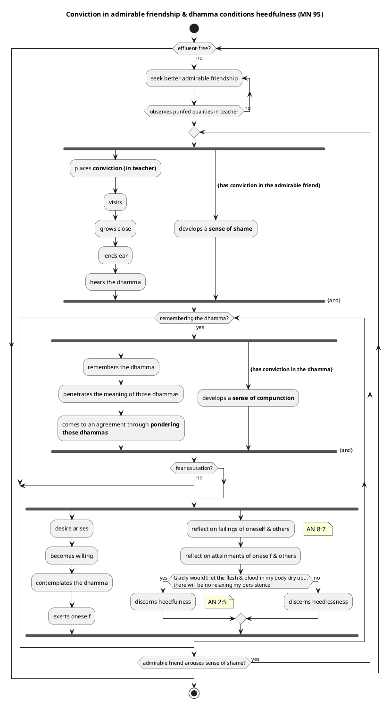
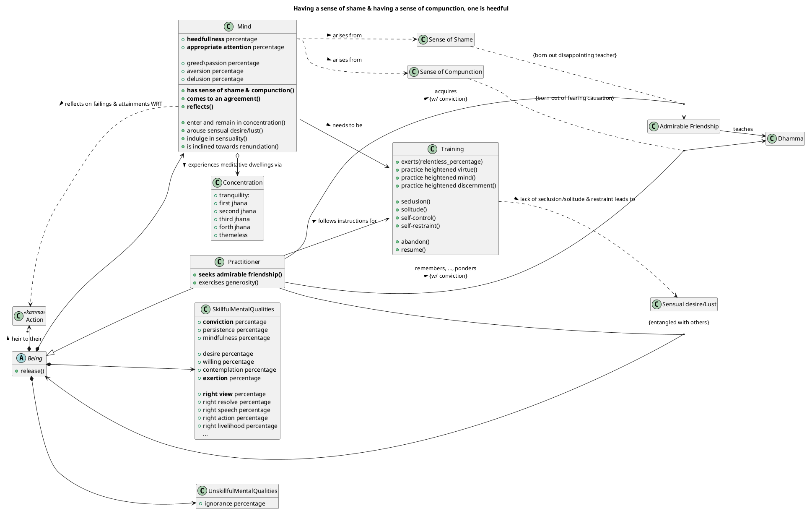
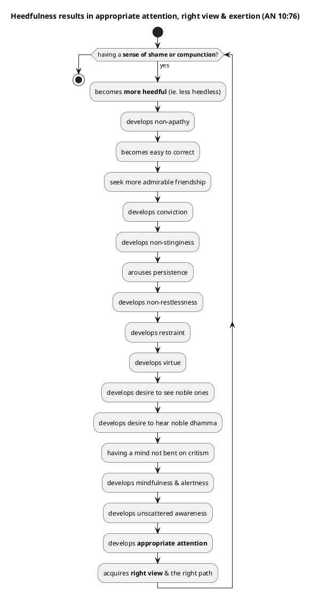
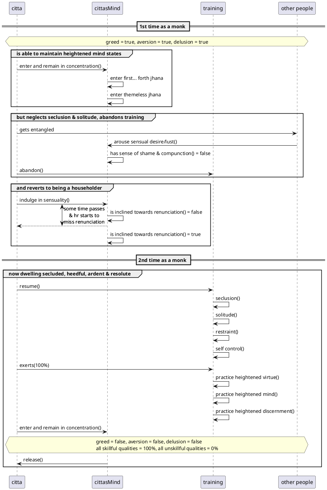

[Ones](./ones-index.md) > [Helpful](../1.helpful-index.md)
# Pattern: Heedfulness with regard to skillful qualities

## Abstract
This pattern captures a **fundamental best practice** for spiritual practitioners: the **cultivation of unwavering diligence and vigilance** in abandoning unskillful qualities and developing skillful ones. It is presented as a **single Dhamma that is very helpful** for achieving the ultimate goals of unbinding, cessation of suffering, and release from all ties.

## Context
You are a practitioner on the holy path, aiming for **unbinding** and the **ending of suffering and stress**. You understand the importance of **skillful qualities** but find it challenging to maintain consistent effort and prevent regression in your practice, potentially feeling **lazy** or **heedless**.

## Problem
How do you overcome **stagnation and complacency** in the training to complete the task of the holy life, ensuring **continuous and effective spiritual progress** towards liberation? [User Query]

## Forces
*   **Ease and Comfort**: There is a natural inclination towards ease, rest, and avoiding effort, which can lead to **laziness** and **heedlessness** in practice.
*   **Distractions and Entanglements**: The world presents numerous **sensual desires** and **external themes** that can distract the mind and lead to unskillful qualities, hindering progress.
*   **Subtle Obstructions**: Ignorance, craving, aversion, and other defilements can subtly arise and overpower the mind, even when one intends to develop skillful qualities.
*   **Lack of Immediate Results**: The path to liberation requires **gradual training, action, and practice**, and immediate results are not always apparent, making sustained effort difficult, leading to potential frustration.
*   **Difficulty of Self-Correction**: Recognizing and abandoning unskillful qualities requires **constant vigilance** and a willingness to confront one's own faults.

## Indications
*   **Four wheels**: Living in a civilized land, associating with people of integrity, directing oneself rightly, and **having done merit in the past** are very helpful developing skillful qualities.
*   **Admirable friendship**: Having admirable friends as companions **is the whole of the holylife**. Associating with an admirable friend even a fool becomes wise.
*   **Commitment and reflection**: Lack of commitment & lack of reflection are obstacles to Dhammas. Commitment & reflection are food for Dhammas.
*   **Reflection**: Pracitioners are encouraged to periodically reflect on their own failings; periodically reflect on the failings of others. Furthermore, to periodically reflect on their own attainments; and periodically reflect on the attainments of others
*   **Right view**: The voice of another and inappropriate attention are the conditions that lead to wrong view. However, the voice of another and appropriate attention are the conditions that lead to right view. Now when the Buddha refers to "a voice of another", it is not the case that this voice needs to be a physical presence. Admirable friendship may take the form of a book or any other form of media. The key here is that the friendship results in a voice echoing Dhamma in your mind for which you to continously ponder with commitment.
*   **Relentless exertion**: One is heedful when one genuinely discerns *"Gladly would I let the flesh & blood in my body dry up, leaving just the skin, tendons, & bones, but if I have not attained what can be reached through manly firmness, manly persistence, manly striving, there will be no relaxing my persistence"* with respect to their practice.
*   **Comprehension, seclusion, tranquility & discernment**: there is the case where a monk studies the Dhamma: dialogues, narratives of mixed prose & verse, explanations, verses, spontaneous exclamations, quotations, birth stories, amazing events, question & answer sessions. This is called a monk dwelling in the Dhamma: 
    * He doesn't spend the day in Dhamma-study. 
    * He doesn't neglect seclusion. 
    * He devotes himself to internal tranquility of awareness. 
    * With his discernment, he discerns [the Dhamma's] higher meaning or goal.

*   **Where, despite practicing in seclusion, heedlessness unexpectedly creeps in**:
    *   **Muddled Mindfulness at Death**: Even monks who have mastered the Dhamma can, if their mindfulness is muddled at the time of passing away, arise in a certain group of devas where the arising of their mindfulness is "slow," preventing quick distinction. This suggests that the quality of mindfulness, and thus heedfulness, needs to be consistently sharp.
    *   **Lack of Further Exertion**: A disciple with conviction in the Dhamma can still fall into heedlessness if they **"don't exert themselves further in solitude by day or seclusion by night."** This leads to a lack of joy, rapture, and calm, resulting in pain, an uncentered mind, and a failure for phenomena to become manifest, thus being "reckoned simply as one who dwells in heedlessness".
    *   **Attachment to Mundane Pursuits**: "Delighting in work, delighting in talking, delighting in sleeping, delighting in entanglement, not guarding the sense faculties, not knowing moderation in food" are all qualities that lead to the **"decline of a monk in training"**. These represent areas where a lack of heedfulness can manifest and pull a practitioner away from the path.
    *   **Tiring the Body/Mind**: Even wholesome activities like "thinking & pondering a long time" can "tire the body" and "disturb the mind," making it "far from concentration". This highlights the need for careful balance, which heedfulness provides, to prevent the overexertion that can lead to subtle forms of heedlessness.
*   **Which unskillful qualities arise to distract a practitioner from remaining heedful**:
    *   **The Five Hindrances**: These are explicitly called **"defilements of the mind"** and **"imperfections of awareness that weaken discernment"**. They include:
        1.  **Sensual desire**.
        2.  **Ill will**.
        3.  **Sloth & drowsiness**.
        4.  **Restlessness & anxiety**.
        5.  **Uncertainty**.
    *   **Passion, Aversion, and Delusion**: These are the "three roots of what is unskillful" and are seen to overcome the mind, preventing concentration and the straight path. Delusion is directly abandoned by appropriate attention.
    *   **Inappropriate Attention**: This leads to a "lack of mindfulness & alertness" and is "on the side of decline".
    *   **Muddled Truth, Unalertness, & Scattered Awareness**: These are linked to a "lack of desire to see the noble ones," "lack of desire to hear the noble Dhamma," and a "mind bent on criticism".
    *   **Unguarded Sense Doors**: Dwelling without restraint over the sense faculties allows the mind to become "stained" with sense objects, leading to a lack of joy, rapture, and calm, and an uncentered mind. Guarding the sense doors is crucial for heedfulness.
    *   **Self-identification (*I-making, mine-making*) and Conceit**: These are directly linked to suffering and stress. Heedfulness, through the perception of not-self, helps in abandoning these.

## Solution

**Cultivating heedfulness (appamāda)** is not easily achieved as it is dependent on the four wheels as suitable conditions for it to arise. Of these four wheels, three factors are based on past kamma, and just one factor is based on the present kamma. Regardless of your individual circumstances, everybody climbs the same mountain albeit perhaps departing from different locations. 

**Steps**:
1. Keep your **persistence aroused for abandoning unskillful qualities and taking on skillful qualities**. Be **steadfast, solid in your effort, not shirking your duties with regard to skillful qualities**
2. Be **mindful** and **alert**, guarding your sense faculties, and being discerning. By you increasing your skillful qualities, you become better positioned to observe others
3. Seek out admirable friends that appear to exhibit skillful qualities
4. Scrutinise the admirable friend in terms of virtue, generosity, learning and discernment. If they don't appear to be genuine people of integrity, then repeat step 3
5. Having identified an admirable friend, undertake repeated acts of generosity towards them with frequent visits and growing close to them. This not only creates incalculable merit, but it has the added benefit of planting kammic seeds for you to circle around noble ones in the future.
6. When the admirable friend discerns your sufficient conviction in them, they will share Dhamma with you. At this stage you should listen attentively
7. If you after repeated visits are struggling to remember the Dhamma instructions that they gave you, then you are either not yet fit to be trained (return to step 1) or they are not the right teacher for you at this stage (return to step 3). It is critical at this stage that you become established in a positive sense of shame of wrong doing in the teacher's eyes
8. Having rememebered the Dhamma you should ponder over its meaning in terms of cause and effect
9. At this stage you will be faced with causal laws that will conflict with your world view. Again, this is another critical stage in the practice. When you finally come to agreement through ponder views, you will be established in a positive sense of a compunction. You will be confronted with your failures with respect to causation. If you are unable to accept causation or prefer the bliss of ignorance (ie. do not fear causation), then you are not yet fit to be trained by this teacher (return to step 1)
10. Having been established in a sense of fear of causation, desire, willingness, weighing up values and priorities will all give rise to exertion
11. In parallel to step 10 you should reflect on your failings & attainments, and the failings & attainments of others. Then depending your reaction to the statement "Gladly would I let the flesh & blood in my body dry up..." you will know, your personal assessment of your own heedfulness
12. Repeat step 7

**Causation**
*   **Mental Qualities (leading to Heedfulness)**:
    1.  **Shame & Compunction (*Hiri & Ottappa*)**: **"Monks, having a sense of shame & having a sense of compunction, one is heedful."** These two qualities are described as "bright qualities" that "guard the world". They are also listed among the **seven noble treasures**.
    2.  **Abandoning Apathy, Being Hard to Correct, & Evil Friendship**: Being heedful enables one to abandon these unskillful qualities. This implies that their absence or active abandonment are also requisites for sustained heedfulness.
    3.  **Admirable Friendship (*Kalyāṇamitta*)**: Having admirable friendship enables one to abandon a lack of conviction, stinginess, and laziness. Associating with people of integrity is the initial "food" for the entire chain leading to clear knowing and release, via hearing the true Dhamma, conviction, appropriate attention, and mindfulness & alertness.
    4.  **Aroused Persistence (*Vīriya*)**: Aroused persistence enables one to abandon restlessness, a lack of restraint, and poor virtue. The Dhamma is specifically described as being "for one whose persistence is aroused, not for one who is lazy".
    5.  **Virtue (*Sīla*)**: Being virtuous enables one to abandon a lack of desire to see noble ones, a lack of desire to hear the noble Dhamma, and a mind bent on criticism. Virtue is another of the **seven noble treasures**.
    6.  **Mind not bent on criticism**: This quality enables one to abandon muddled truth, unalertness, and scattered awareness.
    7.  **Unscattered Awareness**: This quality enables one to abandon inappropriate attention, the following of a wrong path, and slowness of awareness.
    8.  **Quick Awareness**: This quality enables one to abandon self-identification, uncertainty, and grasping at habits & practices.
    9.  **Abandoning Passion, Aversion, & Delusion**: The absence of uncertainty (due to quick awareness) allows one to abandon passion, aversion, and delusion, which ultimately leads to the abandoning of birth, aging, and death. These are the **three roots of what is unskillful**, and their abandonment is central to the path.

*   **Verbal Conduct Requisites for being established in heedfulness**:
    *   **Developing good verbal conduct** is one of the four instances where heedfulness must be exercised.
    *   This includes **abstaining from telling lies, divisive speech, harsh speech, and idle chatter**. Instead, one should speak truthfully, harmoniously, gently, and purposefully.
    *   Training oneself to be **"unaffected" in mind and "say no evil words"** even when faced with disagreeable speech, instead maintaining a mind of goodwill and sympathy.

*   **Bodily Conduct Requisites for being established in heedfulness**:
    *   **Developing good bodily conduct** is another of the four instances where heedfulness must be exercised.
    *   This entails **abstaining from taking life, taking what is not given (stealing), and engaging in illicit sex**. Instead, one dwells with "rod laid down, knife laid down, scrupulous, merciful, compassionate for the welfare of all living beings".
    *   Purifying bodily actions through **"repeated reflection"** to ensure they do not lead to self-affliction or the affliction of others, and are skillful with pleasant consequences.

## Rationale
Heedfulness serves as the **governing principle** for the holy life, with training as its reward, discernment as its surpassing state, and release as its heartwood. It is the foundation upon which all other skillful qualities are developed and brought to fruition. When heedfulness is present, the **mind is not overcome with passion, aversion, or delusion**, leading to joy, rapture, calm, ease, and a concentrated mind. Without heedfulness, skillful qualities decline, and the noble path leading to the right ending of suffering and stress is neglected. The wise cherish heedfulness as their **highest wealth** and, through it, make an **island no flood can submerge**. This essential quality ensures that one remains **incapable of falling away** from the path and is **right in the presence of Unbinding**. It is the diligent practice of the Dhamma in line with the Dhamma.

## Resulting Context
By consistently applying heedfulness, you foster the **growth, increase, and abundance of skillful mental qualities**, leading to a **calm, pliant, malleable, luminous, and rightly concentrated mind**. This diligence allows for the **discernment of phenomena as they truly are**, ultimately leading to the **ending of effluents** and **total unbinding**. Heedfulness ensures that you are **incapable of falling away** from the path and are **right in the presence of Unbinding**.

## Related Patterns

*   **[Appropriate attention](./ones/distinction.md)**: Directly aids heedfulness by focusing on skillful qualities and leading to distinction. Its opposite, **Inappropriate attention**, leads to decline.
*   **[Mindfulness & alertness](./twos/helpful.md)**: These are **very helpful** Dhammas that are developed alongside heedfulness, providing keen awareness necessary for effective practice.
*   **[Tranquility & insight](./twos/developed.md)**: These are **developed** through persistent effort stemming from heedfulness, leading to clear knowing and release.
*   **[Being easy to instruct & admirable friendship](./twos/distinction.md)**: These **distinction** Dhammas represent conditions that foster and support sustained heedful practice.
*   **[Clear knowing & release](./twos/realised.md)**: These are the **realized** Dhammas, the ultimate outcome of diligent heedful practice.
*   **[Associating with people of integrity, listening to the True Dhamma, practicing the Dhamma in accordance with the Dhamma](./threes/helpful.md)**: These three Dhammas are **very helpful** in establishing the foundation for heedfulness and right practice.
*   **[Four establishings of mindfulness](./fours/developed.md)**: These are **developed** through heedfulness, as a monk remains ardent, alert, and mindful of body, feelings, mind, and mental qualities.
*   **[Four noble truths](./fours/directly-known.md)**: These are **directly known** and comprehended through heedful discernment, providing the core understanding of stress and its cessation.
*   **[Four fruits of the contemplative life](./fours/realised.md)**: These are the **realized** stages of progress attained through heedful practice.
*   **[Five factors for exertion](./fives/helpful.md)**: These are **very helpful** and directly support heedfulness, including conviction, good health, honesty, aroused persistence, and discernment.
*   **[Five faculties (conviction, persistence, mindfulness, concentration, discernment)](./fives/distinction.md)**: These are on the side of **distinction**, and heedfulness is the active engagement and balance of these faculties.
*   **[Six objects of recollection (Buddha, Dhamma, Saṅgha, virtue, generosity, devas)](./sixes/developed.md)**: These are **developed** and recollected to maintain a mind that "heads straight" and is not overcome by passion, aversion, or delusion, thereby supporting heedful practice.
*   **[Seven factors for awakening (mindfulness, analysis of qualities, persistence, rapture, calm, concentration, equanimity)](./sevens/developed.md)**: These are **developed** and pursued through heedfulness, leading directly to awakening.
*   **[Seven noble treasures (conviction, virtue, sense of shame, sense of compunction, listening, generosity, discernment)](./sevens/helpful.md)**: These are **very helpful** and are virtues that are strengthened and protected through heedfulness.
*   **Seven true Dhammas**: Heedfulness enables a monk to embody these qualities, including aroused persistence and established mindfulness.
*   **[Noble eightfold path](./eights/developed.md)**: This path is **developed** through heedfulness, as diligence is required to cultivate right view, resolve, speech, action, livelihood, effort, mindfulness, and concentration.
*   **[Eight thoughts of a great person](./eights/made-to-arise.md)**: These thoughts, promoting modesty, contentment, reclusiveness, aroused persistence, established mindfulness, concentration, discernment, and non-objectification, are qualities that should be **made to arise** and are fostered by heedfulness.
*   **[Nine Dhammas rooted in appropriate attention](./nines/helpful.md)**: This sequence, starting with appropriate attention and leading to joy, rapture, calm, concentration, knowing and seeing, disenchantment, dispassion, and release, highlights the progressive results of heedful practice, making them **very helpful**.
*   **[Nine factors of exertion for full purity](./nines/developed.md)**: These factors are **developed** by the heedful practitioner, leading to purity in virtue, mind, view, and ultimately, release.
*   **[Ten qualities creating a protector](./tens/helpful.md)**: These are **very helpful** and encompass virtuous conduct, extensive learning, aroused persistence, established mindfulness, concentration, and discernment, all sustained by heedfulness, ensuring the monk's progress and stability in the Dhamma-Vinaya.
*   **[Ten skillful courses of action](./tens/distinction.md)**: These actions, such as refraining from taking life and cultivating right view, are on the side of **distinction** and are the practical manifestation of heedfulness in conduct.
*   **[Ten qualities of one beyond training](./tens/realised.md)**: These are the ultimate **realized** qualities, signifying the culmination of a life lived with heedfulness.

## Examples

There is a case where Venerable Citta Hatthisārīputta had gained such & such meditative dwellings & attainments but gave up the training and reverted to the lower life.

Venerable Mahā Koṭṭhita explains that despite Venerable Citta Hatthisārīputta getting into higly refined Jhana's and perhaps even acquiring a noble attainment, still he reverted. He says, friends, there is the case where a certain individual, not attending to any themes, enters & remains in the [first or second or third or forth Jhana, or the] themeless concentration of awareness. He, (thinking,) 'I have gained the themeless concentration of awareness,' **gets entangled** with monks, nuns, male lay followers, female lay followers, kings, kings' ministers, sectarians, and sectarians' disciples. As he **lives entangled**, loosened up, uncontrolled, devoted to conversation, **lust invades his mind**. He, with his mind invaded by lust, **gives up the training and reverts to the lower life**.

The Buddha however exclaims: 'It won't be long, monks, before Citta misses [the life of] renunciation.'

Then not long after that, Citta Hatthisārīputta, having shaved off his hair & beard, put on the ochre robes and went forth from the household life into homelessness. **Then—dwelling alone, secluded, heedful, ardent, & resolute**, Venerable Citta Hatthisārīputta in no long time entered & remained in the supreme goal of the holy life for which clansmen rightly go forth from home into homelessness, directly knowing & realizing it for himself in the here & now. He knew: 'Birth is ended, the holy life fulfilled, the task done. There is nothing further for the sake of this world.' **And thus Venerable Citta Hatthisārīputta became another one of the arahants.**

## Simile

*   **The Elephant's Footprint**:
    *   **Description**: "Just as the footprints of all legged animals are encompassed by the footprint of the elephant, and the elephant's footprint is reckoned the foremost among them in terms of size; in the same way, all skillful qualities are rooted in heedfulness, converge in heedfulness, and heedfulness is reckoned the foremost among them".
    *   **Understanding**: This simile emphasizes that **heedfulness is the supreme, all-encompassing, and foundational quality** from which all other skillful qualities arise and into which they converge. It secures both present and future benefits.

*   **Examining One's Face in a Mirror or Bowl of Clear Water**:
    *   **Description**: A person fond of adornment examines their reflection in a clear mirror to see and remove any blemishes.
    *   **Understanding**: This simile directly describes **self-examination (introspection)** as a "very productive" practice for cultivating skillful qualities. **Heedfulness involves this constant, diligent self-monitoring and willingness to remove mental defilements**, like a person removing dirt from their reflection.

