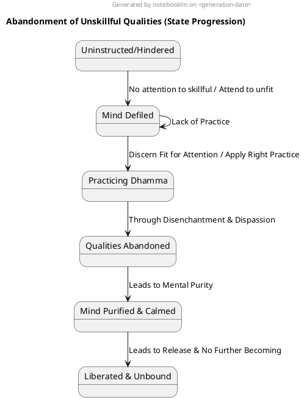
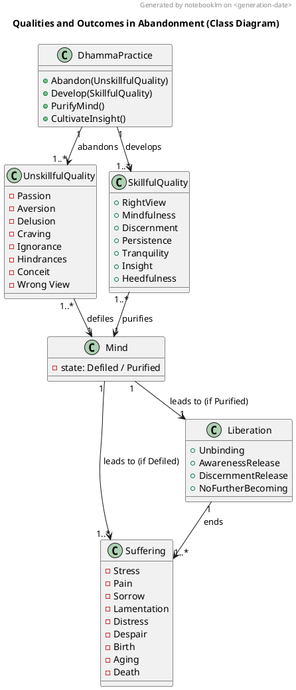

### PART-A: Body Content
In reference to the topic "Abandoned" qualities as defined by the Dhamma, particularly drawing on the provided sources.

#### 1. Definition
"Abandoned" qualities refer to **unskillful or defiling mental qualities that are eliminated, overcome, or relinquished** through diligent Dhamma practice. These are states or actions that contribute to suffering, stress, and continued wandering in the cycle of becoming. Their complete abandonment is essential for achieving purity, release, and ultimately, unbinding.

Examples of qualities that are explicitly stated as needing to be abandoned, destroyed, or cut through include:
*   **Passion (Rāga), Aversion (Dosa), & Delusion (Moha)**: These are the causes for the origination of actions and are defilements of the mind. Their fading leads to awareness-release and discernment-release.
*   **Effluents (Āsava)**: Specifically, the effluent of sensuality, becoming, and ignorance. The ending of effluents is the **ultimate goal of the holy life** and results in effluent-free awareness-release and discernment-release.
*   **Craving (Taṇhā)**: Described as a fetter that causes beings to wander and transmigrate for a long time. Its cutting through leads to unbinding and prevents future becoming.
*   **Five Hindrances**: These include sensual desire, ill will, sloth & drowsiness, restlessness & anxiety, and uncertainty. They are considered **defilements of awareness that weaken discernment**.
*   **I-making & Mine-making Conceit-obsession**: These must be eliminated to enter and remain in awareness-release and discernment-release.
*   **Wrong View (Micchā Diṭṭhi)**: If not relinquished, it can lead to negative destinations like hell or animal wombs.
*   **Unskillful Qualities**: A broad category encompassing any mental quality that increases suffering or leads to harm. This includes bodily, verbal, and mental misconduct.
*   **Sorrow, Lamentation, Pain, Distress, & Despair**: These are direct consequences of clinging and inconstancy, which are overcome through abandonment.

#### 2. Considerations
The abandonment of unskillful qualities is foundational and essential for progressing on the path to liberation and achieving the ultimate goals of the holy life.
*   **Purification and Liberation**: Abandoning defilements directly leads to the **purification of beings, the overcoming of sorrow and lamentation, the disappearance of pain and distress, the attainment of the right method, and the realization of unbinding**. This process results in a **mind that is unblemished and undefiled**.
*   **Cessation of Suffering**: The direct outcome of abandoning passion, aversion, and delusion is the **ending of suffering and stress in the here and now**. This cessation frees beings from birth, aging, death, sorrow, lamentation, pain, distress, and despair.
*   **No Further Becoming**: When craving, ignorance, and other effluents are abandoned, their root is destroyed, making them **like a palmyra stump, deprived of the conditions of development, and not destined for future arising**. This ensures **no further birth, aging, or death**.
*   **Enhanced Mental States**: As defilements are abandoned, the mind becomes **calmed, joyful, rapturous, and concentrated**. It also becomes **pliant, malleable, and luminous**, rightly concentrated for the ending of effluents.
*   **Unexcelled Security**: The abandonment of unskillful qualities leads to **unexcelled freedom/safety from bondage**.
*   **Righteousness and Integrity**: The act of abandoning unskillful qualities is a hallmark of a **person of integrity** and enables one to **look after oneself in a pure way**. This allows one to "righteously refer to oneself as a contemplative".

#### 3. Causation
###### Causes/conditions For Abandonment
*   **Direct Knowledge and Insight**: The **ending of effluents comes for one who knows and sees**. Discernment and clear knowing are crucial for the abandonment of ignorance and the arising of clear knowing.
*   **Disenchantment, Dispassion, Cessation, and Lack of Clinging/Sustenance**: These form the sequence that leads to release from the five clinging-aggregates (form, feeling, perception, fabrications, and consciousness).
*   **Right Practice**: Following the Dhamma, particularly the **Noble Eightfold Path**, is the path and practice that leads to the abandoning and overcoming of defilements.
*   **Appropriate Attention**: **Attending to themes connected with what is skillful** causes unskillful thoughts to be abandoned and subside.
*   **Recollection of Dhamma Qualities**: Recollecting the qualities of the Buddha, Dhamma, Saṅgha, one's own virtues, generosity, and devas helps to **abandon defilements of the mind**.
*   **Truth and Heedfulness**: Making an effort in truth ensures one **doesn't fall back**. **Heedfulness** is the root of all skillful qualities, enabling the abandonment of misconduct and wrong view.
*   **Self-Reflection**: Periodically **reflecting on one's own failings** is beneficial for a monk.
*   **Tranquility and Insight**: These two qualities are of **great help in the attainment of the cessation of perception & feeling**.

###### Effects From Abandonment
*   **Release and Unbinding**: **Awareness-release** comes from the fading of passion, and **discernment-release** comes from the fading of ignorance. The mind nurtured with discernment is **rightly released from the effluents**.
*   **Cessation of Future Suffering**: When effluents are abandoned, their root destroyed, they are **made like a palmyra stump, deprived of the conditions of development, not destined for future arising**, thus ending birth, aging, and death.
*   **Mental Purity**: The mind becomes **cleansed, calm, joyful, and concentrated**. It is no longer overcome with passion, aversion, or delusion.
*   **Crossing Over**: The abandonment of clinging allows one to **cross over attachment** and **cross over the flood of sensuality's bond** for those rightly released.
*   **Increased Skillful Qualities**: When defiling mental qualities are abandoned, **bright mental qualities grow**. The mind becomes **inclined to renunciation** and malleable for direct knowing.

###### Other Causal Factors
*   **Greed, Aversion, and Delusion** are the **causes for the origination of actions**.
*   **Ignorance is a requisite condition for fabrications**, which in turn leads to consciousness, and ultimately, the **origination of the entire mass of stress**.
*   **Craving acts as the "seamstress" that stitches one to the production of this or that becoming**.
*   **Sensual desire, ill will, sloth & drowsiness, restlessness & anxiety, and uncertainty** are **hindrances that overwhelm awareness and weaken discernment**.
*   **"I-making" and "mine-making" conceit-obsession** are fetters that prevent entry into awareness-release and discernment-release.

#### 4. Complications
The failure to abandon unskillful qualities leads to continued suffering, mental defilement, and prevents progress towards liberation.
*   **Perpetuation of Suffering**: If unskillful qualities are not abandoned, they **increase**. This leads to **effluents growing**, and the mind remaining **defiled by passion and ignorance**, which prevents release and the development of discernment.
*   **Ignorance and Bewilderment**: Individuals who do not discern the Four Noble Truths or the cessation of stress remain **bewildered and unprotected**. They are described as "lost" and may not hear the Dhamma sequence.
*   **Wrong Views and Inaction**: Sectarian views that attribute all experiences to past actions, a supreme being, or lack of cause, cause individuals to remain **stuck in inaction**, lacking the desire or effort to change or perform skillful deeds.
*   **Obstacles to Progress**: Unskillful qualities like sloth, restlessness, and uncertainty **overwhelm awareness and weaken discernment**, acting as significant hindrances. For instance, **over-aroused persistence leads to restlessness**, and **overly slack persistence leads to laziness**.
*   **Rebirth in Lower Realms**: Failure to abandon these defiling qualities results in **reappearance in planes of deprivation, bad destinations, or hell** after the break-up of the body.
*   **Discontent and Entanglement**: Living with unabandoned qualities perpetuates a life of **discontent, self-aggrandizement, entanglement, laziness, and being burdensome**.

#### 5. How To
To effectively abandon unskillful qualities and achieve liberation, specific practices and mental cultivation are required:
*   **Discern What is Fit for Attention**: The well-instructed disciple must learn to discern which ideas are fit for attention and **consciously avoid attending to ideas unfit for attention** that would cause effluents to arise or increase.
*   **Actively Abandon and Develop**: One should **generate desire, endeavor, persistence, and exertion for the non-arising and abandoning of unskillful qualities, and for the arising and development of skillful qualities**. This effort must be **steadfast, solid, and unwavering**.
*   **Purify the Mind**: The defiled mind is **cleansed through the proper technique**. This involves **recollecting the Buddha, Dhamma, Saṅgha, one's own virtues, and devas**, which calms the mind and leads to the abandonment of defilements.
*   **Practice Disenchantment and Dispassion**: Cultivate the understanding that **whatever is inconstant, stressful, or not-self should be abandoned of desire-passion**. This disenchantment leads to dispassion, cessation, and release.
*   **Develop Right View**: This encompasses **knowing stress, its origination, cessation, and the path to cessation**. Right view **purges away wrong view** and leads to the culmination of skillful qualities.
*   **Cultivate Sagacity**: Engage in **bodily sagacity** (abstaining from taking life, theft, uncelibacy), **verbal sagacity** (abstaining from lying, divisive speech, harsh speech, idle chatter), and **mental sagacity** (ending effluents, entering awareness-release & discernment-release).
*   **Balance Mental Qualities**: When the mind is sluggish, persistence should be aroused; when restless, calm should be induced; when balanced, equanimity is practiced. This involves periodically attending to **themes of concentration, uplifted energy, and equanimity**.
*   **Practice Mindfulness of In-&Out Breathing**: This is a **peaceful and exquisite abiding that immediately disperses and allays any evil, unskillful mental qualities** that have arisen.
*   **Understand Dependent Co-arising**: Directly knowing the origination and cessation of phenomena (such as ignorance, fabrications, consciousness, feeling, craving, clinging, becoming, birth, aging & death) allows for the **subduing of desire and passion** and the **cessation of stress**.
*   **Seek Seclusion**: Practice jhāna in **empty dwellings and at the roots of trees**, and direct the mind to the **deathless property**, abandoning conceit, restlessness, and anxiety.

### PART-B: Diagrams

