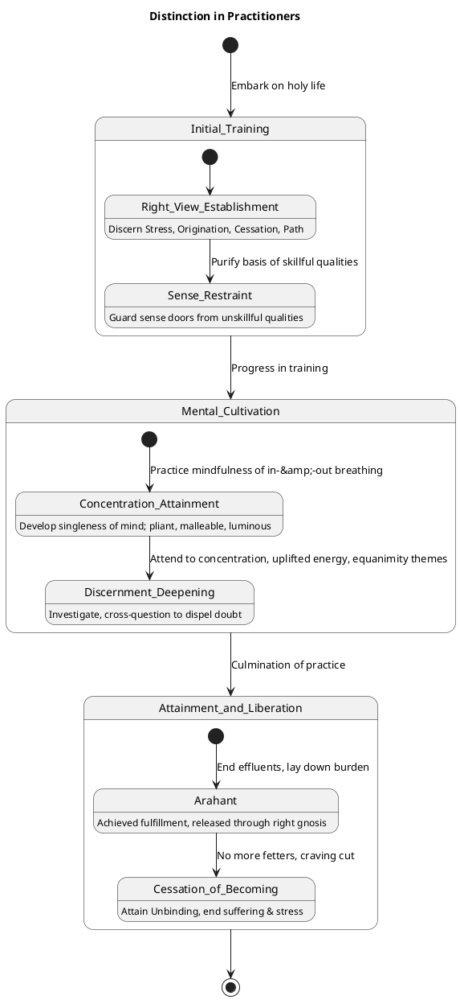
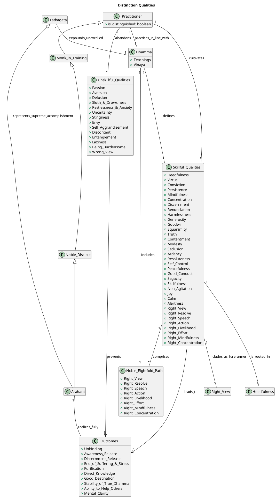

##### PART-A: Body Content
In reference to the topic "Distinction" as defined by the Dhamma, particularly drawing on the provided sources.

###### 1. Definition
**"Distinction"** for practitioners refers to qualities and attainments that elevate an individual above the run-of-the-mill, marking them as advanced, proficient, or supreme in the holy life. These qualities are often described as leading to a **"culmination and abundance of discernment"** and the **"perfection & culmination of direct knowledge"**.

Examples of qualities and characteristics of distinguished practitioners include:
*   **Consummation in Virtue, Concentration, and Discernment**: A monk skilled in these areas is **fulfilled & fully accomplished** in the Dhamma and Vinaya, considered the ultimate person.
*   **Being "One with the Eyes"**: This signifies someone who sees with discernment.
*   **A "Sage"**: Characterized by self-control, freedom from sensuality and becoming, and the ending of effluents.
*   **Noble Disciples**: Such as stream-winners, once-returners, non-returners, and arahants, who have achieved specific stages of liberation from fetters and effluents.
*   **Tathāgata**: The Awakened One, who is the **supreme guide and teacher**, possessing unexcelled direct knowledge and complete freedom from defilements.
*   **Skillfulness in Dhamma**: Including knowing the Dhamma, teaching it, recollecting it, and questioning others to dispel doubt.

###### 2. Considerations
Cultivating qualities of distinction is essential for **realizing unbinding** and **putting an end to suffering & stress**. These qualities enable practitioners to **"cross over birth & aging"** and attain **"effluent-free awareness-release & discernment-release"**.

The favorable impacts and benefits of distinction include:
*   **Achieving the ultimate goal**: This encompasses the cessation of suffering and the realization of unbinding.
*   **Freedom from defilements**: Such as passion, aversion, and delusion, leading to purification and release.
*   **Mental states of ease and clarity**: The mind becomes **pliant, malleable, luminous, & not brittle**, rightly concentrated for ending effluents. Joy, rapture, and calm arise, and the body grows calm.
*   **Ability to help others**: Distinguished practitioners can **teach, exhort, inform, instruct, urge, rouse, & encourage their companions** in the holy life.
*   **Stability of the True Dhamma**: When monks, nuns, lay men, and lay women live with respect for the Teacher, Dhamma, Saṅgha, training, and concentration, it leads to the **stability, non-confusion, & non-disappearance of the true Dhamma**.

###### 3. Causation
###### Causes/conditions For
*   **Heedfulness** (Appamāda) is the **root of all skillful qualities**.
*   **Appropriate attention** is on the side of distinction.
*   **Being easy to instruct** and having **admirable friendship** are on the side of distinction.
*   **Direct knowledge and full comprehension** are the purpose for which the holy life is lived.
*   **Cultivating the four establishings of mindfulness** (body, feelings, mind, mental qualities) leads to going beyond Māra's realm and ensures the **True Dhamma lasts long**.
*   **Developing insight preceded by tranquility** leads to the path being born, followed by the abandonment of fetters and destruction of obsessions.
*   **Consummate virtue, concentration, and discernment** are prerequisites for **entering & emerging from the cessation of perception & feeling** and gaining gnosis.
*   **The Dhamma-stream** carries one along toward higher states, even if one is initially unvirtuous or restless.
*   **Practicing the Dhamma in line with the Dhamma** is what leads to **knowing freedom from disease and seeing unbinding**.

###### Effects From
*   From the **fading of passion** is awareness-release; from the **fading of ignorance** is discernment-release.
*   From **disenchantment** comes **dispassion**, which leads to **cessation, stilling, direct knowledge, self-awakening, and unbinding**.
*   From **abandoning effluents** comes **effluent-free awareness-release & discernment-release**, cutting craving, ripping off fetters, and ending suffering and stress.
*   From **not clinging or sustenance** comes **non-agitation** and **no seed for the conditions of future birth, aging, death, or stress**.
*   From **developing mindfulness of in-&-out breathing** comes a **peaceful & exquisite, refreshing & pleasant abiding that immediately disperses & allays any evil, unskillful (mental) qualities**.
*   From **developing conviction, persistence, mindfulness, concentration, and discernment** comes gaining a **footing in the deathless**.
*   When the mind is **calmed and joyful** through recollection, **defilements are abandoned**.

###### Other Causal Factors
*   **Greed, aversion, and delusion** are causes for the origination of actions and defile the mind.
*   **Self-making or mine-making conceit-obsession** prevents awareness-release and discernment-release.
*   **"Fortuitous-arising" and doctrines of inaction** lead to being stuck in inaction.
*   **Poorly proclaimed Dhamma-Vinaya** and a teacher who is not rightly self-awakened hinder the path.
*   **Wrong view, resolve, speech, action, livelihood, effort, mindfulness, and concentration** impede the attainment of results from the holy life.

###### 4. Complications
Practitioners aspiring to distinction may face complications that hinder their progress. These are often rooted in unskillful mental qualities or an incomplete understanding and practice of the Dhamma.
*   The **"uninstructed run-of-the-mill person"** does not discern the luminous mind defiled by incoming defilements, leading to **no development of the mind**. They are prone to clinging to the five aggregates as self.
*   **Passion, aversion, and delusion** defile the mind and prevent discernment from developing, leading to a mind that is **not released**. Delusion is particularly problematic as it carries great blame and is slow to fade.
*   **Hindrances** such as sensuality, ill will, sloth & drowsiness, restlessness & anxiety, and uncertainty overwhelm awareness and **weaken discernment**. These prevent the mind from becoming concentrated and lead to suffering.
*   **Inappropriate attention** leads to decline.
*   **Conceit**, especially "I-making" or "mine-making" conceit-obsession, is a lower fetter and an obstacle to release.
*   **Laziness** (overly slack persistence) and **restlessness** (over-aroused persistence) prevent the mind from being rightly concentrated for the ending of effluents.
*   **Being unvirtuous, muddled in mindfulness, unconcentrated, or undiscerning** hinders the development of higher qualities.
*   **Sectarian views** that deny cause or condition, or resort to "eel-wriggling," keep one stuck in inaction or unable to respond truthfully, preventing progress.
*   **Not discerning the allure, drawback, and escape** from phenomena like forms, feelings, or consciousness prevents comprehension and release.

These complications prevent the **purification of vision**, lead to **suffering and stress**, and cause **effluents to grow**.

###### 5. How To
To cultivate and attend to qualities that lead to distinction, practitioners should:
*   **Train themselves with a step-by-step training, activity, and practice**. The core purpose is **direct knowledge and full comprehension** of stress, its origination, cessation, and the path to its cessation.
*   **Purify the very basis with regard to skillful mental qualities**: This starts with **well-purified virtue & views made straight**. This involves abstaining from unskillful bodily, verbal, and mental conduct, and engaging in skillful conduct.
*   **Develop the Noble Eightfold Path**: This is the supreme path leading to the **cessation of effluents and purity of vision**. Key aspects include:
    *   **Right View**: Knowledge of the Four Noble Truths.
    *   **Right Effort**: Generating desire and exertion for abandoning unskillful qualities and developing skillful ones.
    *   **Right Mindfulness**: Remaining ardent, alert, and mindful, focusing on body, feelings, mind, and mental qualities. Practice **mindfulness of in-&-out breathing** to disperse unskillful qualities.
    *   **Right Concentration**: Attending periodically to **themes of concentration, uplifted energy, and equanimity** to make the mind pliant, malleable, and luminous for ending effluents.
*   **Develop the five faculties**: Conviction, persistence, mindfulness, concentration, and discernment, which gain a footing in the deathless.
*   **Cultivate awareness-release through goodwill**: Develop it abundantly, expansively, and immeasurably to prevent ill will from overpowering the mind.
*   **Guard the doors to sense faculties**: Not grasping at themes that would lead to unskillful qualities upon sensory contact.
*   **Associate with people of integrity (kalyāṇamitta)** and **listen to the True Dhamma**. This helps one discern skillful and unskillful qualities.
*   **Engage in discussion and cross-questioning** to understand the Dhamma deeply and dispel doubts.
*   **Reflect on one's own failings and attainments** to foster growth.
*   **Live modestly, contentedly, reclusively, with aroused persistence, established mindfulness, a concentrated mind, and discernment**.

The ultimate aim of these practices is to **know the goal and experience the Dhamma, leading to bliss**, and to **put an end to suffering & stress**.

---

##### PART-B: Diagrams
###### 1. PlantUML State Diagram

###### 2. PlantUML Class Diagram
