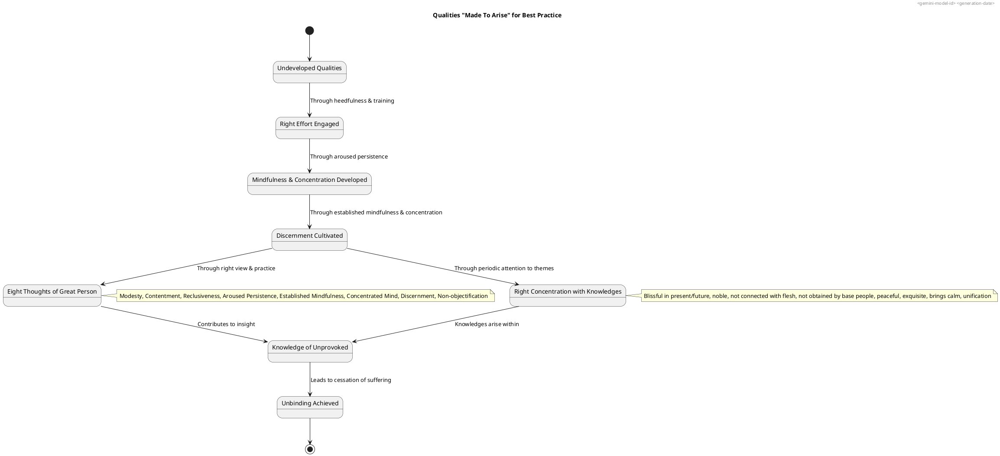
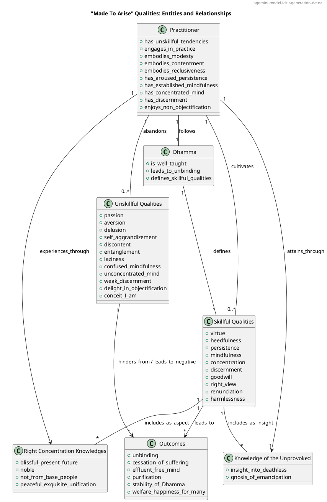

### PART-A: Body Content

#### 1. Definition
**"Made To Arise" qualities** are those that are actively cultivated or brought into existence through diligent effort and right practice in the Dhamma. They are essential for progression on the path, ultimately leading to unbinding and the ending of suffering and stress. These qualities are often presented as contrasting with their unskillful counterparts, emphasizing the transformative nature of practice.

Specific qualities identified in the sources as needing to "be made to arise" include:
*   **Knowledge of the unprovoked** (or unprovoked knowledge).
*   **Eight thoughts of a great person**: These are foundational mindsets and behaviors for a practitioner, indicating how the Dhamma applies to and is embodied by an individual who is on the path. They describe:
    *   **Modesty**: The Dhamma is for one who is modest, not self-aggrandizing.
    *   **Contentment**: The Dhamma is for one who is content, not discontent.
    *   **Reclusiveness**: The Dhamma is for one who is reclusive, not entangled.
    *   **Aroused persistence**: The Dhamma is for one whose persistence is aroused, not lazy.
    *   **Established mindfulness**: The Dhamma is for one whose mindfulness is established, not confused.
    *   **Concentrated mind**: The Dhamma is for one whose mind is concentrated, not unconcentrated.
    *   **Discernment**: The Dhamma is for one endowed with discernment, not weak discernment.
    *   **Enjoyment of non-objectification**: The Dhamma is for one who enjoys non-objectification, not objectification.
*   **Right concentration with knowledges**: This refers to the specific, insightful knowledges that arise within oneself when right concentration is fully developed. These knowledges validate and characterize the quality of the concentration itself:
    *   "This concentration is blissful in the present & will result in bliss in the future."
    *   "This concentration is noble & not connected with the baits of the flesh."
    *   "This concentration is not obtained by base people."
    *   "This concentration is peaceful, exquisite, the acquiring of calm, the attainment of unification, not kept in place by the fabrications of forceful restraint."

#### 2. Considerations
Cultivating these "made to arise" qualities is paramount for a practitioner's progress and ultimate liberation.
*   The development of these qualities is directly linked to **attaining unbinding, putting an end to suffering & stress, and releasing from all ties**. The "Knowledge of the unprovoked" is explicitly a quality on the side of "ending (of effluents)", leading to this ultimate freedom.
*   Embodying the "Eight thoughts of a great person" aligns one's practice with the **true nature of the Dhamma** and fosters an ideal disposition for an enlightened practitioner. This emphasizes detachment from worldly desires and strong mental cultivation, contributing to a "well-expounded, entirely complete, well-proclaimed holy life".
*   The arising of specific "knowledges" within right concentration signifies its **profound quality and effectiveness**, leading to states of bliss, nobility, peace, and unification, while freeing one from unskillful restraints. Such concentration is crucial for the **ending of effluents**.
*   These cultivated qualities contribute to the **purification of beings, overcoming sorrow and lamentation, disappearing pain and distress, attaining the right method, and realizing unbinding**. They secure **benefit in this life and in lives to come**, often leading to **rebirth in good destinations or heavenly worlds**.
*   By actively making these qualities arise, one contributes to the **stability, non-confusion, and non-disappearance of the True Dhamma** for the benefit, welfare, and happiness of the multitude, including human beings and devas.

#### 3. Causation
##### Causes/conditions For
*   **The Dhamma's Teaching**: The Dhamma, as taught by the Blessed One, is "conducive to the goal, conducive to the Dhamma, and basic to the holy life" and explains the qualities that should be developed. The Dhamma "declares, teaches, describes, sets forth, reveals, explains, and makes plain" these paths and qualities.
*   **Right Effort and Persistence**: Qualities are "made to arise" through **aroused persistence, steadfastness, and solid effort**. This involves generating "desire, endeavor, persistence, and exertion for the non-arising and abandoning of unskillful qualities, and the arising and development of skillful qualities".
*   **Established Mindfulness**: **Mindfulness must be established and not confused** for the practitioner to align with the Dhamma's principles. When developed, mindfulness fosters joy, rapture, and calm, contributing to concentration.
*   **Development of Right Concentration**: The profound knowledges characterizing right concentration "arise right within oneself" as the concentration is developed and purified. Attending periodically to "themes of concentration, uplifted energy, and equanimity" makes the mind "pliant, malleable, and luminous" for the ending of effluents.
*   **Cultivation of Discernment**: Being "endowed with discernment" is a prerequisite for embodying the eight thoughts of a great person. Discernment leads to knowing and seeing the Dhamma, which in turn fosters the arising of clear knowing and release.
*   **Recollection of Noble Qualities**: Regularly recollecting the **Buddha, Dhamma, Saṅgha, one's own virtues, generosity, and devas** causes the mind to become "cleansed, calmed, straight, joyful, leading to rapture, calm body, ease, and concentration".
*   **Association with People of Integrity (Kalyāṇamitta)**: Associating with and listening to the True Dhamma from "learned" and "observant companions" helps to clarify understanding and dispels doubts, guiding one towards skillful qualities.

##### Effects From
*   **Unbinding and Cessation of Suffering**: The ultimate outcome of making these qualities arise is the "attainment of unbinding, for putting an end to suffering & stress, for releasing from all ties". The "Knowledge of the unprovoked" is directly related to the "gnosis of emancipation" and the "breaking open of ignorance".
*   **Purification of Mind**: As right concentration is developed, the mind becomes "pliant, malleable, luminous, & not brittle". These qualities contribute to the **"cleansing of the defiled mind through the proper technique"**.
*   **Ending of Effluents**: Right concentration is "rightly concentrated for the ending of the effluents". The knowledges that arise from it facilitate the "abandoning of passion, aversion, and delusion," leading to an effluent-free state.
*   **Freedom from Hindrances and Māra's Realm**: Development of these qualities, particularly through mindful practice, enables one to **"go beyond Māra's realm"** and be "freed from Māra's bonds". The mind is "not overcome with passion, not overcome with aversion, not overcome with delusion" when recollecting the noble ones.

##### Other Causal Factors
*   **The Nature of Reality**: Directly knowing and seeing phenomena as "inconstant," "stressful," and "not-self" leads to disenchantment and dispassion, which are precursors to these qualities arising and culminating in release. This fundamental understanding provides the impetus for the practice.
*   **Dependent Co-arising**: Comprehending dependent co-arising, which shows how phenomena arise from requisite conditions, allows for the understanding of how to abandon those conditions for the cessation of suffering. This direct knowledge is critical for the "Knowledge of the unprovoked" to arise.

#### 4. Complications
The inability or failure to make these crucial qualities arise stems from various unskillful approaches and mindsets:
*   **Inappropriate Attention**: This is a key "declining factor". If a monk attends solely to themes of concentration, their mind may tend to laziness; solely to uplifted energy, restlessness; solely to equanimity, it may not be rightly concentrated for ending effluents. Such imbalanced attention prevents the mind from becoming pliant and luminous.
*   **Unskillful Qualities**: **Passion, aversion, and delusion** are "causes for the origination of actions" that lead to stress and directly hinder the arising of beneficial qualities. If the mind is "overcome" by these defilements, it cannot "head straight" or achieve concentration.
*   **Counter-Qualities to "Eight Thoughts"**: The Dhamma is *not* for those who are "self-aggrandizing, discontent, entangled, lazy, whose mindfulness is confused, whose mind is unconcentrated, whose discernment is weak, or who enjoy & delight in objectification". These mindsets directly oppose the cultivation of the "great person" qualities.
*   **Heedlessness and Laziness**: Remaining "lazy & heedless" is "not fitting" for a monk. Overly slack persistence leads to laziness. Neglecting the "seven factors for awakening" means the noble path is neglected, hindering the ending of suffering.
*   **Conceit "I am"**: This is identified as "one dhamma should be abandoned". It signifies a fundamental lack of insight into not-self, perpetuating clinging and preventing ultimate release.
*   **Lack of Development**: Even with a desire for release, if a monk "dwells without devoting himself to development" of key factors such as the four establishings of mindfulness, right exertions, bases of power, faculties, strengths, factors for awakening, and the noble eightfold path, their mind will not be released from effluents. This highlights the necessity of active cultivation.

#### 5. How To
To ensure these qualities are "made to arise" and to yield the best practitioners, one should undertake a structured and sustained practice:
*   **Engage in Diligent and Consistent Practice**: **"Strive ardently"** and be "steadfast, solid in effort, not shirking duties with regard to skillful qualities". This involves **generating desire, endeavor, persistence, and exertion** for abandoning unskillful qualities and developing skillful ones.
*   **Cultivate Right Concentration with Knowledges**: This involves periodically attending to **"themes of concentration, uplifted energy, and equanimity"** to make the mind "pliant, malleable, luminous, & not brittle," enabling it to be "rightly concentrated for the ending of the effluents". Observing the specific knowledges that arise (e.g., bliss, nobility, peace, unification) confirms its proper development.
*   **Embody the Eight Thoughts of a Great Person**: Consciously cultivate the mindsets that align with the Dhamma: **be modest, content, reclusive, maintain aroused persistence, establish mindfulness, cultivate a concentrated mind, develop discernment, and enjoy non-objectification**. These are the qualities the Dhamma is "for".
*   **Purify the Foundational Basis**: Start by **purifying virtue and making views straight**, as this is the essential basis for skillful mental qualities. This foundation supports the development of higher practices like the four establishings of mindfulness, enabling one to go beyond Māra's realm.
*   **Develop Recollections (Anussati)**: Regularly recollect the **Buddha, Dhamma, Saṅgha, one's own virtues, generosity, and devas**. This practice cleanses and straightens the mind, fostering joy, rapture, calm, and concentration by preventing it from being overcome by passion, aversion, or delusion. This can be done in any posture or activity.
*   **Associate with People of Integrity (Kalyāṇamitta)**: Seek out "learned, intelligent" companions and teachers to hear the **"True Dhamma"**. This helps in discerning what is skillful and unskillful, and clarifying doubtful points, which is essential for practice.
*   **Practice for Direct Knowledge and Full Comprehension**: The holy life is undertaken to "know, see, attain, realize, and break through" to the Dhamma, especially regarding stress, its origination, cessation, and the path to cessation. This involves continuous **investigation and scrutiny with discernment**.
*   **Cultivate Wisdom and Insight**: Through the "inspection of mental qualities swift in the forefront," one gains the "gnosis of emancipation, the breaking open of ignorance". This direct knowledge of "arising and passing away" is a noble, penetrating discernment leading to the ending of stress.

The ultimate aim of making these qualities arise is to **know the goal and experience the Dhamma, leading to bliss**, and to **put an end to suffering & stress**.

---

### PART-B: Diagrams

#### 1. PlantUML State Diagram
This diagram illustrates the progression of a practitioner's mind in cultivating qualities that "should be made to arise," leading towards unbinding. It highlights key stages of mental development and the insights gained along the path.

#### 2. PlantUML Class Diagram
This diagram outlines the main entities involved in the process of making beneficial qualities arise, illustrating their relationships to the practitioner, the Dhamma, and the ultimate outcomes.

