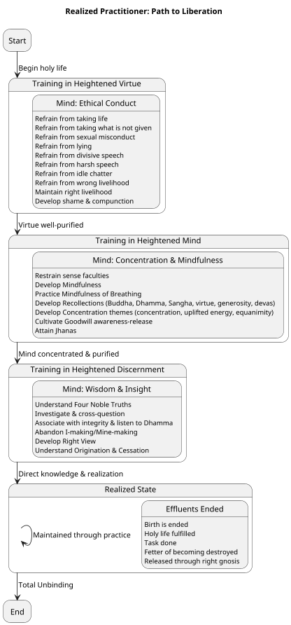
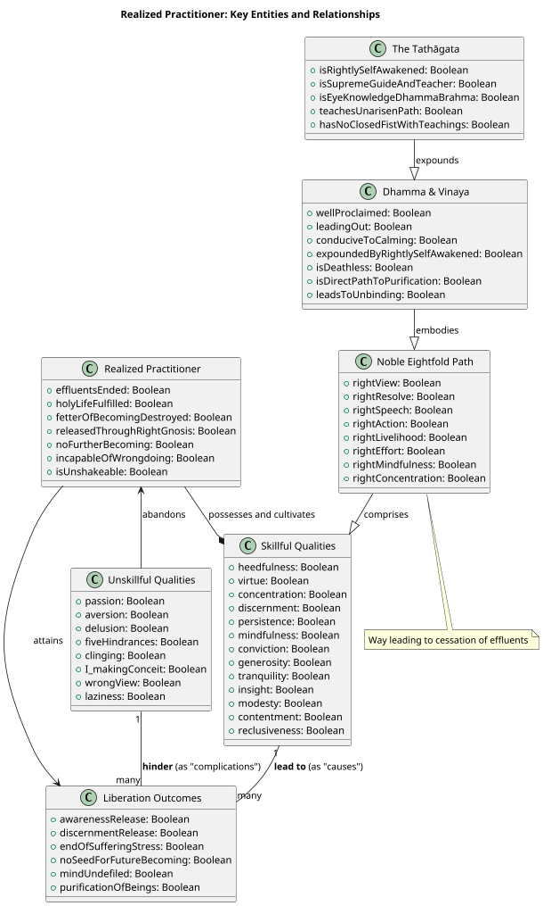

##### PART-A: Body Content
In reference to the topic "Realized" category of practitioners as defined by the Dhamma, particularly drawing on the provided sources.

###### 1. Definition
**Realized practitioners** are those who have attained the highest levels of spiritual achievement within the Dhamma and Vinaya, exemplified by **Arahants** or **Worthy Ones**. This state is characterized by:
*   **Ending of Effluents**: Their effluents are ended.
*   **Fulfillment of the Holy Life**: They have reached fulfillment, done the task, laid down the burden, and attained the true goal.
*   **Release**: They are released through right gnosis, specifically entering and remaining in **effluent-free awareness-release and discernment-release** in the here and now.
*   **Cessation of Becoming**: They have totally destroyed the fetter of becoming, putting an **end to suffering and stress**, and are not destined for future arising or birth.
*   **Unshakeable**: They are referred to as **unshakeable contemplatives**.
*   **Completion of Heedfulness**: They have completed their work with heedfulness and are **incapable of falling back**.

###### 2. Considerations
Attaining the state of a realized practitioner is the **ultimate aim of the holy life** and signifies the **supreme goal of the holy life** for which clansmen rightly go forth from home into homelessness. This state is considered the **highest here-and-now unbinding of an existing being**. The favorable impacts and benefits of this realization include:
*   **Ultimate Liberation**: It is the realization of **Unbinding (Nibbāna)**, which is the **foremost ease** and **deathless** state, characterized by the subduing of intoxication, elimination of thirst, uprooting of attachment, breaking of the round, and destruction of craving.
*   **Freedom from Defilements**: The mind is **purified and freed from hostility, ill will, undefiled, and pure**. There are no defiling mental qualities, and bright mental qualities have grown.
*   **Transcendence**: Such individuals are described as having **crossed over birth and aging** and are **unagitated from lack of clinging or sustenance**. They are also **unsmudged by good or evil**.
*   **Benefit for the World**: The appearance of such a person is **for the benefit of many, the happiness of many, in sympathy for the world**, for the welfare, benefit, and happiness of human beings and devas.
*   **Stability of Dhamma**: Their existence and adherence to the Dhamma contribute to the **stability, non-confusion, and non-disappearance of the True Dhamma**.

###### 3. Causation
###### Causes/conditions For
*   **The Noble Eightfold Path**: This is the **path that leads to the cessation of stress** and the **sole path to purity of vision**. When the noble eightfold path is ascertained in a doctrine and discipline, contemplatives of the first, second, third, and fourth order are ascertained.
*   **Abandonment of Passion, Aversion, and Delusion**: From the **fading of passion is awareness-release**, and from the **fading of ignorance is discernment-release**. The Dhamma is taught for the abandoning of these defilements.
*   **Development of Faculties**: The faculties of **conviction, persistence, mindfulness, concentration, and discernment**, when developed and pursued, lead to direct knowledge, self-awakening, and gain a footing in the deathless.
*   **Tranquility and Insight**: These two qualities are of **great help in the attainment of the cessation of perception and feeling**.
*   **Heedfulness (Appamāda)**: It is the **root of all skillful qualities** and leads to the stability of the True Dhamma.
*   **Right View**: This purges away wrong view and allows skillful qualities to culminate.
*   **Discernment of Phenomena**: Directly knowing the origination, cessation, allure, drawback, and escape from phenomena like form, feeling, perception, fabrications, and consciousness leads to disenchantment, dispassion, and cessation.
*   **Abandoning I-making and Mine-making Conceit-Obscussion**: This is a key training for achieving awareness-release and discernment-release.

###### Effects From
*   **Release from Suffering**: From the **ending of effluents** comes effluent-free awareness-release and discernment-release. Such a state leads to the declaration that "Birth is ended, the holy life fulfilled, the task done. There is nothing further for this world".
*   **No Future Becoming**: The **lack of clinging or sustenance** results in **non-agitation** and **no seed for the conditions of future birth, aging, death, or stress**. When craving is ended, all suffering and stress cease.
*   **Pure Abiding**: The realized practitioner dwells **free of hunger, unbound, cooled, sensitive to happiness, with a Brahmā-like mind**.
*   **Incapability of Wrongdoing**: Arahants are **incapable of intentional killing, stealing, sexual intercourse, deliberate lying, or consuming stored-up sensual things** as a householder.
*   **Dhamma-Stream**: The **Dhamma-stream carries one along** to higher states, even if they were initially unvirtuous or restless.

###### Other Causal Factors
*   **Kamma and Becoming**: Kamma is the field, consciousness the seed, and craving the moisture for the production of renewed becoming in the future. Greed, aversion, and delusion are **causes for the origination of actions**.
*   **Hindrances**: Beings are hindered by ignorance and fettered by craving, leading to transmigration.

###### 4. Complications
Factors that hinder or prevent one from becoming a realized practitioner include:
*   **Unskillful Mental Qualities**: **Passion, aversion, and delusion**, if not abandoned, defile the mind and prevent discernment from developing, hindering release.
*   **The Five Hindrances**: These (sensual desire, ill will, sloth and drowsiness, restlessness and anxiety, and uncertainty) are **defilements of awareness that weaken discernment**.
*   **Clinging/Sustenance (Upādāna)**: If there is any remnant of clinging-sustenance, one does not attain gnosis in the here and now, preventing full liberation. Lack of clinging is essential for mind release.
*   **I-making and Mine-making Conceit-Obscussion**: These obstruct the path to awareness-release and discernment-release.
*   **Wrong View**: Adherence to wrong views, such as those that are **unfactual, unrighteous, and blameworthy**, or views like those of the Fatalists who claim beings are purified without cause, prevents obtaining results from the holy life and can lead to lower realms.
*   **Lack of Persistence, Mindfulness, Concentration, and Discernment**: Without development of these factors, the mind will not be released from effluents.
*   **Being Burdensome**: Qualities that lead to being burdensome do not lead to being unburdensome, which is conducive to the Dhamma.
*   **Laziness and Heedlessness**: Overly slack persistence leads to laziness, and not being heedful leads to regret.

###### 5. How To
To become and remain a realized practitioner:
*   **Engage in the Noble Eightfold Path**: Follow this path diligently as it is the direct way to purify vision and put an end to suffering and stress.
*   **Abandon Unskillful Qualities and Develop Skillful Qualities**: Generate desire, endeavor, persistence, and exertion for the **non-arising and abandoning of evil, unskillful qualities** and for the **arising and development of skillful qualities**. This applies to bodily, verbal, and mental conduct.
*   **Cultivate the Three Trainings**: Focus on **heightened virtue, heightened mind (concentration), and heightened discernment**.
*   **Be Heedful (Appamāda)**: Exercise heedfulness in abandoning misconduct and developing good conduct and right view. It is the **root of all skillful qualities**. Do not be heedless to avoid regret.
*   **Practice Sense Restraint**: Guard the doors of the sense faculties by not grasping at themes or variations that would lead to unskillful qualities.
*   **Develop Mindfulness**: Remain **ardent, alert, and mindful** in focusing on the body, feelings, mind, and mental qualities. Specifically, cultivate **mindfulness of in-and-out breathing** to disperse unskillful mental qualities. Engage in the **recollection of the Buddha, Dhamma, Saṅgha, one's virtues, generosity, and devas** to straighten the mind and lead to joy, rapture, calm, and concentration.
*   **Develop Concentration (Samādhi)**: Periodically attend to **themes of concentration, uplifted energy, and equanimity** to make the mind pliant, malleable, and luminous for ending effluents. Develop **awareness-release through goodwill** to prevent ill will from overpowering the mind.
*   **Cultivate Discernment (Paññā)**: This includes **knowledge of stress, its origination, cessation, and the path to cessation** (the Four Noble Truths). Investigate and cross-question to dispel doubt. Associate with people of integrity and listen to the True Dhamma to understand what is skillful and unskillful.
*   **Cultivate Qualities of a Great Person**: Live **modestly, contentedly, reclusively, with aroused persistence, established mindfulness, a concentrated mind, and discernment**.

The consistent practice and development of these qualities lead to **direct knowledge and full comprehension**, ultimately resulting in **Unbinding** and the **ending of suffering and stress**.

---

##### PART-B: Diagrams
###### 1. PlantUML State Diagram
This diagram illustrates a high-level progression of cultivating helpful qualities, particularly focusing on the development of the mind as described in the sources, moving from foundational practices towards ultimate liberation.

###### 2. PlantUML Class Diagram
This diagram outlines the main entities involved in the development of "helpful" qualities and their relationships to unskillful qualities and resulting outcomes.

