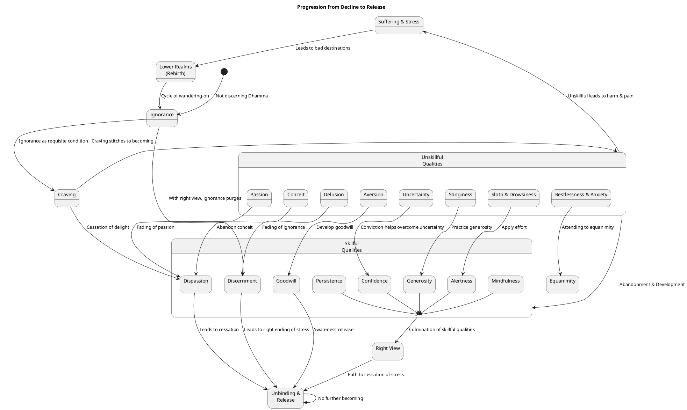

##### PART-A: Body Content
In reference to the topic "Decline" as defined by the Dhamma, particularly drawing on the provided sources.

###### 1. Definition
**"Decline"** refers to the **increase of unskillful mental qualities and the reduction or weakening of skillful mental qualities** in an individual. It encompasses states, actions, and views that lead to suffering, hindered progress on the path, and unfavorable outcomes in this life or future existences.

Examples of qualities and states associated with decline include:
*   **Defilements**: incoming defilements, passion, aversion, and delusion.
*   **Hindrances**: sensual desire, ill will, sloth & drowsiness, restlessness & anxiety, and uncertainty.
*   **Misconduct**: bad bodily, verbal, and mental conduct.
*   **Wrong View**: holding views that are unfactual, not connected to the goal, or that deny causality or moral responsibility.
*   **Lack of persistence and effort**: being lazy, having overly slack persistence, or shirking duties of solitude.
*   **Conceit**: "I-making" or "mine-making" conceit-obsession.
*   **Stinginess**: clinging to monastery, family, gains, status, or the Dhamma.
*   **Entanglement**: delighting in company, being talkative, or returning to worldly life.
*   **Discontent**: with regard to skillful qualities or one's practice.
*   **Heedlessness**: lacking diligence in abandoning misconduct and developing good conduct.

###### 2. Considerations
Engaging in qualities of decline is detrimental, leading to **suffering and stress**. Such qualities **overwhelm awareness and weaken discernment**, making it impossible to realize superior human states or the ultimate goal of unbinding.

The unfavorable impacts and losses include:
*   **Increase of suffering and stress**: Unskillful qualities are conducive to harm and pain. They lead to perpetual pain and distress.
*   **Rebirth in lower realms**: Actions stemming from unskillful qualities can lead to reappearance in a plane of deprivation, a bad destination, a lower realm, or hell.
*   **Mental defilements and hindrances**: Passion, aversion, and delusion defile the mind and prevent discernment from developing. The five hindrances overwhelm awareness and weaken discernment, making it impossible to understand one's own benefit, others' benefit, or a superior human state.
*   **Lack of progress or decline in practice**: Unskillful mental qualities increase while skillful ones decline. This results in being bewildered and unprotected, lacking desire or effort for what should or shouldn't be done. It can lead to a lack of self-awakening and unbinding, and monks may be described as continually lethargic and low in persistence.
*   **Disappearance of the True Dhamma**: If elder monks become luxurious and lax, shirk duties of solitude, and do not make effort for attainments, or if learned monks do not attentively teach discourses, the True Dhamma can become confused and disappear.
*   **Painful death**: Worry at the time of death is painful, and the Blessed One criticized being worried at the time of death. Uninstructed individuals with suspicion towards the Buddha, Dhamma, Saṅgha, or training rules experience dread, alarm, and fear of death.
*   **Weariness and disappointment**: Trying to achieve something impossible, such as drawing pictures in space, leads to weariness and disappointment.

###### 3. Causation
###### Causes/conditions For
*   **Ignorance and craving** are fundamental conditions for beings to be transmigrating and wandering on.
*   **Greed, aversion, and delusion** are **causes for the origination of actions**.
*   **Unskillful actions** (bodily, verbal, mental) lead to harm and pain.
*   **Attending to ideas unfit for attention** causes unarisen effluents (sensuality, becoming, ignorance) to arise and arisen ones to increase.
*   **Relishing, welcoming, and being fastened to forms cognizable by the eye** (and other senses/ideas) leads to delight, which then leads to the origination of suffering and stress.
*   **Assuming form, feeling, perception, fabrications, or consciousness to be self or belonging to self** leads to affliction in mind when these change, resulting in sorrow, lamentation, pain, distress, and despair.
*   **Falling back on past deeds or lack of cause/condition as essential** leads to no desire or effort to do what should or shouldn't be done, leaving one bewildered and unprotected.
*   **Overly slack persistence** leads to laziness, while **over-aroused persistence** leads to restlessness.
*   **Not discerning the allure, drawback, and escape from qualities** prevents genuine comprehension of them.
*   **Speaking unendearing and disagreeable words** can upset and disgruntle others.
*   **Not asking about skillful and unskillful qualities** when visiting a contemplative or brahman leads to stupidity.
*   **Not listening when discourses of the Tathāgata are recited**, and instead listening to literary works of poets, leads to the decline of the Dhamma.
*   **Neglecting the seven factors for awakening** leads to the neglect of the noble path.
*   **Dullness and exceeding stupidity**, along with fear of clinging or interrogation, can cause one to resort to verbal contortions or "eel-wriggling" when asked questions.
*   **Stinginess** is an impurity that leads to an ill destination.

###### Effects From
*   **Passion, aversion, and delusion** defile the mind and prevent its release.
*   **Hindrances** (sensual desire, ill will, sloth & drowsiness, restlessness & anxiety, uncertainty) **overwhelm awareness and weaken discernment**, making it impossible to realize higher human states.
*   **Unskillful qualities** lead to harm and pain.
*   **Craving** is described as the "seamstress" that stitches one to the production of becoming, which then leads to suffering and stress.
*   **Ignoring the four noble truths** leads to reveling in fabrications that produce more birth, aging, death, sorrow, lamentation, pain, distress, and despair.
*   **Conceit 'I am'** can be an obsession that, if not abandoned, contributes to continued suffering.
*   **Wrong view** establishes animosity and, for one with wrong view, leads to destinations like hell or animal wombs.
*   **Lethargy and low persistence** result from a lack of ardency and compunction.
*   **Unskillful actions** cause the growth of effluents.
*   **Lack of discernment** means one doesn't discern stress, its origination, cessation, or the path to its cessation.
*   **Slandering the Blessed One** or misrepresenting his teachings can lead to much demerit.
*   **Not developing mindfulness, not knowing moderation in food, and not being devoted to wakefulness** can lead to a monk's following falling apart.

###### Other Causal Factors
*   A **poorly proclaimed Dhamma-Vinaya** is described as not leading out, not conducive to calming, and having a broken foundation, which can lead to practitioners producing much demerit.
*   The **arising of a counterfeit of the true Dhamma** leads to the disappearance of the true Dhamma.
*   **Contact** is the origination point for feelings, intentions, and perceptions, which themselves are inconstant and changeable. Desire-passion with regard to these contacts defiles the mind.

###### 4. Complications
Decline manifests in the training process when practitioners exhibit qualities that are counter to the Noble Eightfold Path and other skillful practices. This hinders progress towards liberation and keeps one entangled in the cycle of suffering.

*   **Hindering Mental Cultivation**:
    *   **Sensual desire, ill will, sloth & drowsiness, restlessness & anxiety, and uncertainty** act as **obstacles that overwhelm awareness and weaken discernment**, making it impossible to realize superior human states or the four jhānas. These prevent the mind from becoming pliant, malleable, and luminous.
    *   **Conceit ('I am')** obsesses the mind and must be abandoned to progress towards release.
    *   **Unconcentrated mind** and **muddled mindfulness** are hindrances to the development of higher states.
    *   **Laziness** and **lack of aroused persistence** prevent the necessary effort for attainments. Overly slack persistence leads to laziness.
    *   **Entanglement** (with people, conversations, etc.) prevents reclusiveness and can lead to lust invading the mind and reverting to a lower life.
    *   **Not guarding the sense faculties** and **not knowing moderation in food** are signs of decline for monks, leading to a falling apart of their discipline and following.
    *   **Not cultivating equanimity** by attending solely to concentration or uplifted energy can lead to laziness or restlessness, and prevent right concentration for ending effluents.
*   **Impeding Realization of Arising & Passing Away**:
    *   An **uninstructed run-of-the-mill person** does not discern the luminous mind as it has come to be, leading to no development of the mind. They assume the five clinging-aggregates (form, feeling, perception, fabrications, consciousness) to be self or belonging to self, leading to sorrow and despair when these change.
    *   **Lack of discernment** means one does not know or see stress, its origination, cessation, or the path to its cessation. This inability to discern is a fundamental barrier to the ending of suffering.
    *   **Not comprehending the allure, drawback, and escape** from phenomena (like forms, feelings, or the six media of contact) means one cannot genuinely understand or achieve release from them.
    *   **Delighting in senses** and **relishing, welcoming, or being fastened to them** directly leads to the origination of suffering and stress, preventing release.
    *   **Wrong views on causality** (e.g., pain being self-made, other-made, both, or spontaneous) demonstrate a lack of right discernment and prevent an understanding of how to end suffering.

###### 5. How To
To prevent and reverse decline, and cultivate the conditions for favorable outcomes:
*   **Abandon what is unskillful** because it is possible and conducive to benefit and pleasure to do so. This includes abandoning **bodily, verbal, and mental misconduct**, as well as **wrong view**.
*   **Develop what is skillful**, as it is conducive to benefit and pleasure. All skillful qualities are rooted in and converge in **heedfulness**, which is considered foremost.
*   **Cultivate discernment** through **knowledge of stress, its origination, cessation, and the path** leading to its cessation (Right View). This purges away wrong view and develops skillful qualities.
*   **Practice with unrelenting exertion and persistence**, even if it means letting the flesh and blood dry up. Avoid overly slack or over-aroused persistence.
*   **Guard the sense faculties** by not grasping at themes that lead to unskillful qualities and by knowing moderation in eating.
*   **Develop mindfulness (sati)** by being ardent, alert, and mindful when focusing on the body, feelings, mind, and mental qualities. Specifically, **mindfulness of in-&-out breathing** can immediately disperse and allay unskillful mental qualities.
*   **Cultivate concentration (samādhi)** by periodically attending to **themes of concentration, uplifted energy, and equanimity**. This makes the mind pliant, malleable, luminous, and rightly concentrated for ending effluents.
*   **Recollect the Buddha, Dhamma, Saṅgha, one's virtues, generosity, and devas** to cleanse the mind, calm it, make it straight, and give rise to joy, rapture, calm, and concentration.
*   **Associate with admirable people, friends, companions, and colleagues** (people of integrity). **Listen to the True Dhamma** from them, which helps in remembering and penetrating its meaning, leading to willingness and desire for contemplation.
*   **Practice the Dhamma in accordance with the Dhamma**, understanding its meaning and not just its words. The Dhamma is compared to a raft, for crossing over, not for holding onto.
*   **Practice modesty, contentment, and reclusiveness**.
*   **Cultivate goodwill as an awareness-release** to prevent ill will from overpowering the mind.
*   **Reflect on one's own failings and attainments**, as well as those of others.

The ultimate aim of these practices is to **put an end to suffering and stress**, reach **unbinding**, and realize **gnosis** in the here and now.

--------------------------------------------------------------------------------

##### PART-B: Diagrams
###### 1. PlantUML State Diagram
This diagram illustrates the progression from states of decline towards states of skillful qualities, focusing on how different unskillful mental qualities are replaced or overcome by their skillful counterparts, moving towards the ultimate state of release.



###### 2. PlantUML Class Diagram
This diagram outlines the main entities involved in the concept of "Decline," illustrating the relationships between various unskillful qualities, their impact on practitioners, and the resulting negative outcomes.

```plantuml
@startuml <model-id> <generation-date>
title Decline Qualities and Their Impact

class UnskillfulQualities {
    - Passion
    - Aversion
    - Delusion
    - Sloth_Drowsiness
    - Restlessness_Anxiety
    - Uncertainty
    - Conceit
    - Stinginess
    - WrongView
    - Laziness
    - Discontent
    - Entanglement
    - Misconduct
    - Heedlessness
}

class Practitioner {
    + Awareness
    + Discernment
    + Persistence
    + Mindfulness
    + SenseFaculties
    + Virtues
    + Progress
}

class Outcomes {
    - Suffering_Stress
    - Harm_Pain
    - Rebirth_LowerRealms
    - HinderedProgress
    - DhammaDecline
    - PainfulDeath
}

UnskillfulQualities "1" -- "Many" Practitioner : leads_to_presence_in
Practitioner "1" -- "1" Awareness : has
Practitioner "1" -- "1" Discernment : has
UnskillfulQualities "1" -- "*" Outcomes : causes
UnskillfulQualities "Passion" -- Practitioner : defiles_mind
UnskillfulQualities "Aversion" -- Practitioner : defiles_mind
UnskillfulQualities "Delusion" -- Practitioner : defiles_mind

UnskillfulQualities "Sloth_Drowsiness" ..> Practitioner : overwhelms_awareness_weakens_discernment
UnskillfulQualities "Restlessness_Anxiety" ..> Practitioner : overwhelms_awareness_weakens_discernment
UnskillfulQualities "Uncertainty" ..> Practitioner : overwhelms_awareness_weakens_discernment

UnskillfulQualities "Conceit" ..> Practitioner : obsesses_mind
UnskillfulQualities "WrongView" ..> Practitioner : impedes_progress
UnskillfulQualities "Misconduct" ..> Practitioner : leads_to_harm
UnskillfulQualities "Laziness" ..> Practitioner : reduces_persistence

Outcomes "Suffering_Stress" <-- UnskillfulQualities : results_from
Outcomes "Rebirth_LowerRealms" <-- UnskillfulQualities : results_from
Outcomes "HinderedProgress" <-- UnskillfulQualities : results_from
Outcomes "DhammaDecline" <-- UnskillfulQualities : results_from

Practitioner "1" -- "1" Progress : has_status
Progress <|-- Outcomes "HinderedProgress"
Progress <|-- Outcomes "DhammaDecline"

class SkillfulQualities {
    + Discernment_Development
    + Sense_Restraint
    + Mindfulness_Development
    + Concentration_Development
    + Persistence_Arousal
    + Virtue_Cultivation
    + Heedfulness_Practice
    + Association_Integrity
}

SkillfulQualities "1" -- "Many" Practitioner
SkillfulQualities "Discernment_Development" <--> Practitioner : counteracts_Delusion
SkillfulQualities "Persistence_Arousal" <--> Practitioner : counteracts_Laziness

Practitioner -- SkillfulQualities : develops

@enduml
```