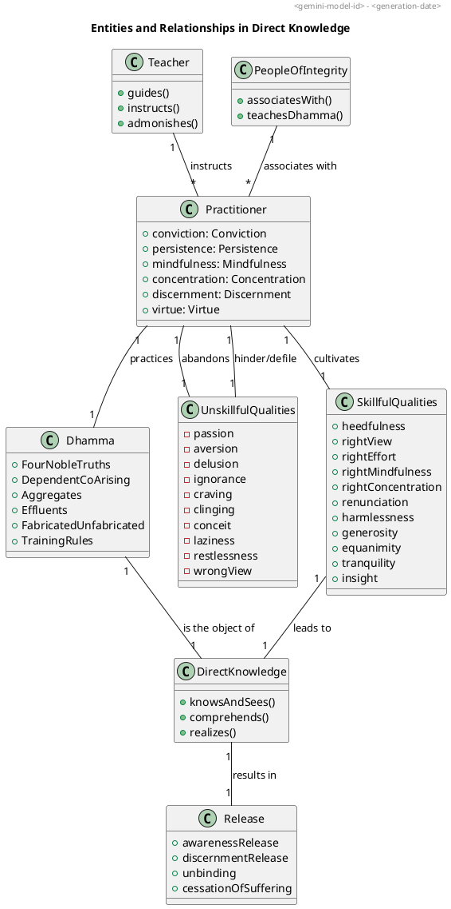

### PART-A: Body Content
In reference to the topic "Directly Known" qualities as defined by the Dhamma, particularly drawing on the provided sources.

#### 1. Definition
**"Directly Known" (abhiññā)** refers to the **direct experience and profound understanding** of phenomena as they truly are. It signifies **knowing and seeing (ñāṇa-dassana)** and the **realization (sacchikaraṇa)** and **breaking through (pativedha)** to previously unknown, unseen, or unrealized truths. This direct knowledge is essential for the **ending of effluents (āsavakkhaya)**.

Qualities and phenomena explicitly stated to be "directly known" in the sources include:
*   **All beings are maintained by nutriment**.
*   **Stress, its origination, cessation, and the path of practice leading to its cessation** (the Four Noble Truths).
*   **Effluents, their origination, cessation, and the path of practice leading to their cessation**.
*   The **fabricated property and the unfabricated property**.
*   **Form, feeling, perception, fabrications, and consciousness** (the Five Aggregates), along with their **origination, cessation, allure, drawback, and escape**.
*   **Kamma (actions)**.
*   **Six properties, six media of sensory contact, and eighteen explorations for the intellect**.
*   **Unbinding (Nibbāna) and Release (Vimutti)**.

#### 2. Considerations
The attainment of "direct knowledge" is crucial for the **purification of beings, the overcoming of sorrow and lamentation, the disappearance of pain and distress, the attainment of the right method, and the realization of unbinding**. It secures **benefit in this life and in lives to come**.

The favorable impacts and benefits of attaining direct knowledge include:
*   The **ending of suffering and stress**.
*   **Realization of Unbinding and Release**, including **effluent-free awareness-release and discernment-release**.
*   **Cutting through craving and ripping off fetters**.
*   Leading to **disenchantment, dispassion, and cessation**.
*   The **development and culmination of discernment**.
*   **Purification of vision**.
*   The cessation of I-making or mine-making conceit-obsession.
*   No longer being fooled, cheated, or deceived by the mind.
*   **Overcoming perplexity and doubt**.
*   Attaining **fearlessness and independence** from others regarding the Teacher's message.
*   Contributing to the **stability, non-confusion, and non-disappearance of the True Dhamma**.
*   **Crossing over birth and aging**.
*   Attaining stages of liberation such as stream-entry, once-returning, non-returning, or arahantship.
*   Direct knowledge of the Dhamma's regularity precedes the knowledge of unbinding.

#### 3. Causation
##### Causes/conditions For
*   **Well-purified virtue and views made straight**.
*   Having **admirable people as friends, companions, and colleagues**.
*   **Hearing the True Dhamma**.
*   **Lending ear**.
*   Applying one's mind to gnosis.
*   **Practicing the Dhamma in accordance with the Dhamma**.
*   **Developing conviction, persistence, mindfulness, concentration, and discernment**.
*   **Developing the four establishings of mindfulness**.
*   Developing the seven factors for awakening.
*   **Right view**.
*   **Abandoning effluents**.
*   **Abandoning passion, aversion, and delusion**.
*   Developing tranquility and insight.
*   Developing **awareness-release through goodwill**.
*   Responding to the Teacher's instruction and admonition.
*   **Scrutiny of phenomena** (e.g., form, feeling, perception, fabrications, consciousness) and their **origination, cessation, allure, drawback, and escape**.
*   Investigation of conditions for future birth, aging, death, or stress.
*   **Appropriate attention**.
*   Cultivating disenchantment, dispassion, and cessation.
*   Being carried along by the **Dhamma-stream**.
*   Rightly practicing the holy life for direct knowledge and full comprehension.
*   Experiencing the Dhamma directly.
*   **Knowing both sides and not adhering in between**.
*   Fathoming the high and low in the world.
*   **Abandoning sensual desires, unhappiness, sloth, and anxieties**, and purifying equanimity and mindfulness through inspection of mental qualities.
*   Being **astute** (persistence aroused for abandoning unskillful qualities and taking on skillful qualities) and **consummate in one's backing** (asking questions of learned monks).
*   Having an **undivided mind, best of resolves, and practicing Dhamma in line with Dhamma**.

##### Effects From
*   The **ending of effluents**.
*   **Awareness-release and discernment-release**.
*   The **end of suffering and stress**.
*   Cutting through craving and ripping off the fetter.
*   **Disenchantment, dispassion, and cessation**.
*   Purification of beings.
*   Freedom from thirst and a mind inwardly at peace.
*   **No I-making or mine-making conceit-obsession**.
*   No longer being fooled, cheated, or deceived by the mind.
*   **Wisdom/discernment develops and culminates**.
*   **Purity of vision**.
*   **Crossing over birth and aging**.
*   Attaining **gnosis in the here-and-now**.
*   Progressing through the stages of noble discipleship (stream-winner, once-returner, non-returner, arahant).
*   The **knowledge of the regularity of the Dhamma precedes the knowledge of unbinding**.

##### Other Causal Factors (hindering direct knowledge)
*   **Defiled mind**.
*   **Incoming defilements**.
*   **Passion, aversion, and delusion**.
*   **Ignorance**.
*   **Conceit-obsession (I-making, mine-making)**.
*   **Laziness and heedlessness**.
*   **Restlessness**.
*   **Unconcentrated mind**.
*   **Weak discernment**.
*   **Being an uninstructed run-of-the-mill person**.
*   **Not guarding the doors of the senses**, lack of moderation in eating, not being devoted to wakefulness, or lacking mindfulness and alertness.
*   **Craving**.
*   **Clinging**.
*   Animosity or ill will.
*   **Wrong view**.
*   Self-identification view.
*   Not having conviction in the Teacher's message.

#### 4. Complications
Failure to achieve "direct knowledge" or neglecting the qualities to be "directly known" results in:
*   **No development of the mind**.
*   The mind remaining unreleased and **discernment not developing**.
*   The **continuation of suffering and stress**.
*   **Perpetuation of becoming, birth, aging, and death**.
*   **Lingering ignorance**.
*   The mind being **overcome with passion, aversion, and delusion**.
*   The mind not heading straight.
*   No arising of joy, rapture, calm, or concentration.
*   Lack of conviction, persistence, mindfulness, concentration, and discernment.
*   Not attaining gnosis in the here-and-now (specifically for the cessation of perception and feeling).
*   **Long-term harm and suffering** for those who criticize or misunderstand the Dhamma without direct knowledge.
*   Not being considered a true contemplative or brahman among others.
*   **Incapacity to touch superlative self-awakening**.
*   Remaining "unpurified" and "not released from stress," similar to other sectarians.
*   The body and mind remaining afflicted.
*   Persistence of wrong view.
*   Persistence of self-identification view.

#### 5. How To
To attain and cultivate "Directly Known" qualities and phenomena:
*   **Practice the Dhamma in accordance with the Dhamma**.
*   **Cultivate virtue, concentration, and discernment** as central to the holy life, aiming for direct knowledge and full comprehension.
*   Develop **persistence, mindfulness, and concentration**.
*   Attend periodically to themes of **concentration, uplifted energy, and equanimity**.
*   **Abandon unskillful qualities and take on skillful qualities**.
*   Develop the **four establishings of mindfulness**.
*   Develop the **seven factors for awakening**.
*   **Scrutinize the origination, cessation, allure, drawback, and escape of phenomena** (e.g., aging and death, acquisition, becoming, birth, clinging, feeling, contact, six sense media, name-&-form, consciousness, fabrications, ignorance, effluents, form).
*   Investigate for the total right ending of suffering and stress.
*   Practice **non-agitation from lack of clinging or sustenance** by ensuring consciousness is neither externally scattered nor internally positioned.
*   **Practice the noble eightfold path**.
*   **Hear the True Dhamma**.
*   **Associate with people of integrity**.
*   Go for **refuge in the Buddha, Dhamma, and Saṅgha**.
*   Undertake training rules (virtue).
*   **Recollect the Buddha, Dhamma, Saṅgha, one's virtues, generosity, and devas** to straighten the mind and bring joy, rapture, calm, and concentration.
*   Develop the **perception of inconstancy**.
*   **Guard the doors of the senses** by not grasping at themes that lead to unskillful qualities.
*   Practice **mindfulness of in-and-out breathing** to disperse unskillful qualities.
*   Reflect on the impermanence of self-related notions: **'It should not be, it should not be mine; it will not be, it will not be mine'**.
*   Live modestly, contentedly, reclusively, with aroused persistence, established mindfulness, a concentrated mind, and discernment.

The ultimate aim of these practices is to **know the goal and experience the Dhamma, leading to bliss**, and to **put an end to suffering and stress**.

---

### PART-B: Diagrams
#### 1. PlantUML State Diagram
This diagram illustrates the progression towards "Directly Known" states, highlighting the central role of the Dhamma and its relationship to the practitioner's mental states and the ultimate goal of liberation.

```plantuml
@startuml
!pragma layout smetana
title "Progression to Direct Knowledge and Release"
header <gemini-model-id> - <generation-date>

[*] --> "Uninstructed Person" as Uninstructed

state "Uninstructed Person" as Uninstructed {
    state "Ignorance & Defilements" as IgnoranceDefilements
    state "Craving & Clinging" as CravingClinging
    state "Cycle of Becoming" as CycleOfBecoming
    state "Lack of Development" as LackOfDevelopment

    Uninstructed --> IgnoranceDefilements
    IgnoranceDefilements --> CravingClinging : "causes"
    CravingClinging --> CycleOfBecoming : "leads to"
    CycleOfBecoming --> LackOfDevelopment : "results in"
    LackOfDevelopment --> IgnoranceDefilements : "perpetuates"
}

Uninstructed --> "Seeking Dhamma" as SeekingDhamma : "Arousal to Practice"

state "Seeking Dhamma" as SeekingDhamma {
    state "Associating with Integrity" as AssociateIntegrity
    state "Hearing True Dhamma" as HearTrueDhamma
    state "Developing Conviction" as DevelopConviction

    SeekingDhamma --> AssociateIntegrity
    AssociateIntegrity --> HearTrueDhamma : "leads to"
    HearTrueDhamma --> DevelopConviction : "leads to"
    DevelopConviction --> "Practicing Dhamma" as PracticeDhamma : "fosters persistence"
}

state "Practicing Dhamma" as PracticeDhamma {
    state "Cultivating Virtue" as CultivateVirtue
    state "Developing Concentration" as DevelopConcentration
    state "Developing Discernment" as DevelopDiscernment
    state "Mindfulness & Persistence" as MindfulnessPersistence

    PracticeDhamma --> CultivateVirtue
    CultivateVirtue --> DevelopConcentration : "provides basis"
    DevelopConcentration --> DevelopDiscernment : "supports"
    DevelopDiscernment --> MindfulnessPersistence : "informed by"
    MindfulnessPersistence --> CultivateVirtue : "reinforces"
}

PracticeDhamma --> "Direct Knowledge" as DirectKnowledge : "through diligent effort"

state "Direct Knowledge" as DirectKnowledge {
    state "Knowledge of Four Noble Truths" as FourNobleTruths
    state "Knowledge of Effluents" as EffluentsKnowledge
    state "Knowledge of Fabricated & Unfabricated" as FabricatedUnfabricated
    state "Knowledge of Aggregates" as AggregatesKnowledge

    DirectKnowledge --> FourNobleTruths
    FourNobleTruths --> EffluentsKnowledge
    EffluentsKnowledge --> FabricatedUnfabricated
    FabricatedUnfabricated --> AggregatesKnowledge
    AggregatesKnowledge --> FourNobleTruths : "interconnected"
}

DirectKnowledge --> "Awareness-Release & Discernment-Release" as Release : "leads to"

state "Awareness-Release & Discernment-Release" as Release {
    state "Ending of Suffering & Stress" as EndingSuffering
    state "Unbinding (Nibbana)" as Unbinding
    state "No Further Becoming" as NoBecoming

    Release --> EndingSuffering
    EndingSuffering --> Unbinding
    Unbinding --> NoBecoming
}

Release --> [*]

@enduml
```

#### 2. PlantUML Class Diagram

This diagram outlines the main entities involved in the process of achieving "Directly Known" qualities and their relationships.

