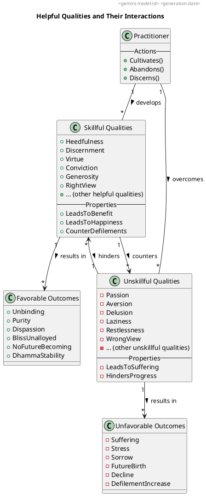

### PART-A: Body Content
In reference to the topic "Helpful" qualities as defined by the Dhamma, particularly drawing on the provided sources.

#### 1. Definition
**"Helpful" qualities** are those that are **conducive to benefit (hita) and happiness (sukha)** for oneself and others. This category includes qualities that align with the **Dhamma and Vinaya (discipline)** and are explicitly taught by the **Tathāgata** as clear and beneficial. They are **connected with the goal (attha) and fundamental to the holy life (brahmacariya)**.

Examples of qualities frequently described as helpful or leading to beneficial outcomes in the sources include:
*   **Heedfulness (Appamāda)**, which is considered the **root of all skillful qualities**.
*   **Discernment (Paññā)**, which is the **treasure of human beings** and leads to the arising of the goal.
*   **Virtue (Sīla)**, described as **good all the way through old age**.
*   **Conviction (Saddhā)**, which is **good when established**.
*   **Generosity (Cāga)**, characterized as being **freely generous and openhanded**.
*   **Right View (Sammā Diṭṭhi)**, identified as the **forerunner of the path**.
*   **Right Effort (Sammā Vāyāma)**, involving **aroused persistence, steadfast and solid in effort**.
*   **Right Mindfulness (Sammā Sati)**, being **highly meticulous and remembering**.
*   **Right Concentration (Sammā Samādhi)**, which leads to the mind becoming **pliant, malleable, and luminous**.
*   **Goodwill (Mettā)**, which, when developed, is described as an **awareness-release**.
*   **Associating with people of integrity** and **listening to the True Dhamma**.
*   **Practicing the Dhamma in accordance with the Dhamma**.

#### 2. Considerations
Engaging with "helpful" qualities is paramount for the **purification of beings, overcoming sorrow and lamentation, disappearing pain and distress, attaining the right method, and realizing unbinding**. These qualities secure **benefit in this life and in lives to come**, often leading to **rebirth in good destinations or heavenly worlds**. The holy life itself is lived for the ultimate purpose of **direct knowledge and full comprehension**.

The favorable impacts and benefits include:
*   **Gaining a sense of the goal and the Dhamma**, which gives rise to **joy, rapture, calm, and concentration**.
*   Leading to **dispassion, cessation, and liberation from suffering and stress**. This involves the **ending of effluents** and the attainment of **effluent-free awareness-release and discernment-release**.
*   **Making the mind pliant, malleable, luminous, and not brittle**, allowing it to be **rightly concentrated for ending effluents**.
*   **Increasing one's virtue, concentration, discernment, release, and knowledge & vision of release**, and enabling one to **encourage others** in these qualities.
*   Contributing to the **stability, non-confusion, and non-disappearance of the True Dhamma**.
*   **Protecting against various dangers and defilements**, such as Māra's realm, and counteracting passion, aversion, and delusion.
*   Enabling one to **"cross over birth and aging"** by being at peace, with vices evaporated, undesiring, and untroubled.
*   **Amassing much merit and helping the True Dhamma to remain**.

#### 3. Causation
##### Causes/conditions For
*   **Heedfulness** serves as the **root of all skillful qualities**.
*   **Conviction** (in the Buddha, Dhamma, and Saṅgha) leads to **visiting** teachers and companions and fosters **persistence**.
*   **Listening to the True Dhamma** is a condition for **learning**, which in turn leads to **discernment**.
*   The **discernment of Dhamma** (dialogues, narratives, etc.) makes one **"one with a sense of Dhamma"**.
*   **Appropriate attention** is a cause for **distinction**.
*   **Recollecting the Tathāgata, Dhamma, Saṅgha, one's virtues, generosity, and devas** causes the mind to become **cleansed, calmed, straight, joyful, leading to rapture, calm body, ease, and concentration**.
*   **Aroused persistence, established mindfulness, and discernment** are prerequisites for **further developing qualities** such as the six recollections.
*   **Tranquility and insight** are significantly helpful in the **attainment of the cessation of perception & feeling**.
*   The **Dhamma-stream** carries one along toward higher states, even if one is initially unvirtuous or restless.

##### Effects From
*   From the **increase of skillful qualities** comes **fruitful habit and practice**.
*   From **developing generosity, a life in tune, and goodwill** comes reappearance in a **world of bliss unalloyed**.
*   From **right view** comes the **purging away of wrong view**, and **skillful qualities go to culmination**.
*   From **disenchantment** comes **dispassion**, which leads to **cessation, stilling, direct knowledge, self-awakening, and unbinding**.
*   From the **lack of clinging or sustenance** comes **non-agitation** and **no seed for the conditions of future birth, aging, death, or stress**.
*   From **abandoning passion, aversion, and delusion** comes **purification and release**.
*   From **practicing the Dhamma in accordance with the Dhamma** comes **knowing freedom from disease and seeing unbinding**.
*   From **developing mindfulness of in-&amp;-out breathing** comes a **peaceful & exquisite, refreshing & pleasant abiding that immediately disperses & allays any evil, unskillful (mental) qualities**.

##### Other Causal Factors
*   **Greed, aversion, and delusion** are **causes for the origination of actions**.
*   **Inappropriate attention** leads to **decline** in skillful qualities.
*   **Clinging (upadana)** is the **origination of stress**.
*   **Ignorance (avijjā)** is a **requisite condition for fabrications**.
*   **Not discerning the allure, drawbacks, and escape** from phenomena leads to **obsession** [476, 477, Conversation History].

#### 4. Complications
Difficulties in cultivating "helpful" qualities arise from the presence and increase of **unskillful qualities**. These complications include:
*   **Passion, aversion, and delusion**, which are roots of unskillful actions, defile the mind, and impede development. They lead to **self-detriment, detriment of others, and mental stress & sorrow**.
*   **Inappropriate attention** which contributes to decline.
*   **Conceit 'I am' (ahaṅkāra)**, which should be abandoned to progress on the path.
*   **Laziness (kosajja)** and **overly slack persistence**, which prevent proper concentration and progress.
*   **Restlessness (uddhacca)** and **over-aroused persistence**, which also hinder concentration.
*   **Uncertainty (vicikicchā)** and **muddled mindfulness**, which overwhelm awareness and weaken discernment.
*   **Self-aggrandizement, discontent, entanglement, and being burdensome** are qualities that contradict modesty, contentment, reclusiveness, or being unburdensome, respectively, and are not part of the Dhamma.
*   **Wrong view (micchā diṭṭhi)** hinders the attainment of results from the holy life.
*   **Not discerning the allure, drawbacks, and escape** from qualities prevents genuine comprehension [476, 477, Conversation History].
*   **Misrepresenting the Blessed One** or His teachings with unfactual statements.

Such complications are described as preventing the **purification of vision**, leading to **suffering and stress**, and causing **effluents to grow**.

#### 5. How To
To cultivate and attend to "helpful" qualities for favorable outcomes:
*   **Train yourself in the Dhamma** by making efforts to **abandon unskillful qualities and take on skillful qualities**. This applies to one's bodily, verbal, and mental conduct.
*   **Develop virtue, concentration, and discernment** as central to the holy life, aiming for **direct knowledge and full comprehension**.
*   **Be heedful (appamāda)**, as it is the **root of all skillful qualities**. This includes guarding the mind regarding defilements and preventing regret.
*   **Cultivate conviction** by **recollecting the qualities of the Buddha, Dhamma, and Saṅgha**. This practice helps to straighten the mind, bringing joy, rapture, calm, and concentration.
*   **Practice sense restraint** by not grasping at themes that lead to unskillful qualities and by **guarding the doors of the senses**.
*   **Develop mindfulness** by remaining **ardent, alert, & mindful** in focusing on the body, feelings, mind, and mental qualities. Specifically, practice **mindfulness of in-&amp;-out breathing** to disperse unskillful qualities.
*   **Develop concentration (samādhi)** by attending periodically to **themes of concentration, uplifted energy, and equanimity** to make the mind pliant and luminous for ending effluents.
*   **Cultivate discernment (paññā)** through the **knowledge of the Four Noble Truths**, which involves discerning stress, its origination, cessation, and the path to cessation.
*   **Associate with people of integrity (kalyāṇamitta)** and **listen to the True Dhamma**. This helps one to understand what is skillful and unskillful.
*   **Practice the Dhamma in accordance with the Dhamma** to directly know and see freedom from disease and unbinding.
*   **Live modestly, contentedly, reclusively, with aroused persistence, established mindfulness, a concentrated mind, and discernment**.
*   **Cultivate awareness-release through goodwill** to overcome ill will.

The ultimate aim of these practices is to **know the goal and experience the Dhamma, leading to bliss**, and to **put an end to suffering & stress**.

---

### PART-B: Diagrams

#### 1. PlantUML State Diagram
This diagram illustrates a high-level progression of cultivating helpful qualities, particularly focusing on the development of the mind as described in the sources, moving from foundational practices towards ultimate liberation.

```plantuml
@startuml
title "Path of Cultivating Helpful Qualities"
header <gemini-model-id> <generation-date>

[*] --> "Cultivating Foundation\n(Conviction, Virtue, Heedfulness)" as Foundation

Foundation --> "Developing Recollections\n(Buddha, Dhamma, Saṅgha, etc.)" as Recollections

Recollections --> "Purifying the Mind\n(Joy, Rapture, Calm, Concentration)" as MindPurity

MindPurity --> "Realizing Insight\n(Discernment, Direct Knowledge)" as Insight

Insight --> "Attaining Unbinding\n(Freedom from suffering & stress)" as Unbinding

Unbinding --> [*]

@enduml
```

#### 2. PlantUML Class Diagram
This diagram outlines the main entities involved in the development of "helpful" qualities and their relationships to unskillful qualities and resulting outcomes.



---

**Notes for Template Usage:**
1.  Focus on the topic's primary subject matter but ensure that all accompanying qualities from the topic are given some coverage.
2.  Use sub-headings & lists over large body paragraphs to make the content easier to navigate and consume.
3.  Provide "no more than two citations" per key point.
4.  All causation related querying should use the saved note "Causation Expressions: A Reference Guide" to search the source texts using key causal identifiers as a guide.
5.  Sections 3 & 4 should be key contributors to shaping the State diagram in PART-B.
6.  Use `guide_*.md` sources to help with prompt/query execution but do not use as sources for citation.