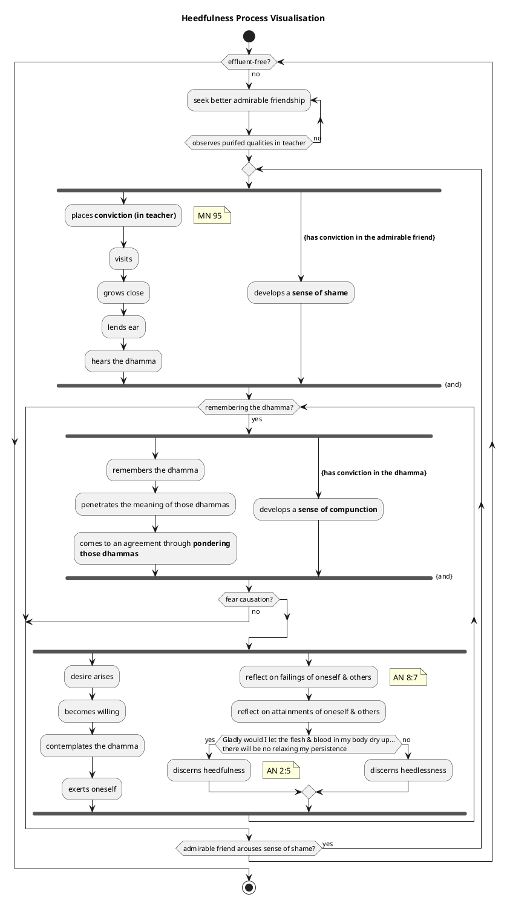
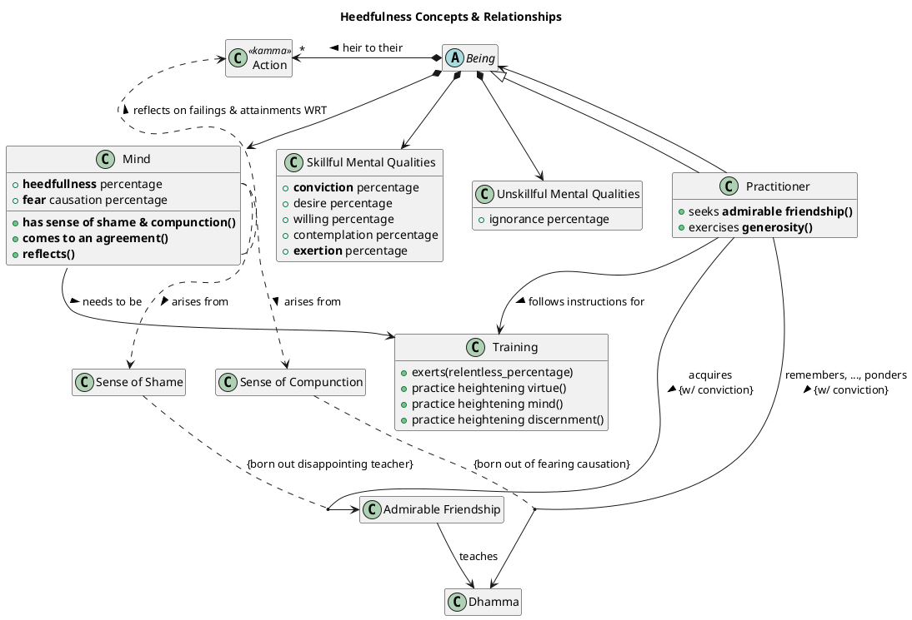
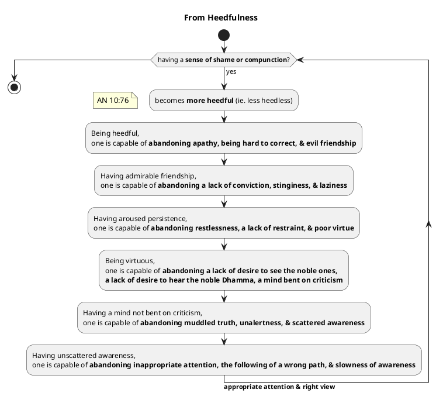
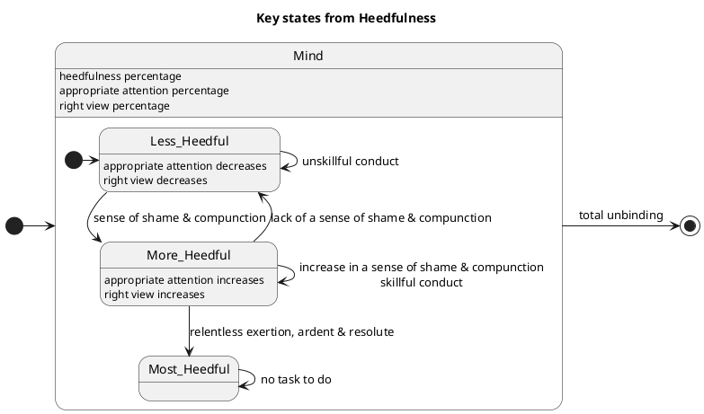

**NotebookLM Context**:
* **Background**: in DN 34 there are 100 Dhammas presented in a "progressing by tens" framework. these Dhammas are highly tailored for attaining unbinding, putting an end to suffering & stress, and releasing from all ties. these 100 Dhammas are in fact patterns, that is, they are well established solutions to known problems that practitioners face whilst in training. this project is a Dhamma practitioner's pattern language of the "progressing by tens" framework

* **Purpose**: to generate one pattern in the pattern language in markdown format which will be user-saved. this source document is a parameterised template with instructions for generating one of those Dhammas patterns. the parameters are defined in the "User Tasks" section below

* **File maming & directory structure**: the "progressing by tens" framework uses an index (ie. starting from 'ones' up to 'tens') and a category (ie. starting from 'helpful' to 'realised') classification scheme as its organisational structure. this project will thus persist each pattern using the category as the filename and index as the directory structure as follows:
    // individual category files (ie. patterns) in index directories
    ./ones/helpful.md
    ./ones/developed.md
    ./ones/comprehended.md
    ./ones/abandoned.md
    ./ones/decline.md
    ./ones/distinction.md
    ./ones/penetrate.md
    ./ones/made-to-arise.md
    ./ones/directly-known.md
    ./ones/realised.md
    ./twos/helpful.md
    ...
    // index catalogs
    ./catalog/1s-index.md
    ./catalog/2s-index.md
    ...
    // catagory catalogs
    ./catalog/helpful-index.md
    ./catalog/developed-index.md
    ...
    // user/practitioner catalogs
    ./catalog/user-conviction-dhamma-follower-index.md
    ./catalog/user-stream-enterer-index.md
    ./catalog/user-once-returner-index.md
    ./catalog/user-non-returner-index.md

* **Pattern names**: Shortened names for all 100 patterns are documented in the source "DN34-param-pattern-request-config.json.txt". this is a json file with each category represented in lower with its corresponding array of 10 pattern names (eg. json["pattern-names"]["developed"][7] is 'Noble eightfold path' as the intended pattern name). 

**User Tasks**:
* Submit the pattern generation request query to NotebookLM by specifying the following parameters:
    1. <paramIndexCategoryQuestion>: string
        This must be an exact index/catagory match as found in the DN 34 "progressing by tens" framework
    3. <paramIndexValue>: number [1-10]
        This is the numeric value of the progression index in reference to the question
    5. <paramCategoryOrder>: number [0-9]
        This is the zero based numeric value of the category in reference to the question 

* Example User Query:
    Using the source "param-DN34-pattern-request.md" as the template & instructions for this query's response, generate the pattern using the following user parameters:
    1. paramIndexCategoryQuestion="Which one Dhamma is very helpful?"
    2. paramIndexValue=1
    3. paramCategoryOrder=0
    

**NotebookLM Task**:
* using the <paramIndexCategoryQuestion> parameter, seek for the text in DN 34 to find Venerable Sāriputta's full answer and store it in the <varIndexCategoryFullAnswer> variable. Thus, the specific user query is now:
    * generate the pattern document and provide a comprehensive and analytical response to:
        * <paramIndexCategoryQuestion> <varIndexCategoryFullAnswer>

    * open the source "DN34-param-pattern-request-config.json.txt" and parse it into a JSON <paramConfigJson> object variable
    * assign <paramConfigJson>["catagory-keys"][paramCategoryOrder] to the <varCatagoryKey> variable
    * assign <paramConfigJson>["catagory-breadcrumb-labels"][paramCategoryOrder] to the <varCatagoryBreadcrumbLabel> variable
    * assign <paramConfigJson>["index-keys"][paramIndexValue-1] to the <varIndexKey> variable
    * assign <paramConfigJson>["pattern-names"][varCatagoryKey][paramIndexValue-1] to the <varPatternName> variable

    * use the template below for generating the content between (and including) the ---- PART-[A|B] [BEGIN|END] GENERATED OUTPUT ---- segment markers
    * honour the specific NotebookLM tasks for each respective section of the pattern. note, this pattern is modeled from the source "A Pattern Language for Pattern Writing" which serves as the reference for further details of the pattern language documentaiton approach
    * some PART-A sections of the template below provide examples documented within HTML comments (ie. not intended to be included in the final pattern generation). When present, NotebookLM must use this as an example of how this section is expected to be generated 
    * all PART-B sections of the template below provide examples documented within markdown plantuml codeblocks as comments (ie. not intended to be included in the final pattern generation). When present, NotebookLM must use this as an example of how this section is expected to be generated 
    * only draw citations from the following core sources:
        AN_nblm.txt  DN_nblm.txt  KN_Dhp_nblm.txt  KN_Iti_nblm.txt  KN_Khp_nblm.txt  KN_StNp_nblm.txt  KN_Thag_nblm.txt  KN_Thig_nblm.txt  KN_Ud_nblm.txt  MN_nblm.txt  SN_nblm.txt
    * strictly adhere to the specified number of hash symbols for all headings
    * aggressively link to referenced patterns in all sections of PART-A
    * for links to other patterns whether within the "Related Patterns" section or not, use following strategy:
        1. <paramConfigJson>["catagory-keys"][categoryIndex] to acquire the categoryName key
        2. <paramConfigJson>["pattern-names"][categoryName][index-1] to acquire the patternName
        3. <paramConfigJson>["index-keys"][index-1] to acquire the indexRef Key
        4. apply markdown link workaround, use: /${patternName}\\(../${indexRef}/${categoryName}.md) ; instead of [${patternName}](../${indexRef}/${categoryName}.md)
        5. post processing will apply the regex /\/(.*)\\\((.*)\)/gm to find and replace to finalise workaround

---- PART-A BEGIN GENERATED OUTPUT ----
**NotebookLM Task**:
* inject the parameter & variable values into the breadcrumb expression below:
<!-- eg.
/ones\(../catalog/1s-index.md) > /Dhammas that a very helpful\(../catalog/1.helpful-index.md) -->
/${varIndexKey}\\(../catalog/${paramIndexValue}s-index.md) > /${varCatagoryBreadcrumbLabel}\\(../catalog/${varCatagoryKey}-index.md)

# Pattern: ${varPatternName}

## Problem:
**NotebookLM Task**:
* This is represents the specific problem that needs to be solved. Ensure that the problem is kept separate from the constraints of the solution.
* the pattern's "Problem" statement is not same as the question posed by Venerable Sāriputta. Rather the root problem must be discerned from the solution itself
* There is a balance between being too specific and being to generic in terms of the problem description. ideally you want to enable the practitioner to see that on some occasions there are multiple solutions to a given problem (evident in catalogs) which are represented as different patterns delineated by the context/forces that the practitioner faces (eg1. "how should you travel between A & B?", solutions: 1. travel optimised by time, 2, travel optimised by distance), (eg2. solutions: 1. Seven Perceptions, 2. Nine Perceptions and 3. Ten Perceptions, all share the same problem). therefore, review all 100 dhammas to determine whether they share a generalised problem statement before generating a new problem statement
* generate section
<!-- eg.
How do you ensure consistent progress and prevent decline in your practice, leading to the development of skillful qualities and ultimately, liberation from suffering and stress? -->

## Context:
**NotebookLM Task**:
* The circumstances in which the problem is being solved imposes constraints on the solution. The context is often described via a "situation" rather than stated explicitly. Sometimes, the context is described in terms of the patterns that have already been applied. The relative importance of the forces (those that need to be optimized at the expense of others) is determined by the context.
* generate section

## Forces:
**NotebookLM Task**:
* The often contradictory considerations that must be taken into account when choosing a solution to a problem. The relative importance of the forces (those that need to be optimized at the expense of others) is implied by the context.
* use a structured list format for listing each force in order of the most significant impact for the solution. the practitioner should be able to quickly dismiss the pattern if the requisite forces are not satisfied/valid
* generate section

## Solution:
**NotebookLM Context**:
* The proposed solution to the problem. Note that many problems may have more than one solution, and the "goodness" of a solution to a problem is affected by the context in which the problem occurs. Each solution takes certain forces into account. It resolves some forces at the expense of others. It may even totally ignore some forces. The most appropriate solution to a problem is the one that best resolves the highest priority forces as determined by the particular context. Use Solution Clearly Related to Forces to ensure that the reader understands why this solution was chosen.
* the solution must be generated in four parts: 1. step-by-step, 2 cause-&-effect, 3. process visualisation, 4. concepts & relationships
* generate solution introduction

**Steps-by-Step**:
**NotebookLM Task**:
* it is critical that NotebookLM takes advantage of being an LLM with inference capabilities that surpass human. NotebookLM must infer (beyond the explicit) relationships to define at times unexpected and creative solution processes for problem. the dhamma is vast and most practitioners get buried in a sea of complexity unable to see clear causal relationship re-engineerted into a process. the disconnect lies in that causation is typically event oriented and processes are activity oriented. practitioners follow processes that model order, concurrency, flow, conditions & loops. The challenge will likely be to model these processes from disparate causal chains with implicit inferred connections to one another
* use a numbered list to express the step-by-step process of the solution. focus on clarity leaving the complexity of explaining parallel processing and loops for the Process Visualisation section below. note, text-to-speech will be applied to this section but not to the PART-B segment
* generate the step-by-step process list

<!-- eg.
1. Keep your persistence aroused for abandoning unskillful qualities and taking on skillful qualities. Be steadfast, solid in your effort, not shirking your duties with regard to skillful qualities
2. Be mindful and alert, guarding your sense faculties, and being discerning. By you increasing your skillful qualities, you become better positioned to observe others
3. Seek out admirable friends that appear to exhibit skillful qualities
4. Scrutinise the admirable friend in terms of traits:virtue, purity, endurance and discernment. If they don't appear to be genuine people of integrity, then repeat step 3
5. Having identified an admirable friend, undertake repeated acts of generosity towards them with frequent visits and growing close to them. This not only creates incalculable merit, but it has the added benefit of planting kammic seeds for you to circle around noble ones in the future.
6. When the admirable friend discerns your sufficient conviction in them, they will share Dhamma with you. At this stage you should listen attentively
7. If you after repeated visits are struggling to remember the Dhamma instructions that they gave you, then you are either not yet fit to be trained (return to step 1) or they are not the right teacher for you at this stage (return to step 3). It is critical at this stage that you become established in a positive sense of shame of wrong doing in the teacher's eyes
8. Having rememebered the Dhamma you should ponder over its meaning in terms of cause and effect
9. At this stage you will be faced with causal laws that will conflict with your world view. Again, this is another critical stage in the practice. When you finally come to agreement through ponder views, you will be established in a positive sense of a compunction. You will be confronted with your failures with respect to causation. If you are unable to accept causation or prefer the bliss of ignorance (ie. do not fear causation), then you are not yet fit to be trained by this teacher (return to step 1)
10. Having been established in a sense of fear of causation, desire, willingness, weighing up values and priorities will all give rise to exertion
11. In parallel to step 10 you should reflect on your failings & attainments, and the failings & attainments of others. Then depending your reaction to the statement "Gladly would I let the flesh & blood in my body dry up..." you will know, your personal assessment of your own heedfulness
12. Repeat step 7 -->

**Cause-&-Effect**:
**NotebookLM Task**:
* use a structured list for describing the cause/effect pairs applied in the above steps ensuring that the dhamma instruction is in line with cause & effect between steps and activities
* generate a causal relationships numbered list in order of significance
<!-- eg. 
1.  **Admirable Friendship (*Kalyāṇamitta*)**: Having admirable friendship enables one to abandon a lack of conviction, stinginess, and laziness. Associating with people of integrity is the initial "food" for the entire chain leading to clear knowing and release, via hearing the true Dhamma, conviction, appropriate attention, and mindfulness & alertness.
2.  **Shame & Compunction (*Hiri & Ottappa*)**: **"Monks, having a sense of shame & having a sense of compunction, one is heedful."** These two qualities are described as "bright qualities" that "guard the world". They are also listed among the **seven noble treasures**.
... -->

**Process Visualisation**:
**NotebookLM Task**:
* note, the actual diagram is generated in Part B below
* generate a brief explanation of the generated Process Visualisation diagram

!/Process Visualisation\\(./${varCatagoryKey}-sol-pv.svg)        <!-- User Task: manually exported plantuml to svg -->

**Concepts & Relationships**:
**NotebookLM Task**:
* note, actual diagram is generated in Part B below
* generate a brief explanation of the Concepts & Relationships diagram

!/Concepts & Relationships\\(./${varCatagoryKey}-sol-cr.svg)     <!-- User Task: manually exported plantuml to svg -->

## Rationale:
**NotebookLM Task**:
* An explanation of why this solution is most appropriate for the stated problem within this context.
* generate section

## Resulting Context:
**NotebookLM Task**:
* The context that we find ourselves in after the pattern has been applied. It can include one or more new problems to solve. This sets us up for applying more patterns, possibly the next pattern(s) in a language
* similar to the solution, it is critical that NotebookLM takes advantage of being an LLM with inference capabilities that surpass human. NotebookLM must infer (beyond the explicit) relationships to identify causal chains that continue having progressed with this dhamma
* generate section body text
* note, actual activity & state diagrams are generated in Part B below
* generate a brief explanation above both the resultant causal chain diagram & the resultant state diagram

!/Resultant causal chain\\(./${varCatagoryKey}-rc-cc.svg)

!/Resultant state\\(./${varCatagoryKey}-rc-s.svg)

## Related Patterns:
**NotebookLM Task**:
* Other patterns that may be of interest to the reader. The kinds of patterns include:
    * Other solutions to the same problem,
    * More general or (possibly domain) specific variations of the pattern,
    * Patterns that solve some of the problems in the resulting context (set up by this pattern)
* use a structured formatted list in order of the previous point. explain the relationship between this dhamma and the related pattern
* use the <paramConfigJson>["pattern-names"][categoryName][index-1] object reference to determine the related pattern name based on the determined categoryName and index
* generate section
<!-- eg.
*   **/Factors of stream-entry\\(../threes/helpful.md)**: These three Dhammas are **very helpful** in establishing the foundation for heedfulness and right practice.
*   **/Appropriate attention\\(../ones/distinction.md)**: Directly aids heedfulness by focusing on skillful qualities and leading to distinction. Its opposite, **Inappropriate attention**, leads to decline. -->

## Case studies:
* Concrete examples that illustrate the application of the pattern. choose at most 3 case studies that best exhibit the application of this dhamma pattern
* provide a synopsis for each case study

<!-- eg.
**Venerable Citta Hatthisārīputta**
There is a case where Venerable Citta Hatthisārīputta had gained such & such meditative dwellings & attainments but gave up the training and reverted to the lower life.

Venerable Mahā Koṭṭhita explains that despite Venerable Citta Hatthisārīputta getting into higly refined Jhana's and perhaps even acquiring a noble attainment, still he reverted. He says, friends, there is the case where a certain individual, not attending to any themes, enters & remains in the [first or second or third or forth Jhana, or the] themeless concentration of awareness. He, (thinking,) 'I have gained the themeless concentration of awareness,' **gets entangled** with monks, nuns, male lay followers, female lay followers, kings, kings' ministers, sectarians, and sectarians' disciples. As he **lives entangled**, loosened up, uncontrolled, devoted to conversation, **lust invades his mind**. He, with his mind invaded by lust, **gives up the training and reverts to the lower life**.

The Buddha however exclaims: 'It won't be long, monks, before Citta misses [the life of] renunciation.'

Then not long after that, Citta Hatthisārīputta, having shaved off his hair & beard, put on the ochre robes and went forth from the household life into homelessness. **Then—dwelling alone, secluded, heedful, ardent, & resolute**, Venerable Citta Hatthisārīputta in no long time entered & remained in the supreme goal of the holy life for which clansmen rightly go forth from home into homelessness, directly knowing & realizing it for himself in the here & now. He knew: 'Birth is ended, the holy life fulfilled, the task done. There is nothing further for the sake of this world.' **And thus Venerable Citta Hatthisārīputta became another one of the arahants.** -->
---- PART-A END GENERATED OUTPUT ----
---- PART-B BEGIN GENERATED OUTPUT ----
## Diagrams:

**NotebookLM Context**:
* note, PART-B uses markdown codeblocks rather than HTML comments because plantuml uses HTML comments markers in its syntax. therefore, all the plantuml code below are for the purposes of example and should be removed before generation!

**NotebookLM Task**:
* generate a plantuml activity diagram. this should be a superior representation of the solution's step-by-step process depicting parallel processing, conditions & loops
* use the source "guide_plantuml_activity_diagram.md" for a synatax and semantics guide
* set the diagram title as <varPatternName> Process Visualisation
* do not exceed the scope of the step-by-step process (ie. activities may be decomposed but not anything new outside of the process)

**NotebookLM Task**:
* generate a plantuml class diagram. this is a structural representation of the step-by-step process and the above visualisation. illustrate abstract and concrete concepts along with their generalisation, aggregation, composition, association etc relationships. also show relevent members, "class associations" & qualified associations when applicable
* use the source "guide_plantuml_class_diagram.md" for a synatax and semantics guide
* set the diagram title as <varPatternName> Concepts & Relationships 
* do not exceed the scope of the step-by-step process' underlying structure. use the CRC (ie. class responsibility & collaborator) approach for structurally fullfilling the process

**NotebookLM Task**:
* generate a plantuml activity diagram. this is a high-level resultant causal chain diagram that represents what qualities/process that can now be pursued progressing after this patttern. start the diagram assuming that this dhamma has been progressed and outline the progression for the practitioner to follow (ie. where to next on a roadmap).
* use the source "guide_plantuml_activity_diagram.md" for a synatax and semantics guide
* set the diagram title as From <varPatternName>

**NotebookLM Task**:
* generate a plantuml state diagram. this is a behavioural representation of the result of having applied the step-by-step process. illustrate key composite states and their transitions. depict the new states or transitions that lead the practitioner to where the application of this dhamma will take them. note, this diagram and the Resulting Causal Chain activity diagram should be different perspectives of the same progression
* use the source "guide_plantuml_state_diagram.md" for a synatax and semantics guide
* set the diagram title as title Key states from <varPatternName>

---- PART-B END GENERATED OUTPUT ----