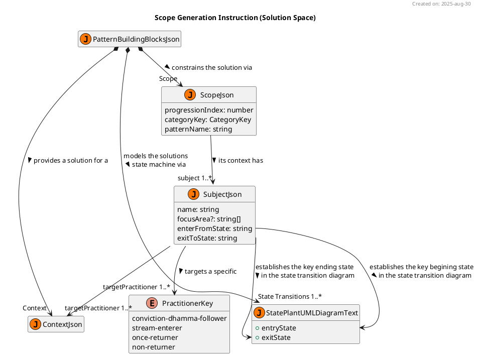

# JSON Scope Generation Instruction Manual For NotebookLM

this manual is written for and to be executed by notebooklm. it must be fit for notebooklm's use. this manual must routinely be assessed by notebooklm for ambiguity, inconsistencies and errors which present as obstacles to the pattern generation.


## Pre-conditions
the initiating user-query must specify an userPatternRequestJson object of type UserPatternRequestJson

the following are key abstractions from source "pattern-API.ts.txt" are relevent to the "scope" work task:

```typescript
export type TopicJson = {
    progressionIndex: number 
    categoryKey: CategoryKey 
}

export type UserInfluentialFactorsJson = {
    factors?: string[]
    determinantQuotations?: DeterminantQuotationString[]
}

export type UserDirectExperienceJson = {
    "Scope"?: UserInfluentialFactorsJson
    // ...
}

export type UserPatternRequestJson = TopicJson &{
    stopGeneratingAfterTask?: WorkTaskKey
    directExperience?: UserDirectExperienceJson
}
```

**running example**
```json
  userPatternRequestJson = { 
    "progressionIndex": 1,
    "categoryKey": "helpful"
  }

```
note, directExperience is an optional field that the user may supply.


## Post-conditions

on completion of this work task the PatternResponseJson object's buildingBlocks & quotationSheet "Scope" attributes will have been appropriate updated in respond to the ser request.

```typescript
export type  PractitionerKey = "conviction-dhamma-follower" | "stream-enterer" | "once-returner" | "non-returner";

export type SubjectJson = {
    name: string
    focusArea?: string[]
    enterFromState: string
    exitToState: string
    targetPractitioner: PractitionerKey[]
}

export type ScopeJson = TopicJson &{
    patternName: string
    subject: SubjectJson[]
}

export type PatternBuildingBlocksJson = {
    "Scope": ScopeJson
  // ...
}

export type PatternQuotationsJson = {
    "Scope": DeterminantQuotationString[]
  // ...
} 

export type PatternResponseJson = {
    buildingBlocks: PatternBuildingBlocksJson
    quotationSheet: PatternQuotationsJson
}
```

**running example**

```json
{
  "buildingBlocks": {
    "Scope": {
      "progressionIndex": 1,
      "categoryKey": "helpful",
      "patternName": "Heedful, ardent & resolute",
      "subject": [
        {
          "name": "Heedfulness",
          "focusArea": [
            "skillful qualities"
          ],
          "enterFromState": "complacent",
          "exitToState": "effluent-free",
          "targetPractitioner": [
            "stream-enterer",
            "once-returner",
            "non-returner"
          ]
        }
      ]
    }
  },
  "quotationSheet": {
    "Scope": [
      "[dont] ever let yourself get complacent when the ending of effluents is still unattained",
      "Now, then, monks, I exhort you: All fabrications are subject to ending & decay. Reach consummation through heedfulness.' That was the Tathāgata's last statement [to a group of noble monks the most backward of which was a stream-enterer]"
    ]
  }
}
```


## Background

scope is the initial work task and it sets the context for generating the rest of the pattern building blocks.





the class diagram above highlights how the scope via SubjectJson will later play a role in:
1. the pattern's context
  * patterns are solutions to problems in a given context. that context also includes "who" (ie. the type of practitioners) this solution is applicable for. therefore, it is crucial that notebooklm identifies the appropriate type of practitioner for each subject. note, the pattern's (as opposed to the subject) target practitioner is the union set of the subject practitioners.
  
2. the pattern's solution state transition diagrams 
  * a pattern's solution can be expressed in many modes and permutations. this project aims to be as comprehensive as possible in assembling the critical knowledge for the practitioner from multiple perspectives. the behavioural aspects of a state transition diagram help the practitioner to see how the practice progresses upon state transitions as opposed to a focus on processes, structures and events. 


## Orchestration

### 1. Assign the Pattern Name

all pattern names for the "progressing by tens" framework are found in source "pbt-catalog.json.txt". the userPatternRequestJson's "progressionIndex" & "categoryKey" property values are the keys for establishing the PBT context. 

store the patternName from the config["patternName"][categoryKey][progressionIndex]

**running example**
```json
{
  "buildingBlocks": {
    "Scope": {
      "progressionIndex": 1,
      "categoryKey": "helpful",
      "patternName": "Heedful, ardent & resolute",
    }
  }
}
```

### 2. Parsing the Answer Excerpt

all answer excerpts for the "progressing by tens" framework are found in source "pbt-catalog.json.txt". the userPatternRequestJson's "progressionIndex" & "categoryKey" property values are the keys for establishing the PBT context. hence the answerExcerpt is accessed from the config["answerExcerpt"][categoryKey][progressionIndex]

the answerExcerpt must be parsed by:
1. identifying a maximum of progressionIndex number of subjects in the answerExcerpt
2. identifying optional focusArea(s) associated with that subject

notebooklm must:
1. **Command:parse** the answerExcerpt into subjects & focusAreas

note, this parsing approach will typically work for the majority of the 100 topics. however, there are exceptions that notebooklm will need to manage.


**exceptional cases**

consider the following case:

> Which three dhammas should be developed? Three concentrations: concentration with directed thought & evaluation, concentration without directed thought & with a modicum of evaluation, concentration without directed thought & evaluation.

this case can be parsed in two ways:
1. three subjects
  1. concentration with directed thought
  2. concentration without directed thought & with a modicum of evaluation
  3. concentration without directed thought & evaluation
2. one subject with three focusAreas:
  1. concentration
    1. with directed thought
    2. without directed thought & with a modicum of evaluation
    3. without directed thought & evaluation

which one is correct? the answer lies in the significance the role of the first and second jhana place in the solution. the three subjects approach elevates the significance of first and second jhana as first class citizens of the solution. however, the generalised concentration with one subject approach diminishes the first and second jhana as a consideration of the solution. this decision will also be evident in the generated state transition diagram as the requisite condition for concentration is [mindfulness & calm], however, the requisite conditions for first and second jhana are [subduing the hindrances] & [first-jhana] respectively.

notebooklm should choose the most appropriate approach. in such a case where the user intends the other approach then they should inject this factor as such:

```json
  userPatternRequestJson = { 
    "progressionIndex": 3,
    "categoryKey": "developed", 
    "directExperience": {
        "Scope": {
          "factors": ["**NotebookLM:advice** parse as one subject with three focusAreas"]
        }
    }
  }

```

store the parsed subjects 

**running example**
```json
{
  "buildingBlocks": {
    "Scope": {
      "progressionIndex": 1,
      "categoryKey": "helpful",
      "patternName": "Heedful, ardent & resolute",
      "subject": [
        {
          "name": "Heedfulness",
          "focusArea": [
            "skillful qualities"
          ]
        }
      ]
    }
  }
}
```

### 3. Determine Pattern Details

for each subject in the scope:
1. determine the enter from state
2. determine the exit to state
3. determine the target practitioner


#### 3.1. Determine Enter From State

dhamma practice is a training of the mind and more often than not, the states of significance are in relation to the mind's composite states. 

the "progressing by tens" framework is all about the development of skillful qualities and the abandoning of unskillful qualities. most qualities are internal mental qualities, but there are a few external qualities (eg. admirable friendship, living in a civilised land, having done merit in the past etc.)

given that all skillful qualities converge and are rooted in heedfulness. its would reduce the value & quality of all the artifacts if they all had an enter from state of "heedfulness". therefore, notebooklm is encouraged to look deeper at the "nearest branch" state (as opposed to root state) when identifying the enter from state.

notebooklm must:
1. **Command:search** for quotations from the ["*_nblm.txt"] sources:
  * on the subject and its associated focusArea(s)
  * select 1 if possible (or more when chained together) that best quotes that substantiates the concluded enter from state

**Command:UPDATE INSTRUCTION MANUAL** by inserting the internal json request object for step 1

2. **Command:parse** the selected quotation(s) to extract the enter from state

**Command:UPDATE INSTRUCTION MANUAL** by inserting the internal json request object for step 2

3. **Command:store** the quotation in the quotation sheet for "Scope" 


#### 3.2. Determine Exit To State

similar to the enter from state, the ending of the effluents (labeled as "effluent-free") a frequent candidate for the exit to state. again, look more deeply at where there is a natural baton change to another skillful quality when identifying the exit to state.

notebooklm must:
1. **Command:search** for quotations from the ["*_nblm.txt"] sources:
  * on the subject and its associated focusArea(s)
  * select 1 if possible (or more when chained together) that best quotes that substantiates the concluded exit to state

**Command:UPDATE INSTRUCTION MANUAL** by inserting the internal json request object for step 1

2. **Command:parse** the selected quotation(s) to extract the enter from state

**Command:UPDATE INSTRUCTION MANUAL** by inserting the internal json request object for step 2

3. **Command:store** the quotation in the quotation sheet for "Scope" 


#### 3.3. Determine Target Practitioner

the "progressing by tens" framework covers a spectrum of topics. some are suited for conviction and dhamma followers, whilst others are extremely advanced practices that are suited for non-returners. these patterns are like medical prescriptions; thus, if a practitioner doesnt suffer a given context, then they shouldnt follow the solution.

notebooklm must:
1. **Command:search** for quotations from the ["*_nblm.txt"] sources:
  * on the subject and its associated focusArea(s)
  * select 1 if possible (or more when chained together) that best quotes that substantiates the concluded target practitioner

**Command:UPDATE INSTRUCTION MANUAL** by inserting the internal json request object for step 1  


2. **Command:parse** the selected quotation(s) to extract the practitioner(s)

**Command:UPDATE INSTRUCTION MANUAL** by inserting the internal json request object for step 2

3. **Command:store** the quotation in the quotation sheet for "Scope" 

**running example**
```json
{
  "buildingBlocks": {
    "Scope": {
      "progressionIndex": 1,
      "categoryKey": "helpful",
      "patternName": "Heedful, ardent & resolute",
      "subject": [
        {
          "name": "Heedfulness",
          "focusArea": [
            "skillful qualities"
          ],
          "enterFromState": "complacent",
          "exitToState": "effluent-free",
          "targetPractitioner": [
            "stream-enterer",
            "once-returner",
            "non-returner"
          ]
        }
      ]
    }
  },
  "quotationSheet": {
    "Scope": [
      "[dont] ever let yourself get complacent when the ending of effluents is still unattained",
      "Now, then, monks, I exhort you: All fabrications are subject to ending & decay. Reach consummation through heedfulness.' That was the Tathāgata's last statement [to a group of noble monks the most backward of which was a stream-enterer]"
    ]
  }
}
```
