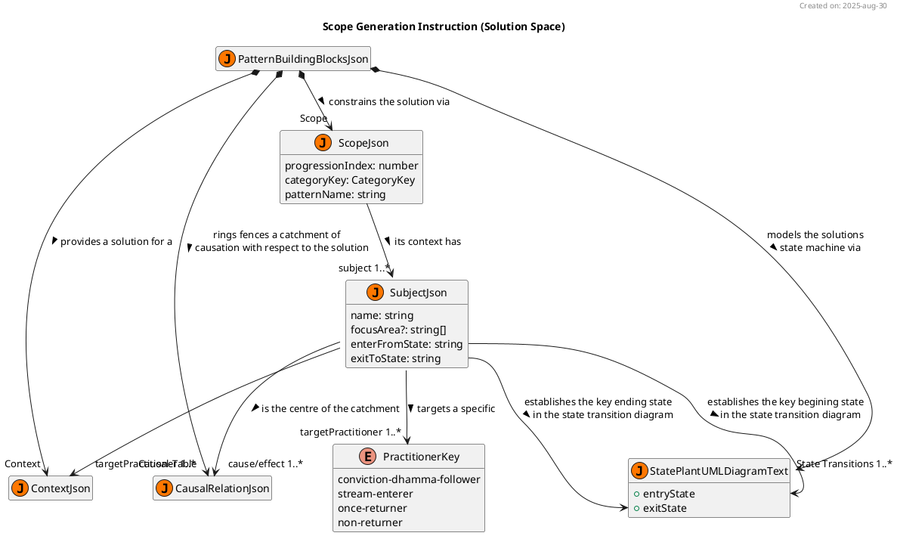

# JSON Scope Generation Instruction Manual For NotebookLM

this manual is written for and to be executed by notebooklm. it must be fit for notebooklm's use. this manual must routinely be assessed by notebooklm for ambiguity, inconsistencies and errors which present as obstacles to the pattern generation.


## Pre-conditions
the initiating user-query must specify an userPatternRequestJson object of type UserPatternRequestJson

the following are key abstractions from source "pattern-API.ts.txt" are relevent to the "scope" work task:

```typescript
export type TopicJson = {
    progressionIndex: number 
    categoryKey: CategoryKey 
}

export type UserInfluentialFactorsJson = {
    factors?: string[]
    determinantQuotations?: DeterminantQuotationString[]
}

export type UserDirectExperienceJson = {
    "Scope"?: UserInfluentialFactorsJson
    // ...
}

export type UserPatternRequestJson = TopicJson &{
    stopGeneratingAfterTask?: WorkTaskKey
    directExperience?: UserDirectExperienceJson
}
```

**running example**
```json
  userPatternRequestJson = { 
    "progressionIndex": 1,
    "categoryKey": "helpful"
  }

```
note, directExperience is an optional field that the user may supply.


## Post-conditions

on completion of this work task the PatternResponseJson object's buildingBlocks & quotationSheet "Scope" attributes will have been appropriate updated in respond to the ser request.

```typescript
export type  PractitionerKey = "conviction-dhamma-follower" | "stream-enterer" | "once-returner" | "non-returner";

export type SubjectJson = {
    name: string
    focusArea?: string[]
    enterFromState: string
    exitToState: string
    targetPractitioner: PractitionerKey[]
}

export type ScopeJson = TopicJson &{
    patternName: string
    subject: SubjectJson[]
}

export type PatternBuildingBlocksJson = {
    "Scope": ScopeJson
  // ...
}

export type PatternQuotationsJson = {
    "Scope": DeterminantQuotationString[]
  // ...
} 

export type PatternResponseJson = {
    buildingBlocks: PatternBuildingBlocksJson
    quotationSheet: PatternQuotationsJson
}
```

**running example**

```json
{
  "buildingBlocks": {
    "Scope": {
      "progressionIndex": 1,
      "categoryKey": "helpful",
      "patternName": "Heedful, ardent & resolute",
      "subject": [
        {
          "name": "Heedfulness",
          "focusArea": [
            "skillful qualities"
          ],
          "enterFromState": "complacent",
          "exitToState": "effluent-free",
          "targetPractitioner": [
            "stream-enterer",
            "once-returner",
            "non-returner"
          ]
        }
      ]
    }
  },
  "quotationSheet": {
    "Scope": [
      "Because of that gain, he becomes intoxicated, complacent, & falls into heedlessness.",
      "[dont] ever let yourself get complacent when the ending of effluents is still unattained",
      "Now, then, monks, I exhort you: All fabrications are subject to ending & decay. Reach consummation through heedfulness.' That was the Tathāgata's last statement [to a group of noble monks the most backward of which was a stream-enterer]"
    ]
  }
}
```


## Background

scope is the initial work task and it sets the context for generating the rest of the pattern building blocks.





the class diagram above highlights how the scope via SubjectJson will later play a role in:
1. the pattern's context
  * patterns are solutions to problems in a given context. that context also includes "who" (ie. the type of practitioners) this solution is applicable for. therefore, it is crucial that notebooklm identifies the appropriate type of practitioner for each subject. note, the pattern's (as opposed to the subject) target practitioner is the union set of the subject practitioners.
  
2. the pattern's causal-table with the subject at the centre
  * a pattern's context, forces, solution & resulting context are all dependent on comprehending causation for each subject. hence, generalised and appropriately abstracted subject names are critical for creating a bi-directional causal tree 

3. the pattern's solution state transition diagrams 
  * a pattern's solution can be expressed in many modes and permutations. this project aims to be as comprehensive as possible in assembling the critical knowledge for the practitioner from multiple perspectives. the behavioural aspects of a state transition diagram help the practitioner to see how the practice progresses upon state transitions as opposed to a focus on processes, structures and events. 


## Orchestration

### 1. Assign the Pattern Name

all pattern names for the "progressing by tens" framework are found in source "pbt-catalog.json.txt". the userPatternRequestJson's "progressionIndex" & "categoryKey" property values are the keys for establishing the PBT context. 

store the patternName from the config["patternName"][categoryKey][progressionIndex]

**running example**
```json
{
  "buildingBlocks": {
    "Scope": {
      "progressionIndex": 1,
      "categoryKey": "helpful",
      "patternName": "Heedful, ardent & resolute",
    }
  }
}
```

### 2. Parsing the Answer Excerpt

all answer excerpts for the "progressing by tens" framework are found in source "pbt-catalog.json.txt". the userPatternRequestJson's "progressionIndex" & "categoryKey" property values are the keys for establishing the PBT context. hence the answerExcerpt is accessed from the config["answerExcerpt"][categoryKey][progressionIndex]

the answerExcerpt must be parsed by:
1. identifying a maximum of progressionIndex number of subjects in the answerExcerpt
2. identifying optional focusArea(s) associated with that subject

notebooklm must:
1. **Command:parse** the answerExcerpt into SubjectJson objects. focusArea is optional can remain undefined if not applicable. assign "", "" & [] for enterFromState, exitToState & targetPractitioner respectively.
```typescript
export type SubjectJson = {
    name: string
    focusArea?: string[]
    enterFromState: string
    exitToState: string
    targetPractitioner: PractitionerKey[]
}
```

**Internal JSON Request Object for `Command:parse` (Answer Excerpt Parsing):**
```json
{
  "commandType": "structured_extraction",
  "parameters": {
    "textToParse": "<answerExcerpt_string>",
    "extractionTarget": "SubjectJson[]",
    "expectedFormat": "{ name: string, focusArea?: string[] }[]",
    "guidance": "Identify distinct subjects and their optional associated focus areas from the answer excerpt. If components within the answer excerpt have distinct and sequential requisite conditions, or lead to different immediate outcomes, parse them as separate SubjectJson objects. The maximum number of subjects to extract is defined by progressionIndex. Initially, enterFromState and exitToState should be empty strings, and targetPractitioner an empty array."
  }
}
```


2. **Command:generalise & abstract** the subject name if necessary. the subject name plays role in the causal-table. if the name is to specific the causal-table will be small and of little benefit (due to simplicity) for the remaining work tasks. however, if the name is over-generalised then the causal-table will be too large and again of little benefit (due to complexity) for the remaining work tasks.
  * eg, consider the subject: "people of integrity"
    1. "people of integrity" has 77 references in 6 source files
    2. "person of integrity" has 112 references in 7 source files
    3. "admirable friend" 43 references in 8 source files
  * within the context of "Associating with people of integrity", these are all abstractions of the same concept. notebooklm needs to ensure that it can subsequently match on the concept as opposed to the specific term for the benefit of down-stream work tasks

note, this parsing approach will typically work for the majority of the 100 topics. however, there are exceptions that notebooklm will need to manage.


**exceptional cases**

consider the following case:

> Which three dhammas should be developed? Three concentrations: concentration with directed thought & evaluation, concentration without directed thought & with a modicum of evaluation, concentration without directed thought & evaluation.

this case can be parsed in two ways:
1. three subjects
  1. concentration with directed thought
  2. concentration without directed thought & with a modicum of evaluation
  3. concentration without directed thought & evaluation
2. one subject with three focusAreas:
  1. concentration
    1. with directed thought
    2. without directed thought & with a modicum of evaluation
    3. without directed thought & evaluation

which one is correct? the answer lies in the significance the role of the first and second jhana place in the solution. the three subjects approach elevates the significance of first and second jhana as first class citizens of the solution. however, the generalised concentration with one subject approach diminishes the first and second jhana as a consideration of the solution. this decision will also be evident in the generated state transition diagram as the requisite condition for concentration is [mindfulness & calm], however, the requisite conditions for first and second jhana are [subduing the hindrances] & [first-jhana] respectively.

notebooklm should choose the most appropriate approach.  **If the components within an answer excerpt have distinct and sequential requisite conditions, or lead to different immediate outcomes, they should be parsed as separate `SubjectJson` objects.** This ensures that the individual significance of each component is maintained, aligning with the example provided for the Jhanas and their unique pre-conditions ([subduing the hindrances] and [first-jhana] respectively).

note, in such a case where the user intends the other approach than what notebooklm selected then they should inject this factor into the originating userPatternRequestJson object as such:

```json
  userPatternRequestJson = { 
    "progressionIndex": 3,
    "categoryKey": "developed", 
    "directExperience": {
        "Scope": {
          "factors": ["**NotebookLM:advice** parse as one subject with three focusAreas"]
        }
    }
  }

```

store the parsed subjects 

**running example**
```json
{
  "buildingBlocks": {
    "Scope": {
      "progressionIndex": 1,
      "categoryKey": "helpful",
      "patternName": "Heedful, ardent & resolute",
      "subject": [
        {
          "name": "Heedfulness",
          "focusArea": [
            "skillful qualities"
          ]
        }
      ]
    }
  }
}
```

### 3. Determine Pattern Details

for (const subjIter of patternResponseJson.buildingBlocks.Scope.subject)
1. determine the enter from state
2. determine the exit to state
3. determine the target practitioner


#### 3.1. Determine Enter From State

dhamma practice is a training of the mind and more often than not, the states of significance are in relation to the mind's composite states. 

the "progressing by tens" framework is all about the development of skillful qualities and the abandoning of unskillful qualities. most qualities are internal mental qualities, but there are a few external qualities (eg. admirable friendship, living in a civilised land, having done merit in the past etc.)

given that all skillful qualities converge and are rooted in heedfulness. its would reduce the value & quality of all the artifacts if they all had an enter from state of "heedfulness". therefore, notebooklm is encouraged to look deeper at the "nearest branch" state (as opposed to root state) when identifying the enter from state.

notebooklm must:
1. **Command:search** for quotations from the ["*_nblm.txt"] sources:
  * on the subject and its associated focusArea(s)
  * select 1 if possible (or more when chained together) that best quotes that substantiates the concluded enter from state
  let searchAttempts = [subjIter.name]
  let quotes: DeterminantQuotationString[] = []
  if (focusArea) // simple model with no permutations
      searchAttempts = [...searchAttempts, ...subjIter.focusArea]
  const attempts = searchAttempts.length
  for (let i=0; i< attempts; i++) {
      const searchExpr = searchAttempts.join(" ")
      // do notebooklm search using searchExpr and store in quotes array
      // search context is with respect to mind states or external states
      if doesQuoteSubstantiate(quotes, "enterFromState")
        break
      searchAttempts.pop()
  }


**Internal JSON Request Object for `Command:search` (for `enterFromState`):**
```json
{
  "commandType": "information_retrieval",
  "parameters": {
    "query": "<dynamic_search_expression_from_subject_name_and_focus_area>",
    "sources": ["AN_nblm.txt", "DN_nblm.txt", "KN_Dhp_nblm.txt", "KN_Iti_nblm.txt", "KN_Khp_nblm.txt", "KN_StNp_nblm.txt", "KN_Thag_nblm.txt", "KN_Thig_nblm.txt", "KN_Ud_nblm.txt", "MN_nblm.txt", "SN_nblm.txt"],
    "contextHint": "mind states or external states",
    "resultType": "DeterminantQuotationString[]"
  }
}
```

2. **Command:parse** the selected quotation(s) to extract the enter-from-state as text and assign it to the subject's "enterFromState" property


**Internal JSON Request Object for `Command:parse` (for `enterFromState` extraction):**
```json
{
  "commandType": "structured_extraction",
  "parameters": {
    "textToParse": "<quotes_array_from_Command:search>",
    "extractionTarget": "enterFromState",
    "expectedFormat": "string",
    "guidance": "Extract the 'nearest branch' condition or state that precedes or leads to the subject. Prioritize a specific preceding condition over general states like 'heedfulness' if a more direct link is present, as per manual's instruction 'look deeper at the \"nearest branch\" state (as opposed to root state)'."
  }
}
```

**running example**
```typescript
let quotes = ["Because of that gain, he becomes intoxicated, complacent, & falls into heedlessness.", "[dont] ever let yourself get complacent when the ending of effluents is still unattained"]

{
  "buildingBlocks": {
    "Scope": {
      "progressionIndex": 1,
      "categoryKey": "helpful",
      "patternName": "Heedful, ardent & resolute",
      "subject": [
        {
          "name": "Heedfulness",
          "focusArea": [
            "skillful qualities"
          ],
          "enterFromState": "complacent",
        }
      ]
    }
  }
}
```


3. **Command:store** the quotation in the quotation sheet for "Scope" 


#### 3.2. Determine Exit To State

similar to the enter from state, the ending of the effluents (labeled as "effluent-free") a frequent candidate for the exit to state. again, look more deeply at where there is a natural baton change to another skillful quality when identifying the exit to state.

notebooklm must:
1. **Command:search** for quotations from the ["*_nblm.txt"] sources:
  * on the subject and its associated focusArea(s)
  * select 1 if possible (or more when chained together) that best quotes that substantiates the concluded exit to state
  let searchAttempts = [subjIter.name]
  let quotes: DeterminantQuotationString[] = []
  if (focusArea) // simple model with no permutations
      searchAttempts = [...searchAttempts, ...subjIter.focusArea]
  const attempts = searchAttempts.length
  for (let i=0; i< attempts; i++) {
      const searchExpr = searchAttempts.join(" ")
      // do notebooklm search using searchExpr and store in quotes array
      // search context is with respect to mind states or external states
      if doesQuoteSubstantiate(quotes, "exitToState")
        break
      searchAttempts.pop()
  }


**Internal JSON Request Object for `Command:search` (for `exitToState`):**
```json
{
  "commandType": "information_retrieval",
  "parameters": {
    "query": "<dynamic_search_expression_from_subject_name_and_focus_area>",
    "sources": ["AN_nblm.txt", "DN_nblm.txt", "KN_Dhp_nblm.txt", "KN_Iti_nblm.txt", "KN_Khp_nblm.txt", "KN_StNp_nblm.txt", "KN_Thag_nblm.txt", "KN_Thig_nblm.txt", "KN_Ud_nblm.txt", "MN_nblm.txt", "SN_nblm.txt"],
    "contextHint": "mind states or external states",
    "resultType": "DeterminantQuotationString[]"
  }
}
```

2. **Command:parse** the selected quotation(s) to extract the exit-to-state as text and assign it to the subject's "exitToState" property

**running example**
```typescript
let quotes = ["Because of that gain, he becomes intoxicated, complacent, & falls into heedlessness.", "[dont] ever let yourself get complacent when the ending of effluents is still unattained"]

{
  "buildingBlocks": {
    "Scope": {
      "progressionIndex": 1,
      "categoryKey": "helpful",
      "patternName": "Heedful, ardent & resolute",
      "subject": [
        {
          "name": "Heedfulness",
          "focusArea": [
            "skillful qualities"
          ],
          "enterFromState": "complacent",
          "exitToState": "effluent-free",
        }
      ]
    }
  }
}
```

```json
{
  "commandType": "structured_extraction",
  "parameters": {
    "textToParse": "<quotes_array_from_Command:search>",
    "extractionTarget": "exitToState",
    "expectedFormat": "string",
    "guidance": "Extract the ending state or 'natural baton change' to another skillful quality. Prioritize a specific outcome over general states like 'ending of the effluents' if a more direct transition is evident, as per manual's instruction 'look more deeply at where there is a natural baton change to another skillful quality'."
  }
}
```

3. **Command:store** the quotation in the quotation sheet for "Scope" 


#### 3.3. Determine Target Practitioner

the "progressing by tens" framework covers a spectrum of topics. some are suited for conviction and dhamma followers, whilst others are extremely advanced practices that are suited for non-returners. these patterns are like medical prescriptions; thus, if a practitioner doesnt suffer a given context, then they shouldnt follow the solution.

notebooklm must:
1. **Command:search** for quotations from the ["*_nblm.txt"] sources:
  * on the subject and its associated focusArea(s)
  * select 1 if possible (or more when chained together) that best quotes that substantiates the concluded target practitioner
  let searchAttempts = [subjIter.name]
  let quotes: DeterminantQuotationString[] = []
  if (focusArea) // simple model with no permutations
      searchAttempts = [...searchAttempts, ...subjIter.focusArea]
  const attempts = searchAttempts.length
  for (let i=0; i< attempts; i++) {
      const searchExpr = searchAttempts.join(" ")
      // do notebooklm search using searchExpr and store in quotes array
      // search context is with respect to individuals in PractitionerKey
      if doesQuoteSubstantiate(quotes, "targetPractitioner")
        break
      searchAttempts.pop()
  }

**Internal JSON Request Object for `Command:search` (for `targetPractitioner`):**
```json
{
  "commandType": "information_retrieval",
  "parameters": {
    "query": "<dynamic_search_expression_from_subject_name_and_focus_area>",
    "sources": ["AN_nblm.txt", "DN_nblm.txt", "KN_Dhp_nblm.txt", "KN_Iti_nblm.txt", "KN_Khp_nblm.txt", "KN_StNp_nblm.txt", "KN_Thag_nblm.txt", "KN_Thig_nblm.txt", "KN_Ud_nblm.txt", "MN_nblm.txt", "SN_nblm.txt"],
    "contextHint": "individuals in PractitionerKey",
    "resultType": "DeterminantQuotationString[]"
  }
}
```

2. **Command:parse** the selected quotation(s) to extract the target-pracitioner as an array of PractitionerKey and assign it to the subject's "targetPractitioner" property

**running example**
```typescript
let quotes = ["Now, then, monks, I exhort you: All fabrications are subject to ending & decay. Reach consummation through heedfulness.' That was the Tathāgata's last statement [to a group of noble monks the most backward of which was a stream-enterer]"]

{
  "buildingBlocks": {
    "Scope": {
      "progressionIndex": 1,
      "categoryKey": "helpful",
      "patternName": "Heedful, ardent & resolute",
      "subject": [
        {
          "name": "Heedfulness",
          "focusArea": [
            "skillful qualities"
          ],
          "enterFromState": "complacent",
          "exitToState": "effluent-free",
          "targetPractitioner": [
            "stream-enterer",
            "once-returner",
            "non-returner"
          ]
        }
      ]
    }
  }
}
```


```json
{
  "commandType": "structured_extraction",
  "parameters": {
    "textToParse": "<quotes_array_from_Command:search>",
    "extractionTarget": "targetPractitioner",
    "expectedFormat": "PractitionerKey[]",
    "guidance": "Identify all relevant practitioner types from the `PractitionerKey` enumeration ('conviction-dhamma-follower', 'stream-enterer', 'once-returner', 'non-returner') that are explicitly or implicitly mentioned as suitable for the subject. Consider the 'medical prescription' analogy; if a practice is too advanced or basic, narrow the target practitioner accordingly."
  }
}

3. **Command:store** the quotation in the quotation sheet for "Scope" 


### 4. Finalise By Removing Duplicate Quotations

**running example**
```json
{
  "buildingBlocks": {
    "Scope": {
      "progressionIndex": 1,
      "categoryKey": "helpful",
      "patternName": "Heedful, ardent & resolute",
      "subject": [
        {
          "name": "Heedfulness",
          "focusArea": [
            "skillful qualities"
          ],
          "enterFromState": "complacent",
          "exitToState": "effluent-free",
          "targetPractitioner": [
            "stream-enterer",
            "once-returner",
            "non-returner"
          ]
        }
      ]
    }
  },
  "quotationSheet": {
    "Scope": [
      "Because of that gain, he becomes intoxicated, complacent, & falls into heedlessness.",
      "[dont] ever let yourself get complacent when the ending of effluents is still unattained",
      "Now, then, monks, I exhort you: All fabrications are subject to ending & decay. Reach consummation through heedfulness.' That was the Tathāgata's last statement [to a group of noble monks the most backward of which was a stream-enterer]"
    ]
  }
}
```
