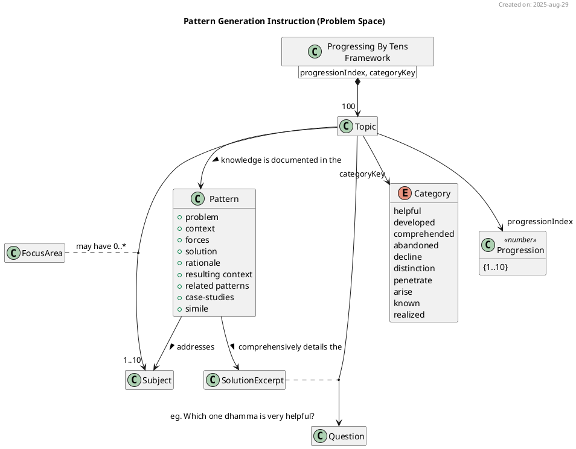

# JSON Pattern Generation Instruction Manual For NotebookLM

this manual is written for and to be executed by notebooklm. it must be fit for notebooklm's use. this manual must routinely be assessed by notebooklm for ambiguity, inconsistencies and errors which present as obstacles to the pattern generation.


## Background

in DN 34 there are 100 dhammas (ie. topics in this context) presented in a "progressing by tens" framework. these topics are highly tailored for attaining unbinding, putting an end to suffering & stress, and releasing from all ties. these 100 topics are in fact patterns, that is, they are well established solutions to known problems that practitioners face whilst in training. there is a requirements to create a project which will result in a Dhamma practitioner's pattern language of the "progressing by tens" framework

in order to be successful at this task, notebooklm has been paired with an expert dhamma practitioner. notebooklm has been assigned the task of eventually generating all of the 100 patterns. therefore, this instruction manual contains the neccessary context and process steps required for notebooklm to complete the pattern generation.





the class diagram above outlines the problem space for this project.

these instructions represents the approach that the expert themselves would follow to create the "progression by tens" patterns. the purpose of this manual is to document the processes, methods & instructions for creating the raw materials and building blocks for JSON pattern generation.


## NotebookLM Collaboration

the dhamma that is documented across the suttas is a blueprint of causation. there is no single sutta that address an given topic. although the "progressing by tens" may appear to only cover 100 topics, the reality is that there are [(1x10 + 2x10 + 3x10 ... 10x10) = 550] 550 subjects which are covered within this framework. this is truely an ambitious project!

generating a pattern for this framework will be a non-trivial exercise. it will require pulling together highly specific relational information and causal knowledge from the sutta sources. 

generating a single pattern will require an orchestration of user-queries managed through programmatic logic. 

notebooklm will:
1. execute the instructions here-in
2. collaborate with the dhamma & pattern language expert on:
    * the work tasks that need to be fulfilled
    * determining the best and most appropriate notebooklm query mechanism (eg. information_retrieval, text_analysis, conceptual_mapping, comparative_analysis, structured_extraction, synthesized_overview, user_text_analysis) for the task at hand
    * composing the pattern sections and their associated quotations
    * outputting the pattern as a JSON object for external user persistence
    * given an expected result determine the best way to utility notebooklm to achieve it
    * advising the sections in this instruction manual that need to be updated    
    * advising on changes to other materials required in this development process


## Pattern Writing Orchestration

generating a pattern will require orchestration between the following artifacts: 
1. parameterised user query: the user provides a parameterised initiating instruction as part of the user query submitted to notebooklm
2. instruction manual (this document): notebooklm, reviews this manual to comprehend the shared resource objects and the pattern api used in the process. notebooklm then executes the step-by-step process (see below) following the methodology applied in separate sub-documents. all tasks incorporate their resultant raw materials & building blocks in the final payload which will be consumed by the template
3. template: notebooklm, executes the instructions in the template using the payload for rendering

this triad of core artifacts provides for the highest level of flexability achieved through the separation of concerns. in this way, it's now a feasible option to persist the generated pattern as a JSON file and later apply the same JSON file as input to a template optimised for text-to-speech  or even video whilst all based on the exact same conceptual pattern. because notebooklm's responses are non-deterministic, this approach is an effective way to achieve write once, consume on any media approach. thus, this manual will deliver the essence of the pattern, the template will target a specific media format.


## "Progression By Tens" Catalog

there has been a concerted effort to reduce notebooklm's parsing & performance work load. a curated json source "pbt-catalog.json.txt" file has been prepared for this project. this file catalogs the entire "progression by tens" framework and links the target patternName for each topic. further, preprocessing may be considered if notebooklm's text analysis and parsing capabilities prove insufficient. the following code snippet introduces the features of the catalog:

```typescript
import config_ from "./pbt-catalog.json" with { type: "json" }

type Progressions = [string, string, string, string, string, string, string, string, string, string]; // one, two, three, ..., ten

type CategoryCollection = {
    helpful: Progressions;
    developed: Progressions;
    comprehended: Progressions;
    abandoned: Progressions;
    decline: Progressions;
    distinction: Progressions;
    penetrate: Progressions;
    arise: Progressions;
    known: Progressions;
    realized: Progressions;
}

type ProgressingByTensConfigJson = {
    topic: {
        progressionKey: string[]    // in reference to a progression key (eg. "nine")
        catagoryKey: string[]       // in reference to a category key (eg. "helpful")
        label: string[]             // in reference to a context (eg. "Dhammas that are very helpful")
    }
    patternName: CategoryCollection;    // 1-to-1 mapping of pattern-names to answer-excerpts "Heedful, ardent & resolute" -> "Heedfulness with regard to skillful qualities")
    answerExcerpt: CategoryCollection
}

export class ProgressingByTens {
    public static config: ProgressingByTensConfigJson = config_ as any
}
```

## Pattern API For Collaboration

in order to inteface between the three core artifacts, a common set of data types must be established to form a contract for communication. objects of these types may be created by notebooklm as part of an orchestrated work task response.

the source "pattern-API.ts.txt" typescript file provides many key types required for communication and exchange. some include:

```typescript
export type CategoryKey = "helpful" | "developed" | "comprehended" | "abandoned" | "decline" | "distinction" | "penetrate" | "arise" | "known" | "realized";

export type TopicJson = {
    progressionIndex: number    /* 1-based progression index reference in: Which [three] dhammas are very helpful */
    categoryKey: CategoryKey    /* category key reference in: Which three dhammas are very [helpful]  */
}

export type  PractitionerKey = "conviction-dhamma-follower" | "stream-enterer" | "once-returner" | "non-returner";

export type SubjectJson = {
    name: string                            /* subject name (eg. "people of integrity") */
    focusArea?: string[]                    /* focus area (eg. ["associating"]) */
    enterFromState: string                  /* from internal|external state (eg. "stress") */
    exitToState: string                     /* to internal|external state (eg. "effluent-free") */
    targetPractitioner: PractitionerKey[]   /* subject's practitioner (eg. ["conviction-dhamma-follower", "stream-enterer", "once-returner"]) */
}

export type ScopeJson = TopicJson &{
    patternName: string
    subject: SubjectJson[]
}

export type PlantUMLDiagramText = string;
export type RootWorkTaskKey = "Scope" | "Problem" | "Causal-Table" | "Context" | "Forces" | "Rationale" | "Resulting Context" | "Related Patterns" | "Case-studies" | "Simile";
export type SolutionWorkTaskKey = "Step-by-Step" | "Cause-&-Effect" | "Process View" | "Concepts & Relationships" | "State Transitions";
export type WorkTaskKey = RootWorkTaskKey | SolutionWorkTaskKey;

export const WORK_TASK_ORDER: WorkTaskKey[] = ["Scope", "Problem", "Causal-Table", "Step-by-Step", "Cause-&-Effect", "Process View", "Concepts & Relationships", "State Transitions", "Context", "Forces", "Rationale", "Resulting Context", "Related Patterns", "Case-studies", "Simile"]

export type PatternBuildingBlocksJson = {
    "Scope": ScopeJson                          /* object of the pattern's scope */
    "Problem": string                           /* string of the problem statement */
    "Causal-Table": CausalRelationJson[]        /* array of CausalRelationJson objects (full table) */
    "Solution": {
        "Step-by-Step": string[]                /* array of process step strings (this is a flattened representation of Process View) */
        "Cause-&-Effect": CausalRelationJson[]  /* array of CausalRelationJson objects (solution only) */
        "Process View": PlantUMLDiagramText[]   /* array of PlantUML Activity Diagram strings */
        "Concepts & Relationships": PlantUMLDiagramText[]   /* array of PlantUML Class Diagram strings */
        "State Transitions": PlantUMLDiagramText[]          /* array of PlantUML State Diagram strings */
    }
    "Context": string[]                         /* array of requisite condition/invariant strings */
    "Forces": string[]                          /* array of design constraint/influence strings */
    "Rationale": string                         /* string of the rationale statement */
    "Resulting Context": PlantUMLDiagramText[]  /* array of PlantUML Mindmap Diagram strings */
    "Related Patterns": string[]                /* array of related pattern-name strings */
    "Case-studies": string[]                    /* array of individual's name reference strings */
    "Simile": string[]                          /* array of simile name reference strings */
}
export type DeterminantQuotationString = string

export type PatternQuotationsJson = {
    "Scope": DeterminantQuotationString[]
    "Problem": DeterminantQuotationString[] 
    "Causal-Table": DeterminantQuotationString[] 
    "Solution": {
        "Step-by-Step": DeterminantQuotationString[] 
        "Cause-&-Effect": DeterminantQuotationString[] 
        "Process View": DeterminantQuotationString[] 
        "Concepts & Relationships": DeterminantQuotationString[] 
        "State Transitions": DeterminantQuotationString[] 
    }
    "Context": DeterminantQuotationString[] 
    "Forces": DeterminantQuotationString[] 
    "Rationale": DeterminantQuotationString[] 
    "Resulting Context": DeterminantQuotationString[] 
    "Related Patterns": DeterminantQuotationString[] 
    "Case-studies": DeterminantQuotationString[] 
    "Simile": DeterminantQuotationString[] 
}

export type PatternResponseJson = {
    buildingBlocks: PatternBuildingBlocksJson
    quotationSheet: PatternQuotationsJson
}
```

## Work Tasks
when following any instruction manual with more than 1 participant, it can become ambiguous as to:
1. who will execute a given instruction
2. what is instructional context or information that elaboerates the current executional state
3. what is an instruction command

to address these concerns this manual & template both annotate each user task segment with a "**User Task**" qualifier indicating that this task is to be performed by the user only. notebooklm must read & analyse all source materials associated with the user-query in order to understand the means of collaboration and exchange between artifacts and the user.

furthermore, all commands that notebooklm executes will be denoted with a "**Command:<command>**" qualifier. this marker helps notebooklm understand the user's expectation and helpe with the separation of concerns between instructional information and command.


## User Pattern Request Query

note, notebooklm does not provide a client side api. this makes an ambitious project like this even more difficult. however, what notebooklm does have is a extremely flexible and comprehensive query mechanism. unfortunately, the only exposure to this mechanism is via the notebooklm web ui, which has a user-query input field with a 2000 character limit. thus, specifying & executing instructions in this instruction manual, coupled with codifications in other source documents are the way forward.

the user query is the means by which a pattern request is submitted via notebooklm's ui prompt input-field. the user query must explicitly specify:
1. a userPatternRequestJson object as the parameters for specifying the desired pattern to be generated
2. this source instruction manual
3. a specific source template to apply for rendering

```typescript
export type UserPatternRequestJson = TopicJson &{
    stopGeneratingAfterTask?: WorkTaskKey
    directExperience?: UserDirectExperienceJson
}
```

**User Task:**
* Submit the pattern generation request query to notebooklm by specifying the following parameters:

```txt
  1. with the parameterised request object below:
    userPatternRequestJson = { 
      "progressionIndex": -1, /* numeric: 1-based progression index [1-10] */
      "categoryKey": null,    /* string:  category key reference ["helpful" | "developed" | "comprehended" | "abandoned" | "decline" | "distinction" | "penetrate" | "arise" | "known" | "realized"]  */
      "stopGeneratingAfterTask": null, /* string: work task key reference ["Scope", "Problem", "Causal-Table", "Step-by-Step", "Cause-&-Effect", "Process View", "Concepts & Relationships", "State Transitions", "Context", "Forces", "Rationale", "Resulting Context", "Related Patterns", "Case-studies", "Simile"]  */
      "directExperience": {
          "Problem": {
            "factors": ["heedfulness co-arises with reflection"],
            "determinantQuotations": ["Having admirable people as friends, companions, & colleagues is actually the whole of the holy life."]
          }
      }
    }
  2. execute the instructions in source "json-pattern-generation-instructions-manual.md" which output's patternResponseJson
  3. with patternResponseJson as input, execute the instructions in source "<template-file>" for rendering
```

**running example**
* Example User Query for generating the "Heedful, ardent & resolute" pattern:

```txt
1. with the parameterised request object below:
userPatternRequestJson = { 
    "progressionIndex": 1,
    "categoryKey": "helpful",
}
2. execute the instructions in source "json-pattern-generation-instructions-manual.md" which output's patternResponseJson
3. with patternResponseJson as input, execute the instructions in source "sys-test_PBT-pattern-request-template.md" for rendering
```


## Running Example

instructions are one things but examples of how a method has been applied is another. therefore, below the instructions for each work task, an example of resultant building blocks has been provided. however, often independent and over-simplisitic examples hide the nuances inherent in tasks that are coupled to the overrall process. to resolve this issues, this manual uses a **running-example**. 

the **"Heedful, ardent & resolute"** pattern whose associated answer-excerpt is **"Heedfulness with regard to skillful qualities"** has been used as a running example for this manual and it's sub-manuals. notebooklm must analyse the running example to follow the expert's methodology on how they implemented the instructions when crafting the resultant raw materials and building blocks. 

note, only the example plantuml diagrams are to be considered final drafts. all other sections or sub-sections examples are to be considered as work-in-progress that notebooklm must use as a reference.

> Which one dhamma is very helpful? Heedfulness with regard to skillful qualities: This one dhamma is very helpful.

there are pros and cons related to this topic selection:
* pro:
    1. it is the 1st progression and therefore there is only one subject
    2. heedfulness is critical subject that cross cuts the entire dhamma practice and is applicable to all practitioners in training
* con:
    1. it may result in an over-simplification of the resultant instruction manual. this may result in failure when apply the instruction manual to large progression topics eg. "Which eight dhammas are on the side of distinction?" this solution excerpt itself has 4827 characters.


the following json captures the desired generated pattern for this topic. note, the json below will be incomplete until this manual has been completed. as the collaborative effort progresses this json object below will get updated.

```json
{
  "buildingBlocks": {
    "Scope": {
      "progressionIndex": 1,
      "categoryKey": "helpful",
      "patternName": "Heedful, ardent & resolute",
      "subject": [
        {
          "name": "Heedfulness",
          "focusArea": [
            "skillful qualities"
          ],
          "enterFromState": "effluent-free",
          "exitToState": "",
          "targetPractitioner": [
            "stream-enterer",
            "once-returner",
            "non-returner"
          ]
        }
      ]
    }
  },
  "quotationSheet": {
    "Scope": [
      "[dont] ever let yourself get complacent when the ending of effluents is still unattained",
      "Now, then, monks, I exhort you: All fabrications are subject to ending & decay. Reach consummation through heedfulness.' That was the Tathāgata's last statement [to a group of noble monks the most backward of which was a stream-enterer]"
    ]
  }
}
```

## Iterative & Incremental Approach To Building This Pattern Generation System
execute the process below in order. each item in the list has its own specification document. open each source document below in turn and complete the instructions before moving on to the next list item.

note, an iterative & incremental approach will be taken. therfore, only those work tasks that have been developed are listed below with an associated sub-instructional manual!

0. **Command:execute** Establish the pattern's "Scope" in source "guide_to_writing_PBT_patterns_0.scope.md"
