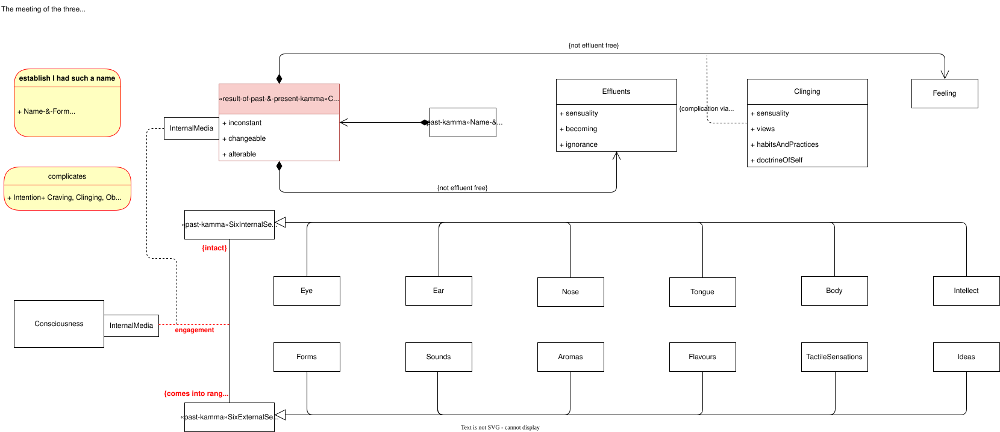

# Comprehend > Contact accompanied by effluents & subject to clinging

## Definitions

> 'Dependent on eye & forms, eye-consciousness arises. **The meeting of the three is contact**. **With contact as a requisite condition, there is feeling**. **What one feels, one perceives [labels in the mind]. What one perceives, one thinks about. What one thinks about, one complicates.** Based on what a person complicates, the perceptions & categories of objectification assail him or her with regard to past, present, & future forms cognizable via the eye.
> 'Dependent on ear & sounds, ear-consciousness arises.…
> 'Dependent on nose & aromas, nose-consciousness arises.…
> 'Dependent on tongue & flavors, tongue-consciousness arises.…
> 'Dependent on body & tactile sensations, body-consciousness arises.…
> 'Dependent on intellect & ideas, intellect-consciousness arises.[^1]

> 'And which contact? These six are classes of contact: **eye-contact, ear-contact, nose-contact, tongue-contact, body-contact, intellect-contact. This is called contact**.[^2]

> 'Now if internally the eye is intact but externally forms do not come into range, nor is there a corresponding engagement, then there is no appearing of the corresponding type of consciousness. If internally the eye is intact and externally forms come into range, but there is no corresponding engagement, then there is no appearing of the corresponding type of consciousness. **But when** internally the **eye is intact** and externally **forms come into range**, and **there is** a corresponding **engagement**, **then** there is **the appearing** of the corresponding type of **consciousness**.[^17]

> Near Sāvatthī. 'Monks, **eye-contact is inconstant, changeable, alterable. Ear-contact.… Nose-contact.… Tongue-contact.… Body-contact.… Intellect-contact is inconstant, changeable, alterable…**[^3]

> 'There are these **three kinds of effluents**: **the effluent of sensuality**, **the effluent of becoming**, **the effluent of ignorance**.[^4]

> 'Monk, **clinging is neither the same thing as the five clinging-aggregates**, **nor is it separate from the five clinging-aggregates**. Just that **whatever passion & delight is there, that's the clinging there.**'[^10]

> 'There are these **four clingings**: **sensuality clinging**, **view clinging**, **habit & practice clinging**, and **doctrine of self clinging**. **This is called clinging**.[^11]

## Origination and concomitants

> **When this is, that is.**
> **From the arising of this comes the arising of that.**
> In other words:
> **From ignorance** as a requisite condition **come fabrications**.
> From fabrications as a requisite condition **comes consciousness**.
> From consciousness as a requisite condition **comes name-&-form**.
> From name-&-form as a requisite condition **come the six sense media**.
> From the six sense media as a requisite condition **comes contact**.
> From contact as a requisite condition **comes feeling**.
> From feeling as a requisite condition **comes craving.**[^7]

> 'Thus, Ānanda, **from name-&-form as a requisite condition comes consciousness**. **From consciousness as a requisite condition comes name-&-form**. **From name-&-form as a requisite condition comes contact**. **From contact as a requisite condition comes feeling**. From feeling as a requisite condition comes craving. From craving as a requisite condition comes clinging. From clinging as a requisite condition comes becoming. From becoming as a requisite condition comes birth. From birth as a requisite condition, aging-&-death, sorrow, lamentation, pain, distress, & despair come into play. Such is the origination of this entire mass of stress.[^6]

> 'And what is the cause by which effluents come into play? **Ignorance is the cause by which effluents come into play.**[^4]

> 'Well then—knowing in what way, seeing in what way, does one without delay put an end to effluents? There is the case where an uninstructed, run-of-the-mill person—who has no regard for noble ones, is not well-versed or disciplined in their Dhamma; who has no regard for people of integrity, is not well-versed or disciplined in their Dhamma—assumes form to be the self. That assumption is a fabrication. Now what is the cause, what is the origination, what is the birth, what is the coming-into-existence of that fabrication? **To an uninstructed**, run-of-the-mill **person, touched by that which is felt** **born of contact with ignorance**, **craving arises**. That fabrication is born of that. And that fabrication is inconstant, fabricated, dependently co-arisen. That craving… That feeling… That contact… That ignorance is inconstant, fabricated, dependently co-arisen. It is by knowing & seeing in this way that one without delay puts an end to effluents.[^8]

> '**From the origination of craving comes the origination of clinging.** From the cessation of craving comes the cessation of clinging. And the way of practice leading to the cessation of clinging is just this very noble eightfold path: right view, right resolve, right speech, right action, right livelihood, right effort, right mindfulness, right concentration.[^11]

## Other considerations and related concepts

> 'And which feeling? These six are classes of feeling: **feeling born from eye-contact**, feeling born **from ear-contact**, feeling born **from nose-contact**, feeling born from **tongue-contact**, feeling born **from body-contact**, feeling born **from intellect-contact**. This is called feeling.[^2]

> 'And what is the diversity in effluents? **There are effluents that lead to hell**, those that lead **to the animal womb**, those that lead **to the realm of the hungry ghosts**, those that lead **to the human world**, those that lead **to the world of the devas**. This is called the diversity in effluents.
>
> 'And what is the result of effluents? **One who is immersed in ignorance produces a corresponding state of existence, on the side of merit or demerit.** This is called the result of effluents.[^4]

> '**Any lack of knowledge with reference to stress**, any lack of knowledge **with reference to the origination of stress**, any lack of knowledge **with reference to the cessation of stress**, any lack of knowledge **with reference to the way of practice leading to the cessation of stress**: **This is called ignorance**.
>
> '**From the origination of effluents comes the origination of ignorance.** From the cessation of effluents comes the cessation of ignorance. And the way of practice leading to the cessation of ignorance is just this very noble eightfold path: right view, right resolve, right speech, right action, right livelihood, right effort, right mindfulness, right concentration.[^5]

> '**All phenomena are rooted in desire**.
> 'All phenomena **come into play through attention**.
> 'All phenomena **have contact as their origination**.
> 'All phenomena **have feeling as their meeting place**.[^9]

## Allure & Drawback

> And whatever is meant
> by becoming & not- :
> Tell me,
> Where is their cause?'
> **'Contact is the cause**
> **of appealing & un-.**
> When contact isn't,
> they do not exist,
> along with what's meant
> by becoming & not- :
> I tell you,[^12]

> The passion for his resolves is a man's sensuality,
> not the beautiful sensual pleasures
> found in the world.
> The passion for his resolves is a man's sensuality.
> The beauties remain as they are in the world,
> while, in this regard,
> the enlightened
> subdue their desire.
> 'And what is the cause by which sensuality comes into play? **Contact is the cause by which sensuality comes into play.**[^13]

> 'And what is feeling? These six bodies of feeling—feeling born of eye-contact, feeling born of ear-contact, feeling born of nose-contact, feeling born of tongue-contact, feeling born of body-contact, feeling born of intellect-contact: This is called feeling. From the origination of contact comes the origination of feeling. From the cessation of contact comes the cessation of feeling. And just this noble eightfold path is the path of practice leading to the cessation of feeling.… **The fact that pleasure & happiness arise in dependence on feeling: That is the allure of feeling.** **The fact that feeling is inconstant, stressful, subject to change: That is the drawback of feeling.** The subduing of desire-passion for feeling, the abandoning of desire-passion for feeling: That is the escape from feeling.…[^14]

## Similes

> '**Just as when, from the friction & conjunction of two fire sticks, heat is born and fire appears**, **and from the separation & disjunction** of those very same fire sticks, the **concomitant heat ceases**, is stilled; **in the same way, in dependence on a sensory contact that is to be felt as pleasure, there arises a feeling of pleasure**.… In dependence on a sensory contact that is to **be felt as pain**.… In dependence on a sensory contact that is **to be felt as neither pleasure nor pain**, there arises a feeling of neither pleasure nor pain.… One discerns that 'With the cessation of that very sensory contact that is to be felt as neither pleasure nor pain, the concomitant feeling… ceases, is stilled.'[^15]

> 'And how is the nutriment of contact to be regarded? **Suppose a flayed cow were to stand leaning against a wall. The creatures living in the wall would chew on it. If it were to stand leaning against a tree, the creatures living in the tree would chew on it. If it were to stand exposed to water, the creatures living in the water would chew on it. If it were to stand exposed to the air, the creatures living in the air would chew on it. For wherever the flayed cow were to stand exposed, the creatures living there would chew on it.** In the same way, I tell you, is the nutriment of **contact to be regarded**. When the nutriment of contact is comprehended, the three feelings [pleasure, pain, neither pleasure nor pain] are comprehended. When the three feelings are comprehended, I tell you, there is nothing further for a disciple of the noble ones to do.[^16]

## References
[^1]: [https://suttaplayer.github.io/#MN/MN18](https://suttaplayer.github.io/#MN/MN18?cursorLinePosition=30&highlightLineRanges=30,32,34,36,38,40&markTextRanges=6495-6545,6548-6583,6585-6639,6642-6691,6694-6729,6732-6769)
[^2]: [https://suttaplayer.github.io/#SN/SN12_2](https://suttaplayer.github.io/#SN/SN12_2?cursorLinePosition=38&highlightLineRanges=38,40&markTextRanges=2429-2457,2473-2488,2509-2520,2541-2554,2575-2586,2705-2816)
[^3]: [https://suttaplayer.github.io/#SN/SN25_4](https://suttaplayer.github.io/#SN/SN25_4?cursorLinePosition=17&highlightLineRanges=17&markTextRanges=626-791)
[^4]: [https://suttaplayer.github.io/#AN/AN6_63](https://suttaplayer.github.io/#AN/AN6_63?cursorLinePosition=88&highlightLineRanges=88,90,92,94&markTextRanges=9470-9493,9496-9521,9524-9547,9550-9575,9636-9692,9736-9772,9791-9808,9827-9859,9878-9895,9914-9938,10023-10098,10101-10131)
[^5]: [https://suttaplayer.github.io/#MN/MN9](https://suttaplayer.github.io/#MN/MN9?cursorLinePosition=235&highlightLineRanges=235,237&markTextRanges=28588-28633,28658-28700,28725-28765,28790-28861,28864-28887,28891-28960)
[^6]: [https://suttaplayer.github.io/#DN/DN15](https://suttaplayer.github.io/#DN/DN15?cursorLinePosition=44&highlightLineRanges=44&markTextRanges=3238-3299,3301-3361,3364-3418,3421-3471)
[^7]: [https://suttaplayer.github.io/#KN/Ud/ud1_1](https://suttaplayer.github.io/#KN/Ud/ud1_1?cursorLinePosition=5&highlightLineRanges=5-23&markTextRanges=526-547,550-600,620-633,660-676,723-741,789-805,851-874,928-940,982-994,1036-1048)
[^8]: [https://suttaplayer.github.io/#SN/SN22_81](https://suttaplayer.github.io/#SN/SN22_81?cursorLinePosition=20.64&highlightLineRanges=20&markTextRanges=3236-3253,3272-3277,3280-3355)
[^9]: [https://suttaplayer.github.io/#AN/AN10_58](https://suttaplayer.github.io/#AN/AN10_58?highlightLineRanges=14-20&markTextRanges=1360-1393,1412-1444,1462-1494,1513-1547&cursorLinePosition=14)
[^10]: [https://suttaplayer.github.io/#SN/SN22_82](https://suttaplayer.github.io/#SN/SN22_82?cursorLinePosition=20&highlightLineRanges=20&markTextRanges=1677-1742,1745-1797,1809-1872)
[^11]: [https://suttaplayer.github.io/#MN/MN9](https://suttaplayer.github.io/#MN/MN9?cursorLinePosition=115&highlightLineRanges=115,117&markTextRanges=13616-13630,13632-13650,13653-13665,13668-13692,13699-13723,13726-13748,13752-13818)
[^12]: [https://suttaplayer.github.io/#KN/StNp/StNp4_11](https://suttaplayer.github.io/#KN/StNp/StNp4_11?cursorLinePosition=113&highlightLineRanges=113-133&markTextRanges=1621-1641,1644-1661)
[^13]: [https://suttaplayer.github.io/#AN/AN6_63](https://suttaplayer.github.io/#AN/AN6_63?cursorLinePosition=26&highlightLineRanges=26-42&markTextRanges=2811-2861,3145-3201)
[^14]: [https://suttaplayer.github.io/#SN/SN22_57](https://suttaplayer.github.io/#SN/SN22_57?cursorLinePosition=20.6&highlightLineRanges=20&markTextRanges=3674-3769,3772-3870)
[^15]: [https://suttaplayer.github.io/#SN/SN12_62](https://suttaplayer.github.io/#SN/SN12_62?cursorLinePosition=14&highlightLineRanges=14&markTextRanges=3388-3482,3485-3521,3555-3581,3596-3677,3679-3713,3760-3777,3824-3862)
[^16]: [https://suttaplayer.github.io/#SN/SN12_63](https://suttaplayer.github.io/#SN/SN12_63?markTextRanges=2215-2694&highlightLineRanges=16&cursorLinePosition=16.06)
[^17]: [https://suttaplayer.github.io/#MN/MN28](https://suttaplayer.github.io/#MN/MN28?cursorLinePosition=85&highlightLineRanges=85&markTextRanges=19001-19008,19021-19037,19054-19074,19081-19088,19106-19115,19118-19121,19132-19147,19175-19187)