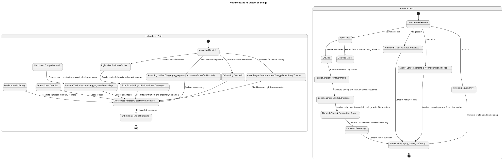
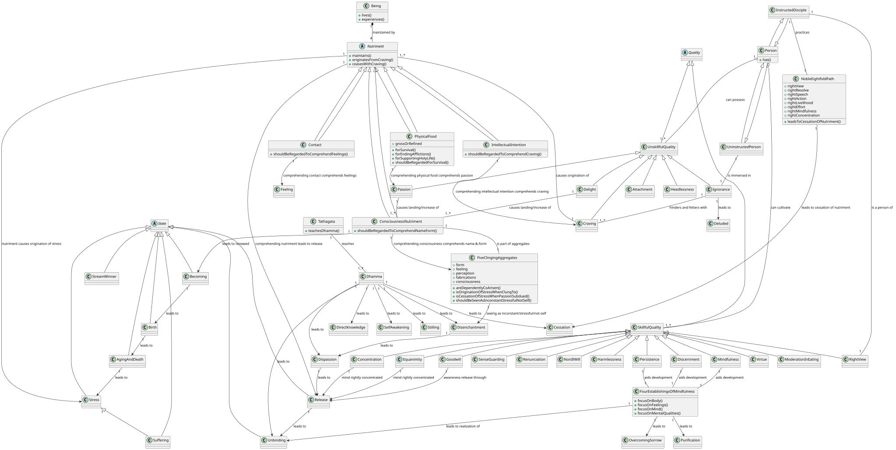

# One > Directly Known > All beings are maintained by nutriment

## 1. Definition
"All beings are maintained by nutriment" is a fundamental principle that should be directly known. This principle refers to the four types of nutriment that sustain living beings and support those seeking rebirth:
*   **Physical food**: This includes both gross and refined sustenance.
*   **Contact**: This is the second type of nutriment.
*   **Intellectual intention (or mind-intention)**: This is the third type of nutriment.
*   **Consciousness**: This is the fourth type of nutriment.
These nutriments are understood to be the cause, origination, and basis for the existence of the body, feelings, perceptions, fabrications, and consciousness.

## 2. Considerations
Considering "all beings are maintained by nutriment" is crucial because it highlights a foundational aspect of existence and rebirth. The world can become "smothered & enveloped like a tangled skein" due to craving, which is inherently linked to these nutriments. Understanding the origination and cessation of craving is directly tied to the origination and cessation of nutriment.

Comprehending these nutriments is essential for putting an end to suffering. When physical food, contact, intellectual intention, and consciousness are comprehended, associated phenomena such as passion for sensuality, feelings, and craving also become understood. This understanding can lead to being freed from fetters, signifying that for a disciple of the noble ones, there is "nothing further to do" in terms of practice. Conversely, not understanding and not penetrating dependent co-arising, which includes nutriment as a key factor, prevents beings from transcending transmigration. A wise person also safeguards their virtue, aspiring for bliss, which includes positive outcomes like wealth and favorable rebirths, demonstrating the importance of proper conduct related to consumption and livelihood.

## 3. Causation
### Causes/conditions For
*   **Craving** is identified as the direct cause, origination, birth, and bringing into being for all four nutriments.
*   **Ignorance** and **craving** together hinder and fetter beings, perpetuating their transmigration and wandering on.
*   **Passion, delight, and craving** for physical food, contact, intellectual intention, and consciousness cause consciousness to "land there and increase".
*   When consciousness lands and increases, it leads to the alighting of **name-&-form** and the growth of **fabrications**, which in turn results in the **production of renewed becoming**. This sequence then leads to **future birth, aging, death, sorrow, affliction, and despair**.

### Effects From
*   The primary effect of nutriment is the **maintenance of beings** who have come into existence or the support of those seeking rebirth.
*   Specifically, the **origination of the body** (and feelings, perceptions, fabrications, and consciousness) arises from the origination of nutriment.
*   **Physical food** specifically contributes to the survival and continuance of the body, helps in ending afflictions, and supports the holy life, leading to a comfortable and blameless existence.
*   Comprehending nutriment leads to **disenchantment, dispassion, and cessation** regarding the phenomena it sustains, ultimately resulting in **release from stress**.
*   When a monk is "free from hunger" by discerning the ending of feelings and effluents, they are said to be "totally unbound".

### Other Causal Factors
*   The **Noble Eightfold Path** is the practice leading to the cessation of nutriment.
*   Practicing **moderation in eating** leads to fewer pains and a longer life, by guarding one's life.
*   **Abandoning desire and passion** for the five clinging-aggregates (form, feeling, perception, fabrications, consciousness) is the path to the cessation of stress, as these aggregates are dependently co-arisen.
*   **Appropriate attention** to beneficial ideas and avoiding unfit ones helps prevent the increase of unskillful effluents like sensuality, becoming, and ignorance.
*   The cultivation of five (or six) **perceptions**—inconstancy, stress in what is inconstant, not-self in what is stressful, abandoning, dispassion, and cessation—is crucial for the maturing of release and penetration.

## 4. Complications
Despite its necessity, how nutriment is engaged with can lead to negative outcomes.
*   **Clinging or sustenance** related to equanimity can prevent one from achieving total unbinding.
*   When almsfood is consumed with **attachment, infatuation, and guilt**, without recognizing its drawbacks or the escape from them, and with heedlessness, it is considered "not of great fruit".
*   **Passion, delight, and craving for nutriments** can cause consciousness to fixate and grow, leading to the "production of renewed becoming in the future," which means more birth, aging, death, sorrow, affliction, and despair. This process is likened to a painter creating an image on a polished surface, implying the active fabrication of future suffering.
*   **Ignorance and craving** are significant obstacles, preventing freedom from transmigration.
*   A monk who **relishes agreeable sensory forms**, welcomes them, and remains fastened to them, allows delight to arise, becomes impassioned, and is thus "fettered," leading them to be described as "living with a companion" rather than living alone in true seclusion.

## 5. How To
To engage with nutriment and its related qualities in a favorable manner:
*   **Mindfulness of Breathing**: Develop and pursue mindfulness of in-and-out breathing to culminate the four establishings of mindfulness. This involves discerning breath length, being sensitive to the entire body, and calming bodily fabrication, leading to ardent, alert, and mindful subduing of greed and distress.
*   **Four Establishings of Mindfulness**: Cultivate these by focusing ardently, alertly, and mindfully on the body, feelings, mind, and mental qualities, subduing greed and distress. This is described as the direct path for the purification of beings, overcoming sorrow, and realizing unbinding.
*   **Proper Regard for Nutriments**:
    *   **Physical food** should be regarded not for pleasure, intoxication, or beautification, but simply for survival, to end afflictions, and to support the holy life, akin to a desperate act for survival in a desert. This comprehension helps subdue passion for sensuality.
    *   **Contact** should be regarded as a flayed cow constantly being consumed, leading to the comprehension of the three types of feelings (pleasure, pain, neutral).
    *   **Intellectual intention** should be seen like a person trying to escape a pit of glowing embers, leading to the comprehension of the three forms of craving.
    *   **Consciousness** should be regarded as experiencing the pain of being stabbed by spears, leading to the comprehension of name-&-form.
*   **Cultivate Goodwill**: Develop and pursue awareness-release through good-will, making it a well-grounded and integrated practice.
*   **Balance Mental Qualities**: Periodically attend to the themes of concentration, uplifted energy, and equanimity to ensure the mind is pliant, malleable, luminous, and rightly concentrated for the ending of effluents, avoiding laziness, restlessness, or incorrect concentration.
*   **Rightly Envision the Body**: Envision the body as inconstant, stressful, a disease, cancer, arrow, painful, an affliction, alien, a disintegration, an emptiness, and not-self to abandon desire and attachment to it.
*   **Moderation in Eating**: Practice moderation, taking food not for play, intoxication, or physical enhancement, but for the body's survival, ending afflictions, and supporting the holy life.
*   **Non-Objectification**: Enjoy and delight in non-objectification to abandon agitation and clinging.
*   **Develop Discernment**: Cultivate discernment that is noble, penetrating, and leads to the right ending of stress, thereby attaining the goal.
*   **Subdue Desire for Aggregates**: Recognize that desire, embracing, grasping, and holding-on to the five clinging-aggregates are the origination of stress, and their subduing and abandoning leads to the cessation of stress.
*   **Contemplate Foulness and Inconstancy**: Focus on the foulness of the body to abandon passion for beauty and on the inconstancy of all fabrications to abandon ignorance and develop clear knowing.
*   **Nurture Factors for Awakening**: Foster appropriate attention to themes of tranquility and non-distraction to cultivate calm and concentration as factors for awakening.
*   **Purify Virtue and Views**: Ensure virtue is well-purified and views are made straight as a basis, then develop the four establishings of mindfulness to go beyond Māra's realm.
*   **Insight into Aggregates**: A virtuous monk should appropriately attend to the five clinging-aggregates (form, feeling, perception, fabrications, consciousness) as inconstant, stressful, diseased, etc., which can lead to realizing the fruit of stream-entry.

## AI Diagram

* [AI Generated Activity Diagram](./generated_diagrams/directly-known_state.svg)
* [AI Generated Class Diagram](./generated_diagrams/directly-known_class.svg)

## Quotations
