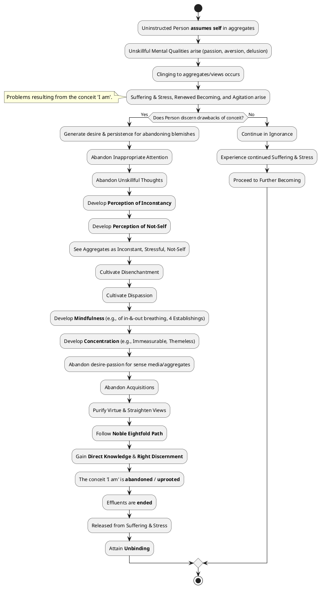
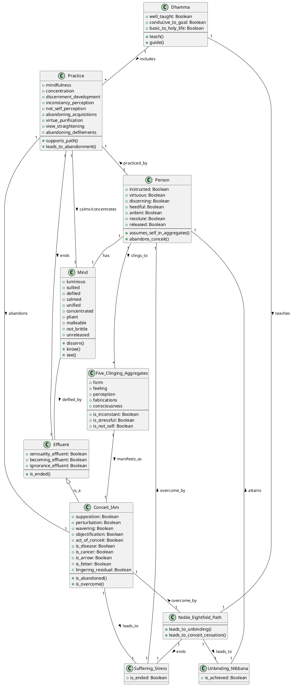

Here is a comprehensive response to your query regarding "The conceit ‘I am’" from the provided sources:

## 1. Definition

The conceit 'I am' is identified as an **act of conceit** and a **view-position**. It is described as a **supposition**, a **perturbation**, a **wavering**, and an **objectification**. It is also categorized as an **obsession** and a **fetter**.

The conceit arises when an uninstructed person assumes form, feeling, perception, fabrications, or consciousness to be the self, or the self as possessing them, or them as being in the self, or the self as being in them. This assumption also includes ideas about "what is seen, heard, sensed, cognized, attained, sought after, pondered by the intellect," or the view that "This cosmos is the self. After death this I will be constant, permanent, eternal, not subject to change. I will stay just like that for an eternity". Even after abandoning the five lower fetters, a **lingering residual 'I am' conceit**, desire, or obsession can remain.

## 2. Problems, Complications & Perplexities

The conceit 'I am' is unequivocally described as a **disease**, a **cancer**, and an **arrow**. For those "possessed by conceit, bound with conceit, delighted with becoming," it leads to **further becoming**, contributing to the **wandering-on**.

Specifically, the sources indicate the following problems:
*   It is among the "effluents that defile, that lead to renewed becoming, that give trouble, that ripen in stress, and lead to future birth, aging, & death".
*   An uninstructed person bound by a "fetter of views" (such as self-identification view) is **not freed from birth, aging, & death, from sorrow, lamentation, pain, distress, & despair**, and consequently, is not freed from suffering & stress.
*   When a person is "seized with the idea that 'I am form' or 'Form is mine'," and that form changes, sorrow, lamentation, pain, distress, & despair arise. This clinging to form (or other aggregates) causes **agitation** and results in fearful, threatened, & solicitous feelings.
*   It leads to **unskillful thoughts** (connected with desire, aversion, or delusion).
*   It is a hindrance to the attainment of **unexcelled safety from bonds** and impedes the realization of **Unbinding**.
*   A mind sullied by such defilements cannot know its own benefit or the benefit of others, nor realize a superior human state or truly noble distinction of knowledge & vision.
*   It leads to disputes: "Whoever supposes 'equal,' 'superior,' or 'inferior,' by that he'd dispute". Self-identity view is identified as the condition for various problematic views to arise.

## 3. Causation

### Causes/conditions for The conceit ‘I am’
*   **Inappropriate attention**: An uninstructed person attends inappropriately to ideas unfit for attention, such as contemplating 'Was I in the past?' or 'Am I?' leading to the arising of views like "I have a self". This inappropriate attention is linked to a lack of mindfulness and alertness, which feeds ignorance.
*   **Lack of discernment**: An uninstructed person who does not discern what ideas are fit or unfit for attention, or who does not discern the origination, disappearance, allure, drawbacks, and escape from phenomena like form, feeling, perception, fabrications, and consciousness, is considered immersed in ignorance.
*   **Clinging/Grasping**: The conceit comes about when an uninstructed person **assumes form, feeling, perception, fabrications, or consciousness to be the self**, or to be possessed by the self, or for the self to be in them, or for them to be in the self.
*   **Craving and Ignorance**: The assumption of self (fabrication) is **born of craving**, which itself arises from contact with ignorance. Ignorance also gives rise to the effluents (including conceit).
*   **Five clinging-aggregates**: Whatever contemplatives or brahmans assume a self, all assume the five clinging-aggregates, or a certain one of them. The "I am" understanding appears with reference to the five faculties (eye, ear, nose, tongue, & body).

### Effects from The conceit ‘I am’
*   **Continuation of suffering and becoming**: The conceit is an "effluent that defiles, that leads to renewed becoming, that gives trouble, that ripen in stress, and lead to future birth, aging, & death".
*   **Mental stress and sorrow**: A person overcome with passion, which includes conceit, experiences mental stress and sorrow.
*   **Inability to discern**: A sullied mind, impacted by such defilements, is incapable of discerning its own benefit or a superior human state.
*   **Disputes**: The supposition of 'equal,' 'superior,' or 'inferior,' which is rooted in conceit, leads to dispute.
*   **Hindrance to arahantship**: One is not an arahant if the 'I am' conceit has not been overcome.

### Other
*   **Craving** acts as a "seamstress" that stitches one to the production of renewed becoming.
*   From **craving** as a requisite condition comes clinging/sustenance, which then leads to becoming, birth, aging, death, sorrow, lamentation, pain, distress, and despair (the origination of stress).
*   The **cessation of ignorance** leads to the cessation of fabrications, consciousness, name-&-form, the six sense media, contact, feeling, craving, clinging/sustenance, becoming, birth, and consequently, the cessation of all stress and suffering.
*   The **mind** itself is described as "luminous" but is "defiled by incoming defilements". Over a long time, the mind can be defiled by passion, aversion, & delusion.

## 4. Arising & Passing Away

The conceit 'I am' manifests itself within the cycle of arising and passing away in connection with the **five clinging-aggregates** and the **six sensory spheres**.
*   It is present in relation to the **five clinging-aggregates** (form, feeling, perception, fabrications, and consciousness).
*   It manifests when an uninstructed person assumes any of the five clinging-aggregates to be "me, my self, or what I am".
*   The "I am" understanding and the "I am" conceit can arise with reference to the **five faculties** (eye, ear, nose, tongue, & body).
*   Disturbances related to 'I am' conceit are "connected with the **six sensory spheres**, dependent on this very body with life as its condition". These six internal sense media (eye, ear, nose, tongue, body, intellect) are seen as "old kamma, fabricated & willed, capable of being felt".
*   The conceit arises in one's **awareness**, particularly when the awareness is "possessed by self-identification view, overcome by self-identification view".
*   It is associated with **views** or "view-positions".

## 5. How To

The abandonment of the conceit 'I am' is a crucial step towards liberation from suffering. It is often referred to as **uprooting the conceit 'I am'**. The sources provide several interconnected methods:

*   **Development of the Perception of Inconstancy and Not-Self**:
    *   One should "develop the perception of inconstancy". When a monk perceives inconstancy, the **perception of not-self is made firm**.
    *   By focusing on **inconstancy** with regard to form, feeling, perception, fabrications, and consciousness, one comes to comprehend them and is "totally released from sorrows, lamentations, pains, distresses, & despairs".
    *   Similarly, focusing on **not-self** with regard to form, feeling, perception, fabrications, and consciousness leads to their comprehension and release from suffering and stress.
    *   Seeing that all phenomena are inconstant, stressful, and not-self leads to **disenchantment, dispassion, and release**.

*   **Direct Knowledge and Right Discernment**:
    *   The ending of effluents, which includes abandoning conceit, comes "for one who knows & sees". This involves knowing and seeing forms, feelings, perceptions, fabrications, and consciousness as they arise and pass away.
    *   **Right discernment** is essential for seeing things "as it has come to be" and for recognizing forms, feelings, etc., as "not mine, not my self, not what I am".
    *   Even the "conceit 'I am'" can be abandoned by **relying on conceit** itself, as seeing another monk's release from effluents can inspire one to question their own state.
    *   Ultimately, "through discernment a person is purified".

*   **Abandoning Greed, Aversion, and Delusion**:
    *   The conceit 'I am' is tied to passion, aversion, and delusion. The **total abandoning of passion-obsession, aversion-obsession, and the "view-&-conceit obsession 'I am'"** through giving rise to clear knowing puts an end to suffering and stress.
    *   The ending of passion, aversion, and delusion is referred to as the **unfabricated**. The mind, when "tamed, guarded, protected, restrained," leads to great benefit.

*   **Following the Noble Eightfold Path**:
    *   The **Noble Eightfold Path** is the path of practice leading to the cessation of stress. It is also the means for the cessation of self-identification, clinging, the six sense media, name-&-form, consciousness, fabrications, and effluents.
    *   It is taught for "disenchantment, to dispassion, to cessation, to stilling, to direct knowledge, to self-awakening, to unbinding".

*   **Development of Concentration and Mindfulness**:
    *   Developing **concentration** leads to the ending of the effluents.
    *   **Immeasurable concentration**, when developed mindfully and astutely, brings five realizations, including knowing when one enters and emerges from concentration mindfully. This also makes the mind pliant, malleable, luminous, and rightly concentrated for ending effluents.
    *   **Mindfulness of in-&-out breathing** is to be developed to cut off distractive thinking and uproot the conceit 'I am'. Remaining "mindful & astute" is crucial.
    *   Developing the **four establishings of mindfulness** acts as "bindings for the awareness" to break household habits, leading to the attainment of the right method and realization of unbinding. They also lead to the comprehension of the body, feelings, mind, and mental qualities, and the realization of the deathless.
    *   Focusing on the **arising & passing away of the five clinging-aggregates** helps in abandoning any conceit that 'I am'.
    *   Mindfulness immersed in the body is highlighted as "very helpful".

*   **Abandoning Acquisitions and Clinging**:
    *   Realizing that **acquisitions are the root of suffering & stress** and achieving release in the ending of acquisitions leads to being unfettered.
    *   The "subduing of desire-passion" for the aggregates (form, feeling, perception, fabrications, consciousness) means the "support is cut off, and there is no landing of consciousness," leading to release and total unbinding.

*   **Purifying Virtue and Straightening Views**:
    *   A monk should first "purify the very basis with regard to skillful mental qualities" by having **well-purified virtue and views made straight**. This forms the foundation for further development, such as the four establishings of mindfulness.
    *   A virtuous monk should attend to the five clinging-aggregates as **inconstant, stressful, not-self**, which can lead to the fruit of stream-entry.

*   **Other supportive practices**:
    *   **Relinquishing of speculations about the past and future** and not being determined by sensual fetters or various types of pleasure or feeling also supports freedom from clinging.
    *   Not measuring or judging other individuals is also suggested, as "He's conceited, anyone who takes the measure of other individuals".
    *   An ardent and compunctious person is capable of self-awakening and unbinding.

## PART-B: PlantUML Diagrams

### 1. PlantUML Activity Diagram

### 2. PlantUML Class Diagram

