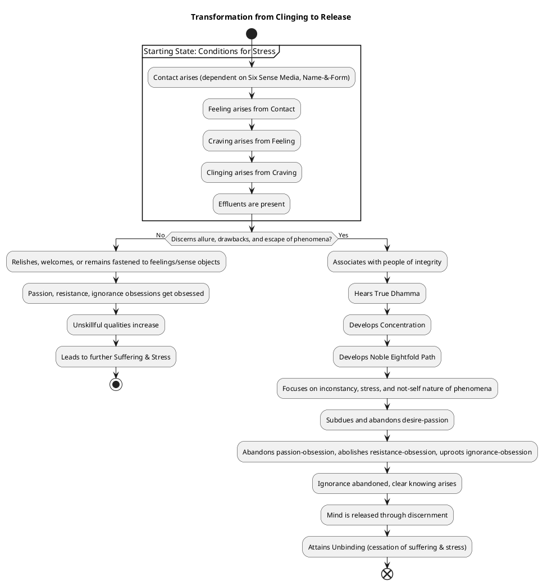
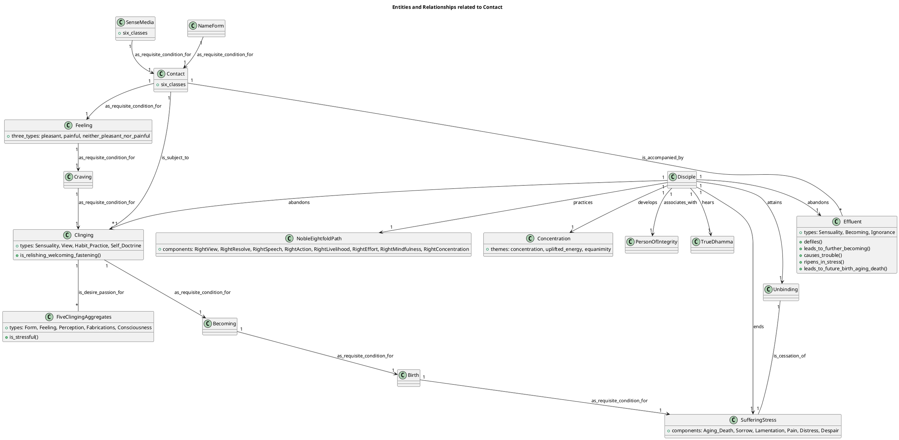

Here is a comprehensive response to your query regarding "Contact accompanied by effluents & subject to clinging" from Dasuttara Sutta (DN 34), drawing on the provided sources and following your specified structure:

## 1. Definition

The phrase "Contact accompanied by effluents & subject to clinging" refers to a specific dhamma or quality that **should be comprehended**.

*   **Contact (phassa)**: This refers to the meeting of three things, such as the eye, forms, and eye-consciousness. There are six classes of contact: eye-contact, ear-contact, nose-contact, tongue-contact, body-contact, and intellect-contact.
*   **Effluents (āsava)**: These are defilements that lead to further becoming, cause trouble, ripen in stress, and result in future birth, aging, and death. The three kinds of effluents are sensuality, becoming, and ignorance.
*   **Clinging (upādāna)**: This is described as the desire and passion regarding the five clinging-aggregates. There are four types of clinging: sensuality clinging, view clinging, habit & practice clinging, and doctrine of self clinging. Clinging manifests as relishing, welcoming, and remaining fastened to feelings.
*   **Five Clinging-Aggregates**: These are form, feeling, perception, fabrications, and consciousness. These aggregates are inherently stressful.

## 2. Allure & Drawbacks

These qualities, particularly contact, need to be comprehended because of their inherent allure and drawbacks, which can lead to suffering if not properly understood.

*   **Allure**: Pleasure and happiness can arise in dependence on contact. When individuals relish, welcome, and remain fastened to pleasing forms, sounds, aromas, flavors, tactile sensations, and ideas, delight arises, leading to impulsion and being fettered. This delight in the six media of sensory contact is a source of stress.
*   **Drawbacks**: The primary drawback is that phenomena like form, feeling, perception, fabrications, and consciousness (which arise from contact) are **inconstant, stressful, and subject to change**. If one relishes pleasant feelings, sorrows over painful feelings, or fails to discern the true nature of neutral feelings, it leads to obsessions with passion, resistance, or ignorance, making it impossible to end suffering and stress. Not discerning the allure, drawbacks, and escape from the six sense media means one has not escaped the cycle of suffering in the cosmos.

## 3. Causation

### Causes/conditions for Contact
*   Contact comes into play from the **six sense media** as a requisite condition.
*   Contact also arises from **name-&-form** as a requisite condition.

### Effects from Contact
*   From contact as a requisite condition comes **feeling**.
*   From feeling as a requisite condition comes **craving**.
*   Contact is the origination for **kamma (action)**.
*   Contact is the origination of **perceptions, thoughts, and resolves**.
*   Various **views** (e.g., eternalism, annihilationism) come from contact as a requisite condition.
*   **Agitation and vacillation** come from contact as a requisite condition when one is immersed in craving.

### Other
*   The cessation of contact leads to the cessation of **feeling**.
*   The origination of the world is dependent on the eye and forms, leading to eye-consciousness, contact, feeling, craving, clinging, becoming, birth, and consequently, aging-and-death, sorrow, lamentation, pain, distress, and despair.
*   The six contact-media are considered dependently co-arisen phenomena.

## 4. Arising & Passing Away

These qualities manifest themselves as momentary phenomena that are in a continuous cycle of arising and passing away.

*   Contact, like other phenomena such as eye, forms, consciousness, feeling, perception, and intention, is described as **inconstant, changeable, and alterable**.
*   The process involves intellect and ideas leading to intellect-consciousness; the meeting of these three is **contact**. From contact, feeling arises, which then leads to perception, thinking, and finally, complications that manifest as perceptions and categories of objectification in relation to past, present, and future ideas.
*   When one is contacted, one feels, intends, and perceives; these phenomena are described as **wavering and fluctuating**, inconstant, changeable, and of a nature to become otherwise.
*   One is "immersed in ignorance" if they do not discern contact's origination, passing away, and its origination & passing away. Conversely, clear knowing arises for an instructed disciple who discerns these aspects of contact.
*   When feelings arise from contact, a lack of discernment (relishing pleasure, sorrowing over pain, or not understanding neutral feelings) leads to **passion, resistance, or ignorance obsessions**, preventing the cessation of suffering.

## 5. How To

To grow disenchanted with "Contact accompanied by effluents & subject to clinging" and ultimately end suffering, one must engage in a process of direct knowing and practice.

*   **Discernment**: One must discern, as they have come to be, the origination, passing away, allure, drawbacks, and escape from these qualities (like contact, feelings, aggregates, and effluents). The Dhamma is taught for the purification of beings and the realization of unbinding by knowing and seeing things as they are.
*   **Focus on Impermanence**: An instructed disciple should keep focusing on the **inconstancy, stressfulness, and not-self** nature of form, feeling, perception, fabrications, and consciousness.
*   **Abandon Desire-Passion**: The subduing and abandoning of desire-passion for contact (and related phenomena like forms, feelings, perceptions, fabrications, and consciousness) is the **escape** from them. When one does not relish or remain fastened to sensual objects and ideas, delight does not arise, which leads to the **cessation of suffering and stress**. This involves abandoning passion-obsession, abolishing resistance-obsession, and uprooting ignorance-obsession.
*   **Develop Concentration**: A monk should develop concentration to discern the inconstant nature of the eye, forms, eye-consciousness, eye-contact, and feelings arising from it.
*   **Noble Eightfold Path**: This path is the practice leading to the cessation of contact and feeling. It is developed for direct knowledge, comprehension, and the abandoning of the four floods (sensuality, becoming, views, ignorance).
*   **Association and Hearing Dhamma**: **Associating with people of integrity** and **hearing the true Dhamma** can help one understand that these clinging-based phenomena are "diseases, cancers, arrows," leading to their cessation.

---

## PART-B: PlantUML Diagrams

### 1. Activity Diagram

### 2. Class Diagram

