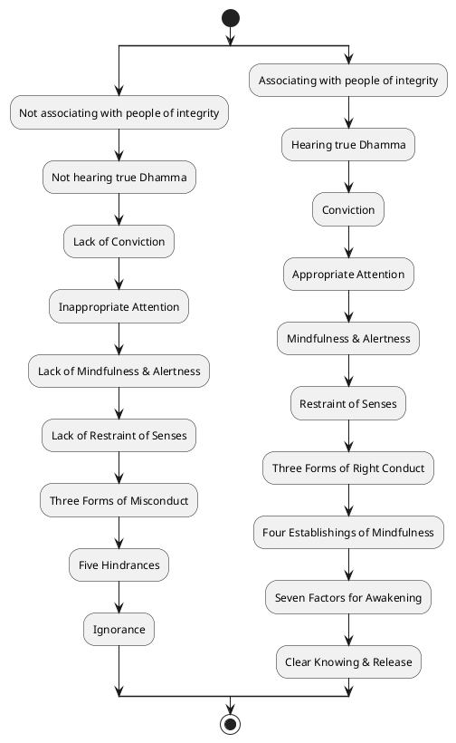
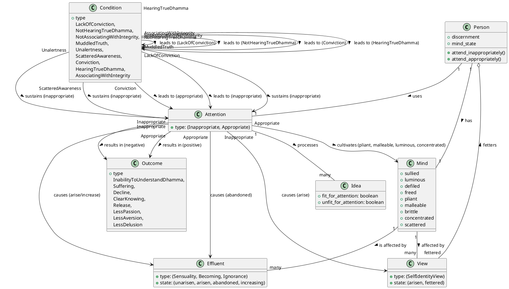

Here is a comprehensive response regarding "Inappropriate attention" drawn from the provided sources:

## 1. Definition

**Inappropriate attention** is primarily characterized by a **lack of discernment** regarding what ideas are fit for attention and, consequently, attending to ideas that are unfit. This can manifest in several ways:

*   **Failure to comprehend teachings:** It involves not attending to the beginning, middle, or end of a discourse, likened to water poured on an upside-down pot that runs off and doesn't stay.
*   **Perplexity about self and existence:** It leads to inward perplexity concerning past, future, and present states of self, such as questioning "Was I in the past?" or "Am I? Am I not? What am I?".
*   **Focus on defiling themes:** It includes attending inappropriately to "the theme of the attractive," "the theme of irritation," or generally to anything that fosters passion, aversion, or delusion.

## 2. Consequences & Liabilities

Engaging in inappropriate attention has significant detrimental impacts and leads to several negative states:

*   **Hindrance to Dhamma understanding:** One becomes **incapable of alighting on the orderliness or rightness of skillful qualities**, even when listening to the true Dhamma.
*   **Propagation of defilements and effluents:** It causes **unarisen passion, aversion, and delusion to arise and existing ones to grow and abound**. Similarly, unarisen effluents (of sensuality, becoming, and ignorance) arise, and arisen ones increase.
*   **Development of wrong views:** It leads to the formation of **six kinds of self-identity views**, which are described as a "thicket of views," "wilderness of views," "contortion of views," "writhing of views," and a "fetter of views".
*   **Entanglement in suffering and stress:** Being bound by these wrong views, the uninstructed person is **not freed from birth, aging, death, sorrow, lamentation, pain, distress, despair, or overall suffering & stress**.
*   **Overall decline:** Inappropriate attention is explicitly identified as a quality that is "on the side of decline".

## 3. Causation

### Causes/conditions for Inappropriate attention

*   **Lack of Conviction:** This is cited as a direct "food" or requisite condition for the arising of inappropriate attention.
*   **Not Hearing True Dhamma:** This is the condition that fosters a lack of conviction.
*   **Associating with People of No Integrity:** This is the initial condition in a chain that leads to not hearing the true Dhamma, thereby ultimately contributing to inappropriate attention.
*   **Muddled Truth, Unalertness, and Scattered Awareness:** These qualities make one incapable of abandoning inappropriate attention, implying they contribute to its persistence.

### Effects from Inappropriate attention

*   **Arising and Growth of Defilements:** Inappropriate attention directly causes **unarisen passion, aversion, and delusion to arise, and existent ones to grow and abound**.
*   **Increase of Effluents:** Through attending to ideas unfit for attention, both **unarisen effluents (sensuality, becoming, ignorance) arise and arisen effluents increase**.
*   **Lack of Mindfulness & Alertness:** Inappropriate attention is a direct cause for a lack of mindfulness and alertness.
*   **Lack of Sense Restraint:** The lack of mindfulness and alertness, resulting from inappropriate attention, then leads to a **lack of restraint of the senses**.
*   **Three Forms of Misconduct:** This lack of restraint contributes to the **three forms of misconduct** (bodily, verbal, mental).
*   **Five Hindrances:** These forms of misconduct, in turn, contribute to the **five hindrances**.
*   **Ignorance:** The complete development of these hindrances culminates in **ignorance**.
*   **Formation of Wrong Views:** Inappropriate attention leads to the arising of **six kinds of wrong self-identity views**, binding an individual with a "fetter of views".
*   **Continued Suffering:** Being bound by these views means the uninstructed person is **not freed from birth, aging, death, sorrow, lamentation, pain, distress, despair, or overall suffering & stress**.

### Other

The sources present **appropriate attention** as the direct opposite and antidote to inappropriate attention, leading to positive outcomes.

## 4. Arising & Passing Away

Inappropriate attention manifests as a **mental quality** that impacts how the mind processes phenomena. When the mind is in this state, it is described as being **"defiled by incoming defilements"**. Specifically, it is the process by which individuals attend to "ideas unfit for attention", leading to the **arising of various self-identity views** concerning their past, present, and future existence. This inappropriate way of attending directly causes **unarisen effluents to arise and existing effluents to increase**. An unguarded and unrestrained mind, which is characteristic of inappropriate attention, can lead to great harm.

## 5. How To

Avoiding inappropriate attention involves cultivating its opposite, "appropriate attention," and addressing the conditions that foster inappropriate attention:

*   **Cultivate Appropriate Attention:** This is the direct method to prevent the arising and abandon the growth of delusion, passion, and aversion. One who attends appropriately is capable of understanding the Dhamma and alighting on skillful qualities.
*   **Attend to Fit Ideas:** Actively **avoid attending to "ideas unfit for attention"** and instead attend to "ideas fit for attention". Ideas fit for attention are those that prevent unarisen effluents from arising and lead to the abandonment of arisen ones (sensuality, becoming, ignorance).
*   **Shift Focus to Skillful Themes:** When unskillful thoughts related to desire, aversion, or delusion arise, one should **shift their attention to a different theme that is connected with what is skillful**.
*   **Scrutinize Drawbacks of Unskillful Thoughts:** Reflect on the downsides of unskillful thoughts, recognizing them as blameworthy and leading to stress.
*   **Relax Thought-Fabrication:** Actively **attend to the relaxing of the mental process that forms thoughts** to cause unskillful thoughts to subside.
*   **Cultivate Qualities of a Wise Person:** This involves being able to **formulate and answer questions appropriately**, and to approve when others do so, demonstrating discernment.
*   **Follow the Path of Cultivation:** This path begins with **associating with people of integrity**, which leads to hearing the true Dhamma, developing conviction, and subsequently, appropriate attention. This chain continues through mindfulness, alertness, restraint of senses, right conduct, establishings of mindfulness, and factors for awakening, culminating in clear knowing and release.
*   **Abandon Hindering Qualities:** Being able to abandon "muddled truth, unalertness, and scattered awareness" makes one capable of abandoning inappropriate attention.

***

## PART-B: PlantUML Diagrams

### 1. Activity Diagram

### 2. Class Diagram

