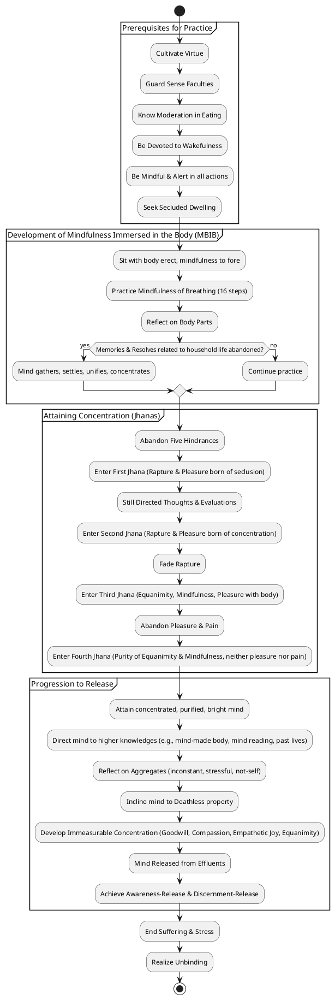
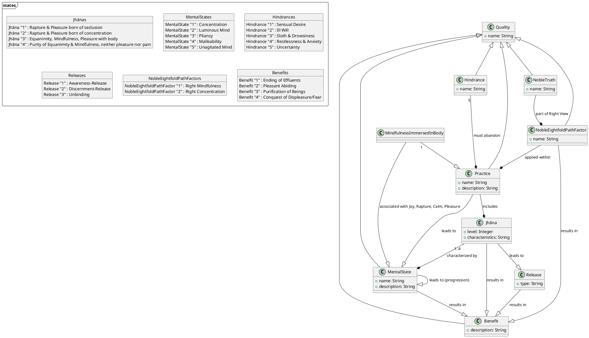

## 1. Definition

**"Mindfulness immersed in the body connected with joy"** is a quality that should be developed. While the specific compound phrase is rare, its components are extensively defined in the sources.

*   **Mindfulness immersed in the body (Kāyagatāsati)** refers to a practice where a monk focuses intently on his own body. This involves sitting with legs crossed, body erect, and mindfulness established to the fore, practicing in-and-out breathing. It can also involve reflecting on the body's various parts and their unclean nature. It is considered a "strong post or stake" for steadying the mind.
*   The **"connected with joy"** aspect points to the pleasant mental states that arise from developing concentration. Specifically, the **first jhāna** is characterized by **rapture and pleasure born of seclusion**. The **second jhāna** involves **rapture and pleasure born of concentration**. These states are achieved through seclusion from sensuality and unskillful qualities. Such concentration makes the mind "pliant, malleable, luminous, and not brittle". This "luminous" mind is described as being defiled by incoming defilements in uninstructed individuals, but for the well-instructed, it is freed from these defilements.

## 2. Purpose & Benefits

The cultivation of "mindfulness immersed in the body connected with joy" and related practices serves multiple crucial purposes, primarily leading to the **ending of suffering and stress (dukkha)** and the **realization of unbinding (nibbāna)**.

*   **Primary Benefits:**
    *   It is a **direct path for the purification of beings**, for overcoming sorrow and lamentation, for the disappearance of pain and distress, and for the attainment of the right method and realization of unbinding.
    *   When developed, it helps the mind become **pliant, malleable, luminous, and not brittle**, making it rightly concentrated for the ending of effluents.
    *   It leads to **pleasant abiding in the here and now**. The first jhāna offers rapture and pleasure born of seclusion, while the second jhāna provides rapture and pleasure born of concentration.
    *   It contributes to the **abandonment of passion** (through the first jhāna) and **ignorance** (through the fourth jhāna).
    *   Developing mindfulness immersed in the body specifically leads to **conquering displeasure and delight**, **conquering fear and dread**, and **obtaining the four jhānas readily**.
    *   It also culminates in **effluent-free awareness-release and discernment-release** in the here and now.

*   **Supporting Benefits:**
    *   **Joy, rapture, calm, and pleasure** arise, which in turn lead to the **mind becoming concentrated**.
    *   A monk with a **well-developed mind of good-will** (a type of immeasurable concentration) is said to be more fruitful than vast offerings.
    *   It helps to **abandon unskillful qualities** and **develop skillful qualities**.
    *   It is conducive to **disenchantment, dispassion, cessation, stilling, direct knowledge, self-awakening, and unbinding**.
    *   With the development of concentration, one **discerns things as they have come to be**, such as the impermanence of the eye, forms, consciousness, and contact.
    *   When mindfulness immersed in the body is developed, **pains arising in the body do not invade or remain in the mind**.

## 3. Causation

### Causes/conditions for Mindfulness immersed in the body

*   **Abandoning five hindrances:** Sensual desire, ill will, sloth & drowsiness, restlessness & anxiety, and uncertainty must be abandoned before entering the first jhāna. Listening to the Dhamma receptively and attentively can help make these hindrances non-existent.
*   **Seclusion:** To enter the jhānas, one must be quite **secluded from sensuality** and **secluded from unskillful qualities**. This can involve seeking out a wilderness, shade of a tree, or empty dwelling.
*   **Right effort and appropriate attention:** A monk keeps persistence aroused for abandoning unskillful and taking on skillful qualities. Focusing the mind on an inspiring theme can lead to gladness and concentration.
*   **Virtue and well-purified views:** Well-purified virtue and straight views are the basis for developing the four establishings of mindfulness, which can then lead beyond Māra's realm. Consummate virtue is a conduct factor enabling one to obtain jhānas.
*   **Guarding sense faculties, moderation in eating, devotion to wakefulness, mindfulness & alertness:** These practices are prerequisites for the contemplative state.
*   **Appropriate attention to the five clinging-aggregates:** Viewing them as inconstant, stressful, and not-self can lead to the fruit of stream-entry.
*   **Recollection practices:** Recollecting the Buddha, Dhamma, Saṅgha, one's own virtues, generosity, and devas, can prevent the mind from being overcome with passion, aversion, or delusion, leading to joy, rapture, calm, ease, and concentration.

### Effects from Mindfulness immersed in the body connected with joy

*   **Mind becomes concentrated:** Joy, rapture, and calm lead to the mind becoming concentrated. When the mind is concentrated, phenomena become manifest.
*   **Abandonment of defilements/effluents:** A concentrated mind discerns things as they have come to be, leading to the **ending of effluents**. The mind is released from the effluent of sensuality, becoming, and ignorance.
*   **Release and Unbinding:** The culmination of concentration, along with discernment, leads to **awareness-release and discernment-release**. This is described as **putting an end to suffering and stress** and **realizing unbinding (nibbāna)**.
*   **Higher Knowledges/Powers:** A mind that is concentrated, purified, bright, unblemished, free from defects, pliant, malleable, steady, and imperturbable can be directed to knowledge and vision, creating a mind-made body, supranormal powers, divine ear, mind reading, recollection of past lives, knowledge of passing away and reappearance of beings, and the knowledge of the ending of effluents.

### Other

*   **Stilling of thoughts/fabrications:** In the first jhāna, the perception of sensuality ceases. In the second jhāna, directed thoughts and evaluations (verbal fabrications) cease. In the third jhāna, rapture ceases. In the fourth jhāna, in-and-out breaths (bodily fabrications) cease.
*   **Lack of clinging:** When consciousness is not externally scattered and diffused, nor internally positioned (attached to jhāna states), from lack of clinging or sustenance, it becomes **unagitated**, and there is no seed for future birth, aging, death, or stress.
*   **Dependent Co-arising:** From the origination of contact comes the origination of feeling. From the cessation of contact comes the cessation of feeling. Craving is the path leading to the origination of feeling. The ending of craving leads to the ending of action and thus the ending of stress.

## 4. Noble Path

"Mindfulness immersed in the body connected with joy" and the associated concentrated states are fundamental aspects of the **Noble Eightfold Path**, particularly under **Right Mindfulness** and **Right Concentration**.

*   **Right Mindfulness (Sammā-sati):** A monk remains focused on the **body in & of itself**, feelings in & of themselves, the mind in & of itself, and mental qualities in & of themselves—ardent, alert, & mindful—subduing greed & distress with reference to the world. Mindfulness immersed in the body is explicitly stated as bringing the four establishings of mindfulness to culmination.
*   **Right Concentration (Sammā-samādhi):** This is defined by the attainment of the **four jhānas**. These jhānas are described as pleasant abidings in the here and now. The process involves seclusion from sensuality and unskillful qualities, leading to rapture, pleasure, internal assurance, equanimity, and pure, bright awareness.
*   **Interconnectedness of Path Factors:** The Noble Eightfold Path, when developed and pursued, brings the four establishings of mindfulness, four right exertions, four bases of power, five faculties, five strengths, and seven factors for awakening to their culmination. This path leads to the subduing of passion, aversion, and delusion.

## 5. How To

The development of "mindfulness immersed in the body connected with joy" and associated concentration is a step-by-step process involving specific practices and the cultivation of certain qualities.

*   **Setting the Stage (Prerequisites):**
    *   **Virtue (Sīla):** One should be virtuous, restrained according to the Pāṭimokkha, consummate in behavior, seeing danger in the slightest faults.
    *   **Guarding the Sense Faculties:** On seeing, hearing, smelling, tasting, feeling, or cognizing, one should not grasp at themes or variations that would lead to unskillful qualities like greed or distress. Practice restraint and protect the senses.
    *   **Moderation in Eating:** One should know moderation in food.
    *   **Devotion to Wakefulness:** During the day and night, one should cleanse the mind of qualities that would hold it in check, often by sitting and pacing, and even when reclining, maintain alertness with the mind set on getting up.
    *   **Mindfulness & Alertness:** Maintain alertness when going forward, returning, looking around, bending limbs, carrying robes, eating, drinking, and in all bodily and verbal actions. Be mindful of feelings, perceptions, and thoughts as they arise, persist, and subside.
    *   **Seeking Seclusion:** Find a secluded dwelling like a wilderness, tree shade, or empty building.

*   **Practice of Mindfulness Immersed in the Body (Kāyagatāsati):**
    *   **Mindfulness of Breathing (Ānāpānasati):** This is a core technique. Sit with legs crossed, body erect, and mindfulness to the fore.
        *   Breathe in long, breathe out long.
        *   Breathe in short, breathe out short.
        *   Train oneself to breathe in and out sensitive to the entire body.
        *   Train oneself to breathe in and out calming bodily fabrication.
        *   Train oneself to breathe in and out sensitive to rapture and pleasure.
        *   Train oneself to breathe in and out sensitive to the mind, gladdening, steadying, and releasing the mind.
        *   Train oneself to breathe in and out focusing on inconstancy, dispassion, cessation, and relinquishment.
    *   **Reflection on Body Parts:** Reflect on the body from head to foot, identifying various unclean parts within (e.g., hairs, nails, organs, bodily fluids).

*   **Attaining Concentration (Jhānas):**
    *   As one remains heedful, ardent, and resolute during these practices, memories and resolves related to household life are abandoned. With their abandoning, the mind **gathers and settles inwardly, grows unified and concentrated**.
    *   **Abandoning Hindrances:** The four jhānas are attained after abandoning the five hindrances.
    *   **First Jhāna:** Secluded from sensuality and unskillful qualities, one enters and remains in the first jhāna, characterized by **rapture and pleasure born of seclusion**, accompanied by directed thought and evaluation. This state permeates the entire body.
    *   **Second Jhāna:** With the stilling of directed thoughts and evaluations, one enters and remains in the second jhāna, with **rapture and pleasure born of concentration**, unification of awareness, and internal assurance. This rapture and pleasure pervades the body.
    *   **Third Jhāna:** With the fading of rapture, one remains equanimous, mindful, and alert, sensing pleasure with the body. This is a state of pleasant abiding. The pleasure pervades the body.
    *   **Fourth Jhāna:** With the abandoning of pleasure and pain, one enters and remains in the fourth jhāna, characterized by **purity of equanimity and mindfulness, neither pleasure nor pain**. A pure, bright awareness permeates the body.

*   **Progression beyond Concentration:**
    *   While in the jhānas, a monk can further reflect on the phenomena of form, feeling, perception, fabrications, and consciousness as **inconstant, stressful, a disease, not-self**, and turn the mind to the **deathless property**.
    *   One should also direct the mind to **immeasurable concentration** based on goodwill, compassion, empathetic joy, or equanimity, developing it mindfully and astutely. This involves realizing one enters and emerges from concentration mindfully.
    *   The practice of mindfulness of in-and-out breathing brings the **four establishings of mindfulness to their culmination**, which then bring the **seven factors for awakening to their culmination**, and these in turn bring **clear knowing and release to their culmination**.

## PART-B: PlantUML Diagrams

### 1. PlantUML Activity Diagram

### 2. PlantUML Class Diagram

