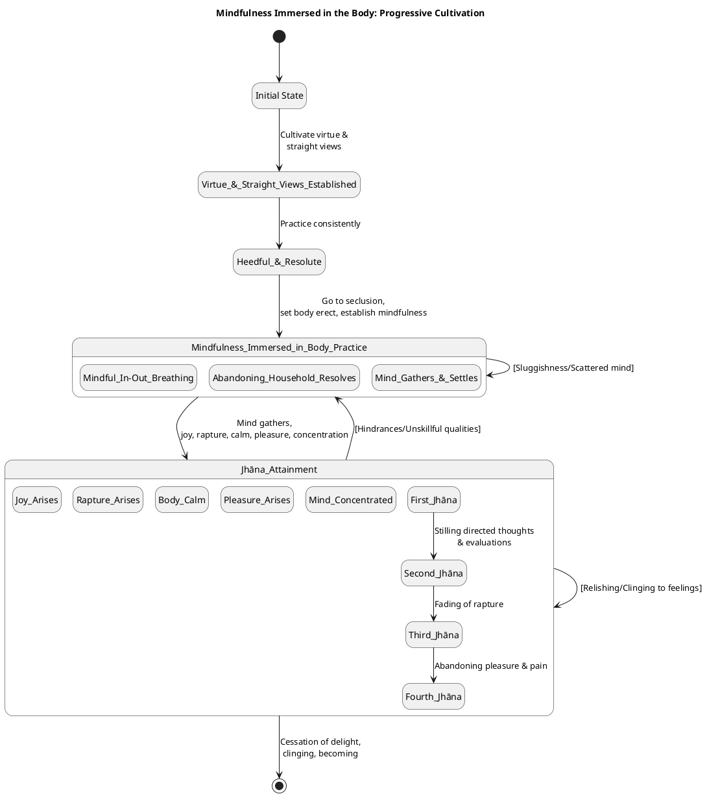
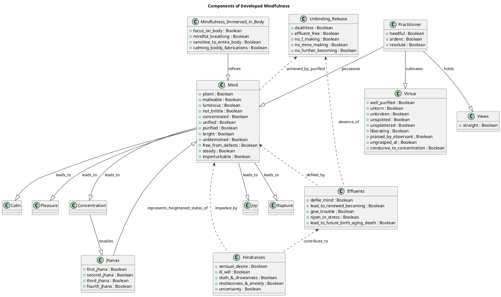

# **Mindfulness immersed in the body connected with joy**

## 1. Definition
Mindfulness immersed in the body (Kāyagatā-sati) is a practice that involves **active cultivation and ongoing transformation** within the holy life. It centers on a monk intently focusing on the body itself, encompassing careful observation of **in-and-out breathing**. The practitioner trains to be sensitive to the entire body and to calm bodily fabrications while breathing. This diligent practice enables the **mind to gather, settle inwardly, grow unified, and become concentrated**. As a result, joy and rapture arise, leading to bodily calm, pleasure, and ultimately a deeply concentrated mind. The inherent nature of this quality is to progressively refine awareness and mental states, and its ultimate purpose in progressing along the path is to serve as a **path leading to the unfabricated**, gaining a footing in the Deathless, and having the Deathless as its final end. It leads to the **purification of beings, the overcoming of sorrow and lamentation, the disappearance of pain and distress, the attainment of the right method, and the realization of unbinding**.

## 2. Considerations
Diligently cultivating and progressively deepening mindfulness immersed in the body is of **profound significance for masterful practice**. This practice allows the mind to become **pliant, malleable, luminous, and not brittle**, thereby becoming rightly concentrated for the ending of the effluents. It is identified as the **direct path for the purification of beings**, leading to the cessation of suffering and the realization of unbinding. Through its consistent development, the practitioner experiences a transformative sequence: **joy arises, followed by rapture, then the body grows calm, pleasure is felt, and the mind becomes concentrated**. This sequence fosters the abandonment of unskillful mental qualities and the increase of skillful ones.

The diligent development of this practice actively counters heedlessness by cultivating **constant mindfulness and alertness** in all activities. It prevents complacency by consistently linking effort to observable internal benefits and preventing a false sense of confidence. When practicing, the mind is not overcome by passion, aversion, or delusion, directly contributing to a sense of the goal and Dhamma. The enduring advantage gained by consistently developing mindfulness immersed in the body is the **culmination of clear knowing and release**, ultimately leading to the **effluent-free awareness-release and discernment-release**.

## 3. Causation
The development of mindfulness immersed in the body connected with joy unfolds through a specific progression, supported by various enabling conditions and leading to refined states. The practitioner discerns opportune moments and necessary conditions for sustaining this cultivation.

*   **Essential Enabling Conditions and Initiation Factors:**
    *   A **well-purified virtue and views made straight** serve as the fundamental basis for the arising of skillful mental qualities and the development of mindfulness.
    *   **Heedfulness, ardency, and resoluteness** are vital for initiating and maintaining this practice.
    *   **Seclusion**—such as going to a wilderness, the foot of a tree, or an empty dwelling—provides the necessary environment.
    *   The practice begins by **sitting with legs folded crosswise, holding the body erect, and establishing mindfulness to the fore**.
    *   **Abandoning memories and resolves related to household life** is crucial for the mind to gather and settle inwardly.
    *   **Appropriate attention** is a key factor that allows skillful qualities to arise.

*   **Requisite and Result Pairs (Developmental Flow):**
    1.  **Mindful In-and-Out Breathing** (sensitive to entire body, calming bodily fabrication) is a requisite condition, leading to the **development of mindfulness immersed in the body**.
    2.  As one remains heedful, ardent, and resolute, **unskillful qualities (memories, resolves related to household life)** are abandoned.
    3.  With the abandoning of unskillful qualities, the **mind gathers, settles inwardly, becomes unified, and concentrated**.
    4.  When the mind is sensitive to the meaning and Dhamma (through recollection, etc.), **joy is born**.
    5.  In one who is joyful, **rapture arises**.
    6.  In one whose mind is enraptured, the **body grows calm**.
    7.  When the body is calm, one **feels pleasure**. This pleasure can be pervaded throughout the body, as seen in the third jhāna.
    8.  Feeling pleasure, the **mind becomes concentrated**, leading to the attainment of the four jhānas.
    9.  The concentrated mind, through continued practice of seeing phenomena as inconstant, stressful, and not-self, and by not clinging to feelings, leads to the **cessation of delight, clinging, becoming, and ultimately the ending of suffering and stress**.

The opportune moments for cultivating this practice are those of **seclusion and sustained effort**. The necessary enabling conditions are a strong ethical foundation, clear understanding of the Dhamma, and persistent application of the training factors.

## 4. Complications
The development of mindfulness immersed in the body connected with joy can be **impeded or undermined by various challenges, hindrances, and unskillful states**. These specific pitfalls and resistances hinder the cultivation process:

*   **Incoming Defilements and Lack of Discernment:** The luminous mind can be **defiled by incoming defilements**, especially if one is an uninstructed run-of-the-mill person who doesn't discern things as they have come to be, leading to a lack of mind development. This perpetuates suffering.
*   **Unskillful Mental Qualities:** The presence of **passion, aversion, and delusion** are root causes of unskillful actions and prevent the mind from being released and discerning. Any increase in these unskillful qualities while skillful ones decline renders practice fruitless.
*   **The Five Hindrances:** These are major obstacles that **overwhelm awareness and weaken discernment**.
    *   **Laziness and Restlessness:** Attending solely to concentration can lead to laziness, while focusing only on uplifted energy can cause restlessness. Overly slack or over-aroused persistence contributes to these states.
    *   **Sloth & Drowsiness, Restlessness & Anxiety, Uncertainty:** These specifically impede the mind's ability to be concentrated and manifest phenomena.
*   **Conceit and Attachment:** **I-making and mine-making conceit-obsession** prevent awareness-release and discernment-release. Failure to uproot the conceit "I am" means one has not arrived at the fruit of mental development.
*   **Lack of Development and Its Consequences:** If the seven factors for awakening (which include elements of mindfulness and concentration) are **neglected, the noble path leading to the ending of suffering and stress is neglected**. An undeveloped body and mind are invaded by pleasant and painful feelings, leading to sorrow, grief, and lamentation.
*   **Relishing and Clinging:** **Relishing, welcoming, or remaining fastened to feelings** (especially pleasant ones) allows passion-obsession to arise, preventing the end of suffering. Even relishing equanimity can prevent total unbinding.
*   **Attachment to Aggregates:** Any desire, embracing, grasping, and holding-on to the five clinging-aggregates **is the origination of stress**. If the mind is hindered by ignorance and fettered by craving, consciousness becomes established, leading to renewed becoming.

These complications highlight that the **lack of development or regression** in mindfulness immersed in the body perpetuates unfavorable outcomes and suffering. They manifest as difficulties in reconciling the attention to deep training with the constant arising of momentary phenomena, as the mind becomes agitated and consumed when it clings or is sustained by unskillful qualities.

## 5. How To
To effectively initiate, sustain, and deepen the cultivation of mindfulness immersed in the body connected with joy, guiding the practitioner towards becoming a masterful practitioner, one should engage in the following practical methods:

*   **Establish a Foundational Practice:**
    *   **Purify Virtue and Straighten Views:** This forms the fundamental basis for all skillful mental qualities. A practitioner should dwell **restrained in accordance with the Pāṭimokkha**, consummate in behavior, and discerning of danger in even the slightest faults.
    *   **Cultivate Verified Confidence:** Develop strong conviction in the Buddha, Dhamma, and Saṅgha, as this is a source of joy and concentration that helps align the mind.
    *   **Practice Good Conduct:** Actively abandon unskillful bodily, verbal, and mental conduct, and develop admirable, skillful actions in their place.

*   **Master Mindful Breathing (Ānāpānasati):**
    *   **Regular, Secluded Practice:** Go to a wilderness, under a tree, or an empty dwelling, sit erect, and establish mindfulness to the fore.
    *   **Breath Awareness:** Consciously discern long and short in-and-out breaths, and train to be **sensitive to the entire body while calming bodily fabrication**.
    *   **Mental Sensitivity to Breath:** Progressively train to breathe in/out sensitive to, gladdening, steadying, and releasing the mind. Further, train to breathe in/out focusing on inconstancy, dispassion, cessation, and relinquishment.

*   **Progress Through Jhānas (Heightened Mental States):**
    *   **First Jhāna:** Achieve seclusion from sensuality and unskillful qualities, entering into rapture and pleasure born of seclusion, accompanied by directed thought and evaluation. This stage involves pervading the body with this rapture and pleasure.
    *   **Second Jhāna:** With the stilling of directed thoughts and evaluations, enter rapture and pleasure born of concentration, characterized by unification of awareness.
    *   **Third Jhāna:** With the fading of rapture, remain equanimous, mindful, and alert, sensing pleasure with the body. Pervade the entire body with this pleasure divested of rapture.
    *   **Fourth Jhāna:** With the abandoning of pleasure and pain, enter into purity of equanimity and mindfulness, neither pleasure nor pain.

*   **Actively Counter Unskillful Qualities:**
    *   **Periodic Attention:** Periodically attend to the themes of concentration, uplifted energy, and equanimity to ensure the mind remains **pliant, malleable, and luminous** for the ending of effluents and to counter laziness or restlessness.
    *   **Develop Sublime Attitudes (Brahmavihāras):** Pervade all directions with **goodwill, compassion, empathetic joy, and equanimity**. This is an immeasurable concentration that directly counters passion and ill will.
    *   **Apply Appropriate Attention:** When unskillful thoughts arise, switch attention to a skillful theme to abandon those thoughts and steady the mind.
    *   **Reflect on Impermanence and Not-Self:** Constantly reflect on forms, feelings, perceptions, fabrications, and consciousness as **inconstant, stressful, and not-self**. This helps abandon desire-passion and uproot the conceit of "I am".

*   **Maintain Heedfulness and Sense Restraint:**
    *   **Continuous Heedfulness:** Remain **heedful, ardent, and resolute** in all activities; this is the root of all skillful qualities.
    *   **Guard Sense Faculties and Moderation in Food:** Practicing restraint of the senses and moderation in eating prevents defilements from arising and supports the development of concentration.
    *   **Embrace Seclusion and Contentment:** The Dhamma is specifically for those who are reclusive and content, not entangled or discontent.

By integrating these practices diligently, a practitioner can initiate, sustain, and deepen their mindfulness, cultivating profound joy, and progressing towards higher states of concentration and ultimate liberation.

## 6. Similes
Similes help the practitioner discern the **dynamic nature, progressive stages, or transformative potential** of cultivating mindfulness immersed in the body connected with joy.

*   **Water Permeating Lotuses (featured quality: pervasive pleasure/calm):**
    *   **Simile:** Just as lotuses, born and growing in water, remain immersed and flourish without standing out, so that they are **permeated and pervaded, suffused and filled with cool water from their roots to their tips**, leaving no part unpervaded.
    *   **Explanation:** This simile illustrates the **pervasive and saturating nature of the pleasure experienced in the third jhāna**, a direct result of mindfulness and concentration. It shows how the mind, through diligent cultivation, can become thoroughly immersed in a refined and tranquil pleasure, indicating a deep and stable stage of mental development where the entire being is suffused with well-being.

*   **Cleansing of Gold (featured quality: purification and refinement):**
    *   **Simile:** The defiled mind is cleansed through the proper technique, **just as gold is cleansed through the use of a furnace, salt earth, red chalk, a blow-pipe, tongs, and appropriate human effort**.
    *   **Explanation:** This simile illuminates the **transformative potential and process of cultivating mindfulness and associated joy**. The impurities of the mind (like passion, aversion, and delusion) are analogous to the dross in gold. Through the "appropriate human effort" of mindfulness practices, the mind is purified and refined, becoming **luminous and not brittle**. This highlights that development is an active, demanding process leading to a higher, purer state.

*   **Kneading Bath Powder (featured quality: saturation and internal integrity):**
    *   **Simile:** Just as a dexterous bathman or his apprentice would pour bath powder into a brass basin and knead it together, sprinkling it again and again with water, so that his **ball of bath powder—saturated, moisture-laden, permeated within & without—would nevertheless not drip**.
    *   **Explanation:** This simile specifically illustrates the **pervasive rapture and pleasure of the first jhāna**. It shows how the mind, through seclusion from unskillful qualities, becomes thoroughly imbued with joy and bliss, but in a contained and stable manner, without scattering. This demonstrates the initial stage of deep absorption, where positive mental states are fully established and integrated internally.

These similes emphasize that the cultivation of mindfulness immersed in the body is a **dynamic process involving progressive stages of purification, absorption, and pervasive well-being**, transforming the practitioner's internal landscape.

---

**PART-B: PlantUML Diagrams**

## 7. Behavioural Model

## 8. Structural Model

