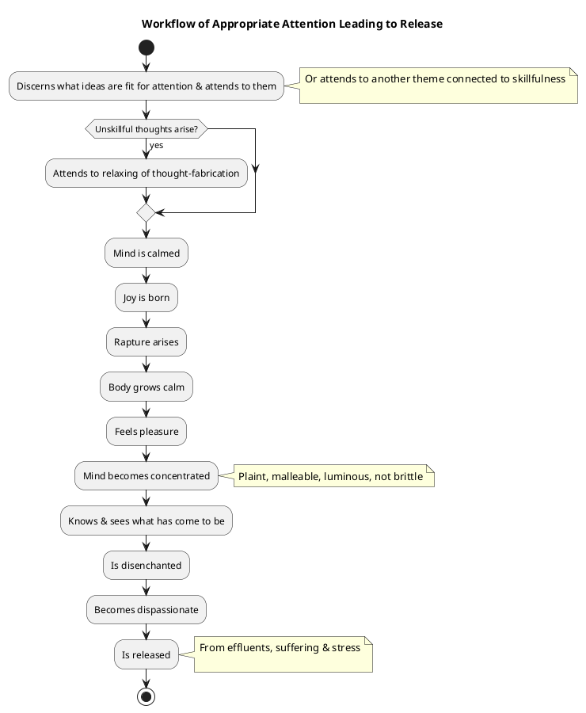
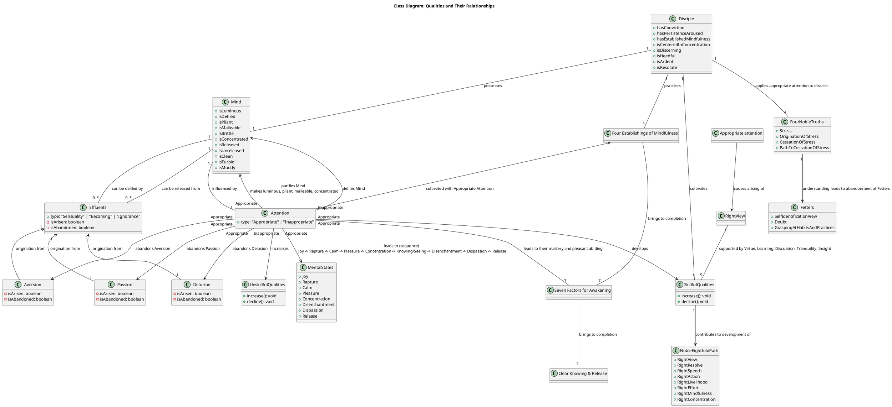

Here is a comprehensive response to your query regarding "Appropriate attention," drawing on the provided sources:

## 1. Definition

"Appropriate attention" (Sanskrit: *Yoniso Manasikara*) is a **mental quality** that is considered **very helpful** and essential for spiritual development within the Dhamma. It is described as being "on the side of distinction," implying its favorable nature.

Specifically, appropriate attention involves:
*   **Discernment of what ideas are fit for attention** and *not* attending to those that are unfit.
*   **Attending to themes that are skillful** when unskillful thoughts arise.
*   **Directing one's mind to inspiring themes** to cultivate gladness, rapture, pleasure, and concentration.
*   **Grasping, attending to, sustaining, and penetrating themes of concentration with discernment**.
*   **Periodically attending to themes of concentration, uplifted energy, and equanimity** to ensure the mind remains pliant, malleable, and luminous.
*   **Attending appropriately to the theme of the unattractive** to abandon passion.
*   **Attending appropriately to goodwill as an awareness-release** to abandon aversion.
*   It is one of the **two conditions for the arising of right view**.
*   It is listed as one of the **four factors for stream entry**.

## 2. Consequences & Benefits

Embracing appropriate attention yields numerous favorable impacts and leads to ultimate positive states:
*   **Cessation of Delusion**: When one attends appropriately, unarisen delusion does not arise, and arisen delusion is abandoned. Inappropriate attention, conversely, causes unarisen delusion to arise and existing delusion to grow.
*   **Abandons Passion and Aversion**: Through appropriate attention to specific themes (e.g., the unattractive for passion, goodwill for aversion), unarisen passion and aversion do not arise, and arisen ones are abandoned.
*   **Mental Purification and Development**: It is key to **cleansing the defiled mind**. It helps abandon "inappropriate attention, the following of a wrong path, abandoning slowness of awareness".
*   **Leads to Higher Mental States**: In one who is appropriately attentive, **joy is born**, leading to rapture, calm, pleasure, and **concentration**. This concentration, when developed, makes the mind **pliant, malleable, luminous, and not brittle**, rightly concentrated for the ending of effluents.
*   **Direct Knowledge and Release**: It enables one to **know and see what has come to be**, leading to disenchantment, dispassion, and ultimately, **release**.
*   **Attainment of the Superlative Goal**: For a monk, appropriate attention is crucial for **attaining the superlative goal** and the **ending of stress**. It fills the conditions for **clear knowing and release**.
*   **Development of the Noble Eightfold Path**: Appropriate attention helps a monk **develop and pursue the noble eightfold path**, which in turn leads to the disgorging of evil, unskillful qualities.
*   **Abandonment of Fetters**: When one attends appropriately to the four noble truths, three fetters—**self-identification view, doubt, and grasping at habits & practices**—are abandoned.
*   **Pleasant Abiding**: When the seven factors for awakening (which are developed through appropriate attention) are mastered, they lead to a **pleasant abiding**.

## 3. Causation

### Causes/conditions for Appropriate attention
*   **Listening to the True Dhamma**: Hearing the Dhamma is a requisite condition, and listening to it with an unscattered, gathered mind is crucial.
*   **Association with People of Integrity**: Associating with admirable people, especially those who are virtuous, learned, and discerning, is a foundational condition for appropriate attention.
*   **Conviction**: A lack of conviction can lead to inappropriate attention, implying that conviction supports appropriate attention.
*   **Mindfulness & Alertness**: Lack of mindfulness and alertness can lead to inappropriate attention. Therefore, being mindful and alert supports appropriate attention.
*   **Restraint of the Senses**: A lack of restraint of the senses leads to lack of mindfulness and alertness, which in turn leads to inappropriate attention.
*   **Good Conduct**: Good bodily, verbal, and mental conduct leads to restraint of the senses, which fosters appropriate attention.

### Effects from Appropriate attention
*   **Abolition of Delusion**: Unarisen delusion does not arise, and arisen delusion is abandoned.
*   **Birth of Joy and Rapture**: In one who is appropriately attentive, joy is born. When joyful, rapture arises.
*   **Calmness and Pleasure**: In one whose heart is enraptured, the body grows calm. When the body is calm, one feels pleasure.
*   **Concentration**: Feeling pleasure, the mind becomes concentrated.
*   **Knowledge and Seeing**: When the mind is concentrated, one knows and sees what has come to be.
*   **Disenchantment and Dispassion**: Knowing and seeing what has come to be leads to disenchantment, and disenchantment leads to dispassion.
*   **Release**: From dispassion, one is released.
*   **Abandonment of Fetters**: When attending appropriately to the four noble truths, self-identification view, doubt, and grasping at habits & practices are abandoned.
*   **Right View**: It is one of the two conditions for the arising of right view.
*   **Mind's Malleability**: The mind becomes pliant, malleable, luminous, and not brittle, and is rightly concentrated for the ending of effluents.

### Other
*   **Inappropriate attention** leads to unarisen effluents (sensuality, becoming, ignorance) arising and arisen effluents increasing.
*   **Lack of desire to see noble ones, lack of desire to hear noble Dhamma, and a mind bent on criticism** lead to muddled truth, unalertness, and scattered awareness. These in turn lead to inappropriate attention.

## 4. Arising & Passing Away

Appropriate attention is a practice engaged directly with the **arising and passing away of phenomena** as they are experienced moment-to-moment.
*   An instructed disciple of the noble ones attends carefully and appropriately **right there at the dependent co-arising**.
*   This involves discerning "when this is, that is; from the arising of this comes the arising of that; when this isn't, that isn't; from the cessation of this comes the cessation of that". This applies to concepts such as ignorance, fabrications, consciousness, name-and-form, the six sense media, contact, feeling, craving, clinging, becoming, birth, and aging-and-death.
*   It is applied to discerning **stress, its origination, cessation, and the path to its cessation**, as these states arise and pass away.
*   This practice helps one understand how consciousness, when attached to forms or other sense objects, exhibits "growth, increase, & proliferation", and how the cessation of a sensory contact leads to the cessation of concomitant feelings.

## 5. How To

To embrace appropriate attention, one should cultivate the following practices:
*   **Shift Focus from Unskillful to Skillful Themes**: If evil, unskillful thoughts arise, **attend to another theme connected with what is skillful**. This helps abandon and subside the unskillful thoughts, settling and concentrating the mind.
*   **Relax Thought-Fabrication**: If unskillful thoughts persist, **attend to the relaxing of thought-fabrication** concerning those thoughts. This helps abandon them and unify the mind.
*   **Develop Mindfulness Immersed in the Body**: Practice mindfulness of in-and-out breathing, discerning long or short breaths, being sensitive to the entire body, and calming bodily fabrication. This abandons household memories and resolves, allowing the mind to gather, settle, unify, and concentrate.
*   **Cultivate the Four Establishings of Mindfulness**: Remain focused on the **body, feelings, mind, and mental qualities in & of themselves**—ardent, alert, & mindful—subduing greed & distress with reference to the world.
*   **Engage with the Dhamma**: Actively direct one's thoughts to the Dhamma, evaluate it, and mentally examine it in detail as heard and learned. This leads to sensitivity to meaning and Dhamma, resulting in joy, rapture, calm, pleasure, and concentrated mind.
*   **Master Themes of Concentration**: Well grasp, attend to, sustain, and penetrate a certain theme of concentration with discernment. This leads to joy, rapture, calm, pleasure, and concentrated mind.
*   **Balance Mental Energy**: Attend periodically to the theme of **concentration** (to prevent restlessness), **uplifted energy** (to prevent laziness), and **equanimity** (to ensure right concentration), making the mind pliant and luminous.
*   **Apply Specific Antidotes to Defilements**: Attend appropriately to **the theme of the unattractive** to abandon passion. Attend appropriately to **goodwill as an awareness-release** to abandon aversion.
*   **Avoid Contempt and Scattering**: Do not hold the Dhamma talk, the speaker, or oneself in contempt. Listen to the Dhamma with an **unscattered mind, gathered into one**.

## PART-B

