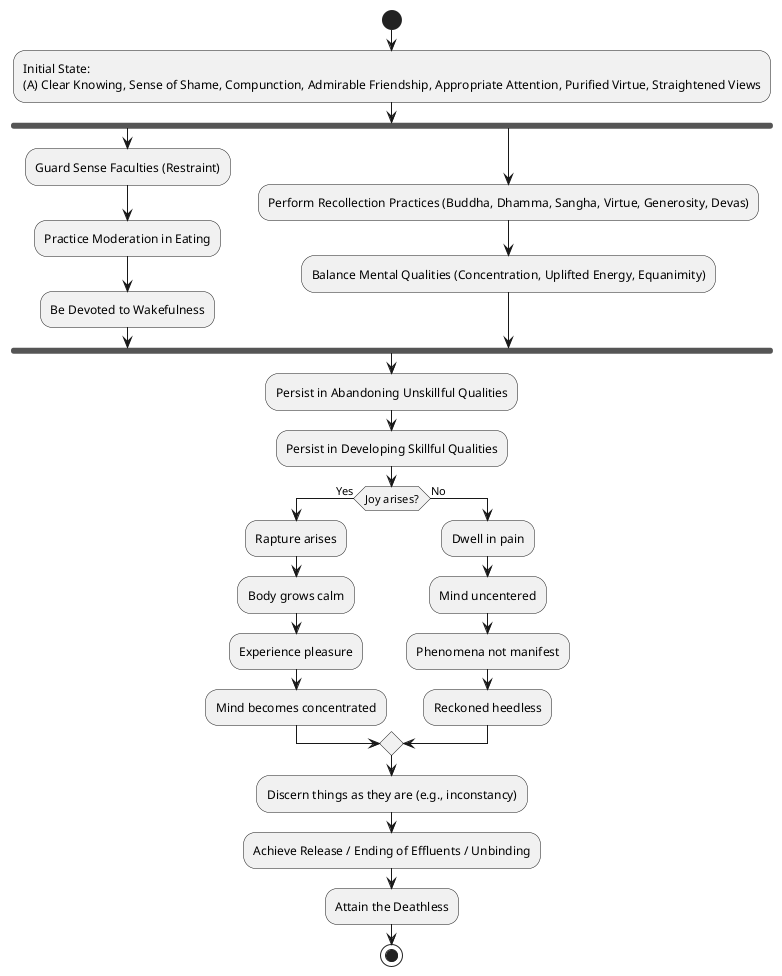

Drawing on the provided sources, here is a comprehensive response to your query regarding "Heedfulness with regard to skillful qualities."

## 1. Definition

**Heedfulness (Appamāda)** is described as the **path to the Deathless** and is considered the **foremost among all skillful qualities**. It is a quality that, when cultivated and pursued, **secures both kinds of benefit: benefit in this life and in lives to come**. Heedfulness embodies being **mindful, clean in action, acting with due consideration, restrained, and self-controlled**. It specifically involves **guarding one's mind with regard to effluents and qualities accompanied by effluents**.

**Skillful qualities (Kusala Dhamma)** are those qualities which, when adopted and carried out, **lead to welfare and happiness**. These are contrasted with unskillful qualities that lead to harm and suffering. Key examples of skillful qualities include the **lack of greed, lack of aversion, and lack of delusion**. They also encompass **good bodily, verbal, and mental conduct**. Therefore, **heedfulness with regard to skillful qualities** signifies a diligent and conscious effort to abandon unskillful qualities and cultivate skillful ones, ensuring one remains vigilant in this pursuit.

## 2. Purpose & Benefits

Cultivating heedfulness with regard to skillful qualities serves several profound purposes and yields significant benefits:

*   **Attainment of Unbinding and the Deathless**: Heedfulness is fundamental to reaching the **superlative goal** and **Unbinding** (Nibbāna). It provides a **footing in the deathless**, which is its final end, and leads to **release from all ties**.
*   **Cessation of Suffering and Stress**: It is crucial for **putting an end to suffering and stress**, serving as the practice for the full comprehension of stress. Mindfulness of inconstancy, fostered by heedfulness, contributes to uprooting conceit and achieving unbinding in the here-and-now.
*   **Development of Mental Faculties and Release**: Heedfulness leads to the **development and culmination of the five faculties**: conviction, persistence, mindfulness, concentration, and discernment. It helps in the **purification of beings, overcoming sorrow and lamentation, and the disappearance of pain and distress**.
*   **Well-being in Present and Future Lives**: As a primary quality, heedfulness **keeps both kinds of benefits secure: benefit in this life and in lives to come**. For lay followers, being consummate in conviction, virtue, generosity, and discernment (which are developed through heedfulness) leads to **happiness and well-being in lives to come**.

## 3. Causation

### Causes/conditions for Heedfulness

*   **Clear Knowing (Vijjā)**: Clear knowing precedes the emergence of skillful qualities, which in turn underpins heedfulness. In a knowledgeable person immersed in clear knowing, right view arises, leading to the noble eightfold path.
*   **Sense of Shame and Compunction**: Possessing a sense of shame (hiri) and compunction (ottappa) is a direct condition for being heedful. These qualities follow after clear knowing.
*   **Admirable Friendship**: Associating with admirable people is a significant prerequisite for a monk in training to abandon unskillful qualities and develop skillful ones, thus fostering heedfulness.
*   **Appropriate Attention**: Appropriate attention is a quality that is very helpful for attaining the superlative goal. When one is appropriately attentive, joy, rapture, calm, pleasure, concentrated mind, knowing, seeing, disenchantment, dispassion, and release are born.
*   **Purified Virtue and Straightened Views**: A **well-purified virtue** and **views made straight** form the basis upon which one should develop the four establishings of mindfulness, a core practice related to heedfulness.

### Effects from Heedfulness

*   **Abandonment of Unskillful Qualities**: Being heedful leads to the **abandoning of apathy, being hard to correct, and evil friendship**. It also enables one to **abandon bodily, verbal, and mental misconduct** and develop good conduct.
*   **Development of Skillful Qualities**: Heedfulness directly supports the **development and well-development of the five spiritual faculties**: conviction, persistence, mindfulness, concentration, and discernment. It leads to the development of good bodily, verbal, and mental conduct, and right view.
*   **Attainment of Release and Ending of Effluents**: Heedfulness is essential for monks in higher training to **reach the supreme goal of the holy life** and the **ending of effluents**. It is integral to the path leading to the Deathless.
*   **Cultivation of Positive Mental States**: When dwelling heedfully, **joy, rapture, calm, and concentration** arise, in contrast to pain and an uncentered mind when heedless. This process is enhanced through recollection practices.
*   **Clear Discernment**: A concentrated monk, practicing heedfulness, **discerns things as they have come to be**, such as the inconstancy of the eye, forms, eye-consciousness, and eye-contact. This discernment is vital for the ending of effluents.

### Other

*   **Roots of Unskillful/Skillful Qualities**: Greed, aversion, and delusion are identified as the **three roots of what is unskillful**. Conversely, **lack of greed, lack of aversion, and lack of delusion** are the roots of what is skillful. These defile the mind, and their abandonment leads to mind purification.
*   **Luminous Mind**: The mind is intrinsically **luminous** but can be defiled by incoming impurities or freed from them. The instructed disciple, by discerning this, develops their mind, while the uninstructed person does not.

## 4. Noble Path

Heedfulness (Appamāda) is deeply embedded within the training processes of the noble ones, particularly through the Noble Eightfold Path and its associated practices:

*   **Noble Eightfold Path**: The Noble Eightfold Path comprises **right view, right resolve, right speech, right action, right livelihood, right effort, right mindfulness, and right concentration**. Heedfulness is considered the one quality that enables the five faculties (conviction, persistence, mindfulness, concentration, discernment) to be developed and developed well. The path's development leads to the subduing of passion, aversion, and delusion.
*   **Four Establishings of Mindfulness (Satipaṭṭhāna)**: These are the direct path for the **purification of beings, for overcoming sorrow and lamentation, for the disappearance of pain and distress, and for the realization of unbinding**. They involve focusing on the body, feelings, mind, and mental qualities, and are a core application of heedfulness.
*   **Abandoning Misconduct and Developing Right View**: Heedfulness should be exercised to **abandon bodily, verbal, and mental misconduct**, and to **develop good bodily, verbal, and mental conduct, and right view**.
*   **Restraint of Sense Faculties**: A crucial application of heedfulness is in **guarding the doors to one's sense faculties** (eye, ear, nose, tongue, body, intellect) to prevent unskillful qualities such as greed or distress from assailing the mind. This is a step-by-step training.
*   **Trainings in Virtue, Mind, and Discernment**: Heedfulness is an integral part of the **training in heightened virtue, heightened mind (concentration), and heightened discernment**. Monks in higher training are encouraged to use suitable resting places, associate with admirable friends, and balance their mental faculties to practice heedfulness effectively.

## 5. How To

The cultivation of heedfulness and skillful qualities involves various practices and supporting conditions:

*   **Development of Mindfulness**: Mindfulness itself is a vital component of heedfulness. It is fostered by being **always mindful** in all actions—going forward, going back, standing, sitting, lying down, and determining on an action—leading to **mindfulness and alertness**.
*   **Guarding the Sense Faculties**: Regular practice of **restraint over the six sense faculties** prevents the arising of unskillful qualities like greed and distress, fostering a heedful state. This is described as a step-by-step training process initiated by the Tathāgata.
*   **Moderation in Eating**: Knowing and practicing moderation in food intake is emphasized alongside guarding sense faculties and devotion to wakefulness as qualities that aid in the contemplative life.
*   **Devotion to Wakefulness**: Actively engaging in wakefulness during the day and night, through sitting and pacing, to **cleanse the mind of qualities that would hold it in check**, is a key method for fostering these qualities.
*   **Recollection Practices (Anussati)**: Recollecting the **Buddha, Dhamma, Saṅgha, one's own virtues, and devas** are techniques to cleanse the defiled mind. These recollections calm the mind, generate joy, and abandon defilements, helping the mind to head straight and remain undisturbed by passion, aversion, or delusion.
*   **Balancing Mental Qualities**: For a monk intent on heightened mind, regularly attending to the **theme of concentration, uplifted energy, and equanimity** ensures the mind becomes pliant, malleable, luminous, and rightly concentrated for the ending of effluents.
*   **Persistent Exertion**: Generating **desire, endeavoring, arousing persistence, upholding, and exerting one's intent** for the non-arising and abandoning of unskillful qualities, and for the arising, maintenance, increase, and culmination of skillful qualities, is essential. This must be a **steadfast and solid effort**, not shirking duties.
*   **Reflection and Examination**: Directing thoughts to the Dhamma in detail, evaluating it, and mentally examining it leads to a **sensitivity to its meaning, joy, rapture, calm, and concentration**. Deeply penetrating the Dhamma with discernment is crucial for this process.
*   **Associating with Wise and Learned Individuals**: Regularly approaching monks who are learned and know the tradition, asking questions, and quizzing them helps to **make open what isn't open, make plain what isn't plain, and dispel doubt**. This interaction fosters discernment and understanding.

## PART-B: PlantUML Diagrams

### 1. Activity Diagram

### 2. Class Diagram

```plantuml
@startuml
class Person {
  + mindful: bool
  + alert: bool
  + ardent: bool
  + resolute: bool
  + discerning: bool
  + convinced: bool
  + persistent: bool
  + cultivates(quality)
  + abandons(quality)
  + guards_senses()
  + recollects(entity)
  + balances_mental_qualities()
}

class SkillfulQuality {
}

class UnskillfulQuality {
}

class Dhamma {
  + purpose: string
  + teaches()
}

class Teacher {
  + teaches_Dhamma()
}

class Mind {
  + state: string
  + is_luminous: bool
  + is_defiled: bool
  + is_calm: bool
  + is_concentrated: bool
  + is_released: bool
  + is_unreleased: bool
}

class StateOfBeing {
}

SkillfulQuality <|-- Heedfulness
SkillfulQuality <|-- Virtue
SkillfulQuality <|-- Concentration
SkillfulQuality <|-- Discernment
SkillfulQuality <|-- Mindfulness
SkillfulQuality <|-- Persistence
SkillfulQuality <|-- Conviction
SkillfulQuality <|-- Shame
SkillfulQuality <|-- Compunction
SkillfulQuality <|-- Generosity
SkillfulQuality <|-- Lack_of_Greed
SkillfulQuality <|-- Lack_of_Aversion
SkillfulQuality <|-- Lack_of_Delusion

UnskillfulQuality <|-- Passion
UnskillfulQuality <|-- Aversion
UnskillfulQuality <|-- Delusion
UnskillfulQuality <|-- Sensual_Desire
UnskillfulQuality <|-- Ill_Will
UnskillfulQuality <|-- Sloth_Drowsiness
UnskillfulQuality <|-- Restlessness_Anxiety
UnskillfulQuality <|-- Uncertainty
UnskillfulQuality <|-- Misconduct
UnskillfulQuality <|-- Effluent

Dhamma <|-- Noble_Eightfold_Path
Dhamma <|-- Four_Establishings_of_Mindfulness
Dhamma <|-- Recollection_Practices

StateOfBeing <|-- Deathless
StateOfBeing <|-- Unbinding
StateOfBeing <|-- Welfare
StateOfBeing <|-- Happiness
StateOfBeing <|-- Suffering
StateOfBeing <|-- Stress
StateOfBeing <|-- Joy
StateOfBeing <|-- Rapture
StateOfBeing <|-- Calm
StateOfBeing <|-- Concentration

Person "1" --> "0..*" SkillfulQuality : cultivates
Person "1" --> "0..*" UnskillfulQuality : abandons

Heedfulness "1" --> "0..*" StateOfBeing : leads_to
Heedfulness "1" --> "0..*" SkillfulQuality : develops (Five Faculties)

"Clear Knowing" "1" -- "1" Heedfulness : is_condition_for
"Shame" "1" -- "1" Heedfulness : is_condition_for
"Compunction" "1" -- "1" Heedfulness : is_condition_for
"Admirable Friendship" "1" -- "1" Heedfulness : is_condition_for
"Appropriate Attention" "1" -- "1" Heedfulness : is_condition_for
"Purified Virtue" "1" -- "1" Heedfulness : is_condition_for
"Straightened Views" "1" -- "1" Heedfulness : is_condition_for

UnskillfulQuality "0..*" --> "1" Mind : defiles
SkillfulQuality "0..*" --> "1" Mind : purifies

Noble_Eightfold_Path "1" -- "1" Dhamma : is_a_component_of
Four_Establishings_of_Mindfulness "1" -- "1" Dhamma : is_a_component_of
Recollection_Practices "1" -- "1" Dhamma : is_a_component_of

Teacher "1" --> "1" Dhamma : teaches

Person "1" --> "0..*" Dhamma : follows

Mind "1" --> "0..*" StateOfBeing : can_be

Mind "1" --> "0..*" SkillfulQuality : is_affected_by
Mind "1" --> "0..*" UnskillfulQuality : is_affected_by

Mind --> "1" Person : has

@enduml
```
