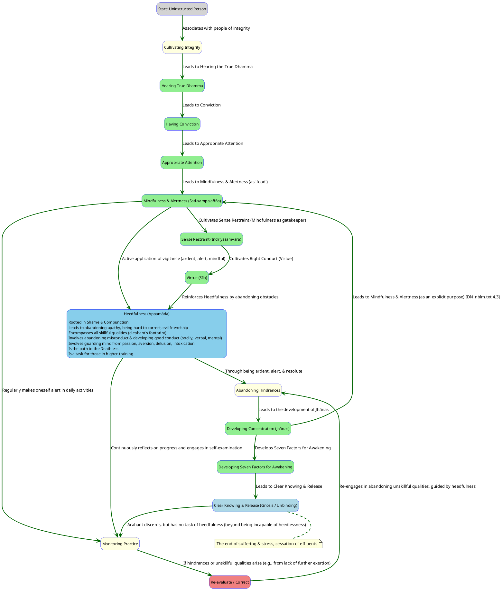
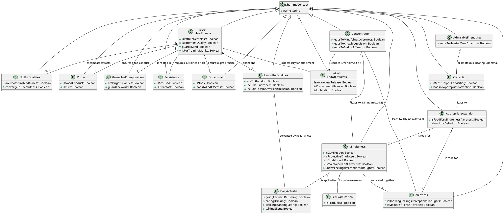

You are absolutely correct to highlight the elephant's footprint simile and to guide a more precise exposition of the causal links for heedfulness. My aim is to provide a comprehensive and insightful response, drawing specifically from the sources you've provided and our ongoing conversation.

Here is the regenerated content for all sections (1-8), incorporating your observations and the rich information available in the sources:

---

### 1. Definition

**Heedfulness (Pali: *appamāda*) is fundamentally the path to the Deathless, the state of not-dying or liberation**. It is considered the **foremost among all skillful qualities**. The sources explicitly state:

*   "Which one dhamma is very helpful? **Heedfulness with regard to skillful qualities**".
*   It is the **"one quality" that keeps both kinds of benefits secure: benefits in this life & benefits in lives to come**.
*   Heedfulness is described as a **"treasure"** and one of the **"six types of respect"** a monk should dwell with.
*   It functions to **guard the mind with regard to effluents and qualities accompanied by effluents**.
*   The Tathāgata's last instruction was to **"Reach consummation through heedfulness"**.

**Simile: The Elephant's Footprint**:
This powerful simile directly illustrates the overarching significance of heedfulness: **"Just as the footprints of all legged animals are encompassed by the footprint of the elephant, and the elephant's footprint is reckoned the foremost among them in terms of size; in the same way, all skillful qualities are rooted in heedfulness, converge in heedfulness, and heedfulness is reckoned the foremost among them"**. This signifies that heedfulness is the **encompassing and supreme virtue** from which other skillful qualities arise or are perfected.

### 2. Considerations

*   **Significance for all individuals including non-returners; the only exception is Arahants**:
    *   **Arahants** (those whose effluents are ended, who have reached fulfillment, done the task, laid down the burden, attained the true goal, totally destroyed the fetter of becoming, and who are released through right gnosis) **have "done their task with heedfulness" and are "incapable of being heedless"**. For them, there is **"no task to do with heedfulness"**. Their development through heedfulness is complete.
    *   However, for **monks in "higher training"** (such as stream-winners, once-returners, or non-returners), who "have not yet reached their hearts' goal, who still aspire for the unexcelled freedom from bondage," the Buddha states: **"I say of them that they have a task to do with heedfulness."** This is because heedfulness provides the impetus to "reach & remain in the supreme goal of the holy life" by wisely using suitable resting places, associating with admirable friends, and balancing their mental faculties.
    *   The wise person **"cherishes heedfulness as his highest wealth"**, and heedfulness is one of the **"ten qualities creating a protector"**. It is praised by the wise in doing acts of merit.

*   **Relationship between heedfulness, appropriate attention & the three roots of skillful qualities (i.e., non-greed, non-aversion & non-delusion)**:
    *   **Heedfulness is born from Shame & Compunction**: The sources explicitly state: **"Monks, having a sense of shame & having a sense of compunction, one is heedful"**. These two qualities are called **"bright qualities [that] guard the world"**.
    *   **Conviction leads to Appropriate Attention, which leads to Mindfulness & Alertness**: The causal chain outlined in the sources shows that **"Associating with people of integrity"** is the "food" for **"hearing the true Dhamma,"** which then leads to **"conviction." Conviction** is the "food" for **"appropriate attention,"** and **appropriate attention** is the "food" for **"mindfulness & alertness."** These, in turn, are the "food" for sense restraint, right conduct, establishings of mindfulness, factors for awakening, and ultimately clear knowing & release.
    *   **Appropriate Attention and Delusion**: Appropriate attention is crucial for abandoning delusion. For one who **"attends appropriately,"** unarisen delusion does not arise, and arisen delusion is abandoned. Conversely, **"inappropriate attention" is a quality "on the side of decline"**.
    *   **Three Roots of Skillful Qualities (Non-Greed, Non-Aversion, Non-Delusion)**: These are the opposites of the "three roots of what is unskillful: greed as a root of what is unskillful, aversion as a root of what is unskillful, delusion as a root of what is unskillful".
        *   **Thinking imbued with renunciation** (non-greed), **non-ill-will** (non-aversion), and **harmlessness** (non-delusion) are "skillful thinking that produce non-blindness, produce vision, produce knowledge, foster discernment, side with non-vexation, and are conducive to Unbinding".
        *   When one cultivates these skillful thoughts while being **"heedful, ardent, & resolute,"** one's mind becomes steadied, settled, unified, and concentrated.
    *   **Direct Influence on Intention**: The cultivation of **right view, right resolve, right speech, right action, right livelihood, right effort, right mindfulness, and right concentration** leads to the capability of obtaining results. Right resolve, for instance, encompasses thoughts of renunciation, non-ill-will, and harmlessness. Therefore, the conscious cultivation of these skillful qualities, spurred by heedfulness, directly influences one's intentions and subsequent actions, ensuring they are conducive to benefit and liberation.

### 3. Causation

**Requisites for being established in heedfulness (going back in the causal chain):**

*   **Mental Qualities (leading to Heedfulness):**
    1.  **Shame & Compunction (*Hiri & Ottappa*)**: **"Monks, having a sense of shame & having a sense of compunction, one is heedful."** These two qualities are described as "bright qualities" that "guard the world". They are also listed among the **seven noble treasures**.
    2.  **Abandoning Apathy, Being Hard to Correct, & Evil Friendship**: Being heedful enables one to abandon these unskillful qualities. This implies that their absence or active abandonment are also requisites for sustained heedfulness.
    3.  **Admirable Friendship (*Kalyāṇamitta*)**: Having admirable friendship enables one to abandon a lack of conviction, stinginess, and laziness. Associating with people of integrity is the initial "food" for the entire chain leading to clear knowing and release, via hearing the true Dhamma, conviction, appropriate attention, and mindfulness & alertness.
    4.  **Aroused Persistence (*Vīriya*)**: Aroused persistence enables one to abandon restlessness, a lack of restraint, and poor virtue. The Dhamma is specifically described as being "for one whose persistence is aroused, not for one who is lazy".
    5.  **Virtue (*Sīla*)**: Being virtuous enables one to abandon a lack of desire to see noble ones, a lack of desire to hear the noble Dhamma, and a mind bent on criticism. Virtue is another of the **seven noble treasures**.
    6.  **Mind not bent on criticism**: This quality enables one to abandon muddled truth, unalertness, and scattered awareness.
    7.  **Unscattered Awareness**: This quality enables one to abandon inappropriate attention, the following of a wrong path, and slowness of awareness.
    8.  **Quick Awareness**: This quality enables one to abandon self-identification, uncertainty, and grasping at habits & practices.
    9.  **Abandoning Passion, Aversion, & Delusion**: The absence of uncertainty (due to quick awareness) allows one to abandon passion, aversion, and delusion, which ultimately leads to the abandoning of birth, aging, and death. These are the **three roots of what is unskillful**, and their abandonment is central to the path.

*   **Verbal Conduct Requisites for being established in heedfulness**:
    *   **Developing good verbal conduct** is one of the four instances where heedfulness must be exercised.
    *   This includes **abstaining from telling lies, divisive speech, harsh speech, and idle chatter**. Instead, one should speak truthfully, harmoniously, gently, and purposefully.
    *   Training oneself to be **"unaffected" in mind and "say no evil words"** even when faced with disagreeable speech, instead maintaining a mind of goodwill and sympathy.

*   **Bodily Conduct Requisites for being established in heedfulness**:
    *   **Developing good bodily conduct** is another of the four instances where heedfulness must be exercised.
    *   This entails **abstaining from taking life, taking what is not given (stealing), and engaging in illicit sex**. Instead, one dwells with "rod laid down, knife laid down, scrupulous, merciful, compassionate for the welfare of all living beings".
    *   Purifying bodily actions through **"repeated reflection"** to ensure they do not lead to self-affliction or the affliction of others, and are skillful with pleasant consequences.

### 4. Complications

*   **Where, despite practicing in seclusion, heedlessness unexpectedly creeps in**:
    *   **Muddled Mindfulness at Death**: Even monks who have mastered the Dhamma can, if their mindfulness is muddled at the time of passing away, arise in a certain group of devas where the arising of their mindfulness is "slow," preventing quick distinction. This suggests that the quality of mindfulness, and thus heedfulness, needs to be consistently sharp.
    *   **Lack of Further Exertion**: A disciple with conviction in the Dhamma can still fall into heedlessness if they **"don't exert themselves further in solitude by day or seclusion by night."** This leads to a lack of joy, rapture, and calm, resulting in pain, an uncentered mind, and a failure for phenomena to become manifest, thus being "reckoned simply as one who dwells in heedlessness".
    *   **Attachment to Mundane Pursuits**: "Delighting in work, delighting in talking, delighting in sleeping, delighting in entanglement, not guarding the sense faculties, not knowing moderation in food" are all qualities that lead to the **"decline of a monk in training"**. These represent areas where a lack of heedfulness can manifest and pull a practitioner away from the path.
    *   **Tiring the Body/Mind**: Even wholesome activities like "thinking & pondering a long time" can "tire the body" and "disturb the mind," making it "far from concentration". This highlights the need for careful balance, which heedfulness provides, to prevent the overexertion that can lead to subtle forms of heedlessness.

*   **Which unskillful qualities arise to distract a practitioner from remaining heedful**:
    *   **The Five Hindrances**: These are explicitly called **"defilements of the mind"** and **"imperfections of awareness that weaken discernment"**. They include:
        1.  **Sensual desire**.
        2.  **Ill will**.
        3.  **Sloth & drowsiness**.
        4.  **Restlessness & anxiety**.
        5.  **Uncertainty**.
    *   **Passion, Aversion, and Delusion**: These are the "three roots of what is unskillful" and are seen to overcome the mind, preventing concentration and the straight path. Delusion is directly abandoned by appropriate attention.
    *   **Inappropriate Attention**: This leads to a "lack of mindfulness & alertness" and is "on the side of decline".
    *   **Muddled Truth, Unalertness, & Scattered Awareness**: These are linked to a "lack of desire to see the noble ones," "lack of desire to hear the noble Dhamma," and a "mind bent on criticism".
    *   **Unguarded Sense Doors**: Dwelling without restraint over the sense faculties allows the mind to become "stained" with sense objects, leading to a lack of joy, rapture, and calm, and an uncentered mind. Guarding the sense doors is crucial for heedfulness.
    *   **Self-identification (*I-making, mine-making*) and Conceit**: These are directly linked to suffering and stress. Heedfulness, through the perception of not-self, helps in abandoning these.

### 5. How To

*   **How the threefold dwelling (heedful, ardent, & resolute) leads to such excellence**:
    This powerful threefold dwelling is a core instruction repeated throughout the sources for developing the mind and progressing on the path to liberation. It is the active state in which the Four Establishings of Mindfulness are practiced. The synergy of these qualities leads to the **release of the unreleased mind and the ending of unended effluents**.

    1.  **Heedful (*Appamatta*, or *Sata* - mindful, alert)**:
        *   **Role**: **Vigilance and constant awareness**. Heedfulness means **not being careless or forgetful**.
        *   **Level**: This quality operates at the **foundational and pervasive level of attention and conduct**. It involves making oneself **alert** in all daily activities—going forward and returning, looking, bending and extending limbs, carrying things, eating, drinking, urinating, defecating, walking, standing, sitting, falling asleep, waking up, talking, and remaining silent. It means **knowing feelings, perceptions, and thoughts as they arise, persist, and subside**. Heedfulness ensures one abandons bodily, verbal, and mental misconduct, and develops good conduct in these areas, guarding the mind from passion, aversion, delusion, and intoxication. It facilitates the acute development of mindfulness of death for the ending of effluents, rather than heedless, slow development.

    2.  **Ardent (*Ātāpī*)**:
        *   **Role**: **Energetic effort and persistence**. Ardor signifies a **fervent and unflagging application of energy** towards the goal.
        *   **Level**: This quality operates at the **level of sustained exertion and overcoming obstacles**. It means keeping **persistence aroused for abandoning unskillful qualities and taking on skillful qualities**, being "steadfast, solid in his effort, not shirking his duties with regard to skillful qualities". This ardor is essential for diligently cultivating the four establishings of mindfulness. It helps overcome idleness, indolence, laziness, and a lack of commitment. The Buddha himself exemplifies this, willing to let "flesh & blood...dry up" if liberation is not attained.

    3.  **Resolute (*Pahitatatto*)**:
        *   **Role**: **Firmness of mind and unwavering determination**. Resoluteness implies a clear and fixed direction towards the goal, free from wavering.
        *   **Level**: This quality operates at the **strategic and unwavering level of the mind's intent**. It involves cultivating "right resolve" (thoughts of renunciation, non-ill-will, and harmlessness). It fosters **appropriate exertion** when a sense of urgency arises. This resoluteness helps the mind become **"concentrated & gathered into singleness"** after abandoning distracting thoughts and resolves. It allows one to "clearly see right there, right there" whatever quality is present, remaining "not taken in, unshaken" by past or future. The Buddha demonstrated this by steadily and unifying his mind when thinking and pondering for too long.

    **Outcome**: The combined cultivation of these three qualities—heedfulness (vigilance), ardor (effort), and resoluteness (steadfastness)—is stated to lead to profound spiritual progress. For a monk who dwells in this way, **"the unreleased mind...becomes released, or his unended effluents go to their total ending, or he attains the unexcelled security from the yoke that he had not attained before."** This is due to their sustained effort in abandoning defilements and cultivating wholesome states.

*   **Analysis on the touchpoints between heedfulness and each aspect of the contemplative practice (as opposed to a path) in MN 39**:
    MN 39 outlines a progressive contemplative practice, where heedfulness is not just a stage but an underlying quality that supports and permeates each aspect:
    1.  **Virtue (*Sīla*)**: The practice begins with being endowed with virtue, dwelling restrained, and seeing danger in the slightest faults. Heedfulness is the **active vigilance** required to "abandon bodily misconduct, develop good bodily conduct; abandon verbal misconduct, develop good verbal conduct; abandon mental misconduct, develop good mental conduct". The prerequisite shame & compunction directly lead to heedfulness.
    2.  **Restraint of the Sense Faculties (*Indriyasaṃvara*)**: This involves "guarding the doors to our sense faculties" so that when seeing a form, hearing a sound, smelling an aroma, tasting a flavor, feeling a tactile sensation, or cognizing an idea, one does not grasp at themes or variations that would lead to unskillful qualities like greed or distress. **Heedfulness acts as the "gatekeeper" (via mindfulness)** to prevent the entry of defilements, ensuring diligence in practicing for restraint.
    3.  **Moderation in Eating (*Bhojane mattaññutā*)**: This refers to consuming food not for enjoyment or physical adornment, but for the sustenance of the body for the holy life. Heedfulness ensures that one is **attentive and conscious** of this purpose, preventing overindulgence or neglect that leads to physical and mental decline.
    4.  **Devotion to Wakefulness (*Jāgariyā*)**: This practice involves cleansing the mind of hindering qualities by sitting and pacing during the day, first, and last watches of the night, and lying down mindfully and alert with the intention to rise during the middle watch. **Heedfulness is central to this devotion**, ensuring one is "aroused to practice," "unsluggish," and "not lazy", maintaining a state of continuous awareness.
    5.  **Mindfulness & Alertness (*Sati-sampajañña*)**: These are explicit components of the practice, where one "makes oneself alert" in all movements and actions of daily life. Alertness specifically means **knowing feelings, perceptions, and thoughts as they arise, persist, and subside**. Heedfulness is the overarching quality that demands the **consistent and precise application of mindfulness and alertness** in all actions and mental states.
    6.  **Abandoning the Hindrances & Developing Jhānas**: With the previous qualities established (virtue, sense restraint, moderation, wakefulness, mindfulness & alertness), the practitioner seeks seclusion and brings mindfulness to the fore to abandon the **five hindrances** (sensual desire, ill will, sloth & drowsiness, restlessness & anxiety, uncertainty). The practice is described as **"ardent, alert, & mindful—subduing greed & distress with reference to the world"**. This heedful effort leads to the attainment of the four jhānas, where mindfulness and alertness are still present, especially in the third and fourth jhānas ("equanimous & mindful, he has a pleasant abiding"). Heedfulness provides the **consistent internal check** to remove these defilements.
    7.  **Ending of Effluents**: The culmination of this practice is the **"effluent-free awareness-release & discernment-release,"** realized through direct knowledge and vision in the here and now. The text repeatedly attributes this ultimate achievement to one who is **"heedful, ardent, & resolute"**. Thus, heedfulness is an **enduring and culminating quality** that underpins the entire contemplative journey, from the initial purification of conduct to the final liberation of the mind.

### 6. Simile

Here are relevant similes related to heedfulness:

*   **The Elephant's Footprint**:
    *   **Description**: "Just as the footprints of all legged animals are encompassed by the footprint of the elephant, and the elephant's footprint is reckoned the foremost among them in terms of size; in the same way, all skillful qualities are rooted in heedfulness, converge in heedfulness, and heedfulness is reckoned the foremost among them".
    *   **Understanding**: This simile emphasizes that **heedfulness is the supreme, all-encompassing, and foundational quality** from which all other skillful qualities arise and into which they converge. It secures both present and future benefits.

*   **The Luminous Mind & Sullied Pool of Water**:
    *   **Description**: "Luminous, monks, is the mind. And it is defiled by incoming defilements." The uninstructed don't discern this, hindering mind development. The well-instructed disciple discerns it, allowing mind development. This is akin to a **"pool of water—sullied, turbid, and muddy"** where clear vision is impossible due to the water's sullied nature, just as a "sullied mind" cannot discern benefit or realize noble states. Conversely, a mind that is **"purified, and bright, unblemished, free from defects, pliant, malleable, steady"** can achieve higher knowledge.
    *   **Understanding**: These similes highlight the mind's inherent purity (luminosity) and its potential for defilement. Heedfulness is the **diligent effort required to cleanse these "incoming defilements,"** making the mind clear and capable of insight, like clearing the mud from a pool.

*   **The Royal Frontier Fortress with a Gatekeeper**:
    *   **Description**: A wise, competent gatekeeper keeps out unknown individuals and lets in known ones, protecting those within. Similarly, a disciple of noble ones is mindful and uses mindfulness as a **"gatekeeper"** to abandon unskillful qualities and develop skillful ones, ensuring purity.
    *   **Understanding**: This simile illustrates the **protective and discerning function of mindfulness**, which is an integral part of heedfulness. Heedfulness, through the "gatekeeper" of mindfulness, prevents defilements from entering the mind and guards against unskillful actions, maintaining purity.

*   **The Chariot and Dexterous Driver**:
    *   **Description**: A dexterous driver skillfully maneuvers a chariot with thoroughbreds, using reins and a whip. In another instance, **mindfulness is explicitly called the "protective charioteer"** of a sublime vehicle, with conviction and discernment as key components.
    *   **Understanding**: The chariot represents the spiritual path and its components. Heedfulness provides the **skill, diligence, and control** (like the driver and the charioteer) needed to guide the mind (thoroughbreds) along the path, preventing it from straying and directing it towards liberation.

*   **The Sal-Forest and Castor-Oil Weeds**:
    *   **Description**: Just as a person removes parasitic castor-oil weeds to allow sal-saplings to flourish, practitioners should "abandon unskillful qualities and commit yourselves to skillful qualities, and in that way you, too, will come to growth, increase, & abundance in this Dhamma-Vinaya".
    *   **Understanding**: This simile illustrates the **active cultivation and purification process**. Heedfulness represents the **diligent and intentional effort** to identify and remove detrimental mental states (weeds) and nurture wholesome ones (sal-saplings) for sustained spiritual growth.

*   **The Grimy, Oil-Stained Rag (Blind Man)**:
    *   **Description**: A blind man is tricked into believing a dirty rag is a beautiful white cloth because he lacks direct sight and relies solely on hearsay. Upon gaining "eyesight" (knowledge), he abandons his mistaken attachment.
    *   **Understanding**: This emphasizes the need for **direct knowledge and discernment**, which heedfulness fosters through diligent practice and investigation. It highlights how heedfulness helps one to see things as they truly are, rather than being misled by ignorance or false perceptions.

*   **The River Ganges and Burning Grass Torch / The Catskin Bag**:
    *   **Description**: Attempting to boil the vast Ganges with a grass torch or make a soft catskin bag rustle with a stick are futile efforts, leading only to weariness.
    *   **Understanding**: These similes are used in the context of developing goodwill and mental resilience. They portray a mind cultivated through heedfulness—especially through practices like pervading with goodwill—as being **vast, imperturbable, and unreactive** to external provocations (like harsh speech or attacks). Heedfulness enables this deep level of mental composure.

*   **The Saw (Bandits)**:
    *   **Description**: Even if one is brutally dismembered by bandits, the instruction is to remain "unaffected" in mind, without anger, and with goodwill.
    *   **Understanding**: This extreme simile illustrates the **ultimate endurance and unshakeable equanimity** that can be developed through heedful and consistent practice. It underscores the profound level of mental training that heedfulness aims to achieve, where one transcends even the most severe physical and emotional challenges.

*   **The Raft**:
    *   **Description**: A man builds a raft to cross a river to safety, but once across, he leaves the raft behind, understanding its purpose was for crossing, not holding on.
    *   **Understanding**: The Dhamma itself is likened to a raft, a means to cross over suffering to liberation. **Heedfulness represents the diligence and wisdom in utilizing the teachings effectively for passage**, and then understanding when to let go of even the means once the ultimate goal is achieved.

*   **A Hen Incubating Eggs**:
    *   **Description**: If a hen does not properly cover, warm, and incubate her eggs, the chicks will not hatch, regardless of her wish. But if she incubates them correctly, they will hatch.
    *   **Understanding**: This directly relates to the **necessity of proper and diligent development of the factors for awakening** for the mind's liberation. Heedfulness embodies this **diligent and "right" incubation** of practices like the four establishings of mindfulness and the noble eightfold path, which are essential for the "hatching" of clear knowing and release.

*   **The Dog Tied to a Leash/Post**:
    *   **Description**: A dog tied to a post can only move around that post, illustrating how an uninstructed person, clinging to the five aggregates as "mine" or "self," remains bound to them.
    *   **Understanding**: This highlights the **suffering inherent in clinging**. Heedfulness, by fostering self-reflection and discernment, helps one realize how the mind has "for a long time been defiled by passion, aversion, & delusion," thereby motivating the "purification of the mind" for liberation from this binding.

*   **Examining One's Face in a Mirror or Bowl of Clear Water**:
    *   **Description**: A person fond of adornment examines their reflection in a clear mirror to see and remove any blemishes.
    *   **Understanding**: This simile directly describes **self-examination (introspection)** as a "very productive" practice for cultivating skillful qualities. **Heedfulness involves this constant, diligent self-monitoring and willingness to remove mental defilements**, like a person removing dirt from their reflection.

### 7. PlantUML Behavioural Model

### 8. PlantUML Structural Model

