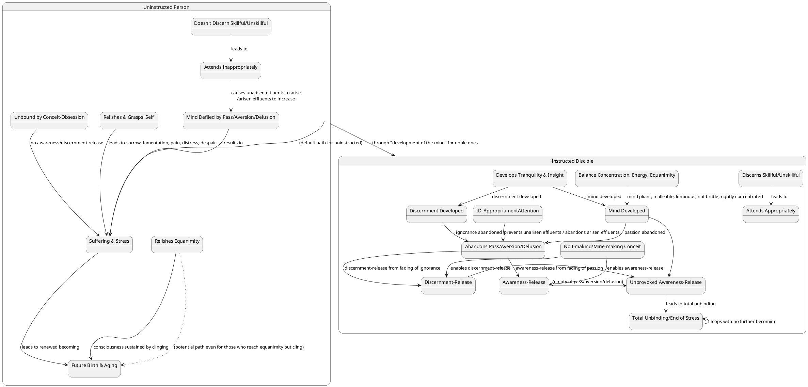
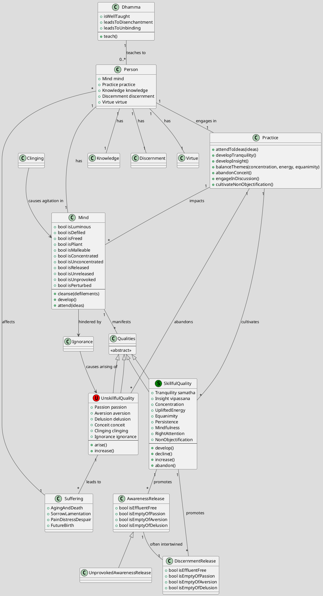

In response to your query regarding "Knowledge of the unprovoked" from the Dasuttara Sutta (DN 34), drawing on the provided sources, here is a comprehensive response:

***

### 1. Definition

**Knowledge of the unprovoked** refers to a profound state of insight and awareness that should be cultivated. It is closely associated with an **"unprovoked awareness-release"**, which is considered the **foremost** among awareness-releases.

Specifically, an **unprovoked awareness-release** is characterized by being **empty of passion, empty of aversion, and empty of delusion**. The term "unprovoked" describes a mind that is **still and unperturbed**, like a lake unruffled by wind. This mind "doesn't shake" and is "dispassionate for things that spark passion, unprovoked by things that spark provocation".

### 2. Considerations

The cultivation of "knowledge of the unprovoked" is crucial because it is identified as a **"dhamma that should be made to arise"**, signifying its importance in the spiritual path.

Its overall favorable impact is the **abandonment of passion, aversion, and delusion**. These three are considered "fires" and "impurities", and are described as qualities that lead to being "fettered" and "accumulating".

The ultimate benefits of this knowledge and the resulting unprovoked state include:
*   Attaining **awareness-release and discernment-release**.
*   Reaching a state of being **"at peace,"** "untroubled," and having "crossed over birth & aging".
*   Putting an **end to suffering & stress**.
*   Being **"totally unbound"** and experiencing **"unwavering bliss"**.
*   Preventing **"further becoming"** or rebirth.
*   Achieving a mind that is **"pliant, malleable, luminous, & not brittle,"** and "rightly concentrated for the ending of the effluents".

### 3. Causation

#### Causes/conditions For
*   "Knowledge of the unprovoked" is explicitly a **"dhamma that should be made to arise"**.
*   The state of being **"unperturbed"** is attained through **"direct knowledge of Dhamma, gnosis of Dhamma"**.
*   **Awareness-release** can be achieved when the mind is cleansed and joy arises, with defilements being abandoned through recollection of the Tathāgata, Dhamma, or Saṅgha.
*   **Tranquility [samatha] and insight [vipassanā]** are two qualities that have a share in clear knowing, with the development of tranquility leading to a developed mind and the abandonment of passion, and the development of insight leading to developed discernment and the abandonment of ignorance.
*   A mind that is **"rightly concentrated for the ending of the effluents"** is achieved by periodically attending to three themes: **concentration, uplifted energy, and equanimity**.
*   The **"theme-less awareness-release"** (which aligns with the "unprovoked awareness-release") is attained through **lack of attention to all themes and attention to the theme-less property**.
*   Cultivating the **"eight thoughts of a great person,"** which include being modest, content, reclusive, persistent, mindful, concentrated, discerning, and enjoying non-objectification, supports the development of such knowledge.

#### Effects From
*   The attainment of "knowledge of the unprovoked" results in a mind that is **"empty of passion, empty of aversion, and empty of delusion"**.
*   It leads to a mind that is **"composed"** and has **"no swellings"**.
*   One becomes **"disenchanted with this world & the next"**.
*   It allows one to be **"unagitated"** from lack of clinging or sustenance, meaning **"no seed for the conditions of future birth, aging, death, or stress"**.
*   One **"crosses over birth & aging"**.

#### Other Causal Factors (Impediments)
*   **Inappropriate attention** is the cause for unarisen passion, aversion, and delusion to arise, and for arisen ones to grow. Conversely, **appropriate attention** leads to their non-arising and abandonment.
*   **Clinging or sustenance** prevents total unbinding; if a monk relishes, welcomes, or remains fastened to equanimity, their consciousness becomes dependent on it, and they are not totally unbound. Agitation is directly caused by clinging.
*   **Conceit-obsession** (I-making or mine-making) with regard to the conscious body or external themes prevents awareness-release and discernment-release. It can also relate to restlessness and anxiety.
*   **Ignorance** is a "great delusion" that causes beings to wander on through birth and death. An "uninstructed run-of-the-mill person" is unable to gain release from consciousness because it has been relished and grasped as 'self' for a long time.
*   **Wrong views** and **lack of discerning what is skillful/unskillful** can lead to falsehood, clinging, and distress.
*   **Laziness and restlessness** can hinder proper concentration if themes of concentration or uplifted energy are attended to *solely* without balance.
*   A person who is **"fond of conceit"** or **"unconcentrated"** will find it hard to be tamed or cross beyond death's realm.

### 4. Complications

Obstacles or "complications" related to the development of "knowledge of the unprovoked" often manifest in the following ways:
*   **Ignorance and Delusion:** An **uninstructed run-of-the-mill person** is hindered by ignorance and fettered by craving, leading to continued transmigration and wandering. Such a person fails to discern phenomena like form, feeling, perception, fabrications, and consciousness as subject to origination, passing away, or their allure and drawbacks, leading to immersion in ignorance.
*   **Defiled Mind:** The mind becomes defiled by incoming defilements. When defiled by passion, it is not released; when defiled by ignorance, discernment does not develop.
*   **Clinging to Self-Identity:** An uninstructed person assumes form, feeling, perception, fabrications, or consciousness to be the self, or as belonging to the self, which leads to sorrow, lamentation, pain, distress, and despair when these change. This "self-identification view" is a "lower fetter" and its presence causes various other views to arise.
*   **Failure to Discern:** An inability to discern "what ideas are fit for attention and what ideas are unfit for attention" leads to the increase of unarisen effluents (sensuality, becoming, ignorance).
*   **Lack of Development:** An "undeveloped mind" cannot prevent unpleasant feelings from invading and remaining, leading to sorrow, grief, and lamentation.
*   **Resistance to Truth:** Some individuals may "wander from one thing to another, pull the discussion off the topic, show anger & aversion and sulk" when asked questions, making them unfit for beneficial discussion. Others may engage in "eel-wriggling" or verbal contortions due to fear of falsehood, clinging, or interrogation, or simply due to dullness and stupidity.

### 5. How To

To cultivate "knowledge of the unprovoked" and achieve the associated state of release:
*   **Discernment of Dependent Co-arising:** One must know and see the origination and passing away of phenomena, understanding that "whatever is subject to origination is all subject to cessation". This includes seeing stress, its origination, cessation, and the path to its cessation.
*   **Right Attention and Appropriate Engagement:**
    *   **Attend to ideas fit for attention:** These are ideas that prevent the arising of unarisen effluents and lead to the abandonment of arisen ones.
    *   **Attend appropriately to the theme of the unattractive:** This helps in the non-arising and abandonment of passion.
    *   **Attend appropriately to goodwill as an awareness-release:** This helps in the non-arising and abandonment of aversion.
    *   **Attend appropriately in general:** This helps in the non-arising and abandonment of delusion.
*   **Balanced Development of Concentration and Energy:** Periodically attend to the themes of concentration, uplifted energy, and equanimity. This makes the mind pliant, malleable, luminous, and rightly concentrated for ending effluents, avoiding laziness and restlessness.
*   **Abandoning Conceit and Clinging:** Train oneself to have **"no I-making or mine-making conceit-obsession"** with regard to the conscious body and all external themes. This is crucial for entering and remaining in awareness-release and discernment-release. Furthermore, do not relish, welcome, or remain fastened to even desirable states like equanimity, to avoid consciousness becoming dependent and sustained by them, which prevents total unbinding.
*   **Cultivate Virtue and Discernment:** Engage in a holy life where "unskillful mental qualities decline while one's skillful mental qualities increase". Develop "consummate virtue, consummate concentration, consummate discernment".
*   **Seek and Engage with Wise Individuals:**
    *   Regularly approach and question learned monks to clarify doubts and understand teachings.
    *   A wise person formulates questions appropriately, answers appropriately, and approves of appropriate answers from others.
    *   Be open to guidance and admonition from wise companions, recognizing that such interactions are for one's welfare.
*   **Non-Objectification and Reclusiveness:** Embrace non-objectification, which means not delighting in or enjoying objectification. Practice seclusion and reclusiveness, conversing only as necessary when visited.
*   **Mindfulness of Body, Feelings, Mind, and Mental Qualities:** Remain focused on these in and of themselves, ardently, alertly, and mindfully, subduing greed and distress with reference to the world.

***

### PART-B: Diagrams

