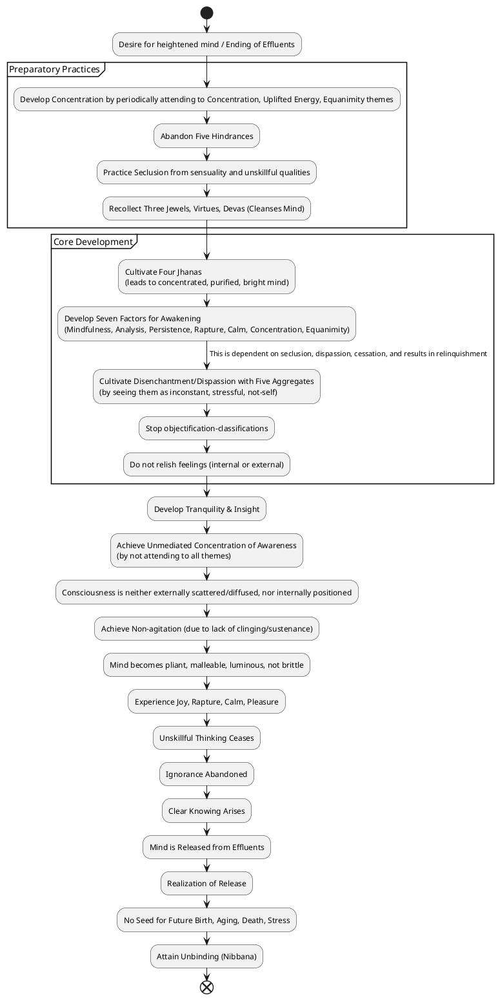
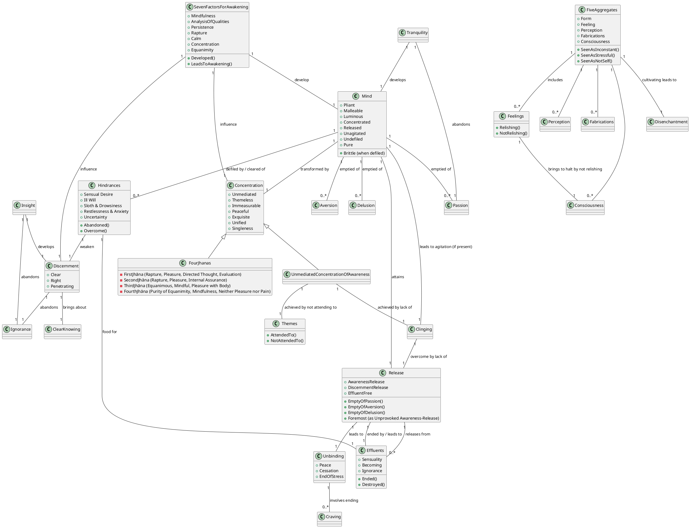

Here is a comprehensive response to your query regarding "Unmediated concentration of awareness" from the Dasuttara Sutta (DN 34), drawing solely from the provided sources.

## 1. Definition

"Unmediated concentration of awareness" is identified in the sources as a quality that is **hard to penetrate**. It is closely associated with, and appears synonymous with, **"theme-less concentration of awareness"**.

This state is characterized by a mind where one is **"not attending to all themes"**. In this concentration, consciousness is described as **neither externally scattered & diffused, nor internally positioned**. This lack of external diffusion or internal positioning leads to a state of **non-agitation** due to an absence of clinging or sustenance.

The "unprovoked awareness-release," which is strongly implied as the culmination or outcome of such a concentration, is stated to be the **foremost** among immeasurable awareness-releases. This unprovoked awareness-release is explicitly described as **empty of passion, empty of aversion, and empty of delusion**. Ultimately, this state signifies **peace, cessation, unbinding**, and involves the **pacification of all fabrications and the relinquishing of all acquisitions**.

## 2. Consequences & Benefits

Engaging in "Unmediated concentration of awareness" and related practices yields profound positive outcomes:

*   **Ending of the Effluents**: When the mind is rightly concentrated through these practices, it becomes **rightly concentrated for the ending of the effluents**. This culmination results in the profound realization that "birth is ended, the holy life fulfilled, the task done," with "nothing further for this world".
*   **Realization of Release**: This state facilitates the **release of the mind** from defilements, specifically leading to **effluent-free awareness-release and discernment-release**. This liberation frees the practitioner from the effluents of sensuality, becoming, and ignorance.
*   **Attainment of Unbinding (Nibbana)**: The ultimate fruit is unbinding, described as a **pleasant state where nothing is felt**, and where **craving is abandoned**. It represents the **unexcelled safety from bonds**.
*   **Transformation of the Mind**: Through such concentration, the mind becomes notably **pliant, malleable, luminous, and not brittle**. This transformed state enables it to be effectively concentrated for the ending of effluents.
*   **Cessation of Unskillful Thinking**: This concentration is powerful enough to cause **unskillful thinking to cease without remainder**, including thoughts imbued with sensuality, ill will, and harmfulness.
*   **Generation of Positive Mental States**: As the mind is purified and becomes concentrated, **joy and rapture naturally arise**. This leads to a calm body, resulting in pleasure and further concentration.
*   **Overcoming Agitation and Attachment**: The absence of clinging and scattering in this concentration leads to a state of **non-agitation**. It also helps one to **cross over attachment**.
*   **Development of Clear Knowing and Abandonment of Ignorance**: Through the knowledge and insight gained, ignorance is abandoned, and **clear knowing arises**.

## 3. Causation

### Causes/conditions for Unmediated concentration of awareness

*   **Not attending to all themes**: Directly, entering into "theme-less concentration of awareness" is achieved by **not attending to any theme**.
*   **Lack of clinging or sustenance**: A state where consciousness is "neither externally scattered & diffused, nor internally positioned" and becomes unagitated **due to lack of clinging or sustenance** is a prerequisite. This also enables the mind to be released from effluents.
*   **Abandoning passion, aversion, and delusion**: The "unprovoked awareness-release" is inherently defined by its **emptiness of passion, aversion, and delusion**.
*   **Development of tranquility (samatha) and insight (vipassanā)**: These two qualities are presented as paths leading to the unfabricated and contribute to clear knowing.
*   **Abandoning the five hindrances**: The five hindrances (sensual desire, ill will, sloth & drowsiness, restlessness & anxiety, and uncertainty) defile the mind, making it brittle and unfocused. Abandoning these allows the mind to become **pliant, malleable, and luminous**, rightly concentrated for the ending of effluents.
*   **Seclusion from sensuality and unskillful qualities**: This seclusion is the basis for entering the four jhānas, which are heightened mental states conducive to deep concentration.
*   **Well-developed concentration**: A concentrated mind is capable of discerning things as they truly are. The four jhānas are examples of such heightened mental states that purify the mind.
*   **Development of the seven factors for awakening**: These factors (mindfulness, analysis of qualities, persistence, rapture, calm, concentration, equanimity) are developed dependent on seclusion, dispassion, and cessation, leading to relinquishment and the release of the mind from effluents.
*   **Recollection of the Triple Gem and one's virtues**: Recollecting the Tathāgata (Buddha), Dhamma, Saṅgha, one's own virtues, and devas, cleanses the defiled mind and allows joy and calm to arise, leading to concentration and abandonment of defilements.

### Effects from Unmediated concentration of awareness

*   **No seed for future birth, aging, death, or stress**: When the mind is unagitated due to lack of clinging, there is **no seed for the conditions of future birth, aging, death, or stress**.
*   **Mind released from effluents**: This concentration is directly stated to lead to the **ending of effluents** and the **release of the mind** from sensuality, becoming, and ignorance.
*   **Pliant, malleable, luminous, not brittle mind**: The mind becomes highly adaptable, clear, and resilient, making it **rightly concentrated for the ending of effluents**.
*   **Cessation of unskillful thinking**: This concentration can specifically lead to the **cessation of unskillful thinking** related to sensuality, ill will, and harm.
*   **Arising of joy, rapture, calm, and pleasure**: As the mind achieves this state, joy and rapture emerge, bringing about a **calm body, a sense of pleasure, and deeper concentration**.
*   **Clear knowing and abandonment of ignorance**: Through this path, ignorance is abandoned, and **clear knowing arises**, which is essential for final release.

### Other

*   **Dependent Co-arising**: The fundamental principle governing all phenomena is "When this is, that is; from the arising of this comes the arising of that. When this isn't, that isn't; from the cessation of this comes the cessation of that". This applies to phenomena like ignorance (condition for fabrications) and craving (root of suffering).
*   **Hindrances as food for ignorance**: The five hindrances are metaphorically described as the "food" that sustains ignorance.
*   **Abandoning desire-passion**: Abandoning desire-passion for the five aggregates leads to the support being cut off, allowing consciousness to be released and become steady, contented, and ultimately unbound.

## 4. Arising & Passing Away

"Unmediated concentration of awareness" is an advanced state, described as **"hard to penetrate"**, implying it does not readily manifest in an ordinary state of mind.

It manifests when a practitioner moves beyond conventional engagement with objects of awareness by **"not attending to all themes"**. This allows consciousness to transcend its usual external scattering and internal positioning, achieving a state that is **"neither externally scattered & diffused, nor internally positioned"**.

This state is deeply connected to the **cessation of perception & feeling**, which is presented as the eighth step-by-step cessation. The "unprovoked awareness-release" that arises is **empty of passion, aversion, and delusion**, indicating that these defilements have completely ceased and are "not destined for future arising". This signifies its manifestation at the highest levels of spiritual liberation.

The process leading to this involves a keen focus on the **origination and passing away** of the five clinging-aggregates (form, feeling, perception, fabrications, consciousness). By discerning these aggregates as inconstant, stressful, and not-self, the practitioner develops disenchantment and dispassion, leading to release. Through this diligent focus on arising and passing away, the **"I am" conceit** and related desires are fully obliterated.

## 5. How To

Penetrating "Unmediated concentration of awareness" involves a multifaceted approach to mental development:

*   **Develop Concentration**: The core instruction is to "develop concentration". This includes cultivating "immeasurable concentration" based on goodwill, compassion, empathetic joy, or equanimity, which helps the mind become concentrated and opens the way to various realizations.
*   **Periodic Attention to Specific Themes**: For heightened mind, a monk should **periodically attend to the themes of concentration, uplifted energy, and equanimity**. This practice makes the mind pliant, malleable, and luminous, preparing it for the ending of effluents.
*   **Cultivate Tranquility (Samatha) & Insight (Vipassanā)**: These two qualities are crucial. **Tranquility develops the mind and abandons passion**, while **insight develops discernment and abandons ignorance**.
*   **Abandon the Five Hindrances**: The hindrances (sensual desire, ill will, sloth & drowsiness, restlessness & anxiety, uncertainty) are "imperfections of awareness that weaken discernment". Their abandonment is essential for the mind to become pliant, malleable, and luminous, enabling it to be rightly concentrated for the ending of effluents.
*   **Practice Seclusion**: Secluding oneself from sensuality and unskillful qualities is a foundational step, as it allows for the development of jhānas.
*   **Cultivate the Four Jhānas**: These are progressive states of heightened awareness (first, second, third, and fourth jhānas) attained by increasingly secluding the mind from sensuality and unskillful qualities, leading to a mind that is concentrated, purified, bright, and ready for the knowledge of the ending of effluents.
*   **Develop the Seven Factors for Awakening**: These factors—mindfulness, analysis of qualities, persistence, rapture, calm, concentration, and equanimity—are developed "dependent on seclusion, dependent on dispassion, dependent on cessation, resulting in relinquishment". Their development leads to the mind's release from effluents.
*   **Cultivate Disenchantment (Dispassion)**: Regularly cultivate disenchantment with the five clinging-aggregates (form, feeling, perception, fabrications, consciousness) by seeing them as "inconstant, stressful, a disease, a cancer, an arrow, painful, an affliction, alien, a dissolution, an emptiness, not-self". This leads to comprehension and total release from suffering.
*   **Stop Objectification-Classifications**: A key practice is to "put an entire stop to the root of objectification-classifications: 'I am the thinker'".
*   **Not Relish Feelings**: By "not relishing feeling, inside or out," one can bring consciousness to a halt.
*   **Recollection Practices**: Regularly recollecting the Tathāgata (Buddha), the Dhamma, the Saṅgha, one's own virtues, and devas, serves to calm the mind, generate joy, and abandon mental defilements. This is described as a "cleansing of the defiled mind through the proper technique".

---

## PART-B: PlantUML Diagrams

### 1. PlantUML Activity Diagram

### 2. PlantUML Class Diagram

