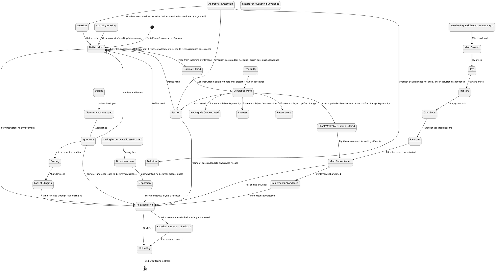
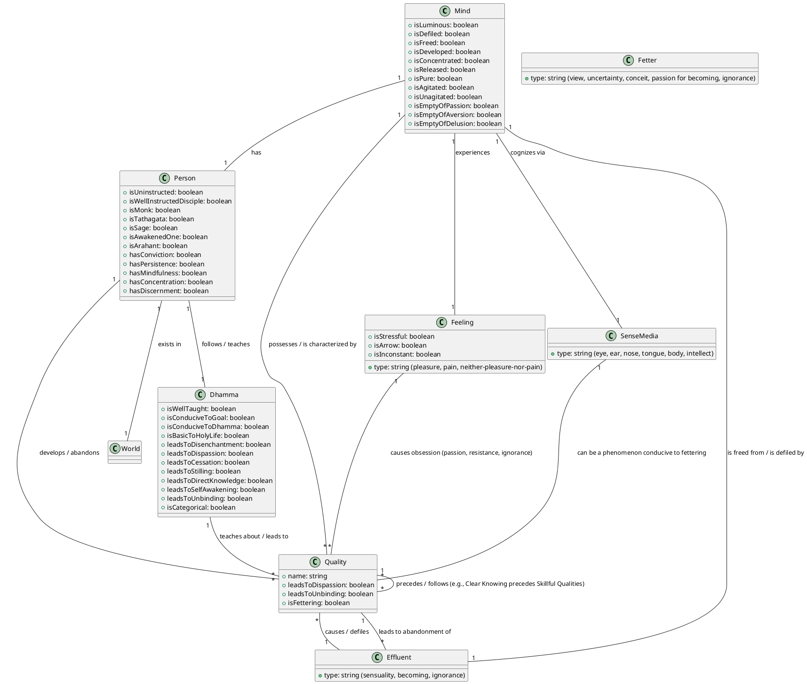
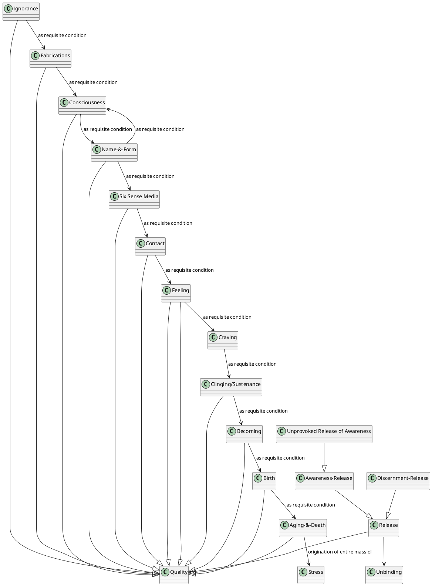

Here is a comprehensive response to your query regarding "Unprovoked release of awareness", drawing on the provided sources and formatted according to the template.

---

### PART-A: Body Content

## 1. Definition

"Unprovoked release of awareness" is a state of liberation of the mind that is **empty of passion, empty of aversion, and empty of delusion**. It is described as **the foremost** among other types of awareness-releases, such as immeasurable, nothingness, and themeless awareness-releases. This state signifies that the effluents (passion, aversion, and delusion) have been abandoned, their root destroyed, made like a palmyra stump, deprived of the conditions of development, and not destined for future arising. This concentration is also described as a "fruit of gnosis [arahantship]" where the mind is neither pressed down nor forced back, nor kept in place by the fabrications of forceful restraint, but is **still as a result of release, contented as a result of standing still, and unagitated** as a result of contentment.

## 2. Considerations

The realization of unprovoked release of awareness is the ultimate goal of the holy life. It signifies the **ending of suffering and stress** and leads to **unbinding** (Nibbāna). When this release is attained, there is **no further becoming** or birth. A mind in this state is described as **freed from hostility, free from ill will, undefiled, and pure**. It also implies that the individual is **incapable of being heedless**.

## 3. Causation

### Causes/conditions For

*   **Abandonment of passion, aversion, and delusion**: The unprovoked awareness-release *is* the state of being empty of these defilements, which are abandoned when effluents are ended.
*   **Development of tranquility and insight**: Tranquility leads to a developed mind and the abandonment of passion, while insight leads to developed discernment and the abandonment of ignorance. The fading of passion leads to awareness-release, and the fading of ignorance leads to discernment-release.
*   **Appropriate attention**: This is crucial for preventing the arising of unarisen passion, aversion, and delusion, and for abandoning those that have arisen.
*   **Discernment of inconstancy, stress, and not-self**: Seeing all forms, feelings, perceptions, fabrications, and consciousness as inconstant, stressful, and not-self leads to disenchantment, then dispassion, and then release.
*   **Developing factors for awakening**: When factors like mindfulness, analysis of qualities, persistence, rapture, calm, concentration, and equanimity are developed, dependent on seclusion, dispassion, and cessation, the mind is released from effluents.
*   **Lack of clinging or sustenance**: Consciousness, when not having landed (supported) by passion, is released, steady, contented, and not agitated, leading to total unbinding.
*   **Purified virtue and straightened views**: These form the basis for developing the four establishings of mindfulness, which in turn can lead beyond Māra's realm.

### Effects From

*   **Total ending of suffering and stress**: This is the ultimate outcome.
*   **Realization of unbinding**: The final destination of the holy life.
*   **No future becoming/birth**: The effluents are destroyed, preventing future arising.
*   **Freedom from defilements**: The mind is pure, free from hostility and ill will.
*   **Non-agitation**: The mind becomes unagitated, steady, and unified.
*   **Knowledge and vision of release**: This is the culmination of the path of development.
*   **Inability to be heedless**: The task of heedfulness is complete.
*   **Cutting through craving and ripping off fetters**: This is achieved through rightly breaking through conceit.

### Other Causal Factors

*   **Inappropriate attention**: Leads to the arising and increase of unarisen passion, aversion, and ignorance.
*   **Clinging or sustenance**: Causes agitation and prevents total unbinding.
*   **Ignorance and craving**: Hinder beings from going beyond transmigration.
*   **Delighting in objects/ideas**: Relishing, welcoming, or remaining fastened to feelings can lead to passion, resistance, and ignorance obsessions, preventing the end of suffering.

## 4. Complications

The path to unprovoked awareness-release is hindered by various unskillful qualities and views:

*   **Defilements and Effluents**: **Passion, aversion, and delusion** are primary hindrances. They defile the mind. The effluent of sensuality, becoming, and ignorance must be abandoned.
*   **Ignorance**: Precedes the arrival of unskillful qualities and prevents discerning the origination, disappearance, allure, drawbacks, and escape from form, feeling, perception, fabrications, and consciousness. It is a great delusion that causes wandering-on.
*   **Clinging and Sustenance**: Prevent total unbinding and cause agitation. "Craving is the seamstress" that stitches one to renewed becoming.
*   **Conceit (I-making/mine-making)**: Hinders the attainment of awareness-release and discernment-release.
*   **Restlessness and Laziness**: If one attends solely to uplifted energy, the mind may tend to restlessness; solely to concentration, it may tend to laziness. Over-aroused persistence leads to restlessness, and overly slack persistence leads to laziness. Heedlessness leads to lack of joy, rapture, calm, and concentration.
*   **Uninstructed/Run-of-the-mill person**: Such individuals don't discern ideas fit for attention, attend inappropriately to views of self, and are bound by views, leading to suffering. They are unable to grow disenchanted with mind/intellect/consciousness because they relish, appropriate, and grasp them as 'self'.

The realization of unprovoked awareness-release is supported by:

*   **Tranquility (samatha) & Insight (vipassanā)**: These two qualities have a share in clear knowing and are of great help in attaining cessation. Tranquility leads to a developed mind and abandoning passion; insight leads to developed discernment and abandoning ignorance.
*   **Discernment**: Essential for knowing the path, seeing phenomena as they are, and penetrating to the end of suffering.
*   **Persistence**: Aroused for abandoning unskillful qualities and taking on skillful ones, steadfast and solid in effort.
*   **Mindfulness**: Established, not confused, crucial for self-control, and for discerning feelings and effluents. Mindfulness immersed in the body helps abandon passion and thoughts.
*   **Concentration**: Essential for a pliant, malleable, luminous mind, rightly concentrated for ending effluents. It is a presiding state for all phenomena.
*   **Equanimity**: When developed, helps make the mind pliant and rightly concentrated. It can be pursued when it leads to skillful mental qualities and declines unskillful ones.
*   **Well-instructed disciple of the noble ones**: Such individuals discern fit and unfit ideas, leading to the cessation of views and freedom from suffering.
*   **The Dhamma-stream**: Can carry one along to release.

## 5. How To

To attain unprovoked release of awareness, one should practice the Dhamma by:

*   **Developing tranquility (samatha) and insight (vipassanā)**: These two qualities are foundational for clear knowing and the abandonment of passion and ignorance.
*   **Cultivating appropriate attention**: This involves attending to ideas fit for attention and refraining from ideas unfit for attention. For instance, focusing on the unattractive theme for sensuality, goodwill for aversion, and maintaining appropriate attention for delusion helps abandon these defilements.
*   **Training in non-conceit and non-identification**: This includes cultivating no "I-making" or "mine-making" conceit-obsession with regard to the conscious body and external themes. Continuously reflecting on mind, intellect, or consciousness as "not me, not my self, not what I am" is essential.
*   **Abandoning unskillful qualities and developing skillful ones**: This requires persistent effort, steadfastness, and not shirking duties regarding skillful qualities.
*   **Periodic attention to themes**: A monk intent on heightened mind should periodically attend to the theme of concentration, uplifted energy, and equanimity to keep the mind pliant, malleable, luminous, and rightly concentrated for the ending of effluents.
*   **Recollecting the Triple Gem**: Regularly recollecting the qualities of the Buddha (Tathāgata), the Dhamma, and the Saṅgha helps calm the mind, foster joy, and abandon defilements.
*   **Understanding Dependent Co-arising and Cessation**: Deeply understanding that stress arises from conditions (like ignorance, fabrications, consciousness, contact, feeling, craving, clinging, becoming, birth, aging-and-death) and ceases with the cessation of these conditions is central to the practice.
*   **Rightly seeing feelings**: One should view feelings of pleasure as stressful, pain as an arrow, and neutral feelings as inconstant. Not relishing, welcoming, or clinging to feelings, and discerning their origination, passing away, allure, drawback, and escape, is crucial for overcoming obsessions.
*   **Developing mindfulness immersed in the body**: This practice helps abandon passion for beauty, eliminates annoying external thoughts (through mindfulness of in-and-out breathing), and leads to clear knowing by focusing on the inconstancy of fabrications.
*   **Systematic training of faculties**: The unexcelled development of faculties involves discerning agreeable, disagreeable, or mixed reactions to sensory input (forms, sounds, etc.) as fabricated and dependently co-arisen, and letting equanimity take its place.
*   **Engaging in "openings to release"**: This includes learning the Dhamma from a teacher, teaching it to others, reciting it, contemplating it mentally, and mastering themes of concentration.
*   **Seeking guidance**: Approaching learned monks, asking questions, and seeking clarification on difficult points is highly beneficial for understanding the Dhamma.

---

### PART-B: Diagrams

<!-- partition diagram -->

