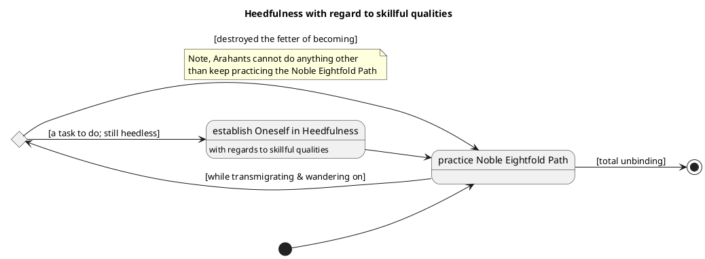
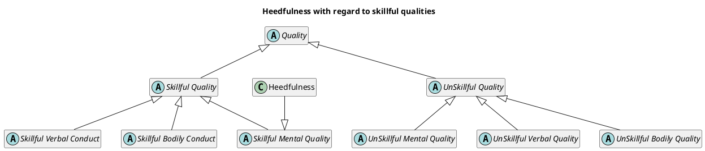

# One > Helpful > Heedfulness with regard to skillful qualities

## Behavioural Overview

```plantuml
@startuml
title Heedfulness with regard to skillful qualities
state hasTaskToDo <<choice>>
state "practice Noble Eightfold Path" as practiceNobleEightfoldPath
state "establish Oneself in Heedfulness" as heedfulness
left to right direction

[*] --> practiceNobleEightfoldPath
practiceNobleEightfoldPath --> hasTaskToDo: [while transmigrating & wandering on]
hasTaskToDo --> practiceNobleEightfoldPath: [destroyed the fetter of becoming]
note on link
Note, Arahants cannot do anything other 
than keep practicing the Noble Eightfold Path
end note

hasTaskToDo --> heedfulness: [a task to do; still heedless]
heedfulness --> practiceNobleEightfoldPath
heedfulness: with regards to skillful qualities

practiceNobleEightfoldPath --> [*]: [total unbinding]
@enduml
```

## Structural Overview

```plantuml
@startuml
title Heedfulness with regard to skillful qualities
hide empty members

abstract class "Quality" as Q
abstract class "Skillful Quality" as SQ extends Q
abstract class "UnSkillful Quality" as UQ extends Q

abstract class "Skillful Mental Quality" as SMQ extends SQ
abstract class "Skillful Verbal Conduct" as SVC extends SQ
abstract class "Skillful Bodily Conduct" as SBC extends SQ
abstract class "UnSkillful Mental Quality" as UMQ extends UQ
abstract class "UnSkillful Verbal Quality" as UVQ extends UQ
abstract class "UnSkillful Bodily Quality" as UBQ extends UQ

Heedfulness --|> SMQ

@enduml
```