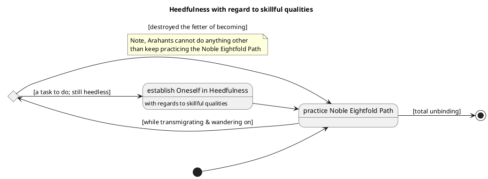
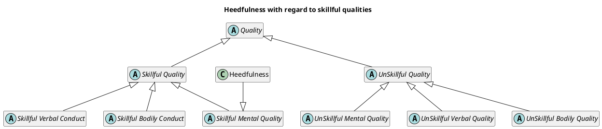

# One > Helpful > Heedfulness with regard to skillful qualities

## Models

@startuml
title Heedfulness's role in daily life
package "Dhamma Practice in Daily Life" {
    usecase dl as "daily_life
    --
    **repeat** {                                   
          - attend to **hygiene**                 
      - attend to **travel**               
      - attend to **meals**                
      - attend to **livelihood**           
      - attend to **companionship**
      - attend to **entertainment** 
      - attend to **rest**                    
    } **until (end of life)**                 "
    
    usecase hd as "Heedfulness with regard to\nskillful qualities"
    
    dl <|-l- hd: touches on every aspect of\ndaily life because heedfulness\ngives rise to attention
}
@enduml



@startuml
title Cultivating Heedfulness results in appropriate attention & right view
start
while (effluent-free?) is (no)
    repeat
        :seek admirable friendship;
        floating note left: MN 95
    repeat while (observes purifed qualities) is (no)

    fork
        repeat
            fork
                :places **conviction (in teacher)**;
                :visits;
                :grows close;
                :lends ear;
                :hears the dhamma;
            fork again
                :develops a **sense of shame**;
                detach
            end fork {and}
            while (remembering the dhamma?) is (yes) 
                fork
                    :remembers the dhamma;
                    :penetrates the meaning of those dhammas;
                    :comes to an agreement through pondering 
                    those dhammas (ie. **conviction in dhamma**);
                fork again
                    :develops a **sense of compunction**;
                    detach
                end fork {and}
                :desire arises;
                :becomes willing;
                :contemplates the dhamma;
                :exerts oneself;
            end while
        repeat while (admirable friend arouses sense of shame?) is (yes)
    fork again
      while (having a **sense of shame or compunction**?) is (yes)
        :becomes **more heedful** (ie. less heedless);
        floating note right: AN 10:76
        :develops non-apathy;
        :becomes easy to correct;
        :seek admirable friendship;
        :develops conviction;
        :develops non-stinginess;
        :arouses persistence;
        :develops non-restlessness;
        :develops restraint;
        :develops virtue;
        :develops desire to see noble ones;
        :develops desire to hear noble dhamma;
        :having a mind not bent on critism;
        :develops mindfulness & alertness;
        :develops unscattered awareness;
        :develops **appropriate attention**;
        :acquires **right view** & the right path;
      end while
    end fork {and}
endwhile
stop
@enduml




@startuml

left to right direction
state Mind {
  [*] --> Heedless
  Heedless --> Heedless: task to do
  Heedless --> Heedful: {effluent-free}
  Heedful --> [*]: total unbinding
--
  state "Run-of-the-Mill" as rotm
  state "Conviction|Dhamma-follower" as cdf
  state "Stream-enterer" as se
  state "Once-returner" as or
  state "Non-returner" as nr
  state "Arahant" as ar
  
  [*] --> rotm
  rotm --> rotm: task to do
  rotm --> cdf
  cdf --> cdf: task to do
  cdf --> se
  se --> se: task to do
  se --> or
  or --> or: task to do
  or --> nr
  nr --> nr: task to do
  nr --> ar: {effluent-free}
  ar --> [*]: total unbinding
}
@enduml



## Behavioural Overview

* draw a diagram that shows conviction, sense of shame & compunction is grown thru:
    - identify admirable friend
    - establish conviction
    - visit & grow close
    - lend ear

## Structural Overview

