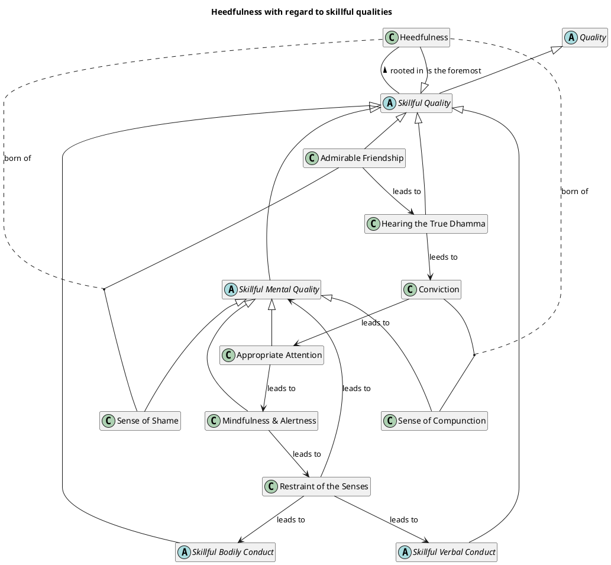

<!-- 
```notebooklm-prompt
Using the source "helpful_template.md" as a template and instructions, generate the content for all sections from 1-8
```
 -->

In Dasuttara Sutta (DN 34) it is stated 
> "Which one dhamma is very helpful? Heedfulness with regard to skillful qualities"

## 1. Definition

NotebookLM Task:
    Answer: What is heedfulness with regard to skillful qualities?


## 2. Considerations

> But as for monks in higher training, who have not yet reached their hearts' goal, who still aspire for the unexcelled freedom from bondage: I say of them that they have a task to do with heedfulness. 

> Then the Blessed One addressed the monks, 'Now, then, monks, I exhort you: All fabrications are subject to ending & decay. Reach consummation through heedfulness.' That was the Tathāgata's last statement.


NotebookLM Task:
    Answer: Given the quotes above why is heedfulness significant for all individuals including non-returners; the only exception is Arahants? 

NotebookLM Task:
    Answer: What is the relationship between heedfulness, appropriate attention & the three roots of skillfull qualities (ie. non-greed, non-aversion & non-delusion)? 
    Answer: Which of these (ie. heedfulness, appropriate attention & the three roots of skillfull qualities) directly influences intention?  


## 3. Causation

NotebookLM Task:
    Answer: What mental qualities (going back 3 level in the chain) are requisites for being established in heedfulness?
    Answer: What verbal conduct are requisites for being established in heedfulness?
    Answer: What bodily conduct are requisites for being established in heedfulness?

    Answer: What qualities does estanlishing oneself in heedfulness immediately lead to?


## 4. Complications

NotebookLM Task:
    Answer: Where, despite practicing in seclusion, does heedlessness unexpectedly creep in?
    Answer: which unskillful qualities arise to distract a practitioner from remaining heedful?


## 5. How To

The following statement is repeated in the source:
> dwelling heedful, ardent, & resolute—releases his unreleased mind

NotebookLM Task:
    Answer: How does this threefold dwelling lead such excellence? What roles does each quality and what level is each role played at for such an outcome?

NotebookLM Task:
    Answer: In MN 39 the buddha describes a contemplative practice (as opposed to a path). provide an analysis on the touchpoints between heedfulness and each aspect of the  contemplative practice.


## 6. Simile
NotebookLM Task:
    list all relevant similes related to heedfulness:
        * Describing the simile
        * Explain how it can be understood


## 7. PlantUML Behavioural Model

NotebookLM Task:
    * Generate a plantuml state diagram using only the information generated in this document. the purpose of the diagram is to help the practitioner understand the practice workflow and where heedfulness fits into it

    * Consider using guide_plantuml_state_diagram.md

### 8. PlantUML Structural Model

NotebookLM Task:
    * Generate a plantuml class diagram using only the information generated in this document. the purpose of the diagram is to help the practitioner understand the relationships between the concepts that are relevant to heedfulness

    * Consider using guide_plantuml_state_diagram.md



<!-- Yes, your summary of the chain heedfulness → appropriate attention → right view → roots of skillful (i.e., non-greed, non-aversion, non-delusion) is broadly correct and reflects a foundational progression in the cultivation of skillful intentions and qualities according to the sources. Let's explore each link to understand the connections more deeply. -->
