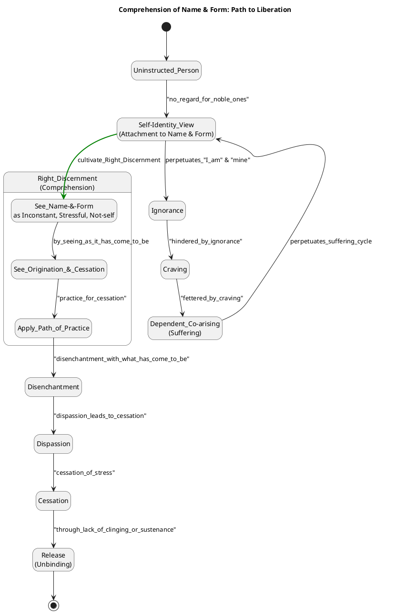
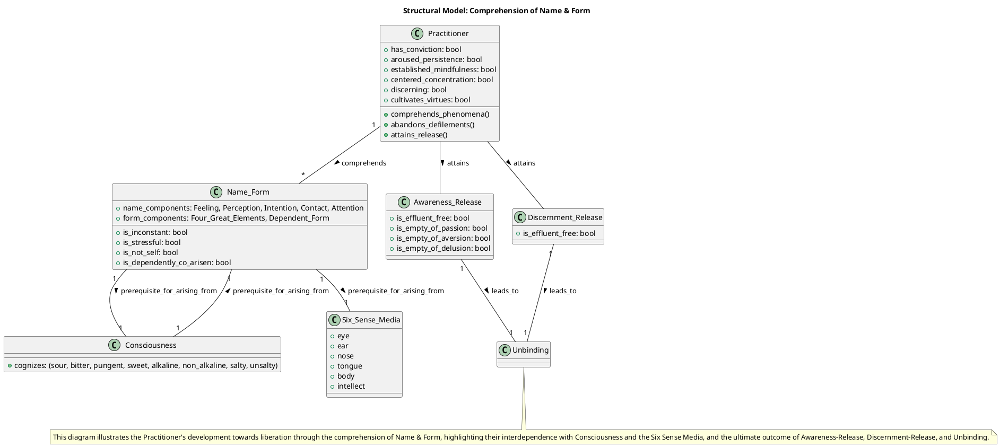

### Name & Form: Comprehended Dhamma

This chapter delves into the comprehension of "Name & Form," a fundamental concept in the Dhamma, guiding practitioners toward a deeper understanding of reality and the path to liberation.

#### 1. Definition

"Name & form" refers to the totality of an individual's being.
*   **Name** encompasses mental aspects, defined as feeling, perception, intention, contact, and attention.
*   **Form** refers to the physical aspect, comprising the four great elements and the form dependent on them.

These two, name and form, are inherently conjoined and are considered "two dhammas that are rightly expounded by the Blessed One". They are also recognized as "inconstant" and "stressful".

#### 2. Considerations

Fully comprehending "Name & form" is crucial for ending suffering and attaining liberation because it addresses the root causes of entanglement in the cycle of existence. By deeply understanding "Name & form," a practitioner can:

*   **Counter Ignorance and Attachment:** The Dhamma is taught for the purification of beings, leading to the overcoming of sorrow, lamentation, pain, distress, and the realization of unbinding. This purification involves countering the defilements of passion, aversion, and delusion, which prevent true understanding and release.
*   **Develop Right View:** Discerning "Name & form," along with its origination, cessation, and the path to its cessation, is integral to establishing right view. Right view, in turn, purges away wrong views and leads to the culmination of skillful qualities.
*   **Recognize Inconstancy and Stress:** Comprehending that "Name & form" is inconstant, stressful, and not-self is essential. This realization leads to disenchantment and dispassion, which are necessary steps toward cessation and unbinding.
*   **Sever the Cycle of Becoming:** Understanding "Name & form" within the framework of dependent co-arising reveals how it is a requisite condition for further elements in the chain of suffering, such as the six sense media, contact, feeling, craving, and ultimately, renewed becoming, birth, aging-&-death, and the entire mass of suffering and stress. Comprehension allows for the subduing of desire and passion for these aggregates, leading to the cessation of stress.

#### 3. Causation

The comprehension of "Name & form" unfolds through specific conditions and leads to progressive states:

*   **Requisites for the Arising of Name & Form:**
    *   **Consciousness** is a requisite condition for the coming into play of "Name & form". Conversely, "Name & form" is a requisite condition for consciousness. They are interdependent, like two sheaves of reeds leaning against each other.
    *   **Kamma** is the "field," **consciousness** is the "seed," and **craving** is the "moisture" for the production of renewed becoming, which involves "Name & form" in the future.
*   **Results of Name & Form:**
    *   From "Name & form" as a requisite condition come the **six sense media**.
    *   The entire mass of suffering and stress, including aging-&-death, sorrow, lamentation, pain, distress, & despair, comes into play dependent on the conditions originating from "Name & form".
*   **Essential Preceding States/Practices for Comprehension:**
    *   **Right Discernment:** One must see phenomena "as it has come to be with right discernment".
    *   **Hearing the Dhamma:** Hearing the Dhamma leads to remembering it, which leads to penetrating its meaning, and ultimately to discerning it.
    *   **Questioning and Quizzing:** Regularly approaching learned monks and asking and questioning them helps to make open what isn't open, plain what isn't plain, and dispel doubt.
    *   **Conviction (Saddhā):** Conviction in the Tathāgata's message is healing and nourishing, supporting the penetration of the Dhamma.
    *   **Ardency, Alertness, Mindfulness:** Remaining heedful, ardent, and resolute is crucial for mind development and ultimately for penetrating the Dhamma.

#### 4. Complications

The comprehension of "Name & form" can be impeded by various challenges and unskillful states:

*   **Allure and Drawbacks of Phenomena:** The allure of "Name & form" lies in the pleasure and joy that arises in dependence on them. However, the drawback is that any change or alteration in "Name & form" leads to sorrow, lamentation, pain, grief, and despair. This cycle perpetuates suffering if not understood.
*   **Lack of Discernment and Ignorance:** An uninstructed, run-of-the-mill person does not discern "Name & form" as subject to origination and passing away, leading to immersion in ignorance. Such ignorance hinders beings and keeps them fettered by craving, perpetuating transmigration.
*   **Self-Identity View (Conceit):** Assuming "Form to be the self, or the self as possessing form, or form as in the self, or the self as in form" is a self-identification view. This fixed and unsubdued view is a lower fetter. Similarly, clinging to "Name & form" as "mine" or "my self" prevents the comprehension and total destruction of stress. The "I-making" or "mine-making" conceit-obsession must be abandoned.
*   **Wrong Views about Consciousness:** Mistaking consciousness as a permanent entity that "runs and wanders on" (as in the case of Sati the Fisherman's Son) is a severe misrepresentation of the Dhamma and produces demerit. Consciousness is dependently co-arisen and not separate from its requisite conditions.
*   **Unskillful Mental Qualities:** Passion, aversion, and delusion defile the mind and prevent discernment from developing, leading to a lack of release. These are explicitly stated as "a making of measurement," which is a form of conceit. Without abandoning these, one remains deluded.

#### 5. How To

To initiate, sustain, and deepen the process of comprehending "Name & form" and become a masterful practitioner:

*   **Discern the Nature of "Name & Form":** Train yourself to see all forms as inconstant, stressful, and not-self. Understand that "Name & form" is dependently co-arisen, meaning it arises when its requisite conditions are present and ceases when those conditions cease.
*   **Cultivate Disenchantment and Dispassion:** Recognize the drawbacks and dangers inherent in clinging to "Name & form". Actively work towards subduing passion and desire for it, which leads to the cessation of stress.
*   **Develop the Noble Eightfold Path:** Engage in the practice that leads to the ending of suffering and stress. This includes cultivating right view, right resolve, right speech, right action, right livelihood, right effort, right mindfulness, and right concentration. Right view, in particular, involves knowing stress, its origination, cessation, and the path to cessation, which directly applies to "Name & form".
*   **Practice Concentration:** Attend periodically to themes of concentration, uplifted energy, and equanimity to make the mind pliant, malleable, luminous, and rightly concentrated for ending effluents. This helps in stabilizing the mind to clearly observe "Name & form."
*   **Apply Mindfulness:** Remain ardent, alert, and mindful in focusing on body, feelings, mind, and mental qualities, including "Name & form" as a mental quality and a component of the body. This subdues greed and distress regarding the world.
*   **Seek and Engage with Wise Teachers:** Approach learned monks at regular intervals to ask and question them, allowing them to clarify what is unclear and dispel doubts. This active investigation is essential for understanding the Dhamma deeply.

#### 6. Similes

*   **Sheaves of Reeds Leaning Against One Another:**
    *   **Description:** From "Name & form" as a requisite condition comes consciousness, and from consciousness as a requisite condition comes "Name & form." This interdependence is likened to two sheaves of reeds standing leaning against one another.
    *   **Explanation:** This simile helps the practitioner discern the **dynamic and mutually dependent nature** of "Name & form" and consciousness. It illustrates that neither can arise independently, emphasizing the conditioned nature of existence and undermining any notion of a separate, permanent self.
*   **Boil with Nine Openings:**
    *   **Description:** The physical body (a component of "Form") is compared to a boil that has been building for many years with nine openings, from which uncleanliness, stench, and disgust ooze out.
    *   **Explanation:** This simile helps in cultivating **disenchantment and dispassion** towards the physical form. By highlighting its inherent unattractiveness, impurity, and impermanence, it encourages the practitioner to abandon desire and attachment to the body, thereby aiding in the comprehension of "Form" as unsatisfactory and not-self.

---

### PART-B: PlantUML Diagrams

#### 7. Behavioural Model

#### 8. Structural Model
