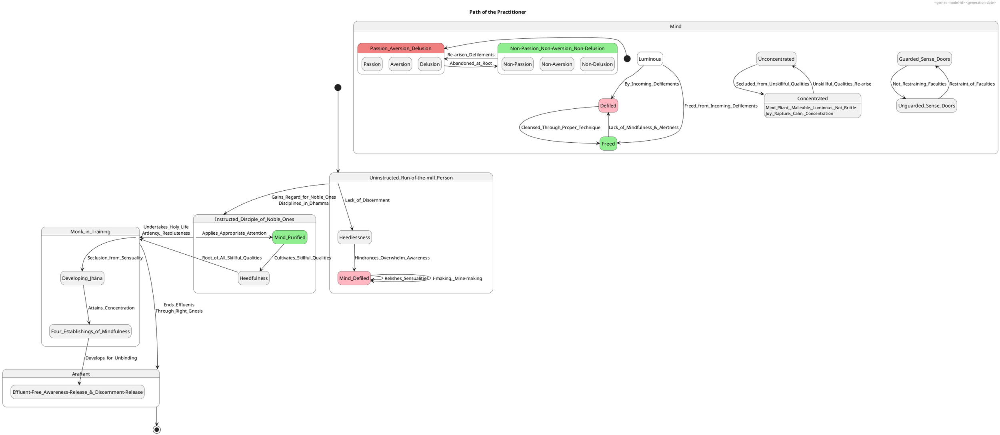
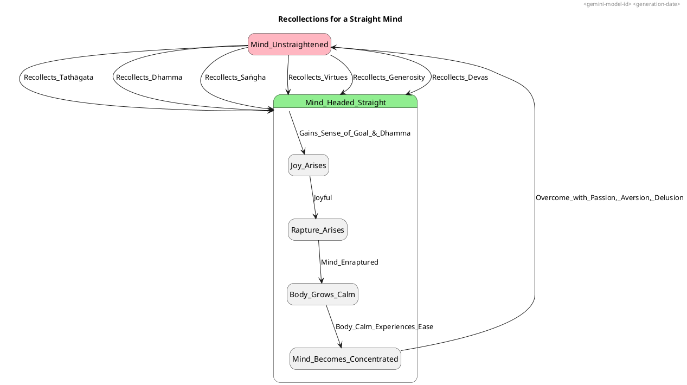

### > Helpful >
#### 1. Definition
**Mindfulness (Sati)** is described as being **highly meticulous, remembering & able to call to mind even things done & said long ago**. **Alertness (Sampajañña)** involves making oneself **fully alert when going forward and returning**, and maintaining awareness "when going forward and returning... when looking toward and looking away... when bending and extending limbs... when carrying outer cloak, upper robe, & bowl... when eating, drinking, chewing, & tasting... when urinating & defecating... when walking, standing, sitting, falling asleep, waking up, talking, & remaining silent". One should be **mindful & alert** at the time of death.

Mindfulness and alertness are fundamental qualities to be possessed in all activities. They are considered **"two dhammas that are very helpful"**.

#### 2. Considerations
Acquiring and developing mindfulness and alertness is crucial for a masterful practice because they are integral to a practitioner's progress towards liberation and purity.

**Overall favorable impact and ultimate positive states or benefits:**
*   Mindfulness and alertness lead to **concentration**. When recollecting the Buddha, Dhamma, Saṅgha, virtue, generosity, and devas, the mind becomes straight, leading to joy, rapture, calm, and concentration.
*   They contribute to the mind becoming **pliant, malleable, luminous, and not brittle**, and **rightly concentrated for the ending of the effluents**.
*   They are essential for the **purification of beings, for the overcoming of sorrow & lamentation, for the disappearance of pain & distress, for the attainment of the right method, & for the realization of unbinding**.
*   When one is alert, feelings, thoughts, and perceptions are known as they arise, persist, and subside. This **leads to clear knowing**.
*   A mind protected by mindfulness is described as pure.
*   They are crucial for avoiding later remorse and for living without heedlessness.

#### 3. Causation
##### Causes/conditions For Mindfulness & Alertness:
*   **Appropriate attention** is a dhamma that is on the side of distinction. When a disciple of the noble ones listens to the Dhamma with appropriate attention, their five hindrances don't exist, and the seven factors for awakening go to completion.
*   **Developing mindfulness of breathing** is a peaceful and exquisite abiding that immediately disperses & allays any evil, unskillful mental qualities that have arisen.
*   **Recollection of the Tathāgata, Dhamma, Saṅgha, one's own virtues, generosity, and devas** strengthens the mind, making it "not overcome with passion, not overcome with aversion, not overcome with delusion," and causes the mind to head straight, leading to joy, rapture, calm, and concentration.
*   **Virtue and views made straight** form the basis for developing the four establishings of mindfulness.
*   A monk is **astute** by keeping persistence aroused for abandoning unskillful qualities and taking on skillful qualities, being steadfast and solid in effort. This astuteness implies a quality of mindfulness and alertness.
*   **Good digestion**, being of moderate strength, is a factor that makes one fit for exertion. Exertion supports mindfulness.
*   **Tranquility and insight** are two qualities of great help in the attainment of the cessation of perception and feeling. These are developed through mindfulness and concentration.
*   **Heedfulness (Appamāda)** is integrally linked with mindfulness and alertness and is considered the **root of all skillful qualities**.
*   **Right effort** involves generating desire, endeavor, persistence, and exertion for the non-arising and abandoning of unskillful qualities and the arising and development of skillful qualities.

##### Effects From Mindfulness & Alertness:
*   The mind, when periodically attentive to concentration, uplifted energy, and equanimity themes, becomes **pliant, malleable, luminous, & not brittle**, and **rightly concentrated for the ending of the effluents**.
*   When a mind is **cleansed** through proper technique (e.g., recollection of the Buddha, Dhamma, Saṅgha, virtues, devas), joy arises and defilements are abandoned.
*   Mindfulness and alertness lead to the **abandonment of passion, aversion, and delusion**.
*   They enable one to **know, see, attain, realize, and break through** to what has been unknown, unseen, unattained, and unrealized, specifically understanding stress, its origination, cessation, and the path to its cessation.
*   When mindfulness of in-&amp;-out breathing is developed, even one's **final in-breaths & out-breaths are known as they cease, not unknown**.
*   The **purity of the mind** is attained through exertion for full purity, which includes purity of virtue, mind, view, overcoming doubt, knowledge & vision of the path, and release.
*   A mind that is **unagitated** from lack of clinging or sustenance has no seed for the conditions of future birth, aging, death, or stress. This state is achieved through investigation that prevents consciousness from being externally scattered or internally positioned.

##### Other Causal Factors:
*   **Guarded sense doors & knowing moderation in eating** are two dhammas that contribute to skillful mental qualities and are directly related to the maintenance of mindfulness. Nanda, for example, could follow the holy life, perfect and pure, because he guarded the doors of his senses, knew moderation in eating, and was endowed with mindfulness & alertness.
*   **Knowledge of the ending (of effluents) & knowledge of (their) non-recurrence** are two knowledges that should be made to arise. These are ultimate forms of knowledge that mindfulness and discernment support.
*   **Ignorance & craving for becoming** are two dhammas that lead to suffering. Their cessation is the goal that mindfulness and alertness aim to achieve.

#### 4. Complications
Challenges, obstacles, or negative states that hinder mindfulness and alertness, or that mindfulness and alertness address, occur throughout one's training and in momentary phenomena.

**Hindrances to Mindfulness & Alertness:**
*   **Muddled mindfulness** prevents a person from receiving the Dhamma intended for those with established mindfulness. It is one of the five qualities that, if not present (established mindfulness), means one is "not aroused to practice".
*   **Unalertness** is one of the qualities of a person who has gone forth but misses out on the purpose of contemplative life.
*   **Heedlessness** (the opposite of heedfulness, which is rooted in mindfulness) leads to a decline in spiritual progress: **no joy, no rapture, no calm; dwelling in pain; the mind doesn't become concentrated; phenomena don't become manifest**. This means unskillful mental qualities increase while skillful ones decline.
*   **Unguarded sense doors and not knowing moderation in eating** are two qualities that lead to decline. When one doesn't guard the doors of the senses, unskillful qualities like greed and distress can assault the mind.
*   **Sloth & drowsiness** can overwhelm awareness and weaken discernment. Overly slack persistence leads to laziness.
*   **Restlessness & anxiety** can overwhelm awareness and weaken discernment. Over-aroused persistence leads to restlessness.
*   **Uncertainty** is another hindrance that overwhelms awareness and weakens discernment.
*   **Conceit (I-making, mine-making conceit-obsession)** can prevent awareness-release and discernment-release. The view 'I am' is explicitly linked to smoldering and clinging.
*   An **uninstructed run-of-the-mill person** has their awareness possessed by self-identification view, and does not discern the escape from it, which acts as a lower fetter. Such a person is "not freed from birth, aging, & death, from sorrow, lamentation, pain, distress, & despair".
*   **Relishing, welcoming, or remaining fastened** to pleasant feelings or sensualities directly occasions desire and passion, which are defilements that prevent release.
*   **Ignorance and craving** hinder beings, causing them to transmigrate and wander on.

#### 5. How To
To cultivate and maintain mindfulness and alertness, and to progress towards becoming a masterful practitioner, one should engage in various practices:

*   **Train oneself to be mindful and alert** in all activities: "When going forward and returning, we will act with alertness. When looking toward and looking away… when bending and extending our limbs… when carrying our outer cloak, upper robe, & bowl… when eating, drinking, chewing, & tasting… when urinating & defecating… when walking, standing, sitting, falling asleep, waking up, talking, & remaining silent, we will act with alertness".
*   **Develop mindfulness of in-&-out breathing (Anapanasati)**: This practice is peaceful & exquisite, a refreshing & pleasant abiding that immediately disperses & allays any evil, unskillful mental qualities that have arisen. Specific instructions include training oneself to breathe in/out sensitive to the entire body, calming bodily fabrication, sensitive to rapture/pleasure, mental fabrication, calming mental fabrication, sensitive to mind, gladdening mind, steadying mind, releasing mind, and focusing on inconstancy, dispassion, cessation, and relinquishment.
*   **Develop mindfulness immersed in the body**: This practice is a path leading to the unfabricated.
*   **Practice recollection** of the Buddha (Tathāgata), Dhamma, Saṅgha, one's own virtues, generosity, and devas. These recollections ensure the mind is not overcome by passion, aversion, or delusion, and cause it to head straight, leading to concentration. This practice should be done continuously: "while walking, while standing, while sitting, while lying down, while busy at work, while resting in your home crowded with children".
*   **Cultivate the four establishings of mindfulness**: Remaining focused on the body, feelings, mind, and mental qualities in and of themselves—ardent, alert, & mindful—subduing greed & distress with reference to the world. This is the "direct path for the purification of beings, for the overcoming of sorrow & lamentation, for the disappearance of pain & distress, for the attainment of the right method, & for the realization of unbinding".
*   **Practice jhāna**: Secluding oneself from sensuality and unskillful qualities, and entering and remaining in the jhānas. This results in the mind being pliant, malleable, luminous, and not brittle. One should periodically attend to themes of concentration, uplifted energy, and equanimity to achieve this.
*   **Restrain the sense faculties**: Not grasping at themes or variations that would lead to unskillful qualities like greed or distress upon seeing, hearing, smelling, tasting, feeling, or cognizing. This prevents the mind from being stained by pleasing or unpleasing stimuli.
*   **Maintain right persistence**: Determine the **right pitch for your persistence**, attune the pitch of the (five) faculties (to that), and there pick up your theme. Over-aroused persistence leads to restlessness, while overly slack persistence leads to laziness. Persistence should be aroused for abandoning unskillful qualities and taking on skillful qualities.
*   **Engage in self-examination**: Like a young woman or man examining their face in a bright, clean mirror or bowl of clear water, a monk's self-examination should be very productive in terms of skillful qualities, discerning if they are covetous, ill-willed, sluggish, restless, uncertain, angry, with soiled thoughts, aroused body, lazy, or unconcentrated.
*   **Cultivate virtue and straighten views**: Purify the very basis with regard to skillful mental qualities, ensuring virtue is well purified and views are made straight. Right view (knowledge of stress, its origination, cessation, and path) purges away wrong view and leads to the culmination of skillful qualities.
*   **Abandon I-making & mine-making**: Train oneself to have no I-making or mine-making conceit-obsession with regard to the conscious body or external themes, and to enter & remain in the awareness-release & discernment-release where such obsession is absent. This leads to cutting through craving, ripping off the fetter, and ending suffering & stress.
*   **Contemplate impermanence, stress, and not-self**: Continuously focus on the inconstant, stressful, and not-self nature of form, feeling, perception, fabrications, and consciousness to abandon desire-passion and achieve release.
*   **Apply mind to gnosis**: Listen well, give ear, apply one's mind to gnosis, reject what is worthless, grab hold of what is worthwhile, and be endowed with the patience to comply with the teaching.
*   **Overcome doubt**: Verified confidence in the Awakened One helps overcome uncertainty.
*   **Rightly contemplate dualities**: For instance, contemplate "This is stress. This is the origination of stress" and "This is the cessation of stress. This is the path of practice leading to the cessation of stress". This leads to gnosis right here-&-now or non-return.

#### 6. Similes

*   **Mirror / Bowl of Clear Water**:
    *   **Description**: A young woman or man fond of adornment examines their face in a bright, clean mirror or bowl of clear water; if they see dirt, they try to remove it, if not, they are pleased.
    *   **Featured Quality**: **Self-assessment and purification of the mind**.
    *   **Understanding**: This illustrates how a monk, skilled in reading their own mind (a facet of mindfulness and alertness), can identify and remove mental defilements like covetousness, ill will, sloth, restlessness, and uncertainty, thus achieving mental purity.
*   **Pot set right side up**:
    *   **Description**: Just as when a pot is set right side up, water poured there stays and doesn't run off.
    *   **Featured Quality**: **Attentiveness and retention of Dhamma**.
    *   **Understanding**: This simile describes a "person of wide open discernment" who attends to and grasps the words of a Dhamma talk from beginning to end, implying the focused attention and memory fostered by mindfulness.
*   **Glowworm / Sun**:
    *   **Description**: The glowworm shines as long as the sun hasn't risen, but its light is destroyed when the sun rises. Likewise, sectarians shine as long as rightly awakened ones don't appear in the world.
    *   **Featured Quality**: **Superior clarity and truth of the Dhamma**.
    *   **Understanding**: This highlights the profound truth revealed by the Awakened One, which surpasses lesser teachings. Mindfulness and alertness are essential for discerning and accepting this superior truth, leading one to abandonment of wrong views.
*   **Clean cloth absorbing dye**:
    *   **Description**: Just as a white cloth with stains removed would rightly take dye.
    *   **Featured Quality**: **Receptivity and malleability of the mind**.
    *   **Understanding**: This illustrates how a mind that is purified (through practices supported by mindfulness and alertness), ready, and unhindered, is capable of fully absorbing and benefiting from the profound teachings of the Dhamma, leading to direct knowledge and fearlessness.
*   **Iron pan heated all day**:
    *   **Description**: When two or three drops of water fall onto an iron pan heated all day, they quickly vanish & disappear.
    *   **Featured Quality**: **Efficacy of mindfulness in dispelling unskillful thoughts**.
    *   **Understanding**: This shows that even if mindfulness arises slowly in response to unskillful memories and resolves, it can quickly abandon, destroy, and wipe out those defilements, demonstrating its power in purifying the mind.
*   **Dog tied by a leash to a post**:
    *   **Description**: A dog tied by a leash to a post or stake walks, stands, sits, or lies down right around that post or stake.
    *   **Featured Quality**: **The deluded mind's entanglement in clinging-aggregates**.
    *   **Understanding**: This powerfully depicts how the uninstructed person's mind, lacking mindfulness and insight, remains bound to and circles around the five clinging-aggregates (form, feeling, perception, fabrications, consciousness), endlessly perpetuating stress. It underscores the need for purification of mind to break free.
*   **Waterpot analogy (Receptivity of Dhamma)**:
    *   **Description**: A man has three waterpots: one uncracked that doesn't let water seep out (monks/nuns), one uncracked that lets water seep out (lay followers), and one cracked that lets water seep out (other sects). He stores water in the one that holds it best.
    *   **Featured Quality**: **Varying receptivity to the Dhamma**.
    *   **Understanding**: This simile demonstrates that individuals have different capacities for receiving and retaining the Dhamma. Mindfulness and alertness contribute to being like the uncracked pot that holds water, allowing one to effectively receive, remember, and apply the teachings.

---
### PART-B: PlantUML Diagrams

